# Review: gh_etcd-io_etcd_20418

**Stale reads caused by process pausing**

- source: https://github.com/etcd-io/etcd/issues/20418
- kind: LLM draft (needs review)
- reviewed: `True`
- graph: `data/github_v0/graphs/gh_etcd-io_etcd_20418.json` · raw thread: `data/github_v0/raw/gh_etcd-io_etcd_20418.json`

```mermaid
flowchart LR
    N0["<b>N0 stale-member linearizability failure reported</b><br/><small>info: 4</small>"]
    N1["<b>N1 conflicting revisions clarified</b><br/><small>info: 6</small>"]
    N2["<b>N2 stale ReadIndex sequence established</b><br/><small>info: 10</small>"]
    N2_x["<b>N2_x leadership-race candidate aftermath</b><br/><small>info: 11</small>"]
    N3["<b>N3 duplicate ReadIndex retry sequence captured</b><br/><small>info: 14</small>"]
    N4["<b>N4 candidate fix survives initial Antithesis runs</b><br/><small>info: 15</small>"]
    N_terminal["<b>terminal periodic tests pass with landed fix</b><br/><small>info: 18</small>"]
    N0 -.->|"❓ same_put_observed_at_revision_3_and_revision_155, db_and_wal_inspection_found_no_corruption"| N1
    linkStyle 0 stroke:#3b82f6,stroke-width:2px
    N1 -.->|"❓ committed_write_preceded_stale_range_request, stale_range_received_read_index_10_after_write_index_11, antithesis_faults_include_pause_slow_network_jam_and_cpu_throttle, antithesis_log_order_is_trustworthy"| N2
    linkStyle 1 stroke:#3b82f6,stroke-width:2px
    N2 ==>|"💥 blind: Treat the failure as a race between the ReadIndex result and leadership-change notification, and change the select handling so a leadership change wins before the old result is accepted."| N2_x
    linkStyle 2 stroke:#ef4444,stroke-width:2px
    N2_x -.->|"❓ debug_logs_show_same_read_request_id_reused_on_timeout_retries, delayed_heartbeat_responses_arrive_after_stall_and_leader_change, duplicate_request_reentered_readonly_queue_before_newer_request_released"| N3
    linkStyle 3 stroke:#3b82f6,stroke-width:2px
    N3 -.->|"❓ candidate_unique_id_build_zero_failures_in_four_runs"| N4
    linkStyle 4 stroke:#3b82f6,stroke-width:2px
    N4 ==>|"⚡ Prevent duplicate ReadIndex request contexts from entering raft during retries by generating a fresh read request ID for every retry, then verify the landed change with repeated periodic robustness runs."| N_terminal
    linkStyle 5 stroke:#f97316,stroke-width:2px
    class N0 start
    class N1 normal
    class N2 normal
    class N2_x normal
    class N3 normal
    class N4 normal
    class N_terminal terminal
    classDef start fill:#fee2e2,stroke:#b91c1c,color:#000
    classDef terminal fill:#dcfce7,stroke:#15803d,color:#000
    classDef normal fill:#fef3c7,stroke:#a16207,color:#000
```

## Opening (body)

> In an Antithesis run against the main branch, one member's revision stopped progressing for a long time, but it continued accepting reads and writes. The resulting history has a linearizability failure. The cluster used ETCD_SNAPSHOT_CATCHUP_ENTRIES=100, ETCD_SNAPSHOT_COUNT=50, and ETCD_COMPACTION_BATCH_LIMIT=10. I attached the Antithesis report, report dump, and a screenshot of the failure.

## Satisfaction conditions

1. Must identify the final accepted root cause: etcd reused the same ReadIndex request context on timeout retries, allowing delayed duplicate traffic to re-enter raft's read-only queue and release a later read with a stale cached commit index.
2. The diagnosis must be grounded in the ordered evidence: a write at index 11 completed before the Range began, the Range received index 10, retries reused one request ID, and delayed heartbeat responses interacted with the queued requests.
3. The fix must generate a fresh ReadIndex request ID for every retry rather than reusing the prior request context.
4. Must not settle on the earlier leadership-change select-race hypothesis; a branch implementing that direction reproduced the linearizability failure.
5. Must ask for verification on a build containing the fix and must not declare resolution until repeated robustness runs no longer reproduce the failure.

## Edges

| edge | type | gates / info | payload |
|---|---|---|---|
| `e1_N0__N1` | clarification_only | asks: same_put_observed_at_revision_3_and_revision_155, db_and_wal_inspection_found_no_corruption | The put of key26 with value 147 gets revision 3 in client-4's watch and client-6's operation result, while the / I inspected the DB and WAL files and did not see a data problem, apart from a missing tombstone revision that  |
| `e2_N1__N2` | clarification_only | asks: committed_write_preceded_stale_range_request, stale_range_received_read_index_10_after_write_index_11, antithesis_faults_include_pause_slow_network_jam_and_cpu_throttle, antithesis_log_order_is_trustworthy | The transaction completed at 23.731 with revision 4 and proposed index 11. The Range request on another member / The write completed with proposed index 11, but the later Range request received ReadIndex 10 and therefore di / A node pause uses docker pause and later unpause; a slowed partition delays packets between the selected group / Yes, we can trust the time and order shown in the Antithesis logs. |
| `e3_N2__N2_x` | solution_only **BLIND** | req_info: antithesis_faults_include_pause_slow_network_jam_and_cpu_throttle, committed_write_preceded_stale_range_request, stale_range_received_read_index_10_after_write_index_11 elements: attributes_failure_to_leadership_change_select_race, retries_when_leadership_change_is_observed | Treat the failure as a race between the ReadIndex result and leadership-change notification, and change the select handling so a leadership change wins before the old result is accepted. |
| `e4_N2_x__N3` | clarification_only | asks: debug_logs_show_same_read_request_id_reused_on_timeout_retries, delayed_heartbeat_responses_arrive_after_stall_and_leader_change, duplicate_request_reentered_readonly_queue_before_newer_request_released | The follower sent read request ID 3744633826720154659, timed out, and retried twice using that exact same ID.  / When the stalled member woke up, it processed delayed heartbeat responses carrying the old request ID after th / The original request was dequeued, then a delayed retry with the same ID was received and queued again. A newe |
| `e5_N3__N4` | clarification_only | asks: candidate_unique_id_build_zero_failures_in_four_runs | The instrumented builds detected the issue in two of three runs. The candidate build detected it in zero of fo |
| `e6_N4__N_terminal` | solution_only | req_info: same_put_observed_at_revision_3_and_revision_155, antithesis_log_order_is_trustworthy, committed_write_preceded_stale_range_request, stale_range_received_read_index_10_after_write_index_11, debug_logs_show_same_read_request_id_reused_on_timeout_retries, delayed_heartbeat_responses_arrive_after_stall_and_leader_change, duplicate_request_reentered_readonly_queue_before_newer_request_released, candidate_unique_id_build_zero_failures_in_four_runs elements: identifies_reused_read_request_context_as_root_cause, explains_interaction_with_delayed_messages_and_readonly_queue, generates_fresh_request_id_for_every_retry, asks_user_to_verify_on_a_build_containing_the_fix | Prevent duplicate ReadIndex request contexts from entering raft during retries by generating a fresh read request ID for every retry, then verify the landed change with repeated periodic robustness runs. |

## Nodes

| node | terminal | volunteered | images | symptoms |
|---|---|---|---|---|
| `N0` |  | 1 | 0 | In the Antithesis history, one member's revision stops progressing for a long time while that member continues accepting reads and writes, a |
| `N1` |  | 0 | 0 | The put of key26 with value 147 is reported at revision 3 by one client, while other clients observe that same put at revision 155. |
| `N2` |  | 0 | 0 | A transaction completed at proposed index 11 before a Range request began, but the Range request later received read index 10 and did not ob |
| `N2_x` |  | 1 | 1 | The Antithesis run on the branch with the leadership-change select-race change still produced a linearizability failure. |
| `N3` |  | 0 | 0 | During a long leader stall, the same read request ID is sent more than once; delayed messages are then processed after the cluster has advan |
| `N4` |  | 0 | 0 | The unmodified debug build reproduced the linearizability failure in two of three runs, while four runs of the candidate build completed wit |
| `N_terminal` | ✓ | 2 | 2 | After the change landed, the periodic robustness tests completed five consecutive runs without reproducing the stale-read linearizability fa |

## Machine review (audit pass, adversarially verified)

Auditor verdict: **n/a** · 0 of 0 findings survived independent refutation.

__

## Review checklist

> The graph is the case's ANSWER KEY, not a transcript: edge order need
> not mirror thread chronology. Do not file chronology mismatch as a
> defect; what must be faithful is who knew what, when.

Structural (machine-checked by `scripts/validate.py`, re-verify after edits):

- [ ] validates: schema + info-containment + terminal reachability

Semantic (the defect catalog — check each against the source thread):

- [ ] **Faithful blind paths** — every `is_known_blind_path` edge corresponds
  to an attempt actually falsified in the thread (or a brush-off the
  reporter rejected). No invented failures; no ACCEPTED fix mislabeled as
  a blind path (the most common LLM defect class).
- [ ] **Gettable required info** — every id in any `solution.required_info`
  is obtainable: a clarification on some edge, or in the start node's
  info_state, or volunteered (with matching `volunteered_info` text).
  Engineer-only inference belongs in `info_inferred_by_engineer` /
  `inference_hint`, not in hard required_info.
- [ ] **Measurement-class rule** — handler-initiated measurements the user
  executed (bisections, test builds, config probes, version checks) are
  clarification edges, not solutions; their answers state what the
  measurement showed.
- [ ] **No logistics gates** — `required_elements_for_full_match` encode the
  technical diagnostic→fix chain, not release/packaging/scheduling
  remarks the engineer merely mentioned.
- [ ] **Coherent reveals** — each `user_answer_in_this_oncall` is consistent
  with the thread, delivers what it promises, and stays in the user's
  voice (no future knowledge, no diagnosis the user never made).
- [ ] **Symptoms are observations** — `symptoms_visible` contains only what
  the user can see; no causes or advice.
- [ ] **Terminal semantics** — satisfaction_conditions demand root cause +
  evidence grounding + prohibition of falsified moves + user verification;
  the terminal node is the verified-resolved state.
- [ ] **Image assignment** — referenced attachments exist and sit on the
  right hook (opening / node symptom / clarification evidence).
- [ ] **Persona** — matches the reporter's actual expertise and style.

## How to sign off

1. Edit the graph JSON if needed (authored fields only; keep
   `concrete_example` as the factual record).
2. `uv run scripts/validate.py '<graph path>'`
3. Set `metadata.hitl_reviewed: true` in the graph JSON.
4. Re-run `uv run scripts/make_review_docs.py` to refresh this page.
