# Review: gh_etcd-io_etcd_20418

**Stale reads caused by process pausing**

- source: https://github.com/etcd-io/etcd/issues/20418
- kind: LLM draft (needs review)
- reviewed: `False`
- graph: `data/github_v0/graphs/gh_etcd-io_etcd_20418.json` · raw thread: `data/github_v0/raw/gh_etcd-io_etcd_20418.json`

```mermaid
flowchart LR
    N0["<b>N0 stale-read failure reported</b><br/><small>info: 3</small>"]
    N1["<b>N1 linearizability violation clarified</b><br/><small>info: 4</small>"]
    N2["<b>N2 ordered read-index evidence collected</b><br/><small>info: 8</small>"]
    N2_x["<b>N2_x early leadership-race fix aftermath</b><br/><small>info: 9</small>"]
    N3["<b>N3 duplicate ReadIndex trace captured</b><br/><small>info: 11</small>"]
    N4["<b>N4 fresh-ID patch verified under fault injection</b><br/><small>info: 12</small>"]
    N_terminal["<b>terminal resolved</b><br/><small>info: 13</small>"]
    N0 -.->|"❓ same_key_operation_observed_at_revisions_3_and_155"| N1
    linkStyle 0 stroke:#3b82f6,stroke-width:2px
    N1 -.->|"❓ committed_write_index_11_preceded_read_start_by_460ms, read_request_later_received_index_10, failure_run_included_container_pause_and_network_slowdown, antithesis_log_timestamps_have_trusted_global_order"| N2
    linkStyle 1 stroke:#3b82f6,stroke-width:2px
    N2 ==>|"💥 blind: Treat the stale ReadIndex as a race between the ReadState and leadership-change select cases, and patch the leadership check before accepting the result."| N2_x
    linkStyle 2 stroke:#ef4444,stroke-width:2px
    N2_x -.->|"❓ instrumented_trace_reused_read_request_id_across_retries, delayed_duplicate_context_advanced_readonly_queue"| N3
    linkStyle 3 stroke:#3b82f6,stroke-width:2px
    N3 -.->|"❓ fresh_request_id_patch_passed_targeted_and_periodic_runs"| N4
    linkStyle 4 stroke:#3b82f6,stroke-width:2px
    N4 ==>|"⚡ Prevent stale linearizable reads by generating a fresh ReadIndex RequestCtx/request ID for every retry, so delayed responses for an earlier attempt cannot interact with a newly queued request under the same context."| N_terminal
    linkStyle 5 stroke:#f97316,stroke-width:2px
    class N0 start
    class N1 normal
    class N2 normal
    class N2_x normal
    class N3 normal
    class N4 normal
    class N_terminal terminal
    classDef start fill:#fee2e2,stroke:#b91c1c,color:#000
    classDef terminal fill:#dcfce7,stroke:#15803d,color:#000
    classDef normal fill:#fef3c7,stroke:#a16207,color:#000
```

## Opening (body)

> In an Antithesis robustness run on the main branch, one etcd member's revision stopped progressing for a long time, but that member continued accepting reads and writes. The resulting history is not linearizable: the linearizability checker flags the run as inconsistent. I attached the report, state dump, and a screenshot. Configuration includes ETCD_SNAPSHOT_CATCHUP_ENTRIES=100, ETCD_SNAPSHOT_COUNT=50, and ETCD_COMPACTION_BATCH_LIMIT=10.

## Satisfaction conditions

1. Must identify the root cause: etcd reused the same ReadIndex RequestCtx/request ID when retrying against the same leader, allowing delayed responses for that context to interact with raft's readOnly queue and release a stale read index.
2. Diagnosis must be grounded in the ordered write/read evidence and the instrumented trace showing repeated request IDs, delayed heartbeat processing, and readOnly queue activity.
3. The fix must generate a fresh ReadIndex request ID for every retry, preventing an old response from being associated with a newly queued use of the same context.
4. Must not present the leadership-change/select race patch as the resolution; that attempted fix was followed by another in-case reproduction.
5. Must require extended Antithesis or equivalent fault-injection verification and clean periodic runs before treating the issue as resolved.

## Edges

| edge | type | gates / info | payload |
|---|---|---|---|
| `e1_N0__N1` | clarification_only | asks: same_key_operation_observed_at_revisions_3_and_155 | For key26 with value 147, client-4's watch and client-6's operation record show revision 3, while the other cl |
| `e2_N1__N2` | clarification_only | asks: committed_write_index_11_preceded_read_start_by_460ms, read_request_later_received_index_10, failure_run_included_container_pause_and_network_slowdown, antithesis_log_timestamps_have_trusted_global_order | The Antithesis log has the Txn completion at 23.731 with revision 4 and proposed-index 11, followed by the Ran / The request started at 24.193. At 24.870 it sent ReadIndex request 7179191402480470886, and at 25.817 it recei / The run includes docker pause/unpause events, a slowed network partition between container groups, a jammed li / Yes, we can trust the time and order of the Antithesis logs. |
| `e3_N2__N2_x` | solution_only **BLIND** | req_info: failure_run_included_container_pause_and_network_slowdown, read_request_later_received_index_10 elements: attributes_failure_to_leadership_select_race, changes_leadership_check_around_readstate | Treat the stale ReadIndex as a race between the ReadState and leadership-change select cases, and patch the leadership check before accepting the result. |
| `e4_N2_x__N3` | clarification_only | asks: instrumented_trace_reused_read_request_id_across_retries, delayed_duplicate_context_advanced_readonly_queue | In the failing trace, etcd0 sent ReadIndex with request ID 3744633826720154659 at 16.725, then retried at 17.2 / The logs show request 3744633826720154659 queued at read index 26, dequeued after a delayed heartbeat response |
| `e5_N3__N4` | clarification_only | asks: fresh_request_id_patch_passed_targeted_and_periodic_runs | Before the patch, two of three instrumented runs detected the issue. With commit 05c978844f47a09b4731723b9e6fa |
| `e6_N4__N_terminal` | solution_only | req_info: antithesis_detected_non_linearizable_history, member_revision_stalled_while_serving_requests, same_key_operation_observed_at_revisions_3_and_155, instrumented_trace_reused_read_request_id_across_retries, delayed_duplicate_context_advanced_readonly_queue, fresh_request_id_patch_passed_targeted_and_periodic_runs, committed_write_index_11_preceded_read_start_by_460ms, read_request_later_received_index_10 elements: identifies_readindex_request_context_reuse_on_retry, explains_interaction_with_delayed_responses_and_readonly_queue, generates_fresh_request_id_for_each_retry, requires_fault_injection_verification_before_resolution | Prevent stale linearizable reads by generating a fresh ReadIndex RequestCtx/request ID for every retry, so delayed responses for an earlier attempt cannot interact with a newly queued request under the same context. |

## Nodes

| node | terminal | volunteered | images | symptoms |
|---|---|---|---|---|
| `N0` |  | 1 | 0 | In an Antithesis run, one member's revision stopped progressing for a long time while it continued accepting reads and writes, and the resul |
| `N1` |  | 0 | 0 | For key26 with value 147, one client received revision 3 while other clients' watches recorded the same operation at revision 155. |
| `N2` |  | 0 | 0 | A transaction completed at proposed index 11, then 460 ms later a Range request started on another member and ultimately used read index 10. |
| `N2_x` |  | 1 | 1 | One of three Antithesis runs on the branch with the leadership/select-race patch still produced a failed linearization assertion. |
| `N3` |  | 0 | 0 | The instrumented failing run still returned stale data after a process stall; its trace contains repeated ReadIndex sends with the same requ |
| `N4` |  | 0 | 0 | The instrumented unfixed builds reproduced the failed linearization assertion, while four initial runs with the fresh-request-ID patch and f |
| `N_terminal` | ✓ | 0 | 0 | Antithesis and periodic robustness runs containing the fix complete without reproducing the stale-read linearization failure. |

## Machine review (audit pass, adversarially verified)

Auditor verdict: **minor_issues** · 1 of 2 findings survived independent refutation.

_The case is the etcd "stale reads caused by process pausing" Antithesis linearizability failure, whose real answer key is: a follower reuses the same ReadIndex RequestCtx/request-id across retries to the same leader, so a delayed HeartbeatResp for that context flushes raft's readOnly queue and falsely confirms a newer queued read (fixed by PR 21399, generating a fresh request id per retry, verified by 0/4 fault-injection runs and 5 consecutive clean periodic CI runs). The graph is largely faithful: the blind path (leadership/select-race guess, commit ad284ef) is correctly marked as falsified because 1 of 3 runs on the patched branch reproduced the failure and the reporter himself called it "early bad guess"; the measurement edges (instrumented traces, fault-injection runs) are correctly typed as clarifications; the diagnostic-to-fix chain, image assignments and satisfaction conditions all match the thread. Two fidelity issues remain: the opening rev-3 vs rev-155 evidence is chained into the ReadIndex root cause although the thread attributed it to a different (snapshot-restore / current-rev:1) bug, and the fault-definition/timestamp-trust answers are positioned before the blind-path attempt although they only arrived after it._

### Confirmed findings

- [ ] 🟡 **misattributed_required_info** (low) — `graph.nodes.N1 (info id same_key_operation_observed_at_revisions_3_and_155) + edges[e6_N4__N_terminal].solution.required_info.L2`
  - claim: The July rev-3-vs-rev-155 discrepancy is modeled as evidence the agent must collect on the way to (and as hard required_info for) the ReadIndex-reuse root cause, but the thread explains that discrepancy with a different bug entirely.
  - thread evidence: Comment 30 (participant3, 2026-02-27T19:56): etcd1 'Received a snapshot' / 'applied incoming Raft snapshot' then 'kvstore restored, current-rev:1' — "it looks like related to this one - https://github.com/etcd-io/etcd/issues/20271 ... That's why we saw that `Revision is 3` instead of 155 (the event was from etcd1)". Nobody rebutted this. All later diagnostic work (comments 8-11, 28, 31) uses entirely different Antithesis runs, and the merged fix PR 21399 is never connected back to the key26 rev-3/155 artifacts.
  - suggested fix: Either drop same_key_operation_observed_at_revisions_3_and_155 from e6.solution.required_info.L2 (keep it as opening-context clarification only), or add an edge comment on e1 noting that this particular artifact was later attributed to a separate snapshot-restore issue and that the scored chain continues from the Feb reproduction runs.
  - verifier: The factual base of the finding checks out. c0 (participant1, 2025-07-29) is the sole source of the key26/rev-3-vs-155 artifact, and it is faithfully rendered as the e1 clarification. c30 (participant3, 2026-02-27T19:56) reads the SAME July report (commit 472662fe) and traces etcd1's 'received and saved database snapshot' -> 'applied incoming Raft snapshot' -> 'kvstore restored, current-rev:1' and

### Refuted claims (auditor was wrong — do not act on these)

- ~~graph_shape~~: Two clarification answers (failure_run_included_container_pause_and_network_slowdown, antithesis_log_timestamps_have_trusted_global_order) are placed before the blind-path attempt, but in the thread those answers only ar
  - why refuted: The chronology the reviewer quotes is accurate but does not support the defect. Three independent reasons. (1) The gating info was already in the reporter's hands before the blind guess. e3.solution.required_info.L3 is exactly ['failure_run_included_container_pause_and_network_slowdown', 'read_request_later_received_in

## Review checklist

> The graph is the case's ANSWER KEY, not a transcript: edge order need
> not mirror thread chronology. Do not file chronology mismatch as a
> defect; what must be faithful is who knew what, when.

Structural (machine-checked by `scripts/validate.py`, re-verify after edits):

- [ ] validates: schema + info-containment + terminal reachability

Semantic (the defect catalog — check each against the source thread):

- [ ] **Faithful blind paths** — every `is_known_blind_path` edge corresponds
  to an attempt actually falsified in the thread (or a brush-off the
  reporter rejected). No invented failures; no ACCEPTED fix mislabeled as
  a blind path (the most common LLM defect class).
- [ ] **Gettable required info** — every id in any `solution.required_info`
  is obtainable: a clarification on some edge, or in the start node's
  info_state, or volunteered (with matching `volunteered_info` text).
  Engineer-only inference belongs in `info_inferred_by_engineer` /
  `inference_hint`, not in hard required_info.
- [ ] **Measurement-class rule** — handler-initiated measurements the user
  executed (bisections, test builds, config probes, version checks) are
  clarification edges, not solutions; their answers state what the
  measurement showed.
- [ ] **No logistics gates** — `required_elements_for_full_match` encode the
  technical diagnostic→fix chain, not release/packaging/scheduling
  remarks the engineer merely mentioned.
- [ ] **Coherent reveals** — each `user_answer_in_this_oncall` is consistent
  with the thread, delivers what it promises, and stays in the user's
  voice (no future knowledge, no diagnosis the user never made).
- [ ] **Symptoms are observations** — `symptoms_visible` contains only what
  the user can see; no causes or advice.
- [ ] **Terminal semantics** — satisfaction_conditions demand root cause +
  evidence grounding + prohibition of falsified moves + user verification;
  the terminal node is the verified-resolved state.
- [ ] **Image assignment** — referenced attachments exist and sit on the
  right hook (opening / node symptom / clarification evidence).
- [ ] **Persona** — matches the reporter's actual expertise and style.

## How to sign off

1. Edit the graph JSON if needed (authored fields only; keep
   `concrete_example` as the factual record).
2. `uv run scripts/validate.py '<graph path>'`
3. Set `metadata.hitl_reviewed: true` in the graph JSON.
4. Re-run `uv run scripts/make_review_docs.py` to refresh this page.
