# Review: gh_etcd-io_etcd_20418

**Stale reads caused by process pausing**

- source: https://github.com/etcd-io/etcd/issues/20418
- kind: LLM draft (needs review)
- reviewed: `False`
- graph: `data/github_v0/graphs/gh_etcd-io_etcd_20418.json` · raw thread: `data/github_v0/raw/gh_etcd-io_etcd_20418.json`

```mermaid
flowchart LR
    N0["<b>N0 stale-read failure reported</b><br/><small>info: 3</small>"]
    N1["<b>N1 linearizability violation clarified</b><br/><small>info: 4</small>"]
    N2["<b>N2 ordered read-index evidence collected</b><br/><small>info: 8</small>"]
    N2_x["<b>N2_x early leadership-race fix aftermath</b><br/><small>info: 9</small>"]
    N3["<b>N3 duplicate ReadIndex trace captured</b><br/><small>info: 11</small>"]
    N4["<b>N4 fresh-ID patch verified under fault injection</b><br/><small>info: 12</small>"]
    N_terminal["<b>terminal resolved</b><br/><small>info: 13</small>"]
    N0 -.->|"❓ same_key_operation_observed_at_revisions_3_and_155"| N1
    linkStyle 0 stroke:#3b82f6,stroke-width:2px
    N1 -.->|"❓ committed_write_index_11_preceded_read_start_by_460ms, read_request_later_received_index_10, failure_run_included_container_pause_and_network_slowdown, antithesis_log_timestamps_have_trusted_global_order"| N2
    linkStyle 1 stroke:#3b82f6,stroke-width:2px
    N2 ==>|"💥 blind: Treat the stale ReadIndex as a race between the ReadState and leadership-change select cases, and patch the leadership check before accepting the result."| N2_x
    linkStyle 2 stroke:#ef4444,stroke-width:2px
    N2_x -.->|"❓ instrumented_trace_reused_read_request_id_across_retries, delayed_duplicate_context_advanced_readonly_queue"| N3
    linkStyle 3 stroke:#3b82f6,stroke-width:2px
    N3 -.->|"❓ fresh_request_id_patch_passed_targeted_and_periodic_runs"| N4
    linkStyle 4 stroke:#3b82f6,stroke-width:2px
    N4 ==>|"⚡ Prevent stale linearizable reads by generating a fresh ReadIndex RequestCtx/request ID for every retry, so delayed responses for an earlier attempt cannot interact with a newly queued request under the same context."| N_terminal
    linkStyle 5 stroke:#f97316,stroke-width:2px
    class N0 start
    class N1 normal
    class N2 normal
    class N2_x normal
    class N3 normal
    class N4 normal
    class N_terminal terminal
    classDef start fill:#fee2e2,stroke:#b91c1c,color:#000
    classDef terminal fill:#dcfce7,stroke:#15803d,color:#000
    classDef normal fill:#fef3c7,stroke:#a16207,color:#000
```

## Opening (body)

> In an Antithesis robustness run on the main branch, one etcd member's revision stopped progressing for a long time, but that member continued accepting reads and writes. The resulting history is not linearizable: clients can observe inconsistent revisions for the same operation. I attached the report, state dump, and a screenshot. Configuration includes ETCD_SNAPSHOT_CATCHUP_ENTRIES=100, ETCD_SNAPSHOT_COUNT=50, and ETCD_COMPACTION_BATCH_LIMIT=10.

## Satisfaction conditions

1. Must identify the root cause: etcd reused the same ReadIndex RequestCtx/request ID when retrying against the same leader, allowing delayed responses for that context to interact with raft's readOnly queue and release a stale read index.
2. Diagnosis must be grounded in the ordered write/read evidence and the instrumented trace showing repeated request IDs, delayed heartbeat processing, and readOnly queue activity.
3. The fix must generate a fresh ReadIndex request ID for every retry, preventing an old response from being associated with a newly queued use of the same context.
4. Must not present the leadership-change/select race patch as the resolution; that attempted fix was followed by another in-case reproduction.
5. Must require extended Antithesis or equivalent fault-injection verification and clean periodic runs before treating the issue as resolved.

## Edges

| edge | type | gates / info | payload |
|---|---|---|---|
| `e1_N0__N1` | clarification_only | asks: same_key_operation_observed_at_revisions_3_and_155 | For key26 with value 147, client-4's watch and client-6's operation record show revision 3, while the other cl |
| `e2_N1__N2` | clarification_only | asks: committed_write_index_11_preceded_read_start_by_460ms, read_request_later_received_index_10, failure_run_included_container_pause_and_network_slowdown, antithesis_log_timestamps_have_trusted_global_order | The Antithesis log has the Txn completion at 23.731 with revision 4 and proposed-index 11, followed by the Ran / The request started at 24.193. At 24.870 it sent ReadIndex request 7179191402480470886, and at 25.817 it recei / The run includes docker pause/unpause events, a slowed network partition between container groups, a jammed li / Yes, we can trust the time and order of the Antithesis logs. |
| `e3_N2__N2_x` | solution_only **BLIND** | req_info: read_request_later_received_index_10, failure_run_included_container_pause_and_network_slowdown elements: attributes_failure_to_leadership_select_race, changes_leadership_check_around_readstate | Treat the stale ReadIndex as a race between the ReadState and leadership-change select cases, and patch the leadership check before accepting the result. |
| `e4_N2_x__N3` | clarification_only | asks: instrumented_trace_reused_read_request_id_across_retries, delayed_duplicate_context_advanced_readonly_queue | In the failing trace, etcd0 sent ReadIndex with request ID 3744633826720154659 at 16.725, then retried at 17.2 / The logs show request 3744633826720154659 queued at read index 26, dequeued after a delayed heartbeat response |
| `e5_N3__N4` | clarification_only | asks: fresh_request_id_patch_passed_targeted_and_periodic_runs | Before the patch, two of three instrumented runs detected the issue. With commit 05c978844f47a09b4731723b9e6fa |
| `e6_N4__N_terminal` | solution_only | req_info: antithesis_detected_non_linearizable_history, member_revision_stalled_while_serving_requests, same_key_operation_observed_at_revisions_3_and_155, committed_write_index_11_preceded_read_start_by_460ms, read_request_later_received_index_10, instrumented_trace_reused_read_request_id_across_retries, delayed_duplicate_context_advanced_readonly_queue, fresh_request_id_patch_passed_targeted_and_periodic_runs elements: identifies_readindex_request_context_reuse_on_retry, explains_interaction_with_delayed_responses_and_readonly_queue, generates_fresh_request_id_for_each_retry, requires_fault_injection_verification_before_resolution | Prevent stale linearizable reads by generating a fresh ReadIndex RequestCtx/request ID for every retry, so delayed responses for an earlier attempt cannot interact with a newly queued request under the same context. |

## Nodes

| node | terminal | volunteered | images | symptoms |
|---|---|---|---|---|
| `N0` |  | 1 | 0 | In an Antithesis run, one member's revision stopped progressing for a long time while it continued accepting reads and writes, and the resul |
| `N1` |  | 0 | 0 | For key26 with value 147, one client received revision 3 while other clients' watches recorded the same operation at revision 155. |
| `N2` |  | 0 | 0 | A transaction completed at proposed index 11, then 460 ms later a Range request started on another member and ultimately used read index 10. |
| `N2_x` |  | 1 | 1 | One of three Antithesis runs on the branch with the leadership/select-race patch still produced a failed linearization assertion. |
| `N3` |  | 0 | 0 | The instrumented failing run still returned stale data after a process stall; its trace contains repeated ReadIndex sends with the same requ |
| `N4` |  | 0 | 0 | The instrumented unfixed builds reproduced the failed linearization assertion, while four initial runs with the fresh-request-ID patch and f |
| `N_terminal` | ✓ | 0 | 0 | Antithesis and periodic robustness runs containing the fix complete without reproducing the stale-read linearization failure. |

## Machine review (audit pass, adversarially verified)

Auditor verdict: **minor_issues** · 2 of 4 findings survived independent refutation.

_The case tests a long expert-driven diagnosis of an Antithesis-detected linearizability violation in etcd: from "a member's revision stalled while still serving reads/writes" through ordered write/read-index evidence, a falsified leadership/select-race guess, deep raft readOnly instrumentation, and finally the fresh-ReadIndex-request-ID fix (PR 21399) verified by fault-injection and periodic CI. The graph is highly faithful: the blind path is genuinely falsified in-thread, the final root cause and fix match the merged change and the maintainers' conclusion, all required_info is gettable, and every quoted log/number I checked reproduces exactly from the thread. Two fidelity issues remain (an image hooked to the wrong claim, and the July rev-3/155 datum being wired into the causal chain of a root cause the thread attributes elsewhere) plus one ordering nit; none of them inverts scoring._

### Confirmed findings

- [ ] 🟡 **image_misassignment** (low) — `graph.edges[e2_N1__N2].clarifications[failure_run_included_container_pause_and_network_slowdown].images[0] = data/github_v0/images/gh_etcd-io_etcd_20418_img4.png`
  - claim: The screenshot attached to the fault-type clarification answer is not evidence about fault types; it is the Antithesis search 'Map' view showing that all 880 failed linearization examples branch off a single history.
  - thread evidence: Image img4 comes from comment c24 (participant2), where it illustrates a different point in the same comment: 'If you go to this search and view the map, you'll notice that all the 880 failed examples, "branch off" from one history. ... So, my guess is that we actually only found the linearization bug 1 time.' The fault definitions in that same comment (docker pause ~2s, Slowed partition, Jammed clog, cpu-quota throttle) carry no image. I rendered the file to confirm: it is a dark 'Search results / Map' timeline with a single highlighted purple branch, not a fault description.
  - suggested fix: Drop img4 from this clarification (the fault-definition answer had no image), or move it to a separate info_id capturing the 'the 880 failures are one find explored repeatedly / ~4x12h clean runs ≈ 99% confidence' fact from c24, which is currently unmodeled.
  - verifier: Independently confirmed. The raw thread's own images[] manifest maps gh_etcd-io_etcd_20418_img4.png to source 'c24' (f6bb08b2-...), and in c24 the  tag sits immediately after the paragraph 'If you go to this search and view the map, you'll notice that all the 880 failed examples, "branch off" from one history' -- not after the numbered fault definitions (items 1-4: docker pause ~2s, Slowed pa
- [ ] 🟡 **unfaithful_reveal** (low) — `graph.edges[e5_N3__N4].clarifications[fresh_request_id_patch_passed_targeted_and_periodic_runs].user_answer_in_this_oncall`
  - claim: The verification answer already reports that the fix was merged and that CI has five consecutive clean runs, i.e. the user states the fix is landed before the solution edge e6 proposes it.
  - thread evidence: The 0/4 patched runs are c32 (2026-02-28, 'Runs with fix 05c978844f...: 0/4 runs detected issue'), but 'Merged https://github.com/etcd-io/etcd/pull/21399' is c48 (2026-03-01), the 3-extra-copies periodic run is c49 (2026-03-02) and 'no failures since March 2, 5 consecutive passes' is c55 (2026-03-04) - all strictly after the point this clarification sits at.
  - suggested fix: Split into two info_ids: the pre-merge targeted result (2/3 unfixed vs 0/4 patched, from c32) on e5, and the post-merge periodic/CI confirmation as the terminal-node evidence after e6.
  - verifier: Confirmed against the thread. e5's user_answer merges four separated moments: c32 (2026-02-28) gives '2/3 runs that detected issue' and 'Runs with fix 05c978844f...: 0/4 runs detected issue'; but 'Merged https://github.com/etcd-io/etcd/pull/21399' is c48 (2026-03-01), 'Took todays periodic run on main branch and run it in 3 additional copies' is c49 (2026-03-02, = img5), and 'On CI no failures sin

### Refuted claims (auditor was wrong — do not act on these)

- ~~wrong_root_cause~~: The rev-3-vs-155 mismatch from the original July run is wired in as hard evidence for the ReadIndex-context-reuse root cause, but the thread's last unrefuted analysis of that specific observation attributes it to a diffe
  - why refuted: The reviewer's factual premise checks out (c30 by participant3 does attribute the Revision-3 value on etcd1 to a snapshot restore logging 'kvstore restored current-rev:1' and links #20271; no later comment rebuts it; '20271' appears only in c30). But the conclusion does not follow under the semantic contract. (a) The g
- ~~graph_shape~~: Two of the e2 clarification answers are only given in the thread after the leadership/select-race blind guess had already been proposed and falsified, so the graph's clarification order does not match the thread's actual
  - why refuted: The timestamps are as the reviewer states (questions c17 2026-02-25T18:21 and c18 18:27; blind guess c19 23:47 'First blind guess on root cause: Race on select'; falsification c23 2026-02-26T21:18 'Out of 3 runs, the last one got a reproduction on branch with the fix'; answers only in c24 2026-02-26T22:12). But under t

## Review checklist

> The graph is the case's ANSWER KEY, not a transcript: edge order need
> not mirror thread chronology. Do not file chronology mismatch as a
> defect; what must be faithful is who knew what, when.

Structural (machine-checked by `scripts/validate.py`, re-verify after edits):

- [ ] validates: schema + info-containment + terminal reachability

Semantic (the defect catalog — check each against the source thread):

- [ ] **Faithful blind paths** — every `is_known_blind_path` edge corresponds
  to an attempt actually falsified in the thread (or a brush-off the
  reporter rejected). No invented failures; no ACCEPTED fix mislabeled as
  a blind path (the most common LLM defect class).
- [ ] **Gettable required info** — every id in any `solution.required_info`
  is obtainable: a clarification on some edge, or in the start node's
  info_state, or volunteered (with matching `volunteered_info` text).
  Engineer-only inference belongs in `info_inferred_by_engineer` /
  `inference_hint`, not in hard required_info.
- [ ] **Measurement-class rule** — handler-initiated measurements the user
  executed (bisections, test builds, config probes, version checks) are
  clarification edges, not solutions; their answers state what the
  measurement showed.
- [ ] **No logistics gates** — `required_elements_for_full_match` encode the
  technical diagnostic→fix chain, not release/packaging/scheduling
  remarks the engineer merely mentioned.
- [ ] **Coherent reveals** — each `user_answer_in_this_oncall` is consistent
  with the thread, delivers what it promises, and stays in the user's
  voice (no future knowledge, no diagnosis the user never made).
- [ ] **Symptoms are observations** — `symptoms_visible` contains only what
  the user can see; no causes or advice.
- [ ] **Terminal semantics** — satisfaction_conditions demand root cause +
  evidence grounding + prohibition of falsified moves + user verification;
  the terminal node is the verified-resolved state.
- [ ] **Image assignment** — referenced attachments exist and sit on the
  right hook (opening / node symptom / clarification evidence).
- [ ] **Persona** — matches the reporter's actual expertise and style.

## How to sign off

1. Edit the graph JSON if needed (authored fields only; keep
   `concrete_example` as the factual record).
2. `uv run scripts/validate.py '<graph path>'`
3. Set `metadata.hitl_reviewed: true` in the graph JSON.
4. Re-run `uv run scripts/make_review_docs.py` to refresh this page.
