# Review: gh_expo_expo_21347

**Updates.reloadAsync() crashes if called during first startup**

- source: https://github.com/expo/expo/issues/21347
- kind: LLM draft (needs review)
- reviewed: `True`
- graph: `data/github_v0/graphs/gh_expo_expo_21347.json` · raw thread: `data/github_v0/raw/gh_expo_expo_21347.json`

```mermaid
flowchart LR
    N0["<b>N0 first-launch iOS reload crash reported</b><br/><small>info: 5</small>"]
    N1["<b>N1 minimal SDK 47 reproduction and crash signature</b><br/><small>info: 7</small>"]
    N2["<b>N2 SDK 48 candidate build succeeds</b><br/><small>info: 8</small>"]
    N3["<b>N3 JavaScript engine comparison collected</b><br/><small>info: 10</small>"]
    N_terminal["<b>terminal first-launch reload verified across affected apps</b><br/><small>info: 12</small>"]
    N0 -.->|"❓ blank_sdk47_app_reproduces_first_launch_reload_crash"| N1
    linkStyle 0 stroke:#3b82f6,stroke-width:2px
    N1 ==>|"⚡ Build the app with Expo SDK 48 and test the same direct `reloadAsync()` action during its first launch."| N2
    linkStyle 1 stroke:#f97316,stroke-width:2px
    N2 -.->|"❓ sdk48_successful_build_uses_hermes, sdk48_jsc_build_crashes_but_hermes_build_succeeds"| N3
    linkStyle 2 stroke:#3b82f6,stroke-width:2px
    N3 ==>|"⚡ Move the affected iOS apps off the JSC configuration by using Hermes, preferably through the SDK 48 upgrade already shown to work, then verify direct first-launch reload in every rebuilt app."| N_terminal
    linkStyle 3 stroke:#f97316,stroke-width:2px
    class N0 start
    class N1 normal
    class N2 normal
    class N3 normal
    class N_terminal terminal
    classDef start fill:#fee2e2,stroke:#b91c1c,color:#000
    classDef terminal fill:#dcfce7,stroke:#15803d,color:#000
    classDef normal fill:#fef3c7,stroke:#a16207,color:#000
```

## Opening (body)

> I use `Updates.reloadAsync()` on account removal or logout so no reducer state remains. In an iOS production build on Expo SDK 47, calling it directly during the app's first launch crashes the app. After reopening the same app, the same call works. Android does not appear to crash. If an update is available, the sequence `checkForUpdateAsync()`, `fetchUpdateAsync()`, then `reloadAsync()` can reload successfully, but a later direct `reloadAsync()` during that first launch can still crash. Restarting the app once avoids the crash. This is a managed Expo app using Expo 47.0.13 and React Native 0.70.5.

## Satisfaction conditions

1. Must identify the accepted cause at the level established by this chain: the direct first-launch `reloadAsync()` crash follows the iOS JSC runtime path, with the JSC dangling-API-object assertion and the JSC-versus-Hermes comparison grounding that conclusion.
2. Must recommend rebuilding the affected iOS app with Hermes; upgrading to SDK 48 is the reporter-verified route because that build uses Hermes by default.
3. Must distinguish this direct logout or button-triggered reload crash from the separate thread problems involving simultaneous native and JavaScript update checks, `fetchUpdateAsync()` or `checkForUpdateAsync()` hangs, update environment variables, Reanimated, and later Android behavior.
4. Must ask the user to verify the rebuilt app by invoking the same direct `reloadAsync()` path during a fresh first launch before declaring the issue resolved.
5. Resolution requires the observable confirmation surfaced by the graph: the reporter's affected apps reload during first launch without terminating.

## Edges

| edge | type | gates / info | payload |
|---|---|---|---|
| `e1_N0__N1` | clarification_only | asks: blank_sdk47_app_reproduces_first_launch_reload_crash | Yes. I can make a blank SDK 47 app, install and configure expo-updates, add an onPress that calls `Updates.rel |
| `e2_N1__N2` | solution_only | req_info: ios_sdk47_direct_reload_crashes_during_first_launch, same_reload_works_after_reopening_app, blank_sdk47_app_reproduces_first_launch_reload_crash elements: proposes_testing_a_new_sdk48_ios_build, repeats_the_direct_reload_test_on_first_launch | Build the app with Expo SDK 48 and test the same direct `reloadAsync()` action during its first launch. |
| `e3_N2__N3` | clarification_only | asks: sdk48_successful_build_uses_hermes, sdk48_jsc_build_crashes_but_hermes_build_succeeds | The successful SDK 48 build uses Hermes, since that is now the default. The old SDK 47 app was on the previous / In an affected SDK 48 app I had `jsEngine: 'jsc'` configured, and the button-triggered `reloadAsync()` crashed |
| `e4_N3__terminal` | solution_only | req_info: ios_sdk47_direct_reload_crashes_during_first_launch, ios_crash_reports_jsc_runtime_dangling_api_object, android_does_not_show_same_crash, blank_sdk47_app_reproduces_first_launch_reload_crash, sdk48_successful_build_uses_hermes, sdk48_jsc_build_crashes_but_hermes_build_succeeds elements: identifies_the_failure_as_specific_to_the_jsc_first_launch_reload_path, recommends_rebuilding_with_hermes, may_use_sdk48_as_the_verified_way_to_adopt_hermes, asks_user_to_verify_direct_reload_during_a_fresh_first_launch | Move the affected iOS apps off the JSC configuration by using Hermes, preferably through the SDK 48 upgrade already shown to work, then verify direct first-launch reload in every rebuilt app. |

## Nodes

| node | terminal | volunteered | images | symptoms |
|---|---|---|---|---|
| `N0` |  | 0 | 0 | On iOS, calling `Updates.reloadAsync()` directly during the first launch closes the production app. After I reopen the app, the same `reload |
| `N1` |  | 1 | 0 | A blank SDK 47 app with expo-updates crashes when I press a control that calls `reloadAsync()` on its first launch; after reopening it, pres |
| `N2` |  | 1 | 0 | In my new SDK 48 build, calling `Updates.reloadAsync()` during the first app launch reloads the app without crashing. The older SDK 47 build |
| `N3` |  | 0 | 0 | My successful SDK 48 build uses Hermes. In another affected SDK 48 app, `reloadAsync()` crashed while the app was configured for JSC and sto |
| `N_terminal` | ✓ | 1 | 0 | After rebuilding the affected apps on SDK 48 with Hermes, `Updates.reloadAsync()` works during the first launch without closing the app. |

## Machine review (audit pass, adversarially verified)

Auditor verdict: **n/a** · 0 of 0 findings survived independent refutation.

__

## Review checklist

> The graph is the case's ANSWER KEY, not a transcript: edge order need
> not mirror thread chronology. Do not file chronology mismatch as a
> defect; what must be faithful is who knew what, when.

Structural (machine-checked by `scripts/validate.py`, re-verify after edits):

- [ ] validates: schema + info-containment + terminal reachability

Semantic (the defect catalog — check each against the source thread):

- [ ] **Faithful blind paths** — every `is_known_blind_path` edge corresponds
  to an attempt actually falsified in the thread (or a brush-off the
  reporter rejected). No invented failures; no ACCEPTED fix mislabeled as
  a blind path (the most common LLM defect class).
- [ ] **Gettable required info** — every id in any `solution.required_info`
  is obtainable: a clarification on some edge, or in the start node's
  info_state, or volunteered (with matching `volunteered_info` text).
  Engineer-only inference belongs in `info_inferred_by_engineer` /
  `inference_hint`, not in hard required_info.
- [ ] **Measurement-class rule** — handler-initiated measurements the user
  executed (bisections, test builds, config probes, version checks) are
  clarification edges, not solutions; their answers state what the
  measurement showed.
- [ ] **No logistics gates** — `required_elements_for_full_match` encode the
  technical diagnostic→fix chain, not release/packaging/scheduling
  remarks the engineer merely mentioned.
- [ ] **Coherent reveals** — each `user_answer_in_this_oncall` is consistent
  with the thread, delivers what it promises, and stays in the user's
  voice (no future knowledge, no diagnosis the user never made).
- [ ] **Symptoms are observations** — `symptoms_visible` contains only what
  the user can see; no causes or advice.
- [ ] **Terminal semantics** — satisfaction_conditions demand root cause +
  evidence grounding + prohibition of falsified moves + user verification;
  the terminal node is the verified-resolved state.
- [ ] **Image assignment** — referenced attachments exist and sit on the
  right hook (opening / node symptom / clarification evidence).
- [ ] **Persona** — matches the reporter's actual expertise and style.

## How to sign off

1. Edit the graph JSON if needed (authored fields only; keep
   `concrete_example` as the factual record).
2. `uv run scripts/validate.py '<graph path>'`
3. Set `metadata.hitl_reviewed: true` in the graph JSON.
4. Re-run `uv run scripts/make_review_docs.py` to refresh this page.
