# Review: gh_expo_expo_21347

**Updates.reloadAsync() crashes if called during first startup**

- source: https://github.com/expo/expo/issues/21347
- kind: LLM draft (needs review)
- reviewed: `False`
- graph: `data/github_v0/graphs/gh_expo_expo_21347.json` · raw thread: `data/github_v0/raw/gh_expo_expo_21347.json`

```mermaid
flowchart LR
    N0["<b>N0 first-launch iOS reload crash reported</b><br/><small>info: 7</small>"]
    N1["<b>N1 minimal SDK 47 reproduction described</b><br/><small>info: 8</small>"]
    N2["<b>N2 runtime abort and startup update setup collected</b><br/><small>info: 10</small>"]
    N3["<b>N3 SDK 48 build avoids reporter&#x27;s crash</b><br/><small>info: 11</small>"]
    N4["<b>N4 engine difference established</b><br/><small>info: 13</small>"]
    N_terminal["<b>terminal first-launch reload works</b><br/><small>info: 13</small>"]
    N0 -.->|"❓ blank_sdk47_app_reproduces_first_launch_reload_crash"| N1
    linkStyle 0 stroke:#3b82f6,stroke-width:2px
    N1 -.->|"❓ jsc_runtime_sigabrt_dangling_api_object, automatic_startup_update_check_and_early_js_update_calls_enabled"| N2
    linkStyle 1 stroke:#3b82f6,stroke-width:2px
    N2 ==>|"⚡ Move the affected SDK 47 iOS app to an SDK 48 build using its default Hermes runtime, then retest a direct `reloadAsync()` on the first launch."| N3
    linkStyle 2 stroke:#f97316,stroke-width:2px
    N3 -.->|"❓ sdk48_working_build_uses_default_hermes"| N4
    linkStyle 3 stroke:#3b82f6,stroke-width:2px
    N4 ==>|"⚡ Use a current Expo native build with Hermes and ensure only one update-check path runs during startup, preventing `reloadAsync()` from tearing down the JavaScript runtime while native automatic update work is still in progress."| N_terminal
    linkStyle 4 stroke:#f97316,stroke-width:2px
    class N0 start
    class N1 normal
    class N2 normal
    class N3 normal
    class N4 normal
    class N_terminal terminal
    classDef start fill:#fee2e2,stroke:#b91c1c,color:#000
    classDef terminal fill:#dcfce7,stroke:#15803d,color:#000
    classDef normal fill:#fef3c7,stroke:#a16207,color:#000
```

## Opening (body)

> I use `Updates.reloadAsync()` on logout so the app restarts with cleared reducers. In an iOS production build using Expo SDK 47, calling it during the app's first launch crashes the app; after reopening the same app, the same call works. Android does not appear to crash. This also happens when `reloadAsync()` is called directly without applying an update. If an update is available and I call `checkForUpdateAsync()`, `fetchUpdateAsync()`, and then `reloadAsync()`, that reload succeeds, but another direct `reloadAsync()` during that first launch can still crash. Restarting the app once prevents the crash. The app uses the managed workflow with Expo 47.0.13, React Native 0.70.5, and production builds made with EAS.

## Satisfaction conditions

1. Must identify the first-start failure mechanism: expo-updates native automatic startup work can overlap early JavaScript update calls, and a reload during that window can tear down JSC with a dangling API object.
2. Diagnosis must be grounded in the first-launch-only behavior, the raw JSC SIGABRT assertion, the automatic-check plus JavaScript startup flow, and the SDK 48/Hermes comparison.
3. The fix must use a current native build with Hermes and a single startup update orchestration strategy: either disable normal automatic checks with `checkAutomatically: "ON_ERROR_RECOVERY"` when JavaScript manages checks, or retain automatic checking and respond through update events.
4. Must not claim that merely changing the SDK version while explicitly retaining JSC is sufficient; an affected SDK 48 JSC build still crashed, while switching it to Hermes stopped the crash.
5. Must not treat an available OTA update as necessary to reproduce the original direct `reloadAsync()` crash; the blank SDK 47 reproduction crashes without a pushed update.
6. Must ask the user to verify both the first-launch direct reload and the normal check/fetch/reload path on a fresh installation of the rebuilt app before declaring resolution.

## Edges

| edge | type | gates / info | payload |
|---|---|---|---|
| `e1_N0__N1` | clarification_only | asks: blank_sdk47_app_reproduces_first_launch_reload_crash | Yes. I can create a blank SDK 47 Expo app, install and configure `expo-updates`, add an `onPress` that calls ` |
| `e2_N1__N2` | clarification_only | asks: jsc_runtime_sigabrt_dangling_api_object, automatic_startup_update_check_and_early_js_update_calls_enabled | The iOS crash is `EXC_CRASH (SIGABRT)`. In one of our logs the assertion is `JSCRuntime destroyed with a dangl / The build is configured to check for updates automatically at startup. In the affected startup flow I also cal |
| `e3_N2__N3` | solution_only | req_info: ios_first_launch_direct_reload_crashes_sdk47, managed_sdk47_production_environment, jsc_runtime_sigabrt_dangling_api_object, blank_sdk47_app_reproduces_first_launch_reload_crash elements: upgrades_from_sdk47_to_sdk48, creates_a_new_native_build, tests_reload_on_the_first_launch | Move the affected SDK 47 iOS app to an SDK 48 build using its default Hermes runtime, then retest a direct `reloadAsync()` on the first launch. |
| `e4_N3__N4` | clarification_only | asks: sdk48_working_build_uses_default_hermes | I did not keep JSC configured. SDK 48 uses Hermes by default, so the working build is now on Hermes. |
| `e5_N4__N_terminal` | solution_only | req_info: ios_first_launch_direct_reload_crashes_sdk47, subsequent_launch_direct_reload_works, sdk48_new_build_first_launch_reload_does_not_crash, sdk48_with_explicit_jsc_can_still_crash, jsc_runtime_sigabrt_dangling_api_object, automatic_startup_update_check_and_early_js_update_calls_enabled, sdk48_working_build_uses_default_hermes elements: identifies_overlap_between_native_automatic_updates_and_early_javascript_update_calls, keeps_or_switches_the_ios_build_to_hermes, chooses_one_startup_update_orchestration_path, requires_a_new_native_build_for_checkAutomatically_or_engine_changes, asks_user_to_verify_on_a_fresh_install_of_the_build_containing_the_fix | Use a current Expo native build with Hermes and ensure only one update-check path runs during startup, preventing `reloadAsync()` from tearing down the JavaScript runtime while native automatic update work is still in progress. |

## Nodes

| node | terminal | volunteered | images | symptoms |
|---|---|---|---|---|
| `N0` |  | 3 | 0 | On the first launch of my iOS production build, calling `Updates.reloadAsync()` directly during logout closes the app. After I reopen the ap |
| `N1` |  | 0 | 0 | A blank SDK 47 app with `expo-updates` closes when I press a control that calls `reloadAsync()` on its first launch; after reopening it, the |
| `N2` |  | 0 | 0 | The iOS process aborts during the first-start reload; one crash report says `JSCRuntime destroyed with a dangling API object`. In the update |
| `N3` |  | 1 | 0 | After upgrading the app to SDK 48 and making a new build, calling `reloadAsync()` on the first launch no longer closes the app. |
| `N4` |  | 1 | 0 | My working SDK 48 build uses the default Hermes engine and reloads normally on first launch. In an affected SDK 48 build explicitly configur |
| `N_terminal` | ✓ | 0 | 0 | On a fresh installation of the rebuilt iOS app, the first-launch logout or update reload completes without closing the app or leaving an upd |

## Review checklist

> The graph is the case's ANSWER KEY, not a transcript: edge order need
> not mirror thread chronology. Do not file chronology mismatch as a
> defect; what must be faithful is who knew what, when.

Structural (machine-checked by `scripts/validate.py`, re-verify after edits):

- [ ] validates: schema + info-containment + terminal reachability

Semantic (the defect catalog — check each against the source thread):

- [ ] **Faithful blind paths** — every `is_known_blind_path` edge corresponds
  to an attempt actually falsified in the thread (or a brush-off the
  reporter rejected). No invented failures; no ACCEPTED fix mislabeled as
  a blind path (the most common LLM defect class).
- [ ] **Gettable required info** — every id in any `solution.required_info`
  is obtainable: a clarification on some edge, or in the start node's
  info_state, or volunteered (with matching `volunteered_info` text).
  Engineer-only inference belongs in `info_inferred_by_engineer` /
  `inference_hint`, not in hard required_info.
- [ ] **Measurement-class rule** — handler-initiated measurements the user
  executed (bisections, test builds, config probes, version checks) are
  clarification edges, not solutions; their answers state what the
  measurement showed.
- [ ] **No logistics gates** — `required_elements_for_full_match` encode the
  technical diagnostic→fix chain, not release/packaging/scheduling
  remarks the engineer merely mentioned.
- [ ] **Coherent reveals** — each `user_answer_in_this_oncall` is consistent
  with the thread, delivers what it promises, and stays in the user's
  voice (no future knowledge, no diagnosis the user never made).
- [ ] **Symptoms are observations** — `symptoms_visible` contains only what
  the user can see; no causes or advice.
- [ ] **Terminal semantics** — satisfaction_conditions demand root cause +
  evidence grounding + prohibition of falsified moves + user verification;
  the terminal node is the verified-resolved state.
- [ ] **Image assignment** — referenced attachments exist and sit on the
  right hook (opening / node symptom / clarification evidence).
- [ ] **Persona** — matches the reporter's actual expertise and style.

## How to sign off

1. Edit the graph JSON if needed (authored fields only; keep
   `concrete_example` as the factual record).
2. `uv run scripts/validate.py '<graph path>'`
3. Set `metadata.hitl_reviewed: true` in the graph JSON.
4. Re-run `uv run scripts/make_review_docs.py` to refresh this page.
