# Review: gh_expo_expo_24172

**[android][expo-image-picker] content:// URIs are not usable in ExponentImagePicker.launchImageLibraryAsync**

- source: https://github.com/expo/expo/issues/24172
- kind: LLM draft (needs review)
- reviewed: `False`
- graph: `data/github_v0/graphs/gh_expo_expo_24172.json` · raw thread: `data/github_v0/raw/gh_expo_expo_24172.json`

```mermaid
flowchart LR
    N0["<b>N0 Android picker rejection reported</b><br/><small>info: 5</small>"]
    N1_x["<b>N1_x whatwg-fetch downgrade aftermath</b><br/><small>info: 6</small>"]
    N2["<b>N2 affected Android behavior established</b><br/><small>info: 7</small>"]
    N3_x["<b>N3_x package-only upgrade aftermath</b><br/><small>info: 9</small>"]
    N4["<b>N4 app-specific native dependency mismatch reproduced</b><br/><small>info: 12</small>"]
    N5["<b>N5 clean native build verified</b><br/><small>info: 13</small>"]
    N_terminal["<b>terminal resolved</b><br/><small>info: 15</small>"]
    N0 ==>|"💥 blind: Treat the rejection as the fetch-related content URI problem and downgrade whatwg-fetch to 3.6.2."| N1_x
    linkStyle 0 stroke:#ef4444,stroke-width:2px
    N0 -.->|"❓ failures_mainly_android_12_and_13, picker_promise_enters_catch_after_selection"| N2
    linkStyle 1 stroke:#3b82f6,stroke-width:2px
    N2 -.->|"❓ image_picker_14_5_local_production_build_still_fails"| N3_x
    linkStyle 2 stroke:#3b82f6,stroke-width:2px
    N3_x -.->|"❓ pixel6_api33_new_picker_reproduction, dependency_tree_contains_loader_4_3_and_nested_4_4, sentry_stack_only_exposes_final_uri_exception"| N4
    linkStyle 3 stroke:#3b82f6,stroke-width:2px
    N4 -.->|"❓ fresh_eas_build_works_on_same_pixel6_emulator"| N5
    linkStyle 4 stroke:#3b82f6,stroke-width:2px
    N5 ==>|"⚡ Ensure the Android app is built with the fixed expo-image-loader 4.4 native implementation, align packages that can select the older loader, and perform a clean native rebuild instead of reusing stale local Gradle artifacts."| N_terminal
    linkStyle 5 stroke:#f97316,stroke-width:2px
    class N0 start
    class N1_x normal
    class N2 normal
    class N3_x normal
    class N4 normal
    class N5 normal
    class N_terminal terminal
    classDef start fill:#fee2e2,stroke:#b91c1c,color:#000
    classDef terminal fill:#dcfce7,stroke:#15803d,color:#000
    classDef normal fill:#fef3c7,stroke:#a16207,color:#000
```

## Opening (body)

> After upgrading my managed app to Expo SDK 49 with expo-image-picker ~14.3.2, Android users can select an image in the new picker UI, but launchImageLibraryAsync rejects with "java.lang.IllegalArgumentException: Uri lacks 'file' scheme: content://media/picker/...". The photo is never shown after picking. I use mediaTypes: Images, allowsEditing: false, exif: true and quality: 0.91.Is there a workaround or a way to switch back to the old picker?

## Satisfaction conditions

1. Must identify the root cause as old or stale expo-image-loader native code being selected or retained in the Android build; the visible content:// file-scheme exception is secondary to the earlier native loader failure, not evidence that Android content URIs are inherently unsupported.
2. Diagnosis must be grounded in the collected evidence: the app-specific Pixel 6 API 33 reproduction, the simultaneous expo-image-loader 4.3.0 and 4.4.0 dependency tree, failure after a package-only local rebuild, and success from a fresh EAS build.
3. The fix must align SDK 49 image packages so the Android build uses the fixed expo-image-loader 4.4 implementation, including updating expo-image-picker and any dependency such as expo-image-manipulator that leaves loader 4.3 selected, followed by a clean native rebuild.
4. Must not recommend downgrading whatwg-fetch or disabling the new Android photo picker as the resolution; whatwg-fetch 3.6.2 was already installed, and content:// is the normal URI form returned by the Android picker.
5. Must not declare resolution merely because package.json was updated; the corrected native build must be verified by selecting and loading an image on an affected Android 12/13-style environment.

## Edges

| edge | type | gates / info | payload |
|---|---|---|---|
| `e1_N0__N1_x` | solution_only **BLIND** | req_info: content_uri_file_scheme_exception elements: recommends_whatwg_fetch_3_6_2 | Treat the rejection as the fetch-related content URI problem and downgrade whatwg-fetch to 3.6.2. |
| `e2_N0__N2` | clarification_only | asks: failures_mainly_android_12_and_13, picker_promise_enters_catch_after_selection | I cannot reproduce it on my Android 9 test device. My Sentry reports show that it mainly happens on Android 12 / Exactly. After the picker dismisses, ExponentImagePicker.launchImageLibraryAsync goes to my catch handler. The |
| `e3_N2__N3_x` | clarification_only | asks: image_picker_14_5_local_production_build_still_fails | I upgraded to expo-image-picker 14.5.0, made a new local Android build, submitted app version 19.44.0 through  |
| `e4_N3_x__N4` | clarification_only | asks: pixel6_api33_new_picker_reproduction, dependency_tree_contains_loader_4_3_and_nested_4_4, sentry_stack_only_exposes_final_uri_exception | I finally reproduced it on a Pixel 6 API 33 Android 13 emulator. I opened Chrome, downloaded an image, opened  / yarn why expo-image-loader lists expo-image-loader 4.3.0 hoisted through expo-image-manipulator, plus expo-ima / The full stack available in Sentry still only shows the rejected Expo function and the final IllegalArgumentEx |
| `e5_N4__N5` | clarification_only | asks: fresh_eas_build_works_on_same_pixel6_emulator | The build made on the EAS servers seems to work. I submitted its AAB, downloaded the resulting APK from the Pl |
| `e6_N5__N_terminal` | solution_only | req_info: sdk49_image_picker_14_3_2_after_upgrade, content_uri_file_scheme_exception, image_picker_14_5_local_production_build_still_fails, pixel6_api33_new_picker_reproduction, dependency_tree_contains_loader_4_3_and_nested_4_4, fresh_eas_build_works_on_same_pixel6_emulator, picker_promise_enters_catch_after_selection elements: identifies_old_or_stale_expo_image_loader_native_code, requires_fixed_expo_image_loader_4_4_compatible_dependencies, requires_clean_native_android_rebuild, explains_content_uri_exception_is_secondary, uses_same_device_clean_build_verification | Ensure the Android app is built with the fixed expo-image-loader 4.4 native implementation, align packages that can select the older loader, and perform a clean native rebuild instead of reusing stale local Gradle artifacts. |

## Nodes

| node | terminal | volunteered | images | symptoms |
|---|---|---|---|---|
| `N0` |  | 0 | 0 | After selecting a photo in the new Android picker, launchImageLibraryAsync rejects with "Uri lacks 'file' scheme: content://media/picker/... |
| `N1_x` |  | 1 | 0 | My project already has whatwg-fetch 3.6.2, and launchImageLibraryAsync still rejects with the content URI file-scheme exception. |
| `N2` |  | 0 | 0 | The picker closes after a user selects a photo, but the promise enters catch instead of then, so the image never appears. My Sentry reports  |
| `N3_x` |  | 1 | 0 | After upgrading to expo-image-picker 14.5.0 and shipping a new locally built app version, affected Android users still receive the same cont |
| `N4` |  | 0 | 0 | I can reproduce the rejection on a Pixel 6 API 33 emulator when I select a downloaded image through the new photo-picker UI; emulators using |
| `N5` |  | 0 | 0 | An APK obtained from a fresh EAS server build lets me select and load the same image on the Pixel 6 emulator without the app rejecting the p |
| `N_terminal` | ✓ | 0 | 0 | Selecting an image through the Android photo picker now fulfills launchImageLibraryAsync and the selected photo loads normally. |

## Machine review (audit pass, adversarially verified)

Auditor verdict: **needs_rework** · 3 of 3 findings survived independent refutation.

_The case is an Expo SDK 49 Android image-picker failure whose visible "Uri lacks 'file' scheme: content://..." exception was a red herring; the real cause was old/stale expo-image-loader native code retained by the reporter's local Gradle build (and, for a second reporter, expo-image-manipulator 11.3 pinning loader 4.3.0). The graph's diagnostic spine is faithful and well built: the whatwg-fetch suggestion is correctly marked as the falsified blind path, the 14.5.0 upgrade / emulator repro / yarn-why / EAS clean-build steps are all correctly modeled as clarification (measurement) edges, and the root cause and satisfaction conditions match what participant2 concluded in c69 and what fixed participant6 in c75-c77. The defects are all leakage/chronology in the framing rather than in the answer key: the Task body carries two pieces of knowledge that only appear later in the thread, one of which is an L2 required_info that the graph itself models as a clarification the agent must ask for._

### Confirmed findings

- [ ] 🟠 **future_knowledge_leak** (medium) — `body (Task opening report); interacts with edges[e2_N0__N2].clarifications[picker_promise_enters_catch_after_selection] and edges[e6_N5__N_terminal].solution.required_info.L2`
  - claim: The opening report already states that the promise goes to catch and that the display logic sits in then, which in the thread is c13 — the reporter's answer to participant2's question at c12 — and which the graph itself models as a clarification that must be elicited and as L2 required_info for the final solution.
  - thread evidence: Original issue body contains no mention of then/catch (it says only "Is there a workaround for this? Maybe some available flag to switch back to the old UI version"). The then/catch fact first appears at c12 (participant2: "So is the picker dismissing but the image that was selected isn't showing up?") answered at c13 (reporter: "Exactly. The ExponentImagePicker.launchImageLibraryAsync() promise is handled by the catch... it never shows up because the logic behind showing the photo is handled in the then"). Graph body: "The photo is never shown because my display logic is in the promise's then handler and execution goes to catch instead." Note N0.info_state does NOT contain picker_promise_enters_catch_after_selection, so the body contradicts the node it opens on.
  - suggested fix: Delete that sentence from the Task body (keep only the observable "the photo is never shown" if desired), leaving picker_promise_enters_catch_after_selection obtainable solely through the e2 clarification.
  - verifier: Independently confirmed. A keyword scan of the raw thread shows 'catch' appears ONLY in c13; the original issue body contains no then/catch at all — its code snippet ends at `ImagePicker.launchImageLibraryAsync(options)` with no handlers, and its only forward-looking ask is 'Is there a workaround for this? Maybe some available flag to switch back to the old UI version'. The then/catch fact is elic
- [ ] 🟡 **future_knowledge_leak** (low) — `body (Task opening report); pre-answers part of edges[e2_N0__N2].clarifications[failures_mainly_android_12_and_13].user_answer_in_this_oncall`
  - claim: The body says the reporter cannot reproduce on his Android 9 test device, which is c8 knowledge volunteered only after participant2 asked for devices/OS versions, and it is verbatim the first half of the e2 clarification answer.
  - thread evidence: Original body's repro section says only "I don't have Android. I have no idea what is an `uri` with `content://`" — no test device and no reproduction attempt. c7 (participant2): "Can you provide any other details? Devices, OS versions etc?" c8 (reporter): "I can't reproduce it either because I have an iPhone (personal) and an Android 9.1 for testing, and seems like this bug doesn't happen in Android 9.1". The graph's e2 answer opens with "I cannot reproduce it on my Android 9 test device." while the body already says "I cannot reproduce it on my Android 9 test device".
  - suggested fix: Reduce the body to the original scope ("I don't have a modern Android device of my own") and let the Android-9 non-reproduction be revealed only by the e2 clarification answer.
  - verifier: Confirmed on the facts. 'Android 9' occurs only in c8 and c53; the original body's repro section is just 'I don't have Android. I have no idea what is an `uri` with `content://`' (the one '9.1' string in the body is 'watchOS 9.1' in the environment block, not an Android version). c7 (participant2) asks 'Devices, OS versions etc?' and c8 answers 'I can't reproduce it either because I have an iPhone
- [ ] 🟡 **unfaithful_reveal** (low) — `n/a`
  - claim: The analytics evidence attached to N2 (and its edge comment's provenance 'Comments c7-c17') actually comes from c42, which is measured on the app version that already contained expo-image-picker 14.5.0 — i.e. a graph position at or after N3_x, not before it.
  - thread evidence: None
  - suggested fix: None
  - verifier: Confirmed. A scan for 'UPLOAD_PHOTO' and 'ENDS_OK' across all 81 comments returns c42 ONLY: 'In my app I have 2 analytics events: UPLOAD_PHOTO_FLOW_START and UPLOAD_PHOTO_FLOW_ENDS_OK. As far as I can see, in the new version of my app (which contains the last version of expo-image-picker), there were 5 events of START and zero of ENDS_OK.' (The other 'analytic' hits are the @amplitude/analytics-re

## Review checklist

> The graph is the case's ANSWER KEY, not a transcript: edge order need
> not mirror thread chronology. Do not file chronology mismatch as a
> defect; what must be faithful is who knew what, when.

Structural (machine-checked by `scripts/validate.py`, re-verify after edits):

- [ ] validates: schema + info-containment + terminal reachability

Semantic (the defect catalog — check each against the source thread):

- [ ] **Faithful blind paths** — every `is_known_blind_path` edge corresponds
  to an attempt actually falsified in the thread (or a brush-off the
  reporter rejected). No invented failures; no ACCEPTED fix mislabeled as
  a blind path (the most common LLM defect class).
- [ ] **Gettable required info** — every id in any `solution.required_info`
  is obtainable: a clarification on some edge, or in the start node's
  info_state, or volunteered (with matching `volunteered_info` text).
  Engineer-only inference belongs in `info_inferred_by_engineer` /
  `inference_hint`, not in hard required_info.
- [ ] **Measurement-class rule** — handler-initiated measurements the user
  executed (bisections, test builds, config probes, version checks) are
  clarification edges, not solutions; their answers state what the
  measurement showed.
- [ ] **No logistics gates** — `required_elements_for_full_match` encode the
  technical diagnostic→fix chain, not release/packaging/scheduling
  remarks the engineer merely mentioned.
- [ ] **Coherent reveals** — each `user_answer_in_this_oncall` is consistent
  with the thread, delivers what it promises, and stays in the user's
  voice (no future knowledge, no diagnosis the user never made).
- [ ] **Symptoms are observations** — `symptoms_visible` contains only what
  the user can see; no causes or advice.
- [ ] **Terminal semantics** — satisfaction_conditions demand root cause +
  evidence grounding + prohibition of falsified moves + user verification;
  the terminal node is the verified-resolved state.
- [ ] **Image assignment** — referenced attachments exist and sit on the
  right hook (opening / node symptom / clarification evidence).
- [ ] **Persona** — matches the reporter's actual expertise and style.

## How to sign off

1. Edit the graph JSON if needed (authored fields only; keep
   `concrete_example` as the factual record).
2. `uv run scripts/validate.py '<graph path>'`
3. Set `metadata.hitl_reviewed: true` in the graph JSON.
4. Re-run `uv run scripts/make_review_docs.py` to refresh this page.
