# Review: gh_expo_expo_24172

**[android][expo-image-picker] content:// URIs are not usable in ExponentImagePicker.launchImageLibraryAparticipant99**

- source: https://github.com/expo/expo/issues/24172
- kind: LLM draft (needs review)
- reviewed: `False`
- graph: `data/github_v0/graphs/gh_expo_expo_24172.json` · raw thread: `data/github_v0/raw/gh_expo_expo_24172.json`

```mermaid
flowchart LR
    N0["<b>N0 content URI picker failure reported</b><br/><small>info: 4</small>"]
    N1_x["<b>N1_x whatwg-fetch downgrade aftermath</b><br/><small>info: 5</small>"]
    N1["<b>N1 affected versions and behavior established</b><br/><small>info: 7</small>"]
    N2["<b>N2 reproducible on reporter APK</b><br/><small>info: 11</small>"]
    N3["<b>N3 picker-only update insufficient</b><br/><small>info: 12</small>"]
    N4["<b>N4 clean-build comparison isolates stale native code</b><br/><small>info: 15</small>"]
    N5["<b>N5 transitive image-loader version confirmed</b><br/><small>info: 18</small>"]
    N_terminal["<b>terminal resolved with aligned dependencies and clean native build</b><br/><small>info: 18</small>"]
    N0 ==>|"💥 blind: Treat the rejection as the unrelated React Native fetch regression and downgrade whatwg-fetch to 3.6.2."| N1_x
    linkStyle 0 stroke:#ef4444,stroke-width:2px
    N0 -.->|"❓ failure_mainly_android12_android13, picker_promise_rejects_after_selection, previously_active_users_regressed_after_sdk49"| N1
    linkStyle 1 stroke:#3b82f6,stroke-width:2px
    N1 -.->|"❓ api33_emulator_reproduction_with_new_picker, old_picker_ui_does_not_reproduce, reporter_apk_reproduces_but_expo_test_app_does_not, all_photo_picker_results_are_content_uris"| N2
    linkStyle 2 stroke:#3b82f6,stroke-width:2px
    N2 -.->|"❓ picker_14_5_upgrade_alone_still_failed_in_existing_builds"| N3
    linkStyle 3 stroke:#3b82f6,stroke-width:2px
    N3 -.->|"❓ clean_eas_build_verified_working"| N4
    linkStyle 4 stroke:#3b82f6,stroke-width:2px
    N4 -.->|"❓ image_manipulator_pinned_image_loader_4_3, aligned_image_manipulator_11_5_resolved_other_local_build, fixed_image_loader_version_is_4_4"| N5
    linkStyle 5 stroke:#3b82f6,stroke-width:2px
    N5 ==>|"⚡ Ensure every dependency resolves to the fixed expo-image-loader native implementation, then produce a genuinely clean Android build and verify image selection on an affected modern-Android device before declaring the issue resolved."| N_terminal
    linkStyle 6 stroke:#f97316,stroke-width:2px
    class N0 start
    class N1_x normal
    class N1 normal
    class N2 normal
    class N3 normal
    class N4 normal
    class N5 normal
    class N_terminal terminal
    classDef start fill:#fee2e2,stroke:#b91c1c,color:#000
    classDef terminal fill:#dcfce7,stroke:#15803d,color:#000
    classDef normal fill:#fef3c7,stroke:#a16207,color:#000
```

## Opening (body)

> After upgrading to Expo SDK 49 with expo-image-picker ~14.3.2, some Android users can select an image in the new picker UI, but the picker promise rejects instead of returning the asset: `java.lang.IllegalArgumentException: Uri lacks 'file' scheme: content://media/picker/...`. It appears to affect images exposed through `content://` URIs, mainly on Android 12 and 13. I cannot reproduce it on my Android 9 test device and do not personally have a newer Android phone. Is there a workaround or a flag to restore the old picker UI?

## Satisfaction conditions

1. Must identify the true cause: the visible `content://` IllegalArgumentException is misleading and follows the underlying Glide permission/SecurityException path in stale expo-image-loader native code; Android photo-picker content URIs are expected and are not themselves unsupported.
2. Must ground the resolution in the collected evidence: the reporter APK failed while Expo's test app worked, expo-image-picker 14.5.0 alone did not fix existing builds, a clean EAS build worked, and dependency inspection found expo-image-loader 4.3.0 retained through expo-image-manipulator.
3. Must not recommend the falsified whatwg-fetch downgrade, and must not claim that merely hiding content-provider photos, reverting the picker UI, or upgrading expo-image-picker alone resolves the case.
4. Must align all relevant dependencies with expo-image-loader 4.4.0, such as expo-image-picker 14.5.0 and expo-image-manipulator 11.5.0 when manipulator is installed, then perform a clean native Android rebuild rather than reuse stale Gradle/native output.
5. Must require successful user verification on an affected Android 12/13-style picker path before declaring resolution.

## Edges

| edge | type | gates / info | payload |
|---|---|---|---|
| `e1_N0__N1_x` | solution_only **BLIND** | req_info: sdk49_picker_rejects_with_content_uri_error elements: recommends_whatwg_fetch_3_6_2 | Treat the rejection as the unrelated React Native fetch regression and downgrade whatwg-fetch to 3.6.2. |
| `e2_N0__N1` | clarification_only | asks: failure_mainly_android12_android13, picker_promise_rejects_after_selection, previously_active_users_regressed_after_sdk49 | The Sentry reports are mainly from Android 12 and 13. My Android 9 test device does not reproduce it; later re / The picker dismisses after selection, but launchImageLibraryAparticipant99 enters the catch handler. The photo / One affected Android 12 user had uploaded around ten photos per week for three years. The failures started aft |
| `e3_N1__N2` | clarification_only | asks: api33_emulator_reproduction_with_new_picker, old_picker_ui_does_not_reproduce, reporter_apk_reproduces_but_expo_test_app_does_not, all_photo_picker_results_are_content_uris | I reproduced it on a Pixel 6 API 33 Android 13 emulator. I downloaded an image in Chrome, opened my app's new  / It does not reproduce in emulators using the old picker UI. It reproduces in the new Android picker UI. / My APK reproduces consistently on the Pixel 6 API 33 emulator, but the Expo developer can download the same im / The Android photo picker normally returns all selected photos as content URIs. expo-image-picker is expected t |
| `e4_N2__N3` | clarification_only | asks: picker_14_5_upgrade_alone_still_failed_in_existing_builds | No. The reporter's submitted app version using expo-image-picker 14.5.0 still produced the same error. Other u |
| `e5_N3__N4` | clarification_only | asks: clean_eas_build_verified_working | Yes. I built on the EAS servers, submitted the AAB, downloaded the generated APK from Google Play, and install |
| `e6_N4__N5` | clarification_only | asks: image_manipulator_pinned_image_loader_4_3, aligned_image_manipulator_11_5_resolved_other_local_build, fixed_image_loader_version_is_4_4 | yarn why expo-image-loader reports 4.3.0 hoisted because expo-image-manipulator 11.3.0 depends on it, even tho / Another affected user updated expo-image-manipulator to 11.5.0 after picker and media-library updates, rebuilt / The fix is in expo-image-loader 4.4.0, included by the aligned expo-image-picker 14.5.0 and expo-image-manipul |
| `e7_N5__N_terminal` | solution_only | req_info: picker_promise_rejects_after_selection, failure_mainly_android12_android13, all_photo_picker_results_are_content_uris, fixed_image_loader_version_is_4_4, previously_active_users_regressed_after_sdk49, reporter_apk_reproduces_but_expo_test_app_does_not, picker_14_5_upgrade_alone_still_failed_in_existing_builds, clean_eas_build_verified_working, image_manipulator_pinned_image_loader_4_3, aligned_image_manipulator_11_5_resolved_other_local_build elements: identifies_glide_permission_failure_and_stale_image_loader_as_root_cause, states_content_uris_are_normal_picker_results, aligns_all_packages_to_image_loader_4_4, requires_clean_native_rebuild_or_cache_removal, requires_verification_on_affected_android_build | Ensure every dependency resolves to the fixed expo-image-loader native implementation, then produce a genuinely clean Android build and verify image selection on an affected modern-Android device before declaring the issue resolved. |

## Nodes

| node | terminal | volunteered | images | symptoms |
|---|---|---|---|---|
| `N0` |  | 1 | 0 | After the Expo SDK 49 upgrade, affected Android users select a photo in the new picker UI, but launchImageLibraryAparticipant99 rejects with |
| `N1_x` |  | 1 | 0 | The same image-picker rejection remains; whatwg-fetch 3.6.2 is already installed, and the reporter's error is not the fetch status-0 error a |
| `N1` |  | 0 | 0 | Sentry reports show the failure mainly on Android 12 and 13; after a user chooses a photo, the picker closes and its promise enters the catc |
| `N2` |  | 0 | 0 | The reporter reproduces the rejection on a Pixel 6 API 33 Android 13 emulator by downloading a photo in Chrome and selecting it in the new p |
| `N3` |  | 0 | 0 | Existing builds using expo-image-picker 14.5.0 still reject selected photos with the same 'Uri lacks file scheme' message on affected Androi |
| `N4` |  | 0 | 0 | The locally produced APK still fails, but a fresh EAS-server build of the same app can select and display the image successfully on the Pixe |
| `N5` |  | 0 | 0 | Dependency inspection shows expo-image-manipulator 11.3.0 keeping expo-image-loader 4.3.0 in affected local builds; another affected user re |
| `N_terminal` | ✓ | 0 | 0 | Fresh Android builds containing expo-image-loader 4.4.0 through aligned expo-image-picker and expo-image-manipulator versions successfully r |

## Review checklist

Structural (machine-checked by `scripts/validate.py`, re-verify after edits):

- [ ] validates: schema + info-containment + terminal reachability

Semantic (the defect catalog — check each against the source thread):

- [ ] **Faithful blind paths** — every `is_known_blind_path` edge corresponds
  to an attempt actually falsified in the thread (or a brush-off the
  reporter rejected). No invented failures; no ACCEPTED fix mislabeled as
  a blind path (the most common LLM defect class).
- [ ] **Gettable required info** — every id in any `solution.required_info`
  is obtainable: a clarification on some edge, or in the start node's
  info_state, or volunteered (with matching `volunteered_info` text).
  Engineer-only inference belongs in `info_inferred_by_engineer` /
  `inference_hint`, not in hard required_info.
- [ ] **Measurement-class rule** — handler-initiated measurements the user
  executed (bisections, test builds, config probes, version checks) are
  clarification edges, not solutions; their answers state what the
  measurement showed.
- [ ] **No logistics gates** — `required_elements_for_full_match` encode the
  technical diagnostic→fix chain, not release/packaging/scheduling
  remarks the engineer merely mentioned.
- [ ] **Coherent reveals** — each `user_answer_in_this_oncall` is consistent
  with the thread, delivers what it promises, and stays in the user's
  voice (no future knowledge, no diagnosis the user never made).
- [ ] **Symptoms are observations** — `symptoms_visible` contains only what
  the user can see; no causes or advice.
- [ ] **Terminal semantics** — satisfaction_conditions demand root cause +
  evidence grounding + prohibition of falsified moves + user verification;
  the terminal node is the verified-resolved state.
- [ ] **Image assignment** — referenced attachments exist and sit on the
  right hook (opening / node symptom / clarification evidence).
- [ ] **Persona** — matches the reporter's actual expertise and style.

## How to sign off

1. Edit the graph JSON if needed (authored fields only; keep
   `concrete_example` as the factual record).
2. `uv run scripts/validate.py '<graph path>'`
3. Set `metadata.hitl_reviewed: true` in the graph JSON.
4. Re-run `uv run scripts/make_review_docs.py` to refresh this page.
