# Review: gh_expo_expo_24172

**[android][expo-image-picker] content:// URIs are not usable in ExponentImagePicker.launchImageLibraryAsync**

- source: https://github.com/expo/expo/issues/24172
- kind: LLM draft (needs review)
- reviewed: `True`
- graph: `data/github_v0/graphs/gh_expo_expo_24172.json` · raw thread: `data/github_v0/raw/gh_expo_expo_24172.json`

```mermaid
flowchart LR
    N0["<b>N0 content URI rejection reported</b><br/><small>info: 5</small>"]
    N1["<b>N1 affected versions and promise behavior established</b><br/><small>info: 8</small>"]
    N2_x["<b>N2_x image-picker-only upgrade aftermath</b><br/><small>info: 9</small>"]
    N2["<b>N2 app-specific emulator reproduction obtained</b><br/><small>info: 13</small>"]
    N3["<b>N3 local build and duplicate loader versions identified</b><br/><small>info: 16</small>"]
    N4["<b>N4 clean-build comparison succeeds</b><br/><small>info: 17</small>"]
    N_terminal["<b>terminal clean rebuild uses corrected image loader</b><br/><small>info: 17</small>"]
    N0 -.->|"❓ sentry_reports_mainly_android_12_and_13, android_9_test_device_not_affected, picker_dismisses_then_promise_enters_catch"| N1
    linkStyle 0 stroke:#3b82f6,stroke-width:2px
    N1 ==>|"💥 blind: Upgrade expo-image-picker to the newly published version that includes the updated expo-image-loader implementation, then rebuild and deploy the app."| N2_x
    linkStyle 1 stroke:#ef4444,stroke-width:2px
    N2_x -.->|"❓ full_sentry_stack_only_reports_uri_lacks_file_scheme, pixel6_api33_emulator_reproduces_with_downloaded_photo, failure_reproduces_with_reporters_apk_only"| N2
    linkStyle 2 stroke:#3b82f6,stroke-width:2px
    N2 -.->|"❓ local_eas_build_and_play_store_submission_process"| N3
    linkStyle 3 stroke:#3b82f6,stroke-width:2px
    N3 -.->|"❓ clean_eas_build_apk_works_on_same_emulator"| N4
    linkStyle 4 stroke:#3b82f6,stroke-width:2px
    N4 ==>|"⚡ Make the local Android build use the corrected expo-image-loader native code everywhere, removing the stale 4.3.0 path and rebuilding from clean Gradle/native state; do not treat content:// URIs as unsupported."| N_terminal
    linkStyle 5 stroke:#f97316,stroke-width:2px
    class N0 start
    class N1 normal
    class N2_x normal
    class N2 normal
    class N3 normal
    class N4 normal
    class N_terminal terminal
    classDef start fill:#fee2e2,stroke:#b91c1c,color:#000
    classDef terminal fill:#dcfce7,stroke:#15803d,color:#000
    classDef normal fill:#fef3c7,stroke:#a16207,color:#000
```

## Opening (body)

> After upgrading my managed app to Expo SDK 49 with expo-image-picker ~14.3.2, some Android users can select a photo in the new picker UI, but launchImageLibraryAsync rejects with "java.lang.IllegalArgumentException: Uri lacks 'file' scheme: content://media/picker/...". The selected image therefore never reaches my success logic. My options request images with allowsEditing false, exif true, and quality 0.91. I only have an Android 9 test device and cannot initially reproduce the reports myself. Is there a workaround or a way to switch back to the old picker UI?

## Satisfaction conditions

1. Must identify the final accepted root cause as outdated or stale expo-image-loader native code in the Android artifact, supported by the hoisted 4.3.0 versus nested 4.4.0 dependency output and the difference between local and clean server builds.
2. Must explain that Android photo pickers normally return content:// URIs and that the URI scheme itself is not the root problem; the displayed IllegalArgumentException is a secondary or misleading exception.
3. Must recommend resolving all relevant dependencies to the corrected image-loader implementation and performing a clean Android native rebuild, including clearing stale Gradle state when building locally.
4. Must not claim that upgrading expo-image-picker alone is sufficient for this app; that was deployed and the failure persisted while outdated loader code remained available.
5. Must ground resolution in the reporter's reproducible Pixel 6 API 33 case and require verification with the rebuilt APK before declaring the Android issue resolved.

## Edges

| edge | type | gates / info | payload |
|---|---|---|---|
| `e1_N0__N1` | clarification_only | asks: sentry_reports_mainly_android_12_and_13, android_9_test_device_not_affected, picker_dismisses_then_promise_enters_catch | My Sentry reports show that it mainly happens on Android 12 and 13. One affected device is a Xiaomi Mi 10T Pro / I have a physical Android 9 test device, and I cannot reproduce the error there. / Exactly: the picker dismisses, but launchImageLibraryAsync goes into catch. My code that shows the photo is in |
| `e2_N1__N2_x` | solution_only **BLIND** | req_info: sdk49_image_picker_content_uri_rejection, picker_dismisses_then_promise_enters_catch, sentry_reports_mainly_android_12_and_13 elements: upgrades_expo_image_picker_to_the_published_fixed_package, rebuilds_the_android_application | Upgrade expo-image-picker to the newly published version that includes the updated expo-image-loader implementation, then rebuild and deploy the app. |
| `e3_N2_x__N2` | clarification_only | asks: full_sentry_stack_only_reports_uri_lacks_file_scheme, pixel6_api33_emulator_reproduces_with_downloaded_photo, failure_reproduces_with_reporters_apk_only | The full stack available in Sentry still only ends with "java.lang.IllegalArgumentException: Uri lacks 'file'  / I finally reproduced it in a Pixel 6 API 33 Android 13 emulator. I opened Chrome, downloaded a photo from my s / I shared my APK and a step-by-step video. The failure is visible when running my APK, while you said the same  |
| `e4_N2__N3` | clarification_only | asks: local_eas_build_and_play_store_submission_process | I update package.json and app.json, run "eas build -p android --local", submit it with "eas submit -p android" |
| `e5_N3__N4` | clarification_only | asks: clean_eas_build_apk_works_on_same_emulator | The build made on the EAS servers seems to work. I submitted the AAB, downloaded its APK from the Play Store b |
| `e6_N4__N_terminal` | solution_only | req_info: dependency_tree_has_loader_4_3_hoisted_and_4_4_nested, image_manipulator_11_3_depends_on_loader_4_3, failure_reproduces_with_reporters_apk_only, pixel6_api33_emulator_reproduces_with_downloaded_photo, local_eas_build_and_play_store_submission_process, clean_eas_build_apk_works_on_same_emulator elements: identifies_outdated_or_stale_expo_image_loader_native_code_as_the_root_cause, ensures_dependencies_resolve_to_the_corrected_image_loader_instead_of_the_hoisted_4_3_copy, performs_a_clean_android_native_rebuild_or_clears_stale_gradle_state, explains_that_content_uris_are_expected_picker_output_not_the_root_problem, asks_user_to_verify_the_rebuilt_apk_on_the_affected_android_reproduction | Make the local Android build use the corrected expo-image-loader native code everywhere, removing the stale 4.3.0 path and rebuilding from clean Gradle/native state; do not treat content:// URIs as unsupported. |

## Nodes

| node | terminal | volunteered | images | symptoms |
|---|---|---|---|---|
| `N0` |  | 0 | 0 | Since upgrading to Expo SDK 49, affected Android users can choose a photo, but launchImageLibraryAsync rejects with "Uri lacks 'file' scheme |
| `N1` |  | 0 | 0 | Reports mainly come from Android 12 and 13 devices; after a user selects a photo, the picker dismisses and the promise enters catch instead  |
| `N2_x` |  | 1 | 0 | After publishing an app build with expo-image-picker 14.5.0, Android users still get the same content URI rejection and selected photos do n |
| `N2` |  | 1 | 0 | I can reproduce the rejection on a Pixel 6 API 33 emulator by downloading a photo in Chrome and selecting it through the new picker UI. The  |
| `N3` |  | 2 | 0 | My locally built APK still rejects the selected photo on the Pixel 6 API 33 emulator. My dependency output lists expo-image-loader 4.3.0 at  |
| `N4` |  | 0 | 0 | The APK produced by a clean EAS server build lets me select and load the same downloaded photo on the Pixel 6 API 33 emulator without the pr |
| `N_terminal` | ✓ | 0 | 0 | After rebuilding from clean native dependencies with the current image-loader code, selecting the downloaded photo on Android returns succes |

## Machine review (audit pass, adversarially verified)

Auditor verdict: **n/a** · 0 of 0 findings survived independent refutation.

__

## Review checklist

> The graph is the case's ANSWER KEY, not a transcript: edge order need
> not mirror thread chronology. Do not file chronology mismatch as a
> defect; what must be faithful is who knew what, when.

Structural (machine-checked by `scripts/validate.py`, re-verify after edits):

- [ ] validates: schema + info-containment + terminal reachability

Semantic (the defect catalog — check each against the source thread):

- [ ] **Faithful blind paths** — every `is_known_blind_path` edge corresponds
  to an attempt actually falsified in the thread (or a brush-off the
  reporter rejected). No invented failures; no ACCEPTED fix mislabeled as
  a blind path (the most common LLM defect class).
- [ ] **Gettable required info** — every id in any `solution.required_info`
  is obtainable: a clarification on some edge, or in the start node's
  info_state, or volunteered (with matching `volunteered_info` text).
  Engineer-only inference belongs in `info_inferred_by_engineer` /
  `inference_hint`, not in hard required_info.
- [ ] **Measurement-class rule** — handler-initiated measurements the user
  executed (bisections, test builds, config probes, version checks) are
  clarification edges, not solutions; their answers state what the
  measurement showed.
- [ ] **No logistics gates** — `required_elements_for_full_match` encode the
  technical diagnostic→fix chain, not release/packaging/scheduling
  remarks the engineer merely mentioned.
- [ ] **Coherent reveals** — each `user_answer_in_this_oncall` is consistent
  with the thread, delivers what it promises, and stays in the user's
  voice (no future knowledge, no diagnosis the user never made).
- [ ] **Symptoms are observations** — `symptoms_visible` contains only what
  the user can see; no causes or advice.
- [ ] **Terminal semantics** — satisfaction_conditions demand root cause +
  evidence grounding + prohibition of falsified moves + user verification;
  the terminal node is the verified-resolved state.
- [ ] **Image assignment** — referenced attachments exist and sit on the
  right hook (opening / node symptom / clarification evidence).
- [ ] **Persona** — matches the reporter's actual expertise and style.

## How to sign off

1. Edit the graph JSON if needed (authored fields only; keep
   `concrete_example` as the factual record).
2. `uv run scripts/validate.py '<graph path>'`
3. Set `metadata.hitl_reviewed: true` in the graph JSON.
4. Re-run `uv run scripts/make_review_docs.py` to refresh this page.
