# Review: gh_expo_expo_25905

**[SDK 50] Pod install error: The Swift pod `ExpoModulesCore` depends upon `glog`, which does not define modules**

- source: https://github.com/expo/expo/issues/25905
- kind: LLM draft (needs review)
- reviewed: `False`
- graph: `data/github_v0/graphs/gh_expo_expo_25905.json` · raw thread: `data/github_v0/raw/gh_expo_expo_25905.json`

```mermaid
flowchart LR
    N0["<b>N0 glog module error reported</b><br/><small>info: 3</small>"]
    N1_x["<b>N1_x direct-dependency theory rejected</b><br/><small>info: 4</small>"]
    N2["<b>N2 failing runner identified</b><br/><small>info: 5</small>"]
    N3["<b>N3 runner comparison verifies workaround</b><br/><small>info: 7</small>"]
    N_terminal["<b>terminal resolved on macOS 13 runner</b><br/><small>info: 7</small>"]
    N0 ==>|"💥 blind: Remove `expo-modules-core` from direct dependencies, reinstall JavaScript dependencies, and reinstall pods because it should only be pulled transitively by `expo`."| N1_x
    linkStyle 0 stroke:#ef4444,stroke-width:2px
    N1_x -.->|"❓ failing_workflow_uses_macos_12_runner"| N2
    linkStyle 1 stroke:#3b82f6,stroke-width:2px
    N2 -.->|"❓ macos_13_comparison_run_succeeds, runner_change_is_only_difference_between_runs"| N3
    linkStyle 2 stroke:#3b82f6,stroke-width:2px
    N3 ==>|"⚡ Keep the CI workflow on `macos-13` or another environment with Xcode 14.3 or newer, rather than treating `expo-modules-core` as an invalid direct dependency; verify pod installation on that environment before declaring the issue resolved."| N_terminal
    linkStyle 3 stroke:#f97316,stroke-width:2px
    N0 ==>|"🔀 ❓expo_modules_core_not_direct_dependency, failing_workflow_uses_macos_12_runner, macos_13_comparison_run_succeeds, runner_change_is_only_difference_between_runs + ⚡Switch the GitHub Actions workflow to `macos-13` or an environment with Xcode 14.3 or newer and verify that the same pod-install job succeeds."| N_terminal
    linkStyle 4 stroke:#a855f7,stroke-width:2px
    class N0 start
    class N1_x normal
    class N2 normal
    class N3 normal
    class N_terminal terminal
    classDef start fill:#fee2e2,stroke:#b91c1c,color:#000
    classDef terminal fill:#dcfce7,stroke:#15803d,color:#000
    classDef normal fill:#fef3c7,stroke:#a16207,color:#000
```

## Opening (body)

> I have a minimal reproduction at https://github.com/NervJS/taro-native-shell/tree/0.73.0. During the build, pod installation exits with code 1 because the Swift pod `ExpoModulesCore` depends on `glog`, which does not define modules. The action log is https://github.com/NervJS/taro-native-shell/actions/runs/7194009870/job/19593603408.

## Satisfaction conditions

1. Must identify the root cause as an older Xcode toolchain environment triggering the missing-module behavior for React Native's `glog` pod when imported by the Swift `ExpoModulesCore` pod; the reporter's macOS 12 runner failed while macOS 13 succeeded.
2. The diagnosis must be grounded in the failed macOS 12 job, successful macOS 13 job, and the reporter's confirmation that changing `runs-on` was the only difference.
3. Must not prescribe removing `expo-modules-core` as the resolution for this reporter, because it was not a direct dependency.
4. The primary resolution must be to use `macos-13` or an equivalent environment with Xcode 14.3 or newer; editing `DEFINES_MODULE` may only be presented as a fallback workaround for an environment that cannot be upgraded, not as the reporter's verified fix.
5. Must ask the user to rerun pod installation on the updated environment and must not declare resolution until that run succeeds.

## Edges

| edge | type | gates / info | payload |
|---|---|---|---|
| `e1_N0__N1_x` | solution_only **BLIND** | req_info: pod_install_fails_expo_modules_core_glog_no_modules elements: recommends_removing_direct_expo_modules_core_dependency | Remove `expo-modules-core` from direct dependencies, reinstall JavaScript dependencies, and reinstall pods because it should only be pulled transitively by `expo`. |
| `e2_N1_x__N2` | clarification_only | asks: failing_workflow_uses_macos_12_runner | The failing v0.73.0-5 job uses the macOS 12 runner. Here is its pod-install log: https://github.com/NervJS/tar |
| `e3_N2__N3` | clarification_only | asks: macos_13_comparison_run_succeeds, runner_change_is_only_difference_between_runs | The v0.73.0-6 job on macOS 13 succeeds: https://github.com/NervJS/taro-native-shell/actions/runs/7206623790/jo / Yes. The only change was `runs-on: macos-13`. This is the diff: https://github.com/NervJS/taro-native-shell/co |
| `e4_N3__terminal` | solution_only | req_info: expo_modules_core_not_direct_dependency, pod_install_fails_expo_modules_core_glog_no_modules, failing_workflow_uses_macos_12_runner, macos_13_comparison_run_succeeds, runner_change_is_only_difference_between_runs elements: identifies_old_xcode_toolchain_as_trigger, recommends_macos_13_or_xcode_14_3_or_newer, does_not_require_removing_absent_expo_modules_core_dependency, asks_user_to_verify_pod_install_on_the_updated_environment | Keep the CI workflow on `macos-13` or another environment with Xcode 14.3 or newer, rather than treating `expo-modules-core` as an invalid direct dependency; verify pod installation on that environment before declaring the issue resolved. |
| `e5_N0__terminal` | mixed | req_info: expo_modules_core_not_direct_dependency, pod_install_fails_expo_modules_core_glog_no_modules, failing_workflow_uses_macos_12_runner, macos_13_comparison_run_succeeds, runner_change_is_only_difference_between_runs elements: recommends_macos_13_or_xcode_14_3_or_newer, asks_user_to_verify_pod_install_on_the_updated_environment | Switch the GitHub Actions workflow to `macos-13` or an environment with Xcode 14.3 or newer and verify that the same pod-install job succeeds. |

## Nodes

| node | terminal | volunteered | images | symptoms |
|---|---|---|---|---|
| `N0` |  | 2 | 0 | My GitHub Actions build exits with code 1 during pod installation and says that the Swift pod `ExpoModulesCore` depends on `glog`, which doe |
| `N1_x` |  | 1 | 0 | I do not have `expo-modules-core` in my dependencies, and the pod installation error is still present on the original runner. |
| `N2` |  | 0 | 0 | The workflow using the macOS 12 runner fails during pod installation with the `ExpoModulesCore` and `glog` module error. |
| `N3` |  | 1 | 0 | The pod installation succeeds in the macOS 13 comparison run; the corresponding macOS 12 run fails with the `glog` module error. |
| `N_terminal` | ✓ | 0 | 0 | With the workflow kept on `runs-on: macos-13`, pod installation completes successfully and the `ExpoModulesCore` and `glog` module error no  |

## Review checklist

> The graph is the case's ANSWER KEY, not a transcript: edge order need
> not mirror thread chronology. Do not file chronology mismatch as a
> defect; what must be faithful is who knew what, when.

Structural (machine-checked by `scripts/validate.py`, re-verify after edits):

- [ ] validates: schema + info-containment + terminal reachability

Semantic (the defect catalog — check each against the source thread):

- [ ] **Faithful blind paths** — every `is_known_blind_path` edge corresponds
  to an attempt actually falsified in the thread (or a brush-off the
  reporter rejected). No invented failures; no ACCEPTED fix mislabeled as
  a blind path (the most common LLM defect class).
- [ ] **Gettable required info** — every id in any `solution.required_info`
  is obtainable: a clarification on some edge, or in the start node's
  info_state, or volunteered (with matching `volunteered_info` text).
  Engineer-only inference belongs in `info_inferred_by_engineer` /
  `inference_hint`, not in hard required_info.
- [ ] **Measurement-class rule** — handler-initiated measurements the user
  executed (bisections, test builds, config probes, version checks) are
  clarification edges, not solutions; their answers state what the
  measurement showed.
- [ ] **No logistics gates** — `required_elements_for_full_match` encode the
  technical diagnostic→fix chain, not release/packaging/scheduling
  remarks the engineer merely mentioned.
- [ ] **Coherent reveals** — each `user_answer_in_this_oncall` is consistent
  with the thread, delivers what it promises, and stays in the user's
  voice (no future knowledge, no diagnosis the user never made).
- [ ] **Symptoms are observations** — `symptoms_visible` contains only what
  the user can see; no causes or advice.
- [ ] **Terminal semantics** — satisfaction_conditions demand root cause +
  evidence grounding + prohibition of falsified moves + user verification;
  the terminal node is the verified-resolved state.
- [ ] **Image assignment** — referenced attachments exist and sit on the
  right hook (opening / node symptom / clarification evidence).
- [ ] **Persona** — matches the reporter's actual expertise and style.

## How to sign off

1. Edit the graph JSON if needed (authored fields only; keep
   `concrete_example` as the factual record).
2. `uv run scripts/validate.py '<graph path>'`
3. Set `metadata.hitl_reviewed: true` in the graph JSON.
4. Re-run `uv run scripts/make_review_docs.py` to refresh this page.
