# Review: gh_expo_expo_25905

**[SDK 50] Pod install error: The Swift pod `ExpoModulesCore` depends upon `glog`, which does not define modules**

- source: https://github.com/expo/expo/issues/25905
- kind: LLM draft (needs review)
- reviewed: `True`
- graph: `data/github_v0/graphs/gh_expo_expo_25905.json` · raw thread: `data/github_v0/raw/gh_expo_expo_25905.json`

```mermaid
flowchart LR
    N0["<b>N0 glog module error reported</b><br/><small>info: 2</small>"]
    N1_x["<b>N1_x direct-dependency theory rejected</b><br/><small>info: 3</small>"]
    N2["<b>N2 pod install succeeds on macos-13</b><br/><small>info: 4</small>"]
    N3["<b>N3 runner-only comparison confirmed</b><br/><small>info: 5</small>"]
    N_terminal["<b>terminal resolved on newer CI toolchain</b><br/><small>info: 6</small>"]
    N0 ==>|"💥 blind: Remove `expo-modules-core` as a direct package dependency, reinstall JavaScript dependencies, and reinstall pods."| N1_x
    linkStyle 0 stroke:#ef4444,stroke-width:2px
    N1_x ==>|"⚡ Move the CI workflow to a newer macOS runner and rerun pod installation with its newer Xcode toolchain."| N2
    linkStyle 1 stroke:#f97316,stroke-width:2px
    N0 ==>|"🚀 Move the CI workflow to a newer macOS runner and rerun pod installation with its newer Xcode toolchain. (skip 1)"| N2
    linkStyle 2 stroke:#0ea5e9,stroke-width:2px
    N2 -.->|"❓ failed_and_successful_ci_logs_with_runner_only_diff"| N3
    linkStyle 3 stroke:#3b82f6,stroke-width:2px
    N3 ==>|"⚡ Keep the CI workflow on the newer macOS/Xcode toolchain; in this reporter's case the older runner toolchain caused the glog module-integration failure, rather than a direct ExpoModulesCore dependency."| N_terminal
    linkStyle 4 stroke:#f97316,stroke-width:2px
    class N0 start
    class N1_x normal
    class N2 normal
    class N3 normal
    class N_terminal terminal
    classDef start fill:#fee2e2,stroke:#b91c1c,color:#000
    classDef terminal fill:#dcfce7,stroke:#15803d,color:#000
    classDef normal fill:#fef3c7,stroke:#a16207,color:#000
```

## Opening (body)

> I have a minimal reproduction in the taro-native-shell 0.73.0 branch. During the linked CI build, pod installation exits with code 1 because the Swift pod `ExpoModulesCore` depends on `glog`, which does not define modules. The error suggests enabling modular headers globally or for particular dependencies. The environment details are in the action log.

## Satisfaction conditions

1. Must identify the accepted cause for the opening reporter's case as the older CI macOS/Xcode toolchain, grounded in the runner-only comparison between the failed and successful jobs.
2. Must recommend using and retaining a newer macOS/Xcode CI runner, with pod installation verified on that updated environment.
3. Must not diagnose a direct `expo-modules-core` package dependency as the cause for this reporter, because the reporter explicitly had no such direct dependency.
4. Must not substitute unrelated later participants' fixes, such as Podfile module-map patches, CocoaPods changes, dependency downgrades, or removing a project-specific pod, for the reporter's verified resolution.
5. Must treat the case as resolved only after the reporter confirms that the updated runner completes pod installation successfully.

## Edges

| edge | type | gates / info | payload |
|---|---|---|---|
| `e1_N0__N1_x` | solution_only **BLIND** | req_info: sdk50_ci_pod_install_fails_expo_modules_core_glog_modules elements: recommends_removing_direct_expo_modules_core_dependency | Remove `expo-modules-core` as a direct package dependency, reinstall JavaScript dependencies, and reinstall pods. |
| `e2_N1_x__N2` | solution_only | req_info: sdk50_ci_pod_install_fails_expo_modules_core_glog_modules, expo_modules_core_not_direct_dependency elements: moves_ci_to_newer_macos_runner, reruns_pod_install_in_updated_toolchain | Move the CI workflow to a newer macOS runner and rerun pod installation with its newer Xcode toolchain. |
| `e3_N0__N2` | solution_only | req_info: sdk50_ci_pod_install_fails_expo_modules_core_glog_modules elements: moves_ci_to_newer_macos_runner, reruns_pod_install_in_updated_toolchain | Move the CI workflow to a newer macOS runner and rerun pod installation with its newer Xcode toolchain. |
| `e4_N2__N3` | clarification_only | asks: failed_and_successful_ci_logs_with_runner_only_diff | Yes. The pod-install log for tag v0.73.0-5 fails, and the log for tag v0.73.0-6 succeeds. I also shared the co |
| `e5_N3__terminal` | solution_only | req_info: sdk50_ci_pod_install_fails_expo_modules_core_glog_modules, expo_modules_core_not_direct_dependency, failed_and_successful_ci_logs_with_runner_only_diff elements: attributes_reporter_case_to_older_ci_xcode_toolchain, retains_newer_macos_runner, rejects_direct_dependency_diagnosis, asks_user_to_verify_pod_install_on_updated_runner | Keep the CI workflow on the newer macOS/Xcode toolchain; in this reporter's case the older runner toolchain caused the glog module-integration failure, rather than a direct ExpoModulesCore dependency. |

## Nodes

| node | terminal | volunteered | images | symptoms |
|---|---|---|---|---|
| `N0` |  | 1 | 0 | My CI pod installation exits with code 1 and says the Swift pod `ExpoModulesCore` depends upon `glog`, which does not define modules. |
| `N1_x` |  | 1 | 0 | On the original CI environment, pod installation still reports that `ExpoModulesCore` depends upon `glog`, which does not define modules. Th |
| `N2` |  | 1 | 0 | After changing my workflow to use `macos-13`, pod installation completes successfully and the module error no longer appears. |
| `N3` |  | 0 | 0 | The older-runner tag has a failed pod-install log, while the next tag using `macos-13` has a successful pod-install log. |
| `N_terminal` | ✓ | 0 | 0 | My workflow runs successfully on `macos-13`, and pod installation no longer reports that `glog` does not define modules. |

## Machine review (audit pass, adversarially verified)

Auditor verdict: **n/a** · 0 of 0 findings survived independent refutation.

__

## Review checklist

> The graph is the case's ANSWER KEY, not a transcript: edge order need
> not mirror thread chronology. Do not file chronology mismatch as a
> defect; what must be faithful is who knew what, when.

Structural (machine-checked by `scripts/validate.py`, re-verify after edits):

- [ ] validates: schema + info-containment + terminal reachability

Semantic (the defect catalog — check each against the source thread):

- [ ] **Faithful blind paths** — every `is_known_blind_path` edge corresponds
  to an attempt actually falsified in the thread (or a brush-off the
  reporter rejected). No invented failures; no ACCEPTED fix mislabeled as
  a blind path (the most common LLM defect class).
- [ ] **Gettable required info** — every id in any `solution.required_info`
  is obtainable: a clarification on some edge, or in the start node's
  info_state, or volunteered (with matching `volunteered_info` text).
  Engineer-only inference belongs in `info_inferred_by_engineer` /
  `inference_hint`, not in hard required_info.
- [ ] **Measurement-class rule** — handler-initiated measurements the user
  executed (bisections, test builds, config probes, version checks) are
  clarification edges, not solutions; their answers state what the
  measurement showed.
- [ ] **No logistics gates** — `required_elements_for_full_match` encode the
  technical diagnostic→fix chain, not release/packaging/scheduling
  remarks the engineer merely mentioned.
- [ ] **Coherent reveals** — each `user_answer_in_this_oncall` is consistent
  with the thread, delivers what it promises, and stays in the user's
  voice (no future knowledge, no diagnosis the user never made).
- [ ] **Symptoms are observations** — `symptoms_visible` contains only what
  the user can see; no causes or advice.
- [ ] **Terminal semantics** — satisfaction_conditions demand root cause +
  evidence grounding + prohibition of falsified moves + user verification;
  the terminal node is the verified-resolved state.
- [ ] **Image assignment** — referenced attachments exist and sit on the
  right hook (opening / node symptom / clarification evidence).
- [ ] **Persona** — matches the reporter's actual expertise and style.

## How to sign off

1. Edit the graph JSON if needed (authored fields only; keep
   `concrete_example` as the factual record).
2. `uv run scripts/validate.py '<graph path>'`
3. Set `metadata.hitl_reviewed: true` in the graph JSON.
4. Re-run `uv run scripts/make_review_docs.py` to refresh this page.
