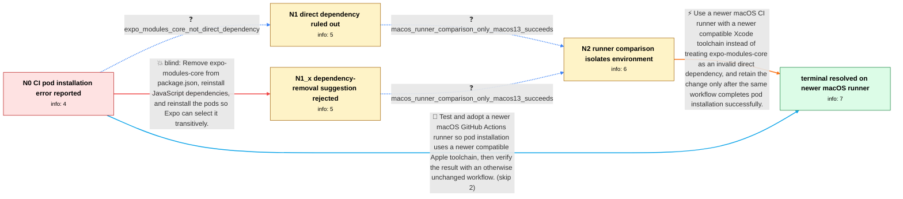

# Review: gh_expo_expo_25905

**[SDK 50] Pod install error: The Swift pod `ExpoModulesCore` depends upon `glog`, which does not define modules.**

- source: https://github.com/expo/expo/issues/25905
- kind: LLM draft (needs review)
- reviewed: `False`
- graph: `data/github_v0/graphs/gh_expo_expo_25905.json` · raw thread: `data/github_v0/raw/gh_expo_expo_25905.json`

## Opening (body)

> I have an SDK 50 project with a minimal reproducible example at https://github.com/NervJS/taro-native-shell/tree/0.73.0. The GitHub Actions build fails during pod installation with: `[!] The following Swift pods cannot yet be integrated as static libraries: The Swift pod ExpoModulesCore depends upon glog, which does not define modules.` The failing action is https://github.com/NervJS/taro-native-shell/actions/runs/7194009870/job/19593603408. Environment details are in the action log.

## Satisfaction conditions

1. Must identify the accepted cause for the opening reporter as an older macOS CI/Xcode toolchain compatibility problem exposed while integrating ExpoModulesCore with glog, grounded in the otherwise-identical runner comparison rather than inferred from the CocoaPods text alone.
2. Must recommend using macos-13 or an equivalently newer compatible CI toolchain and rerunning the same pod installation.
3. Must not treat removal of a direct expo-modules-core dependency as the fix for this reporter, because the reporter confirmed that no such direct dependency exists.
4. Must not substitute unrelated later-thread remedies from other projects, such as global modular headers, patching podspecs, changing Expo major versions, or cleaning pods, for the reporter's demonstrated runner-based resolution.
5. Must require a successful pod-install run on the changed runner before declaring the issue resolved.

## Edges

| edge | type | gates / info | payload |
|---|---|---|---|
| `e1_N0__N1` | clarification_only | asks: expo_modules_core_not_direct_dependency | I don't have expo-modules-core in my dependencies. |
| `e2_N0__N1_x` | solution_only **BLIND** | req_info: sdk50_pod_install_fails_expo_modules_core_glog_no_modules elements: recommends_removing_direct_expo_modules_core_dependency | Remove expo-modules-core from package.json, reinstall JavaScript dependencies, and reinstall the pods so Expo can select it transitively. |
| `e3_N1__N2` | clarification_only | asks: macos_runner_comparison_only_macos13_succeeds | Yes. The pod install fails in tag v0.73.0-5 and succeeds in tag v0.73.0-6. I shared both action logs and the c |
| `e4_N1_x__N2` | clarification_only | asks: macos_runner_comparison_only_macos13_succeeds | The v0.73.0-5 pod install log fails, and the v0.73.0-6 log succeeds. The comparison shows that the only change |
| `e5_N2__N_terminal` | solution_only | req_info: expo_modules_core_not_direct_dependency, failing_github_actions_log_shared, environment_details_available_in_action_log, macos_runner_comparison_only_macos13_succeeds elements: attributes_failure_to_the_older_ci_toolchain_environment, recommends_using_macos_13_or_an_equivalently_newer_compatible_toolchain, uses_the_unchanged_successful_ci_run_as_verification, does_not_require_removing_a_nonexistent_direct_dependency | Use a newer macOS CI runner with a newer compatible Xcode toolchain instead of treating expo-modules-core as an invalid direct dependency, and retain the change only after the same workflow completes pod installation successfully. |
| `e6_N0__N_terminal` | solution_only | req_info: sdk50_pod_install_fails_expo_modules_core_glog_no_modules, failing_github_actions_log_shared, environment_details_available_in_action_log elements: proposes_testing_a_newer_macos_runner, keeps_project_dependencies_unchanged_during_comparison, asks_user_to_verify_pod_install_on_the_new_runner | Test and adopt a newer macOS GitHub Actions runner so pod installation uses a newer compatible Apple toolchain, then verify the result with an otherwise unchanged workflow. |

## Nodes

| node | terminal | volunteered | images | symptoms |
|---|---|---|---|---|
| `N0` |  | 3 | 0 | My GitHub Actions build exits with code 1 during pod installation because CocoaPods says the Swift pod ExpoModulesCore depends on glog, whic |
| `N1` |  | 0 | 0 | The workflow still reaches the ExpoModulesCore and glog module error during pod installation. |
| `N1_x` |  | 1 | 0 | There is no expo-modules-core entry in my package.json for me to remove, and the original workflow still has the pod installation error. |
| `N2` |  | 0 | 0 | The v0.73.0-5 workflow run fails during pod installation, while the v0.73.0-6 run succeeds when tested with runs-on set to macos-13; that ru |
| `N_terminal` | ✓ | 2 | 0 | After keeping the workflow on macos-13, pod installation succeeds and the ExpoModulesCore-to-glog module error no longer occurs in my GitHub |

## Machine review (audit pass, adversarially verified)

Auditor verdict: **n/a** · 0 of 0 findings survived independent refutation.

__

## Review checklist

> The graph is the case's ANSWER KEY, not a transcript: edge order need
> not mirror thread chronology. Do not file chronology mismatch as a
> defect; what must be faithful is who knew what, when.

Structural (machine-checked by `scripts/validate.py`, re-verify after edits):

- [ ] validates: schema + info-containment + terminal reachability

Semantic (the defect catalog — check each against the source thread):

- [ ] **Faithful blind paths** — every `is_known_blind_path` edge corresponds
  to an attempt actually falsified in the thread (or a brush-off the
  reporter rejected). No invented failures; no ACCEPTED fix mislabeled as
  a blind path (the most common LLM defect class).
- [ ] **Gettable required info** — every id in any `solution.required_info`
  is obtainable: a clarification on some edge, or in the start node's
  info_state, or volunteered (with matching `volunteered_info` text).
  Engineer-only inference belongs in `info_inferred_by_engineer` /
  `inference_hint`, not in hard required_info.
- [ ] **Measurement-class rule** — handler-initiated measurements the user
  executed (bisections, test builds, config probes, version checks) are
  clarification edges, not solutions; their answers state what the
  measurement showed.
- [ ] **No logistics gates** — `required_elements_for_full_match` encode the
  technical diagnostic→fix chain, not release/packaging/scheduling
  remarks the engineer merely mentioned.
- [ ] **Coherent reveals** — each `user_answer_in_this_oncall` is consistent
  with the thread, delivers what it promises, and stays in the user's
  voice (no future knowledge, no diagnosis the user never made).
- [ ] **Symptoms are observations** — `symptoms_visible` contains only what
  the user can see; no causes or advice.
- [ ] **Terminal semantics** — satisfaction_conditions demand root cause +
  evidence grounding + prohibition of falsified moves + user verification;
  the terminal node is the verified-resolved state.
- [ ] **Image assignment** — referenced attachments exist and sit on the
  right hook (opening / node symptom / clarification evidence).
- [ ] **Persona** — matches the reporter's actual expertise and style.

## How to sign off

1. Edit the graph JSON if needed (authored fields only; keep
   `concrete_example` as the factual record).
2. `uv run scripts/validate.py '<graph path>'`
3. Set `metadata.hitl_reviewed: true` in the graph JSON.
4. Re-run `uv run scripts/make_review_docs.py` to refresh this page.
