# Review: gh_expo_expo_33911

**[SDK 52] expo-location returns denied before the iOS background-location prompt completes**

- source: https://github.com/expo/expo/issues/33911
- kind: LLM draft (needs review)
- reviewed: `True`
- graph: `data/github_v0/graphs/gh_expo_expo_33911.json` · raw thread: `data/github_v0/raw/gh_expo_expo_33911.json`

```mermaid
flowchart LR
    N0["<b>N0 premature denied result reported</b><br/><small>info: 6</small>"]
    N1_x["<b>N1_x background-only advice rejected</b><br/><small>info: 7</small>"]
    N1["<b>N1 valid sequential-permission use case established</b><br/><small>info: 9</small>"]
    N2["<b>N2 permission lifecycle captured</b><br/><small>info: 12</small>"]
    N_terminal["<b>terminal application flow works with lifecycle workaround</b><br/><small>info: 14</small>"]
    N_terminal_x["<b>terminal recovery after background-only attempt</b><br/><small>info: 9</small>"]
    N0 ==>|"💥 blind: Avoid requesting foreground and background location in sequence on iOS; request only background permission because it can request the necessary foreground access automatically."| N1_x
    linkStyle 0 stroke:#ef4444,stroke-width:2px
    N0 -.->|"❓ foreground_and_background_needed_at_different_feature_times, sdk51_old_arch_flow_previously_worked, public_repository_reproducer_shared"| N1
    linkStyle 1 stroke:#3b82f6,stroke-width:2px
    N1 -.->|"❓ same_session_demo_returns_denied_before_prompt_response, app_becomes_inactive_during_background_prompt, permission_query_after_return_active_sees_updated_result"| N2
    linkStyle 2 stroke:#3b82f6,stroke-width:2px
    N2 ==>|"⚡ Treat the immediate denied result as a premature SDK response during the iOS permission lifecycle. Until the library is fixed, synchronize the sequential permission flow with the application returning active and obtain a fresh background-permission status instead of trusting the result returned while the prompt is open."| N_terminal
    linkStyle 3 stroke:#f97316,stroke-width:2px
    N1_x ==>|"🚀 Recover from the unsuccessful background-only change by handling the premature SDK result around the iOS permission lifecycle: wait for the app to return active and query the background permission again. (skip 6)"| N_terminal_x
    linkStyle 4 stroke:#0ea5e9,stroke-width:2px
    class N0 start
    class N1_x normal
    class N1 normal
    class N2 normal
    class N_terminal terminal
    class N_terminal_x terminal
    classDef start fill:#fee2e2,stroke:#b91c1c,color:#000
    classDef terminal fill:#dcfce7,stroke:#15803d,color:#000
    classDef normal fill:#fef3c7,stroke:#a16207,color:#000
```

## Opening (body)

> On iOS with Expo SDK 52 and the new architecture disabled, I have to call `await Location.requestBackgroundPermissionsAsync()` twice. After I grant foreground access with “Allow While Using App” and then choose “Change to Always Allow” in the background-permission prompt, the first call reports that permission was not granted. Tapping my button again reports the permission correctly. I can reproduce this in Expo Go, a development build, and a standalone app using the linked Snack.

## Satisfaction conditions

1. Must identify the accepted bug: on iOS with the affected Expo Location flow, requesting foreground and then background permission can cause `requestBackgroundPermissionsAsync()` to resolve as denied before the authorization prompt has completed; the immediate value does not necessarily represent the user's choice.
2. The diagnosis must be grounded in the minimal reproduction and observed timing: the permission dialog remains open, the app is inactive, and a fresh query after the app returns active sees the updated permission.
3. Must not present requesting only background permission as a complete fix for this case; the reporter implemented that direction and still observed premature not-granted results.
4. The practical workaround must synchronize with the app returning active and then obtain a fresh background-permission status, rather than trusting a denied result returned while the prompt is open.
5. Must describe the AppState-based code as a temporary application workaround. The thread does not establish that an Expo package fix shipped or that an affected user verified such a release.
6. Must ask the user to verify that the final queried status matches the choice made in the iOS prompt before treating the application flow as resolved.

## Edges

| edge | type | gates / info | payload |
|---|---|---|---|
| `e1_N0__N1_x` | solution_only **BLIND** | req_info: foreground_then_background_prompt_sequence, ios_sdk52_old_arch_location_issue elements: recommends_requesting_only_background_permission_on_ios | Avoid requesting foreground and background location in sequence on iOS; request only background permission because it can request the necessary foreground access automatically. |
| `e2_N0__N1` | clarification_only | asks: foreground_and_background_needed_at_different_feature_times, sdk51_old_arch_flow_previously_worked, public_repository_reproducer_shared | My map only needs foreground location, while a separate background-check feature needs background access. Most / Yes. The same foreground-then-background flow worked for me with SDK 51 on the old architecture. After upgradi / I created a minimal repository with only the permission requests and added reproduction instructions to its RE |
| `e3_N1__N2` | clarification_only | asks: same_session_demo_returns_denied_before_prompt_response, app_becomes_inactive_during_background_prompt, permission_query_after_return_active_sees_updated_result | In the demo, foreground permission is granted and I then request background permission in the same session. Th / While the iOS permission prompt is displayed, my app state is `inactive`. The request has already returned `de / After I answer the prompt and the app becomes active again, `getBackgroundPermissionsAsync()` reports the upda |
| `e4_N2__N_terminal` | solution_only | req_info: background_request_returns_not_granted_after_user_allows, foreground_and_background_needed_at_different_feature_times, sdk51_old_arch_flow_previously_worked, second_background_request_reports_permission_correctly, same_session_demo_returns_denied_before_prompt_response, app_becomes_inactive_during_background_prompt, permission_query_after_return_active_sees_updated_result, public_repository_reproducer_shared elements: identifies_that_the_background_request_can_resolve_before_the_ios_prompt_completes, does_not_treat_the_immediate_denied_status_while_inactive_as_the_final_user_choice, waits_for_the_application_to_return_active_and_rechecks_background_permission, describes_the_code_as_a_temporary_workaround_not_a_shipped_expo_fix, asks_user_to_verify_that_the_returned_status_matches_the_permission_selected_in_the_ios_prompt | Treat the immediate denied result as a premature SDK response during the iOS permission lifecycle. Until the library is fixed, synchronize the sequential permission flow with the application returning active and obtain a fresh background-permission status instead of trusting the result returned while the prompt is open. |
| `e5_N1_x__N_terminal_x` | solution_only | req_info: background_request_returns_not_granted_after_user_allows, only_requesting_background_does_not_fix_reporter_flow, second_background_request_reports_permission_correctly elements: rejects_background_only_as_a_complete_fix, waits_for_the_application_to_return_active_and_rechecks_background_permission, describes_the_code_as_a_temporary_workaround_not_a_shipped_expo_fix, asks_user_to_verify_that_the_rechecked_status_matches_the_ios_selection | Recover from the unsuccessful background-only change by handling the premature SDK result around the iOS permission lifecycle: wait for the app to return active and query the background permission again. |

## Nodes

| node | terminal | volunteered | images | symptoms |
|---|---|---|---|---|
| `N0` |  | 1 | 0 | On iOS, after I allow foreground location and choose “Change to Always Allow,” the first background-permission request reports that permissi |
| `N1_x` |  | 1 | 0 | After changing the iOS flow to request only background permission, the request can still report “not granted” before I have selected anythin |
| `N1` |  | 0 | 0 | The background request returns “denied” without waiting for my response after foreground permission has already been requested. The foregrou |
| `N2` |  | 0 | 0 | In the minimal demo, the background permission dialog remains on screen while the awaited request has already returned “denied.” The app is  |
| `N_terminal` | ✓ | 1 | 0 | With the lifecycle workaround in my production app, the flow waits for the app to become active and then obtains the actual background-permi |
| `N_terminal_x` | ✓ | 1 | 0 | After replacing the background-only attempt with the lifecycle workaround, my production permission flow obtains the updated result when the |

## Machine review (audit pass, adversarially verified)

Auditor verdict: **n/a** · 0 of 0 findings survived independent refutation.

__

## Review checklist

> The graph is the case's ANSWER KEY, not a transcript: edge order need
> not mirror thread chronology. Do not file chronology mismatch as a
> defect; what must be faithful is who knew what, when.

Structural (machine-checked by `scripts/validate.py`, re-verify after edits):

- [ ] validates: schema + info-containment + terminal reachability

Semantic (the defect catalog — check each against the source thread):

- [ ] **Faithful blind paths** — every `is_known_blind_path` edge corresponds
  to an attempt actually falsified in the thread (or a brush-off the
  reporter rejected). No invented failures; no ACCEPTED fix mislabeled as
  a blind path (the most common LLM defect class).
- [ ] **Gettable required info** — every id in any `solution.required_info`
  is obtainable: a clarification on some edge, or in the start node's
  info_state, or volunteered (with matching `volunteered_info` text).
  Engineer-only inference belongs in `info_inferred_by_engineer` /
  `inference_hint`, not in hard required_info.
- [ ] **Measurement-class rule** — handler-initiated measurements the user
  executed (bisections, test builds, config probes, version checks) are
  clarification edges, not solutions; their answers state what the
  measurement showed.
- [ ] **No logistics gates** — `required_elements_for_full_match` encode the
  technical diagnostic→fix chain, not release/packaging/scheduling
  remarks the engineer merely mentioned.
- [ ] **Coherent reveals** — each `user_answer_in_this_oncall` is consistent
  with the thread, delivers what it promises, and stays in the user's
  voice (no future knowledge, no diagnosis the user never made).
- [ ] **Symptoms are observations** — `symptoms_visible` contains only what
  the user can see; no causes or advice.
- [ ] **Terminal semantics** — satisfaction_conditions demand root cause +
  evidence grounding + prohibition of falsified moves + user verification;
  the terminal node is the verified-resolved state.
- [ ] **Image assignment** — referenced attachments exist and sit on the
  right hook (opening / node symptom / clarification evidence).
- [ ] **Persona** — matches the reporter's actual expertise and style.

## How to sign off

1. Edit the graph JSON if needed (authored fields only; keep
   `concrete_example` as the factual record).
2. `uv run scripts/validate.py '<graph path>'`
3. Set `metadata.hitl_reviewed: true` in the graph JSON.
4. Re-run `uv run scripts/make_review_docs.py` to refresh this page.
