# Review: gh_expo_expo_33911

**[SDK 52] expo-location background permission promise resolves denied before the iOS response**

- source: https://github.com/expo/expo/issues/33911
- kind: LLM draft (needs review)
- reviewed: `True`
- graph: `data/github_v0/graphs/gh_expo_expo_33911.json` · raw thread: `data/github_v0/raw/gh_expo_expo_33911.json`

```mermaid
flowchart LR
    N0["<b>N0 premature denied result reported</b><br/><small>info: 6</small>"]
    N1["<b>N1 legitimate permission-upgrade flow established</b><br/><small>info: 10</small>"]
    N1_x["<b>N1_x background-only guidance aftermath</b><br/><small>info: 11</small>"]
    N2["<b>N2 timing bug reproduced and regression narrowed</b><br/><small>info: 14</small>"]
    N3["<b>N3 AppState workaround installed</b><br/><small>info: 15</small>"]
    N_terminal["<b>terminal resolved</b><br/><small>info: 16</small>"]
    N0 -.->|"❓ foreground_and_background_requests_can_be_separate_feature_events, same_session_foreground_then_background_reproduces, sdk51_old_arch_did_wait_for_response, other_ios_apps_present_separate_permission_upgrade_flow"| N1
    linkStyle 0 stroke:#3b82f6,stroke-width:2px
    N1 ==>|"💥 blind: Avoid the foreground-to-background upgrade flow on iOS and request only background permission, relying on that request to obtain foreground access automatically."| N1_x
    linkStyle 1 stroke:#ef4444,stroke-width:2px
    N1_x -.->|"❓ public_repo_reproduces_same_session_sequence, recording_shows_background_promise_finishes_while_dialog_is_unanswered, community_investigation_points_to_pr29272_exbaselocationrequester"| N2
    linkStyle 2 stroke:#3b82f6,stroke-width:2px
    N2 ==>|"⚡ Use an AppState-based temporary workaround: after requesting background permission, wait for iOS to return the app to the active state and then query the permission again."| N3
    linkStyle 3 stroke:#f97316,stroke-width:2px
    N3 ==>|"⚡ Fix the SDK 52 iOS native location requester so `requestBackgroundPermissionsAsync()` remains pending through the authorization UI and resolves from the completed authorization result, then have the reporter verify the same-session foreground-to-background flow on a build containing the fix."| N_terminal
    linkStyle 4 stroke:#f97316,stroke-width:2px
    class N0 start
    class N1 normal
    class N1_x normal
    class N2 normal
    class N3 normal
    class N_terminal terminal
    classDef start fill:#fee2e2,stroke:#b91c1c,color:#000
    classDef terminal fill:#dcfce7,stroke:#15803d,color:#000
    classDef normal fill:#fef3c7,stroke:#a16207,color:#000
```

## Opening (body)

> On iOS with Expo SDK 52 and the new architecture disabled, I have to call `await Location.requestBackgroundPermissionsAsync()` twice. After I grant foreground access with “Allow While Using App” and choose “Change to Always Allow” in the background prompt, the first call reports that permission was denied as if I canceled it. Pressing the button again then reports the permission that I already granted. I reproduced this in a development build, Expo Go, and a standalone app. My Snack reproducer is https://snack.expo.dev/@brodanoel/background-location-broken. I am using Expo 52.0.23, React Native 0.76.5, and the managed workflow on iOS.

## Satisfaction conditions

1. Must identify the root cause as an Expo SDK 52 iOS native requester regression: `requestBackgroundPermissionsAsync()` completes with an intermediate denied state while the system authorization prompt is still unanswered, instead of waiting for the final authorization result.
2. The diagnosis must be grounded in the same-session public reproduction, the recording showing denied before user input, the SDK 51 comparison, and the investigation pointing to PR #29272 and `EXBaseLocationRequester.m`.
3. Must not dismiss the use case by recommending that iOS applications always request only background permission; requesting Always authorization after an earlier When In Use grant is a legitimate flow, and that guidance was tried without resolving the reported behavior.
4. An AppState-active listener followed by `getBackgroundPermissionsAsync()` may be offered as a temporary workaround, but it must not be presented as the native fix.
5. The actual fix must make the native background permission request wait for authorization completion and return the final status.
6. Must ask the reporter to verify the foreground-then-background flow on a build containing the native fix before declaring the issue resolved.

## Edges

| edge | type | gates / info | payload |
|---|---|---|---|
| `e1_N0__N1` | clarification_only | asks: foreground_and_background_requests_can_be_separate_feature_events, same_session_foreground_then_background_reproduces, sdk51_old_arch_did_wait_for_response, other_ios_apps_present_separate_permission_upgrade_flow | My app has a map that only needs foreground location and a separate background-check feature that most users n / Yes. I request foreground access, grant it, and then request background access in the same session. The backgr / The same flow worked without this issue on SDK 51 with the old architecture. After upgrading to SDK 52, the ba / Yes. Apple documents requesting Always authorization after When In Use, and I attached an example of the Citiz |
| `e2_N1__N1_x` | solution_only **BLIND** | req_info: foreground_and_background_requests_can_be_separate_feature_events elements: recommends_requesting_only_background_permission_on_ios | Avoid the foreground-to-background upgrade flow on iOS and request only background permission, relying on that request to obtain foreground access automatically. |
| `e3_N1_x__N2` | clarification_only | asks: public_repo_reproduces_same_session_sequence, recording_shows_background_promise_finishes_while_dialog_is_unanswered, community_investigation_points_to_pr29272_exbaselocationrequester | I created a minimal repository with reproduction instructions: https://github.com/expo/expo-location-repro. It / Yes. In my recording, the background permission dialog is still on screen and I have not selected anything, bu / After investigating, I found that the behavior was introduced by PR #29272 and involves `EXBaseLocationRequest |
| `e4_N2__N3` | solution_only | req_info: background_request_first_call_returns_denied_then_second_reads_granted, recording_shows_background_promise_finishes_while_dialog_is_unanswered elements: waits_for_appstate_to_return_active, rechecks_background_permission_after_prompt, labels_workaround_as_temporary, removes_appstate_listener_after_use | Use an AppState-based temporary workaround: after requesting background permission, wait for iOS to return the app to the active state and then query the permission again. |
| `e5_N3__N_terminal` | solution_only | req_info: sdk51_old_arch_did_wait_for_response, background_request_first_call_returns_denied_then_second_reads_granted, public_repo_reproduces_same_session_sequence, recording_shows_background_promise_finishes_while_dialog_is_unanswered, community_investigation_points_to_pr29272_exbaselocationrequester elements: identifies_premature_native_promise_completion_as_root_cause, fixes_exbaselocationrequester_authorization_completion_timing, supports_foreground_then_background_in_same_session, does_not_treat_background_only_guidance_as_the_fix, asks_user_to_verify_on_a_build_containing_the_fix | Fix the SDK 52 iOS native location requester so `requestBackgroundPermissionsAsync()` remains pending through the authorization UI and resolves from the completed authorization result, then have the reporter verify the same-session foreground-to-background flow on a build containing the fix. |

## Nodes

| node | terminal | volunteered | images | symptoms |
|---|---|---|---|---|
| `N0` |  | 2 | 0 | After I choose “Change to Always Allow” in the iOS permission dialog, the first `requestBackgroundPermissionsAsync()` call reports denied as |
| `N1` |  | 0 | 0 | When foreground access has already been granted and I later request background access, the background request returns denied before I have a |
| `N1_x` |  | 1 | 0 | I implemented the suggestion, but when foreground permission has been granted for the map and background permission is requested later, the  |
| `N2` |  | 1 | 0 | In the minimal repository and recording, the background permission dialog is still awaiting input when the JavaScript request has already pr |
| `N3` |  | 1 | 0 | With my AppState workaround, I wait for the app to become active and then read the background permission again; the production flow now obse |
| `N_terminal` | ✓ | 1 | 0 | On a build containing the native fix, the background permission request waits for my response and returns the final permission status withou |

## Machine review (audit pass, adversarially verified)

Auditor verdict: **n/a** · 0 of 0 findings survived independent refutation.

__

## Review checklist

> The graph is the case's ANSWER KEY, not a transcript: edge order need
> not mirror thread chronology. Do not file chronology mismatch as a
> defect; what must be faithful is who knew what, when.

Structural (machine-checked by `scripts/validate.py`, re-verify after edits):

- [ ] validates: schema + info-containment + terminal reachability

Semantic (the defect catalog — check each against the source thread):

- [ ] **Faithful blind paths** — every `is_known_blind_path` edge corresponds
  to an attempt actually falsified in the thread (or a brush-off the
  reporter rejected). No invented failures; no ACCEPTED fix mislabeled as
  a blind path (the most common LLM defect class).
- [ ] **Gettable required info** — every id in any `solution.required_info`
  is obtainable: a clarification on some edge, or in the start node's
  info_state, or volunteered (with matching `volunteered_info` text).
  Engineer-only inference belongs in `info_inferred_by_engineer` /
  `inference_hint`, not in hard required_info.
- [ ] **Measurement-class rule** — handler-initiated measurements the user
  executed (bisections, test builds, config probes, version checks) are
  clarification edges, not solutions; their answers state what the
  measurement showed.
- [ ] **No logistics gates** — `required_elements_for_full_match` encode the
  technical diagnostic→fix chain, not release/packaging/scheduling
  remarks the engineer merely mentioned.
- [ ] **Coherent reveals** — each `user_answer_in_this_oncall` is consistent
  with the thread, delivers what it promises, and stays in the user's
  voice (no future knowledge, no diagnosis the user never made).
- [ ] **Symptoms are observations** — `symptoms_visible` contains only what
  the user can see; no causes or advice.
- [ ] **Terminal semantics** — satisfaction_conditions demand root cause +
  evidence grounding + prohibition of falsified moves + user verification;
  the terminal node is the verified-resolved state.
- [ ] **Image assignment** — referenced attachments exist and sit on the
  right hook (opening / node symptom / clarification evidence).
- [ ] **Persona** — matches the reporter's actual expertise and style.

## How to sign off

1. Edit the graph JSON if needed (authored fields only; keep
   `concrete_example` as the factual record).
2. `uv run scripts/validate.py '<graph path>'`
3. Set `metadata.hitl_reviewed: true` in the graph JSON.
4. Re-run `uv run scripts/make_review_docs.py` to refresh this page.
