# Review: gh_firecracker-microvm_firecracker_4099

**Processes get stuck after resuming a VM from snapshot**

- source: https://github.com/firecracker-microvm/firecracker/issues/4099
- kind: LLM draft (needs review)
- reviewed: `True`
- graph: `data/github_v0/graphs/gh_firecracker-microvm_firecracker_4099.json` · raw thread: `data/github_v0/raw/gh_firecracker-microvm_firecracker_4099.json`

```mermaid
flowchart LR
    N0["<b>N0 intermittent post-restore stall reported</b><br/><small>info: 7</small>"]
    N1["<b>N1 reproduced on supported AMD host kernel</b><br/><small>info: 8</small>"]
    N2["<b>N2 timer-mode mitigation confirmed</b><br/><small>info: 9</small>"]
    N3["<b>N3 issue shown not to be AMD-only</b><br/><small>info: 12</small>"]
    N4["<b>N4 proposed fix verified by reporter</b><br/><small>info: 13</small>"]
    N_terminal["<b>terminal resolved</b><br/><small>info: 15</small>"]
    N0 -.->|"❓ reproduced_on_amd_m6a_metal_host_kernel_5_10"| N1
    linkStyle 0 stroke:#3b82f6,stroke-width:2px
    N1 -.->|"❓ lapic_notscdeadline_prevents_reproduction_on_amd"| N2
    linkStyle 1 stroke:#3b82f6,stroke-width:2px
    N2 -.->|"❓ later_reproduced_on_nested_intel_after_gke_kernel_update, intel_reproduction_included_rcu_stalls, lapic_notscdeadline_also_mitigates_intel_reproduction"| N3
    linkStyle 2 stroke:#3b82f6,stroke-width:2px
    N3 -.->|"❓ proposed_fix_completes_100_iterations_without_workaround"| N4
    linkStyle 3 stroke:#3b82f6,stroke-width:2px
    N4 ==>|"⚡ Fix snapshot restoration by respecting the dependency between the guest TSC and its deadline timer state: restore the guest TSC before restoring the dependent TSC deadline MSR, rather than requiring users to disable deadline mode."| N_terminal
    linkStyle 4 stroke:#f97316,stroke-width:2px
    class N0 start
    class N1 normal
    class N2 normal
    class N3 normal
    class N4 normal
    class N_terminal terminal
    classDef start fill:#fee2e2,stroke:#b91c1c,color:#000
    classDef terminal fill:#dcfce7,stroke:#15803d,color:#000
    classDef normal fill:#fef3c7,stroke:#a16207,color:#000
```

## Opening (body)

> After resuming a Firecracker v1.4.0 VM from a snapshot, processes occasionally stop making progress. My minimal init binary prints "running", sleeps for 100ms, and repeats; after some restores it prints nothing until the next restore. The reproducer pauses the VM every second, creates a snapshot, terminates Firecracker, starts it again, and restores the snapshot. Replacing nanosleep with a busy NOP loop avoids the problem, and ordinary pause/resume without snapshot restoration does not reproduce it. I initially reproduced this on AMD but not Intel. Adding the nolapic guest kernel parameter also prevents reproduction, although I do not know whether that is an acceptable solution. The AMD guest boot log includes "[Firmware Bug]: TSC doesn't count with P0 frequency!".

## Satisfaction conditions

1. Must identify the final accepted root cause: during snapshot restore, Firecracker restored the TSC deadline MSR before the guest TSC even though KVM relies on the restored guest TSC to initialize the deadline correctly.
2. Must ground the diagnosis in the collected evidence: snapshot-specific sleeping-process stalls, successful timer-mode mitigations, reproduction on a supported AMD 5.10 host and later on nested Intel, and the successful 100-iteration candidate test.
3. Must correct the restore dependency by restoring the guest TSC before its deadline state; disabling deadline mode with nolapic or lapic=notscdeadline may be described as a mitigation, not as the required upstream fix.
4. Must not retain the superseded conclusion that the defect is inherently AMD-specific, because the reporter later reproduced the same behavior on Intel under nested virtualization.
5. Must ask the affected reporter to verify a build containing the fix and must not declare resolution until the reporter confirms that the reproducer runs without the workaround.

## Edges

| edge | type | gates / info | payload |
|---|---|---|---|
| `e1_N0__N1` | clarification_only | asks: reproduced_on_amd_m6a_metal_host_kernel_5_10 | I reproduced it on an m6a.metal instance. uname reports Linux 5.10.186-179.751.amzn2.x86_64, and the same scri |
| `e2_N1__N2` | clarification_only | asks: lapic_notscdeadline_prevents_reproduction_on_amd | I set lapic=notscdeadline in my repro script on my AMD machine, and the issue stopped reproducing afterwards.  |
| `e3_N2__N3` | clarification_only | asks: later_reproduced_on_nested_intel_after_gke_kernel_update, intel_reproduction_included_rcu_stalls, lapic_notscdeadline_also_mitigates_intel_reproduction | We later hit the same behavior on Intel under nested virtualization after GCP upgraded our nodes from 5.15.0-1 / The symptoms look similar, and I sometimes see RCU stalls in the kernel logs. / Yes, lapic=notscdeadline also seems to prevent the problem in that Intel nested-virtualization environment. |
| `e4_N3__N4` | clarification_only | asks: proposed_fix_completes_100_iterations_without_workaround | I verified it on my AMD machine. The script completed 100 iterations without getting stuck, and I did not use  |
| `e5_N4__N_terminal` | solution_only | req_info: snapshot_restore_intermittently_stalls_sleeping_init, busy_loop_does_not_stall, ordinary_pause_resume_does_not_reproduce, nolapic_prevents_reproduction, later_reproduced_on_nested_intel_after_gke_kernel_update, reproduced_on_amd_m6a_metal_host_kernel_5_10, lapic_notscdeadline_prevents_reproduction_on_amd, lapic_notscdeadline_also_mitigates_intel_reproduction, proposed_fix_completes_100_iterations_without_workaround elements: identifies_incorrect_restore_order_between_guest_tsc_and_dependent_deadline_state, restores_guest_tsc_before_the_deadline_msr, distinguishes_the_boot_argument_as_a_mitigation_not_the_required_upstream_fix, asks_user_to_verify_on_a_build_containing_the_fix | Fix snapshot restoration by respecting the dependency between the guest TSC and its deadline timer state: restore the guest TSC before restoring the dependent TSC deadline MSR, rather than requiring users to disable deadline mode. |

## Nodes

| node | terminal | volunteered | images | symptoms |
|---|---|---|---|---|
| `N0` |  | 2 | 0 | After some snapshot restores, my init process stops printing "running" after nanosleep and remains silent until another restore. The same lo |
| `N1` |  | 0 | 0 | On an AMD m6a.metal host running Linux 5.10, some restored rounds print the expected init messages and other rounds print none. |
| `N2` |  | 0 | 0 | With the suggested guest boot argument, the snapshot reproducer no longer gets stuck on my AMD machine; without it, the intermittent silent  |
| `N3` |  | 0 | 0 | After a GKE host-kernel update, the same snapshot script also reproduces the stalled behavior on Intel under nested virtualization, sometime |
| `N4` |  | 0 | 0 | On my AMD machine, the build from the proposed change completes all 100 snapshot iterations without getting stuck and without the guest boot |
| `N_terminal` | ✓ | 0 | 0 | With a Firecracker build containing the fix, my AMD snapshot test completes 100 restore iterations and the init process continues printing a |

## Machine review (audit pass, adversarially verified)

Auditor verdict: **n/a** · 0 of 0 findings survived independent refutation.

__

## Review checklist

> The graph is the case's ANSWER KEY, not a transcript: edge order need
> not mirror thread chronology. Do not file chronology mismatch as a
> defect; what must be faithful is who knew what, when.

Structural (machine-checked by `scripts/validate.py`, re-verify after edits):

- [ ] validates: schema + info-containment + terminal reachability

Semantic (the defect catalog — check each against the source thread):

- [ ] **Faithful blind paths** — every `is_known_blind_path` edge corresponds
  to an attempt actually falsified in the thread (or a brush-off the
  reporter rejected). No invented failures; no ACCEPTED fix mislabeled as
  a blind path (the most common LLM defect class).
- [ ] **Gettable required info** — every id in any `solution.required_info`
  is obtainable: a clarification on some edge, or in the start node's
  info_state, or volunteered (with matching `volunteered_info` text).
  Engineer-only inference belongs in `info_inferred_by_engineer` /
  `inference_hint`, not in hard required_info.
- [ ] **Measurement-class rule** — handler-initiated measurements the user
  executed (bisections, test builds, config probes, version checks) are
  clarification edges, not solutions; their answers state what the
  measurement showed.
- [ ] **No logistics gates** — `required_elements_for_full_match` encode the
  technical diagnostic→fix chain, not release/packaging/scheduling
  remarks the engineer merely mentioned.
- [ ] **Coherent reveals** — each `user_answer_in_this_oncall` is consistent
  with the thread, delivers what it promises, and stays in the user's
  voice (no future knowledge, no diagnosis the user never made).
- [ ] **Symptoms are observations** — `symptoms_visible` contains only what
  the user can see; no causes or advice.
- [ ] **Terminal semantics** — satisfaction_conditions demand root cause +
  evidence grounding + prohibition of falsified moves + user verification;
  the terminal node is the verified-resolved state.
- [ ] **Image assignment** — referenced attachments exist and sit on the
  right hook (opening / node symptom / clarification evidence).
- [ ] **Persona** — matches the reporter's actual expertise and style.

## How to sign off

1. Edit the graph JSON if needed (authored fields only; keep
   `concrete_example` as the factual record).
2. `uv run scripts/validate.py '<graph path>'`
3. Set `metadata.hitl_reviewed: true` in the graph JSON.
4. Re-run `uv run scripts/make_review_docs.py` to refresh this page.
