# Review: gh_fluent_fluent-bit_10139

**systemd input segfaults (Probably caused by introduction of zstd?)**

- source: https://github.com/fluent/fluent-bit/issues/10139
- kind: LLM draft (needs review)
- reviewed: `True`
- graph: `data/github_v0/graphs/gh_fluent_fluent-bit_10139.json` · raw thread: `data/github_v0/raw/gh_fluent_fluent-bit_10139.json`

```mermaid
flowchart LR
    N0["<b>N0 systemd input segfault reported</b><br/><small>info: 5</small>"]
    N1["<b>N1 duplicate zstd loading paths established</b><br/><small>info: 9</small>"]
    N1_x["<b>N1_x disabling preferred system libraries aftermath</b><br/><small>info: 6</small>"]
    N2["<b>N2 exported symbols confirmed outside NixOS</b><br/><small>info: 11</small>"]
    N3["<b>N3 symbol interposition and incompatible context layout established</b><br/><small>info: 17</small>"]
    N_terminal["<b>terminal reporter deployment resolved by dynamic linking</b><br/><small>info: 18</small>"]
    N0 -.->|"❓ also_reproduces_on_3_2_9, system_rdkafka_loads_dynamic_zstd, flb_prefer_system_libs_off_still_segfaults, libsystemd_loads_dynamic_zstd"| N1
    linkStyle 0 stroke:#3b82f6,stroke-width:2px
    N0 ==>|"💥 blind: Avoid the crash by disabling FLB_PREFER_SYSTEM_LIBS so system rdkafka cannot bring a dynamically linked zstd into the process."| N1_x
    linkStyle 1 stroke:#ef4444,stroke-width:2px
    N1_x -.->|"❓ also_reproduces_on_3_2_9, system_rdkafka_loads_dynamic_zstd, libsystemd_loads_dynamic_zstd"| N1
    linkStyle 2 stroke:#3b82f6,stroke-width:2px
    N1 -.->|"❓ official_fedora_binary_does_not_segfault, nm_dynamic_output_shows_official_binary_exports_zstd_symbols"| N2
    linkStyle 3 stroke:#3b82f6,stroke-width:2px
    N2 -.->|"❓ gdb_shows_dynamic_zstd_calling_fluent_bit_zstd_symbol, nixos_and_vendored_zstd_dctx_sizes_differ_by_16_bytes, nixos_zstd_legacy_support_disabled, vendored_zstd_legacy_support_enabled"| N3
    linkStyle 4 stroke:#3b82f6,stroke-width:2px
    N3 ==>|"⚡ Build the NixOS Fluent Bit package without statically linking the conflicting vendored dependencies, using the available dynamic zstd linkage option so systemd and Fluent Bit do not interleave incompatible zstd contexts."| N_terminal
    linkStyle 5 stroke:#f97316,stroke-width:2px
    class N0 start
    class N1 normal
    class N1_x normal
    class N2 normal
    class N3 normal
    class N_terminal terminal
    classDef start fill:#fee2e2,stroke:#b91c1c,color:#000
    classDef terminal fill:#dcfce7,stroke:#15803d,color:#000
    classDef normal fill:#fef3c7,stroke:#a16207,color:#000
```

## Opening (body)

> I upgraded Fluent Bit from 3.2.6 to 3.2.8 while systemd was updated from 257.2 to 257.3, and Fluent Bit started segfaulting on NixOS unstable with a systemd input. The backtrace passes through sd_journal_enumerate_data and decompress_blob_zstd before crashing in ZSTD_freeDCtx/free. I suspect Fluent Bit's statically linked zstd and the zstd used by libsystemd may be mixing symbols, but I do not know enough about the build system to confirm it.

## Satisfaction conditions

1. Must identify the accepted root cause: Fluent Bit exports symbols from its statically linked vendored zstd, allowing calls originating in the dynamically loaded system zstd to interpose into Fluent Bit's different zstd build.
2. Must connect the NixOS crash to the incompatible ZSTD_DCtx layouts: the system zstd build disables legacy support while Fluent Bit's vendored build enables it, producing a 16-byte size difference, out-of-bounds writes, memory corruption, and a later free() crash.
3. Diagnosis must be grounded in the corrected nm -D output, the cross-library gdb call trace, and the compared context sizes and build flags; it must not be dismissed as merely a NixOS-specific bug.
4. Must not recommend disabling FLB_PREFER_SYSTEM_LIBS as the resolution because the reporter tried it and libsystemd still loaded another libzstd copy.
5. For the reporter's deployment, the accepted workaround is to stop statically linking the conflicting dependencies and use the available dynamic system-zstd linkage path.
6. Must not claim that the proposed symbol-visibility tweak was verified or landed; the thread leaves the general upstream static-linking hazard technically unresolved.
7. Must ask the reporter to verify the rebuilt package with the systemd input before declaring their deployment resolved.

## Edges

| edge | type | gates / info | payload |
|---|---|---|---|
| `e1_N0__N1` | clarification_only | asks: also_reproduces_on_3_2_9, system_rdkafka_loads_dynamic_zstd, flb_prefer_system_libs_off_still_segfaults, libsystemd_loads_dynamic_zstd | It also reproduces on 3.2.9. / I first reproduced it with FLB_PREFER_SYSTEM_LIBS and a system-provided rdkafka, which is dynamically linked a / It also reproduces with FLB_PREFER_SYSTEM_LIBS set to Off. / libsystemd dlopen()s libzstd, so another copy can still be loaded even with FLB_PREFER_SYSTEM_LIBS set to Off. |
| `e2_N0__N1_x` | solution_only **BLIND** | req_info: initial_mixed_static_dynamic_zstd_theory elements: mentions_disabling_flb_prefer_system_libs | Avoid the crash by disabling FLB_PREFER_SYSTEM_LIBS so system rdkafka cannot bring a dynamically linked zstd into the process. |
| `e3_N1_x__N1` | clarification_only | asks: also_reproduces_on_3_2_9, system_rdkafka_loads_dynamic_zstd, libsystemd_loads_dynamic_zstd | Yes, it also reproduces on 3.2.9. / I first saw the condition while using a system-provided rdkafka that is dynamically linked against libzstd. / libsystemd itself dlopen()s libzstd, so the second copy can still enter the process. |
| `e4_N1__N2` | clarification_only | asks: official_fedora_binary_does_not_segfault, nm_dynamic_output_shows_official_binary_exports_zstd_symbols | I cannot reproduce the segfault with the official binary on Fedora 41. / I initially looked at ordinary nm output by mistake. With nm -D on Fedora, the official /usr/bin/fluent-bit al |
| `e5_N2__N3` | clarification_only | asks: gdb_shows_dynamic_zstd_calling_fluent_bit_zstd_symbol, nixos_and_vendored_zstd_dctx_sizes_differ_by_16_bytes, nixos_zstd_legacy_support_disabled, vendored_zstd_legacy_support_enabled | In my Fedora gdb session, decompress_blob_zstd in libsystemd calls ZSTD_getFrameContentSize from the system zs / The ZSTD_DCtx used by Fluent Bit is 16 bytes larger than the one allocated by the NixOS system zstd build. / NixOS builds its zstd with ZSTD_LEGACY_SUPPORT=0. / Fluent Bit's vendored zstd uses the default with legacy support enabled, which adds 16 bytes to ZSTD_DCtx. |
| `e6_N3__terminal` | solution_only | req_info: backtrace_systemd_decompression_to_zstd_free, root_cause_exported_vendored_zstd_symbols_interpose_system_zstd, dynamic_zstd_linking_option_identified, libsystemd_loads_dynamic_zstd, nm_dynamic_output_shows_official_binary_exports_zstd_symbols, gdb_shows_dynamic_zstd_calling_fluent_bit_zstd_symbol, nixos_and_vendored_zstd_dctx_sizes_differ_by_16_bytes, nixos_zstd_legacy_support_disabled, vendored_zstd_legacy_support_enabled elements: identifies_exported_vendored_zstd_symbols_interposing_calls_from_system_zstd, connects_incompatible_zstd_build_layouts_to_out_of_bounds_memory_corruption, recommends_using_dynamic_system_zstd_for_the_reporter_packaging_workaround, does_not_claim_the_unverified_visibility_tweak_was_implemented, asks_user_to_verify_the_rebuilt_package_with_the_systemd_input | Build the NixOS Fluent Bit package without statically linking the conflicting vendored dependencies, using the available dynamic zstd linkage option so systemd and Fluent Bit do not interleave incompatible zstd contexts. |

## Nodes

| node | terminal | volunteered | images | symptoms |
|---|---|---|---|---|
| `N0` |  | 2 | 0 | After upgrading Fluent Bit from 3.2.6 to 3.2.8, it segfaults while collecting from the systemd input. The backtrace goes through sd_journal_ |
| `N1` |  | 0 | 0 | The same systemd-input segfault occurs on Fluent Bit 3.2.9. It still segfaults when I build with FLB_PREFER_SYSTEM_LIBS disabled. |
| `N1_x` |  | 1 | 0 | Fluent Bit still segfaults in the systemd input after rebuilding with FLB_PREFER_SYSTEM_LIBS disabled. |
| `N2` |  | 0 | 0 | My NixOS build still segfaults, while I cannot reproduce the crash with the official binary on Fedora 41. Running nm -D on the Fedora Fluent |
| `N3` |  | 2 | 0 | The statically linked NixOS build continues to crash in free after systemd journal decompression. In my Fedora debugger session, a function  |
| `N_terminal` | ✓ | 1 | 0 | After changing the NixOS package so these dependencies are no longer statically linked into Fluent Bit, the systemd-input crash is solved fo |

## Machine review (audit pass, adversarially verified)

Auditor verdict: **n/a** · 0 of 0 findings survived independent refutation.

__

## Review checklist

> The graph is the case's ANSWER KEY, not a transcript: edge order need
> not mirror thread chronology. Do not file chronology mismatch as a
> defect; what must be faithful is who knew what, when.

Structural (machine-checked by `scripts/validate.py`, re-verify after edits):

- [ ] validates: schema + info-containment + terminal reachability

Semantic (the defect catalog — check each against the source thread):

- [ ] **Faithful blind paths** — every `is_known_blind_path` edge corresponds
  to an attempt actually falsified in the thread (or a brush-off the
  reporter rejected). No invented failures; no ACCEPTED fix mislabeled as
  a blind path (the most common LLM defect class).
- [ ] **Gettable required info** — every id in any `solution.required_info`
  is obtainable: a clarification on some edge, or in the start node's
  info_state, or volunteered (with matching `volunteered_info` text).
  Engineer-only inference belongs in `info_inferred_by_engineer` /
  `inference_hint`, not in hard required_info.
- [ ] **Measurement-class rule** — handler-initiated measurements the user
  executed (bisections, test builds, config probes, version checks) are
  clarification edges, not solutions; their answers state what the
  measurement showed.
- [ ] **No logistics gates** — `required_elements_for_full_match` encode the
  technical diagnostic→fix chain, not release/packaging/scheduling
  remarks the engineer merely mentioned.
- [ ] **Coherent reveals** — each `user_answer_in_this_oncall` is consistent
  with the thread, delivers what it promises, and stays in the user's
  voice (no future knowledge, no diagnosis the user never made).
- [ ] **Symptoms are observations** — `symptoms_visible` contains only what
  the user can see; no causes or advice.
- [ ] **Terminal semantics** — satisfaction_conditions demand root cause +
  evidence grounding + prohibition of falsified moves + user verification;
  the terminal node is the verified-resolved state.
- [ ] **Image assignment** — referenced attachments exist and sit on the
  right hook (opening / node symptom / clarification evidence).
- [ ] **Persona** — matches the reporter's actual expertise and style.

## How to sign off

1. Edit the graph JSON if needed (authored fields only; keep
   `concrete_example` as the factual record).
2. `uv run scripts/validate.py '<graph path>'`
3. Set `metadata.hitl_reviewed: true` in the graph JSON.
4. Re-run `uv run scripts/make_review_docs.py` to refresh this page.
