# Review: gh_flutter_flutter_124205

**[Web] Textinput is placed with offset above the keyboard when focused**

- source: https://github.com/flutter/flutter/issues/124205
- kind: LLM draft (needs review)
- reviewed: `False`
- graph: `data/github_v0/graphs/gh_flutter_flutter_124205.json` · raw thread: `data/github_v0/raw/gh_flutter_flutter_124205.json`

```mermaid
flowchart LR
    N0["<b>N0 mobile web keyboard offset reported</b><br/><small>info: 4</small>"]
    N1["<b>N1 physical and cross-platform reproduction established</b><br/><small>info: 7</small>"]
    N1_x["<b>N1_x resize setting aftermath</b><br/><small>info: 5</small>"]
    N2["<b>N2 renderer-independent mobile web reproduction</b><br/><small>info: 9</small>"]
    N2_x["<b>N2_x focus workaround aftermath</b><br/><small>info: 10</small>"]
    N3["<b>N3 bad post-keyboard geometry captured</b><br/><small>info: 11</small>"]
    N4["<b>N4 corrected viewport behavior verified</b><br/><small>info: 12</small>"]
    N_terminal["<b>terminal resolved</b><br/><small>info: 12</small>"]
    N0 -.->|"❓ physical_ios_and_android_devices_reproduce, reproduction_is_intermittent_and_tap_sensitive"| N1
    linkStyle 0 stroke:#3b82f6,stroke-width:2px
    N0 ==>|"💥 blind: Treat the offset as ordinary Scaffold keyboard resizing and disable automatic bottom-inset resizing."| N1_x
    linkStyle 1 stroke:#ef4444,stroke-width:2px
    N1 -.->|"❓ html_renderer_also_reproduces"| N2
    linkStyle 2 stroke:#3b82f6,stroke-width:2px
    N2 ==>|"💥 blind: Avoid calling requestFocus or using autofocus on mobile web and treat duplicate focus requests as the complete cause of the keyboard offset."| N2_x
    linkStyle 3 stroke:#ef4444,stroke-width:2px
    N2 -.->|"❓ keyboard_control_dismissal_triggers_bad_geometry"| N3
    linkStyle 4 stroke:#3b82f6,stroke-width:2px
    N3 -.->|"❓ fixed_flutter_build_verified_on_physical_pixel_and_master"| N4
    linkStyle 5 stroke:#3b82f6,stroke-width:2px
    N4 ==>|"⚡ Update to a Flutter release containing the mobile-web viewport geometry fix from PR 179581, first shipped on stable in 3.38.6, and verify keyboard opening and dismissal on the affected physical devices."| N_terminal
    linkStyle 6 stroke:#f97316,stroke-width:2px
    class N0 start
    class N1 normal
    class N1_x normal
    class N2 normal
    class N2_x normal
    class N3 normal
    class N4 normal
    class N_terminal terminal
    classDef start fill:#fee2e2,stroke:#b91c1c,color:#000
    classDef terminal fill:#dcfce7,stroke:#15803d,color:#000
    classDef normal fill:#fef3c7,stroke:#a16207,color:#000
```

## Opening (body)

> I built a Flutter web app with an editable field at the bottom of the screen. On a mobile browser, tapping the field opens the keyboard, but the app content is moved too far upward and leaves extra space between the field and the keyboard. I can reproduce it with a CanvasKit web build on Safari. The field should align directly above the keyboard.

## Satisfaction conditions

1. Must identify the root cause as Flutter mobile web mishandling viewport geometry across virtual-keyboard transitions, which could leave a reduced viewport height and a stale or negative bottom view inset and therefore displace the canvas or text field.
2. The diagnosis must be grounded in the cross-renderer physical-device reproduction and the captured bad metrics, including the height changing from 770 to 458 and the bottom inset becoming -312 after keyboard dismissal.
3. Must recommend updating to Flutter 3.38.6 or newer containing PR 179581, then rebuilding and testing the affected mobile web app.
4. Must not present resizeToAvoidBottomInset=false or avoiding requestFocus as the general root fix: both were insufficient for affected variants, though the Scaffold setting may remain part of a specific Android web layout configuration after updating.
5. Must require verification on an affected physical mobile browser before declaring the issue resolved.

## Edges

| edge | type | gates / info | payload |
|---|---|---|---|
| `e1_N0__N1` | clarification_only | asks: physical_ios_and_android_devices_reproduce, reproduction_is_intermittent_and_tap_sensitive | Yes. I have the same issue on physical iPhones, including iPhone 14 and iPhone 10, and on a Samsung S22 Ultra. / It varies by device. On some real devices it is intermittent and may need repeated taps, while on slower Andro |
| `e2_N0__N1_x` | solution_only **BLIND** | req_info: mobile_web_text_input_has_extra_keyboard_offset elements: sets_resize_to_avoid_bottom_inset_false_as_complete_fix | Treat the offset as ordinary Scaffold keyboard resizing and disable automatic bottom-inset resizing. |
| `e3_N1__N2` | clarification_only | asks: html_renderer_also_reproduces | I just created an HTML build and got the same result. The issue also appears on a physical Android device, alt |
| `e4_N2__N2_x` | solution_only **BLIND** | req_info: mobile_web_text_input_has_extra_keyboard_offset, reproduction_is_intermittent_and_tap_sensitive elements: removes_programmatic_focus_as_complete_fix | Avoid calling requestFocus or using autofocus on mobile web and treat duplicate focus requests as the complete cause of the keyboard offset. |
| `e5_N2__N3` | clarification_only | asks: keyboard_control_dismissal_triggers_bad_geometry | With the keyboard active, I logged MediaQuery size Size(412.0, 770.0) and bottom view inset 312.0. After dismi |
| `e6_N3__N4` | clarification_only | asks: fixed_flutter_build_verified_on_physical_pixel_and_master | I tested the latest published Flutter on Chrome on a physical Pixel 8 and the issue is resolved for me. I also |
| `e7_N4__N_terminal` | solution_only | req_info: physical_ios_and_android_devices_reproduce, raw_metrics_show_reduced_height_and_negative_bottom_inset, issue_affects_fields_that_browser_must_move, fixed_flutter_build_verified_on_physical_pixel_and_master, html_renderer_also_reproduces elements: identifies_incorrect_mobile_web_viewport_geometry_as_root_cause, mentions_negative_or_stale_bottom_inset_after_keyboard_transition, recommends_flutter_3_38_6_or_newer_containing_pr_179581, requires_retesting_on_an_affected_physical_mobile_browser, does_not_present_resize_to_avoid_bottom_inset_as_the_root_fix | Update to a Flutter release containing the mobile-web viewport geometry fix from PR 179581, first shipped on stable in 3.38.6, and verify keyboard opening and dismissal on the affected physical devices. |

## Nodes

| node | terminal | volunteered | images | symptoms |
|---|---|---|---|---|
| `N0` |  | 3 | 0 | When I focus the bottom editable field in the mobile web app, the keyboard opens but the content moves too far upward, leaving extra space b |
| `N1` |  | 1 | 0 | I see the extra space on physical iPhones and Android devices as well as in a simulator. On some devices it appears only after repeated taps |
| `N1_x` |  | 1 | 0 | The extra keyboard spacing still occurs after setting resizeToAvoidBottomInset to false. |
| `N2` |  | 1 | 0 | The HTML-renderer build has the same extra space above the keyboard. The offset also appears in mobile web browsers on Android, although its |
| `N2_x` |  | 1 | 0 | The keyboard offset still happens in an app that does not programmatically request focus. |
| `N3` |  | 1 | 0 | After dismissing the virtual keyboard with its own control, the page can retain the wrong height and display blank or displaced space. In th |
| `N4` |  | 0 | 0 | On an updated Flutter build, the field and page return to the correct position when the mobile keyboard opens and closes. I no longer see th |
| `N_terminal` | ✓ | 0 | 0 | After updating Flutter, mobile web text fields remain directly above the virtual keyboard and the page geometry resets correctly when the ke |

## Machine review (audit pass, adversarially verified)

Auditor verdict: **minor_issues** · 0 of 2 findings survived independent refutation.

_This case tests a 3-year Flutter web thread where mobile-web text fields get extra space above the virtual keyboard; the real answer is that Flutter mishandles mobile-web viewport geometry across keyboard transitions (reduced height + negative bottom view inset, c100/c101), identical to issue 175074, fixed by PR 179581 and cherry-picked to stable 3.38.6 (c108), then verified by several users (c109-c113). The graph is a faithful and unusually careful rendering of that answer key: both blind paths (resizeToAvoidBottomInset=false, avoid programmatic requestFocus) are genuinely falsified in the thread, the clarification chain follows the thread's real order (c0/c1 physical devices, c6/c7 renderer swap, c100 metrics, c108-c110 fixed-build retest), and all three user-executed probes are correctly modeled as clarification edges. I found no high-severity defect: no mislabeled or fabricated blind path, no ungettable required_info, no wrong root cause, and no future-knowledge leak into the Task body. Two low-severity fidelity issues remain around evidence attribution and the Flutter version pinned on the start node._

### Refuted claims (auditor was wrong — do not act on these)

- ~~image_misassignment~~: [image_misassignment / low] at graph.edges[e1_N0__N1].clarifications[physical_ios_and_android_devices_reproduce].images — The clarification whose answer asserts physical-iPhone reproduction attaches c14's iOS screenshot,
  - why refuted: The images are correctly sourced (raw images[].where: img1/img2/img3 all = c14) and the edge comment already declares them: 'The three screenshots are the Android and iOS reproductions supplied in c14' — literally accurate. Nothing contradicts: (a) c14's Android device is a PHYSICAL Samsung Galaxy Tab A7 Lite / Android
- ~~unfaithful_reveal~~: [unfaithful_reveal / low] at graph.nodes.N0.volunteered_info[flutter_3_7_9_initial_report] (and task body) — flutter_3_7_9_initial_report is declared as volunteered on the start node but no Flutter version appears anywhe
  - why refuted: The premise misunderstands how volunteered_info is surfaced. In src/graph_bench/user_simulator/simulator.py:187 the opening turn does parts.extend(start.volunteered_info) (and responder.py:102 does the same on first arrival), so volunteered ids ARE delivered on top of task.body — the body is not required to restate the

## Review checklist

> The graph is the case's ANSWER KEY, not a transcript: edge order need
> not mirror thread chronology. Do not file chronology mismatch as a
> defect; what must be faithful is who knew what, when.

Structural (machine-checked by `scripts/validate.py`, re-verify after edits):

- [ ] validates: schema + info-containment + terminal reachability

Semantic (the defect catalog — check each against the source thread):

- [ ] **Faithful blind paths** — every `is_known_blind_path` edge corresponds
  to an attempt actually falsified in the thread (or a brush-off the
  reporter rejected). No invented failures; no ACCEPTED fix mislabeled as
  a blind path (the most common LLM defect class).
- [ ] **Gettable required info** — every id in any `solution.required_info`
  is obtainable: a clarification on some edge, or in the start node's
  info_state, or volunteered (with matching `volunteered_info` text).
  Engineer-only inference belongs in `info_inferred_by_engineer` /
  `inference_hint`, not in hard required_info.
- [ ] **Measurement-class rule** — handler-initiated measurements the user
  executed (bisections, test builds, config probes, version checks) are
  clarification edges, not solutions; their answers state what the
  measurement showed.
- [ ] **No logistics gates** — `required_elements_for_full_match` encode the
  technical diagnostic→fix chain, not release/packaging/scheduling
  remarks the engineer merely mentioned.
- [ ] **Coherent reveals** — each `user_answer_in_this_oncall` is consistent
  with the thread, delivers what it promises, and stays in the user's
  voice (no future knowledge, no diagnosis the user never made).
- [ ] **Symptoms are observations** — `symptoms_visible` contains only what
  the user can see; no causes or advice.
- [ ] **Terminal semantics** — satisfaction_conditions demand root cause +
  evidence grounding + prohibition of falsified moves + user verification;
  the terminal node is the verified-resolved state.
- [ ] **Image assignment** — referenced attachments exist and sit on the
  right hook (opening / node symptom / clarification evidence).
- [ ] **Persona** — matches the reporter's actual expertise and style.

## How to sign off

1. Edit the graph JSON if needed (authored fields only; keep
   `concrete_example` as the factual record).
2. `uv run scripts/validate.py '<graph path>'`
3. Set `metadata.hitl_reviewed: true` in the graph JSON.
4. Re-run `uv run scripts/make_review_docs.py` to refresh this page.
