# Review: gh_flutter_flutter_124205

**[Web] Textinput is placed with offset above the keyboard when focused**

- source: https://github.com/flutter/flutter/issues/124205
- kind: LLM draft (needs review)
- reviewed: `True`
- graph: `data/github_v0/graphs/gh_flutter_flutter_124205.json` · raw thread: `data/github_v0/raw/gh_flutter_flutter_124205.json`

```mermaid
flowchart LR
    N0["<b>N0 mobile-web keyboard offset reported</b><br/><small>info: 5</small>"]
    N1["<b>N1 physical-device scope established</b><br/><small>info: 6</small>"]
    N2_x["<b>N2_x resize setting aftermath</b><br/><small>info: 7</small>"]
    N2["<b>N2 renderer-independent reproduction</b><br/><small>info: 9</small>"]
    N3["<b>N3 invalid post-keyboard geometry measured</b><br/><small>info: 10</small>"]
    N_terminal["<b>terminal fixed build verified</b><br/><small>info: 13</small>"]
    N0 -.->|"❓ physical_iphones_ios16_and_samsung_s22_affected"| N1
    linkStyle 0 stroke:#3b82f6,stroke-width:2px
    N1 ==>|"💥 blind: Treat the gap as ordinary Scaffold keyboard resizing and disable or adjust resizeToAvoidBottomInset."| N2_x
    linkStyle 1 stroke:#ef4444,stroke-width:2px
    N2_x -.->|"❓ html_renderer_has_same_keyboard_offset"| N2
    linkStyle 2 stroke:#3b82f6,stroke-width:2px
    N2 -.->|"❓ keyboard_dismissal_raw_metrics_show_shrunken_height_and_negative_bottom_inset"| N3
    linkStyle 3 stroke:#3b82f6,stroke-width:2px
    N3 ==>|"⚡ Update Flutter to a build containing the mobile-web keyboard geometry fix, rebuild the web app, and verify focus and keyboard-dismissal behavior on affected physical devices instead of relying on renderer changes or resizeToAvoidBottomInset alone."| N_terminal
    linkStyle 4 stroke:#f97316,stroke-width:2px
    class N0 start
    class N1 normal
    class N2_x normal
    class N2 normal
    class N3 normal
    class N_terminal terminal
    classDef start fill:#fee2e2,stroke:#b91c1c,color:#000
    classDef terminal fill:#dcfce7,stroke:#15803d,color:#000
    classDef normal fill:#fef3c7,stroke:#a16207,color:#000
```

## Opening (body)

> I built a Flutter web app with the CanvasKit renderer and opened it in Safari on an iPhone. The editable field is aligned at the bottom of the page. When I tap it, the keyboard appears, but the app content receives too much bottom inset and the field sits above the keyboard with an extra gap. I expect the field to align directly above the keyboard. I included two minimal samples and a hosted reproduction. I am using Flutter stable 3.7.9.

## Satisfaction conditions

1. Must identify the accepted root cause as Flutter Web retaining or reporting invalid viewport geometry across virtual-keyboard transitions, evidenced by the reduced screen height and negative bottom view inset after dismissal.
2. The diagnosis must be grounded in the collected physical-device, cross-renderer, and raw MediaQuery evidence rather than inferred from the visual gap alone.
3. Must recommend updating and rebuilding with a Flutter build containing the mobile-web keyboard geometry fix.
4. Must not present switching from CanvasKit to HTML or changing resizeToAvoidBottomInset alone as the fix; both were insufficient in the reported chain.
5. Must ask an affected user to verify repeated keyboard opening and dismissal on a build containing the fix before declaring the issue resolved.

## Edges

| edge | type | gates / info | payload |
|---|---|---|---|
| `e1_N0__N1` | clarification_only | asks: physical_iphones_ios16_and_samsung_s22_affected | Yes. I have the same issue on physical iPhone 14 and iPhone 10 devices, all with iOS 16 or later, and on a Sam |
| `e2_N1__N2_x` | solution_only **BLIND** | req_info: mobile_web_text_field_has_extra_gap_above_keyboard, physical_iphones_ios16_and_samsung_s22_affected elements: recommends_changing_resize_to_avoid_bottom_inset_as_the_fix | Treat the gap as ordinary Scaffold keyboard resizing and disable or adjust resizeToAvoidBottomInset. |
| `e3_N2_x__N2` | clarification_only | asks: html_renderer_has_same_keyboard_offset | I just created an HTML build and it has the same result. |
| `e4_N2__N3` | clarification_only | asks: keyboard_dismissal_raw_metrics_show_shrunken_height_and_negative_bottom_inset | With the keyboard state looking normal, I logged MediaQuery size Size(412.0, 770.0) and view insets EdgeInsets |
| `e5_N3__N_terminal` | solution_only | req_info: mobile_web_text_field_has_extra_gap_above_keyboard, canvaskit_build_reproduces_on_iphone_safari, physical_iphones_ios16_and_samsung_s22_affected, html_renderer_has_same_keyboard_offset, keyboard_dismissal_raw_metrics_show_shrunken_height_and_negative_bottom_inset elements: identifies_invalid_mobile_web_viewport_or_inset_geometry_after_keyboard_transitions, recommends_updating_to_a_flutter_build_containing_the_geometry_fix, does_not_present_renderer_switching_or_resize_to_avoid_bottom_inset_alone_as_the_fix, asks_user_to_verify_on_a_build_containing_the_fix | Update Flutter to a build containing the mobile-web keyboard geometry fix, rebuild the web app, and verify focus and keyboard-dismissal behavior on affected physical devices instead of relying on renderer changes or resizeToAvoidBottomInset alone. |

## Nodes

| node | terminal | volunteered | images | symptoms |
|---|---|---|---|---|
| `N0` |  | 2 | 0 | When I focus the bottom-aligned editable field, the keyboard opens but the app content moves too far upward, leaving extra space between the |
| `N1` |  | 0 | 0 | I see the extra keyboard gap on physical iPhones and on a Samsung S22 Ultra, not only in a simulator. |
| `N2_x` |  | 1 | 0 | With resizeToAvoidBottomInset changed, focusing the field still leaves the content offset above the keyboard. |
| `N2` |  | 1 | 0 | The HTML-renderer build shows the same extra space above the keyboard. I can also see the offset intermittently on a physical Android device |
| `N3` |  | 0 | 0 | After I dismiss the virtual keyboard with its own control, MediaQuery reports the screen height as 458 instead of 770 and reports a bottom v |
| `N_terminal` | ✓ | 1 | 0 | After updating Flutter and rebuilding the web app, focusing and dismissing the keyboard no longer leaves the text field or page offset with  |

## Machine review (audit pass, adversarially verified)

Auditor verdict: **n/a** · 0 of 0 findings survived independent refutation.

__

## Review checklist

> The graph is the case's ANSWER KEY, not a transcript: edge order need
> not mirror thread chronology. Do not file chronology mismatch as a
> defect; what must be faithful is who knew what, when.

Structural (machine-checked by `scripts/validate.py`, re-verify after edits):

- [ ] validates: schema + info-containment + terminal reachability

Semantic (the defect catalog — check each against the source thread):

- [ ] **Faithful blind paths** — every `is_known_blind_path` edge corresponds
  to an attempt actually falsified in the thread (or a brush-off the
  reporter rejected). No invented failures; no ACCEPTED fix mislabeled as
  a blind path (the most common LLM defect class).
- [ ] **Gettable required info** — every id in any `solution.required_info`
  is obtainable: a clarification on some edge, or in the start node's
  info_state, or volunteered (with matching `volunteered_info` text).
  Engineer-only inference belongs in `info_inferred_by_engineer` /
  `inference_hint`, not in hard required_info.
- [ ] **Measurement-class rule** — handler-initiated measurements the user
  executed (bisections, test builds, config probes, version checks) are
  clarification edges, not solutions; their answers state what the
  measurement showed.
- [ ] **No logistics gates** — `required_elements_for_full_match` encode the
  technical diagnostic→fix chain, not release/packaging/scheduling
  remarks the engineer merely mentioned.
- [ ] **Coherent reveals** — each `user_answer_in_this_oncall` is consistent
  with the thread, delivers what it promises, and stays in the user's
  voice (no future knowledge, no diagnosis the user never made).
- [ ] **Symptoms are observations** — `symptoms_visible` contains only what
  the user can see; no causes or advice.
- [ ] **Terminal semantics** — satisfaction_conditions demand root cause +
  evidence grounding + prohibition of falsified moves + user verification;
  the terminal node is the verified-resolved state.
- [ ] **Image assignment** — referenced attachments exist and sit on the
  right hook (opening / node symptom / clarification evidence).
- [ ] **Persona** — matches the reporter's actual expertise and style.

## How to sign off

1. Edit the graph JSON if needed (authored fields only; keep
   `concrete_example` as the factual record).
2. `uv run scripts/validate.py '<graph path>'`
3. Set `metadata.hitl_reviewed: true` in the graph JSON.
4. Re-run `uv run scripts/make_review_docs.py` to refresh this page.
