# Review: gh_flutter_flutter_124205

**[Web] Textinput is placed with offset above the keyboard when focused**

- source: https://github.com/flutter/flutter/issues/124205
- kind: LLM draft (needs review)
- reviewed: `False`
- graph: `data/github_v0/graphs/gh_flutter_flutter_124205.json` · raw thread: `data/github_v0/raw/gh_flutter_flutter_124205.json`

```mermaid
flowchart LR
    N0["<b>N0 mobile web keyboard offset reported</b><br/><small>info: 4</small>"]
    N1["<b>N1 physical and cross-platform reproduction established</b><br/><small>info: 7</small>"]
    N1_x["<b>N1_x resize setting aftermath</b><br/><small>info: 5</small>"]
    N2["<b>N2 renderer-independent mobile web reproduction</b><br/><small>info: 9</small>"]
    N2_x["<b>N2_x focus workaround aftermath</b><br/><small>info: 10</small>"]
    N3["<b>N3 bad post-keyboard geometry captured</b><br/><small>info: 11</small>"]
    N4["<b>N4 corrected viewport behavior verified</b><br/><small>info: 12</small>"]
    N_terminal["<b>terminal resolved</b><br/><small>info: 12</small>"]
    N0 -.->|"❓ physical_ios_and_android_devices_reproduce, reproduction_is_intermittent_and_tap_sensitive"| N1
    linkStyle 0 stroke:#3b82f6,stroke-width:2px
    N0 ==>|"💥 blind: Treat the offset as ordinary Scaffold keyboard resizing and disable automatic bottom-inset resizing."| N1_x
    linkStyle 1 stroke:#ef4444,stroke-width:2px
    N1 -.->|"❓ html_renderer_also_reproduces"| N2
    linkStyle 2 stroke:#3b82f6,stroke-width:2px
    N2 ==>|"💥 blind: Avoid calling requestFocus or using autofocus on mobile web and treat duplicate focus requests as the complete cause of the keyboard offset."| N2_x
    linkStyle 3 stroke:#ef4444,stroke-width:2px
    N2 -.->|"❓ keyboard_control_dismissal_triggers_bad_geometry"| N3
    linkStyle 4 stroke:#3b82f6,stroke-width:2px
    N3 -.->|"❓ fixed_flutter_build_verified_on_physical_pixel_and_master"| N4
    linkStyle 5 stroke:#3b82f6,stroke-width:2px
    N4 ==>|"⚡ Update to a Flutter release containing the mobile-web viewport geometry fix from PR 179581, first shipped on stable in 3.38.6, and verify keyboard opening and dismissal on the affected physical devices."| N_terminal
    linkStyle 6 stroke:#f97316,stroke-width:2px
    N1_x ==>|"⚡ Abandon this direction and return to the investigation."| N0
    linkStyle 7 stroke:#f97316,stroke-width:2px
    N2_x ==>|"⚡ Abandon this direction and return to the investigation."| N2
    linkStyle 8 stroke:#f97316,stroke-width:2px
    class N0 start
    class N1 normal
    class N1_x normal
    class N2 normal
    class N2_x normal
    class N3 normal
    class N4 normal
    class N_terminal terminal
    classDef start fill:#fee2e2,stroke:#b91c1c,color:#000
    classDef terminal fill:#dcfce7,stroke:#15803d,color:#000
    classDef normal fill:#fef3c7,stroke:#a16207,color:#000
```

## Opening (body)

> I built a Flutter web app with an editable field at the bottom of the screen. On a mobile browser, tapping the field opens the keyboard, but the app content is moved too far upward and leaves extra space between the field and the keyboard. I can reproduce it with a CanvasKit web build on Safari. The field should align directly above the keyboard.

## Satisfaction conditions

1. Must identify the root cause as Flutter mobile web mishandling viewport geometry across virtual-keyboard transitions, which could leave a reduced viewport height and a stale or negative bottom view inset and therefore displace the canvas or text field.
2. The diagnosis must be grounded in the cross-renderer physical-device reproduction and the captured bad metrics, including the height changing from 770 to 458 and the bottom inset becoming -312 after keyboard dismissal.
3. Must recommend updating to Flutter 3.38.6 or newer containing PR 179581, then rebuilding and testing the affected mobile web app.
4. Must not present resizeToAvoidBottomInset=false or avoiding requestFocus as the general root fix: both were insufficient for affected variants, though the Scaffold setting may remain part of a specific Android web layout configuration after updating.
5. Must require verification on an affected physical mobile browser before declaring the issue resolved.

## Edges

| edge | type | gates / info | payload |
|---|---|---|---|
| `e1_N0__N1` | clarification_only | asks: physical_ios_and_android_devices_reproduce, reproduction_is_intermittent_and_tap_sensitive | Yes. I have the same issue on physical iPhones, including iPhone 14 and iPhone 10, and on a Samsung S22 Ultra. / It varies by device. On some real devices it is intermittent and may need repeated taps, while on slower Andro |
| `e2_N0__N1_x` | solution_only **BLIND** | req_info: mobile_web_text_input_has_extra_keyboard_offset elements: sets_resize_to_avoid_bottom_inset_false_as_complete_fix | Treat the offset as ordinary Scaffold keyboard resizing and disable automatic bottom-inset resizing. |
| `e3_N1__N2` | clarification_only | asks: html_renderer_also_reproduces | I just created an HTML build and got the same result. The issue also appears on a physical Android device, alt |
| `e4_N2__N2_x` | solution_only **BLIND** | req_info: mobile_web_text_input_has_extra_keyboard_offset, reproduction_is_intermittent_and_tap_sensitive elements: removes_programmatic_focus_as_complete_fix | Avoid calling requestFocus or using autofocus on mobile web and treat duplicate focus requests as the complete cause of the keyboard offset. |
| `e5_N2__N3` | clarification_only | asks: keyboard_control_dismissal_triggers_bad_geometry | When I dismiss the keyboard by defocusing, the metrics look normal: Size(412.0, 770.0) with bottom inset 312.0 |
| `e6_N3__N4` | clarification_only | asks: fixed_flutter_build_verified_on_physical_pixel_and_master | I tested the latest published Flutter on Chrome on a physical Pixel 8 and the issue is resolved for me. I also |
| `e7_N4__N_terminal` | solution_only | req_info: physical_ios_and_android_devices_reproduce, raw_metrics_show_reduced_height_and_negative_bottom_inset, issue_affects_fields_that_browser_must_move, fixed_flutter_build_verified_on_physical_pixel_and_master, html_renderer_also_reproduces elements: identifies_incorrect_mobile_web_viewport_geometry_as_root_cause, mentions_negative_or_stale_bottom_inset_after_keyboard_transition, recommends_flutter_3_38_6_or_newer_containing_pr_179581, requires_retesting_on_an_affected_physical_mobile_browser, does_not_present_resize_to_avoid_bottom_inset_as_the_root_fix | Update to a Flutter release containing the mobile-web viewport geometry fix from PR 179581, first shipped on stable in 3.38.6, and verify keyboard opening and dismissal on the affected physical devices. |
| `rb_N1_x__N0` | solution_only | req_info:  elements: mentions_rollback_or_abandon_direction | Abandon this direction and return to the investigation. |
| `rb_N2_x__N2` | solution_only | req_info:  elements: mentions_rollback_or_abandon_direction | Abandon this direction and return to the investigation. |

## Nodes

| node | terminal | volunteered | images | symptoms |
|---|---|---|---|---|
| `N0` |  | 3 | 0 | When I focus the bottom editable field in the mobile web app, the keyboard opens but the content moves too far upward, leaving extra space b |
| `N1` |  | 1 | 0 | I see the extra space on physical iPhones and Android devices as well as in a simulator. On some devices it appears only after repeated taps |
| `N1_x` |  | 1 | 0 | The extra keyboard spacing still occurs after setting resizeToAvoidBottomInset to false. |
| `N2` |  | 1 | 0 | The HTML-renderer build has the same extra space above the keyboard. The offset also appears in mobile web browsers on Android, although its |
| `N2_x` |  | 1 | 0 | The keyboard offset still happens in an app that does not programmatically request focus. |
| `N3` |  | 1 | 0 | After dismissing the virtual keyboard with its own control, the page can retain the wrong height and display blank or displaced space. In th |
| `N4` |  | 0 | 0 | On an updated Flutter build, the field and page return to the correct position when the mobile keyboard opens and closes. I no longer see th |
| `N_terminal` | ✓ | 0 | 0 | After updating Flutter, mobile web text fields remain directly above the virtual keyboard and the page geometry resets correctly when the ke |

## Machine review (audit pass, adversarially verified)

Auditor verdict: **minor_issues** · 2 of 2 findings survived independent refutation.

_The case tests whether an agent can drive a long, noisy, multi-user Flutter-web keyboard-offset thread past two popular-but-falsified workarounds (Scaffold resizeToAvoidBottomInset=false, avoiding programmatic requestFocus) to the real cause — Flutter mobile-web not restoring viewport geometry across virtual-keyboard transitions, producing a shrunken height and a negative bottom view inset — fixed by PR 179581 / stable 3.38.6. The graph is highly faithful: both blind paths are genuinely falsified in-thread (c3/c25/c35/c78 for the Scaffold property; c55/c77 for the focus workaround), the clarification order mirrors the thread's actual order (physical devices c0-c1, HTML renderer c6-c7, MediaQuery logging c100, fixed-build retest c109-c110), the update-and-retest step is correctly modeled as a clarification rather than a solution, and the engineer-side PR-equivalence inference is kept out of hard required_info. Only two low-impact fidelity nits: the e5 answer relabels which state the "normal" 412x770/+312 log came from, and e1's attached images/comment are slightly mismatched with the answer text._

### Confirmed findings

- [ ] 🟡 **unfaithful_reveal** (low) — `graph.edges[e5_N2__N3].clarifications[keyboard_control_dismissal_triggers_bad_geometry].user_answer_in_this_oncall`
  - claim: The user answer attributes the baseline log (Size(412.0, 770.0), bottom inset 312.0) to the keyboard being active, whereas the thread presents that log as the state after the keyboard was cleared via defocus; the thread's contrast is defocus-dismissal vs keyboard-control-dismissal, not keyboard-open vs keyboard-closed.
  - thread evidence: comment index 100 (participant68, 2025-12-05T20:19:01Z): "Interestingly, when the virtual keyboard is cleared via defocus, the media query looks \"normal\": ... Media query size: Size(412.0, 770.0) ... Media query view insets: EdgeInsets(0.0, 0.0, 0.0, 312.0)" followed by "However, if I dismiss the virtual keyboard (using the control within the keyboard), media query returns a smaller screen height and a large negative view inset" (Size(412.0, 458.0), -312.0).
  - suggested fix: Reword the answer to match the thread's framing, e.g. "When I dismiss the keyboard by defocusing, the metrics look normal: Size(412.0, 770.0) with bottom inset 312.0. But if I dismiss it using the control inside the keyboard, I get Size(412.0, 458.0) and EdgeInsets(0.0, 0.0, 0.0, -312.0)."
  - verifier: Confirmed against raw comment index 100 (participant68, 2025-12-05T20:19:01Z), which reads verbatim: 'Interestingly, when the virtual keyboard is cleared via defocus, the media query looks "normal": ... Size(412.0, 770.0) ... EdgeInsets(0.0, 0.0, 0.0, 312.0)' and 'However, if I dismiss the virtual keyboard (using the control within the keyboard), media query returns a smaller screen height and a l
- [ ] 🟡 **stale_edge_annotation** (low) — `graph.edges[e1_N0__N1].clarifications[physical_ios_and_android_devices_reproduce].images and graph.edges[e1_N0__N1].comment`
  - claim: The edge comment claims "The three screenshots are the Android and iOS reproductions supplied in c14" but only two images are attached, and those two c14 screenshots come from a different participant testing a Samsung Galaxy Tab A7 Lite with issue 125095's sample code, while the answer text names iPhone 14 / iPhone 10 / Samsung S22 Ultra.
  - thread evidence: raw images map: img1 and img2 both "where": "c14" (img3, the iOS one, is not attached). Comment index 14 (participant5): "Verifying the issue on: - Samsung Galaxy Tab A7 Lite, Android 13 - iPhone 14 Pro, iOS 16.4 (emulator)" with the three screenshots labelled "Android sample 1 | Android sample 2 | iOS" and "Another sample code (copy from 125095)". The devices named in the graph answer come from comment index 1 (reporter): "Yes, i have same issue on iPhone 14, iPhone 10, Android Samsung S22 Ultra" (evidence there was a video, not a screenshot).
  - suggested fix: Fix the comment to say two screenshots, and state that they are participant5's physical Galaxy Tab A7 Lite reproductions (c14) folded into the merged user side, distinct from the iPhone/S22 devices named in the answer text.
  - verifier: The verifiable half is confirmed. e1_N0__N1.clarifications[physical_ios_and_android_devices_reproduce].images lists exactly two files (img1.png, img2.png) while the edge comment says 'The three screenshots'; grep over the whole graph shows img3.png (the iOS shot) is referenced nowhere, so the comment is a stale count. Raw images map confirms img1=...233010731 and img2=...233010724, which in c14's 

## Review checklist

> The graph is the case's ANSWER KEY, not a transcript: edge order need
> not mirror thread chronology. Do not file chronology mismatch as a
> defect; what must be faithful is who knew what, when.

Structural (machine-checked by `scripts/validate.py`, re-verify after edits):

- [ ] validates: schema + info-containment + terminal reachability

Semantic (the defect catalog — check each against the source thread):

- [ ] **Faithful blind paths** — every `is_known_blind_path` edge corresponds
  to an attempt actually falsified in the thread (or a brush-off the
  reporter rejected). No invented failures; no ACCEPTED fix mislabeled as
  a blind path (the most common LLM defect class).
- [ ] **Gettable required info** — every id in any `solution.required_info`
  is obtainable: a clarification on some edge, or in the start node's
  info_state, or volunteered (with matching `volunteered_info` text).
  Engineer-only inference belongs in `info_inferred_by_engineer` /
  `inference_hint`, not in hard required_info.
- [ ] **Measurement-class rule** — handler-initiated measurements the user
  executed (bisections, test builds, config probes, version checks) are
  clarification edges, not solutions; their answers state what the
  measurement showed.
- [ ] **No logistics gates** — `required_elements_for_full_match` encode the
  technical diagnostic→fix chain, not release/packaging/scheduling
  remarks the engineer merely mentioned.
- [ ] **Coherent reveals** — each `user_answer_in_this_oncall` is consistent
  with the thread, delivers what it promises, and stays in the user's
  voice (no future knowledge, no diagnosis the user never made).
- [ ] **Symptoms are observations** — `symptoms_visible` contains only what
  the user can see; no causes or advice.
- [ ] **Terminal semantics** — satisfaction_conditions demand root cause +
  evidence grounding + prohibition of falsified moves + user verification;
  the terminal node is the verified-resolved state.
- [ ] **Image assignment** — referenced attachments exist and sit on the
  right hook (opening / node symptom / clarification evidence).
- [ ] **Persona** — matches the reporter's actual expertise and style.

## How to sign off

1. Edit the graph JSON if needed (authored fields only; keep
   `concrete_example` as the factual record).
2. `uv run scripts/validate.py '<graph path>'`
3. Set `metadata.hitl_reviewed: true` in the graph JSON.
4. Re-run `uv run scripts/make_review_docs.py` to refresh this page.
