# Review: gh_flutter_flutter_124205

**[Web] Text input is placed with an offset above the keyboard when focused**

- source: https://github.com/flutter/flutter/issues/124205
- kind: LLM draft (needs review)
- reviewed: `False`
- graph: `data/github_v0/graphs/gh_flutter_flutter_124205.json` · raw thread: `data/github_v0/raw/gh_flutter_flutter_124205.json`

```mermaid
flowchart LR
    N0["<b>N0 mobile keyboard offset reported</b><br/><small>info: 3</small>"]
    N1_x["<b>N1_x resize setting aftermath</b><br/><small>info: 4</small>"]
    N2["<b>N2 devices and renderers ruled in</b><br/><small>info: 6</small>"]
    N3["<b>N3 intermittent cross-device reproduction established</b><br/><small>info: 9</small>"]
    N4["<b>N4 invalid post-keyboard geometry measured</b><br/><small>info: 10</small>"]
    N5["<b>N5 patched builds verified</b><br/><small>info: 13</small>"]
    N_terminal["<b>terminal resolved in stable Flutter</b><br/><small>info: 13</small>"]
    N0 ==>|"💥 blind: Treat the gap as ordinary Scaffold keyboard resizing and change resizeToAvoidBottomInset."| N1_x
    linkStyle 0 stroke:#ef4444,stroke-width:2px
    N1_x -.->|"❓ reproduces_on_physical_ios_and_android, html_renderer_has_same_result"| N2
    linkStyle 1 stroke:#3b82f6,stroke-width:2px
    N2 -.->|"❓ intermittent_repro_across_mobile_browsers_and_scrollable_layouts, issue_triggered_when_focused_field_must_move_for_keyboard, multiple_affected_users_and_devices"| N3
    linkStyle 2 stroke:#3b82f6,stroke-width:2px
    N3 -.->|"❓ keyboard_control_dismissal_leaves_negative_bottom_inset_and_short_height"| N4
    linkStyle 3 stroke:#3b82f6,stroke-width:2px
    N4 -.->|"❓ fixed_versions_verified_on_real_devices_and_master"| N5
    linkStyle 4 stroke:#3b82f6,stroke-width:2px
    N5 ==>|"⚡ Resolve the mobile web keyboard offset by using Flutter's framework fix for the invalid post-keyboard viewport geometry, released through PR 179581 in stable 3.38.6, and close only after the affected focus and dismissal sequence is verified on real devices."| N_terminal
    linkStyle 5 stroke:#f97316,stroke-width:2px
    class N0 start
    class N1_x normal
    class N2 normal
    class N3 normal
    class N4 normal
    class N5 normal
    class N_terminal terminal
    classDef start fill:#fee2e2,stroke:#b91c1c,color:#000
    classDef terminal fill:#dcfce7,stroke:#15803d,color:#000
    classDef normal fill:#fef3c7,stroke:#a16207,color:#000
```

## Opening (body)

> I created a simple Flutter web app with an editable field at the bottom of the screen. On mobile browsers, tapping the field opens the keyboard, but the app content is moved too far upward and leaves extra space between the field and the keyboard. I can reproduce it with a CanvasKit web build on physical iPhones and Android devices. The field should align directly above the keyboard. I am using Flutter stable 3.7.9 and have included minimal sample code and a hosted reproduction.

## Satisfaction conditions

1. Must identify the true root cause as Flutter web retaining incorrect screen geometry around virtual-keyboard dismissal, evidenced by the shortened view and negative bottom inset; it is not merely application padding or a CanvasKit-only rendering problem.
2. Must ground the diagnosis in the collected evidence: reproduction on physical iOS and Android devices, the same result with HTML and CanvasKit, and the measured Size(412, 458) with a -312 bottom inset after keyboard-controlled dismissal.
3. Must identify PR 179581, shared with the geometry defect tracked as issue 175074, and stable Flutter 3.38.6 or later as the framework resolution.
4. Must not present changing resizeToAvoidBottomInset, switching renderers, moving the field, or avoiding programmatic focus as the universal fix: resizeToAvoidBottomInset already failed for the reporter and these measures were only partial app-specific workarounds.
5. Must require rebuilding and verifying the focus, keyboard dismissal, and reopen sequence on an affected real device before declaring the issue resolved.

## Edges

| edge | type | gates / info | payload |
|---|---|---|---|
| `e1_N0__N1_x` | solution_only **BLIND** | req_info: mobile_web_text_input_leaves_extra_keyboard_gap elements: suggests_changing_resize_to_avoid_bottom_inset | Treat the gap as ordinary Scaffold keyboard resizing and change resizeToAvoidBottomInset. |
| `e2_N1_x__N2` | clarification_only | asks: reproduces_on_physical_ios_and_android, html_renderer_has_same_result | It also happens on physical iPhone 14, iPhone X, and Samsung S22 Ultra devices. The iPhones are on iOS 16 or l / I created an HTML-renderer build and got the same result. The issue therefore occurs with both HTML and Canvas |
| `e3_N2__N3` | clarification_only | asks: intermittent_repro_across_mobile_browsers_and_scrollable_layouts, issue_triggered_when_focused_field_must_move_for_keyboard, multiple_affected_users_and_devices | Multiple affected users can reproduce it on Android Chrome and, less consistently, iOS Safari. Repeated taps m / It is not limited to fields exactly at the bottom. It appears whenever a focused field must be pushed upward t / No, it affects many separate Flutter web apps and devices. Reports include Pixel, Galaxy, Xiaomi, iPhone, and  |
| `e4_N3__N4` | clarification_only | asks: keyboard_control_dismissal_leaves_negative_bottom_inset_and_short_height | Yes. On Android web, programmatic defocus reports Size(412, 770) with viewInsets.bottom 312 before the geometr |
| `e5_N4__N5` | clarification_only | asks: fixed_versions_verified_on_real_devices_and_master | The latest published Flutter build works on Chrome on a physical Pixel 8. Other affected users confirm the lat |
| `e6_N5__N_terminal` | solution_only | req_info: reproduces_on_physical_ios_and_android, html_renderer_has_same_result, issue_triggered_when_focused_field_must_move_for_keyboard, keyboard_control_dismissal_leaves_negative_bottom_inset_and_short_height, fixed_versions_verified_on_real_devices_and_master elements: identifies_invalid_viewport_geometry_or_negative_bottom_inset_after_keyboard_dismissal, identifies_pr_179581_as_the_framework_fix, mentions_stable_3_38_6_or_later, requires_rebuild_and_real_device_keyboard_sequence_verification, does_not_present_resize_to_avoid_bottom_inset_as_the_universal_root_fix | Resolve the mobile web keyboard offset by using Flutter's framework fix for the invalid post-keyboard viewport geometry, released through PR 179581 in stable 3.38.6, and close only after the affected focus and dismissal sequence is verified on real devices. |

## Nodes

| node | terminal | volunteered | images | symptoms |
|---|---|---|---|---|
| `N0` |  | 3 | 0 | On a Flutter web page, focusing the blue editable field opens the mobile keyboard but leaves extra blank space between the keyboard and the  |
| `N1_x` |  | 1 | 0 | Changing Scaffold's resizeToAvoidBottomInset behavior does not remove the extra space in the reporter's reproduction; the whole mobile web v |
| `N2` |  | 0 | 0 | The extra keyboard gap occurs on physical iPhone 14, iPhone X, and Samsung S22 Ultra devices; an HTML-renderer build shows the same result a |
| `N3` |  | 0 | 0 | Repeated tapping eventually produces the gap on Android Chrome and occasionally on iOS; it is more frequent in complex or scrollable pages w |
| `N4` |  | 0 | 0 | After dismissing the Android virtual keyboard with its own control, the reported Flutter geometry changes from a 770-pixel-tall view with a  |
| `N5` |  | 0 | 0 | On the fixed Flutter release and current master, affected users can open and dismiss the keyboard without the extra white space or incorrect |
| `N_terminal` | ✓ | 0 | 0 | The Flutter web geometry fix is available in stable 3.38.6 and later; reporters confirm that focusing, closing, and reopening mobile keyboar |

## Review checklist

Structural (machine-checked by `scripts/validate.py`, re-verify after edits):

- [ ] validates: schema + info-containment + terminal reachability

Semantic (the defect catalog — check each against the source thread):

- [ ] **Faithful blind paths** — every `is_known_blind_path` edge corresponds
  to an attempt actually falsified in the thread (or a brush-off the
  reporter rejected). No invented failures; no ACCEPTED fix mislabeled as
  a blind path (the most common LLM defect class).
- [ ] **Gettable required info** — every id in any `solution.required_info`
  is obtainable: a clarification on some edge, or in the start node's
  info_state, or volunteered (with matching `volunteered_info` text).
  Engineer-only inference belongs in `info_inferred_by_engineer` /
  `inference_hint`, not in hard required_info.
- [ ] **Measurement-class rule** — handler-initiated measurements the user
  executed (bisections, test builds, config probes, version checks) are
  clarification edges, not solutions; their answers state what the
  measurement showed.
- [ ] **No logistics gates** — `required_elements_for_full_match` encode the
  technical diagnostic→fix chain, not release/packaging/scheduling
  remarks the engineer merely mentioned.
- [ ] **Coherent reveals** — each `user_answer_in_this_oncall` is consistent
  with the thread, delivers what it promises, and stays in the user's
  voice (no future knowledge, no diagnosis the user never made).
- [ ] **Symptoms are observations** — `symptoms_visible` contains only what
  the user can see; no causes or advice.
- [ ] **Terminal semantics** — satisfaction_conditions demand root cause +
  evidence grounding + prohibition of falsified moves + user verification;
  the terminal node is the verified-resolved state.
- [ ] **Image assignment** — referenced attachments exist and sit on the
  right hook (opening / node symptom / clarification evidence).
- [ ] **Persona** — matches the reporter's actual expertise and style.

## How to sign off

1. Edit the graph JSON if needed (authored fields only; keep
   `concrete_example` as the factual record).
2. `uv run scripts/validate.py '<graph path>'`
3. Set `metadata.hitl_reviewed: true` in the graph JSON.
4. Re-run `uv run scripts/make_review_docs.py` to refresh this page.
