# Review: gh_flutter_flutter_140138

**Can't build Flutter applications on old x86_64 CPUs with 3.16.0 and greater**

- source: https://github.com/flutter/flutter/issues/140138
- kind: LLM draft (needs review)
- reviewed: `False`
- graph: `data/github_v0/graphs/gh_flutter_flutter_140138.json` · raw thread: `data/github_v0/raw/gh_flutter_flutter_140138.json`

```mermaid
flowchart LR
    N0["<b>N0 Flutter tool exits on old Windows machine</b><br/><small>info: 6</small>"]
    N1_x["<b>N1_x generic MSB8066 troubleshooting aftermath</b><br/><small>info: 7</small>"]
    N2_x["<b>N2_x SDK reinstall aftermath establishes version boundary</b><br/><small>info: 9</small>"]
    N3["<b>N3 verbose cross-platform evidence collected</b><br/><small>info: 12</small>"]
    N4["<b>N4 regression narrowed to July 2023 engine rolls</b><br/><small>info: 13</small>"]
    N5["<b>N5 Dart CPU-instruction probe isolates the crash</b><br/><small>info: 15</small>"]
    N6["<b>N6 stable hotfix verified on affected hardware</b><br/><small>info: 16</small>"]
    N_terminal["<b>terminal resolved</b><br/><small>info: 18</small>"]
    N0 ==>|"💥 blind: Treat the failure as a conventional Windows MSBuild MSB8066 project-configuration problem and apply the generic fixes from the linked Stack Overflow thread."| N1_x
    linkStyle 0 stroke:#ef4444,stroke-width:2px
    N0 ==>|"💥 blind: Reinstall the Flutter SDK to replace a potentially corrupted SDK or cache."| N2_x
    linkStyle 1 stroke:#ef4444,stroke-width:2px
    N2_x -.->|"❓ verbose_runs_die_when_dart_frontend_tool_executes, flutter_system_requirements_are_met"| N3
    linkStyle 2 stroke:#3b82f6,stroke-width:2px
    N3 -.->|"❓ flutter_bisects_report_july_2023_engine_rolls_as_first_bad"| N4
    linkStyle 3 stroke:#3b82f6,stroke-width:2px
    N4 -.->|"❓ dart_floor_program_crashes_normally_but_prints_42_with_unknown_cpu, cpuid_reports_sse41_absent_on_affected_processors"| N5
    linkStyle 4 stroke:#3b82f6,stroke-width:2px
    N5 -.->|"❓ flutter_3195_dart_333_verified_on_old_cpus"| N6
    linkStyle 5 stroke:#3b82f6,stroke-width:2px
    N6 ==>|"⚡ Update to Flutter 3.19.5 or later, which includes Dart 3.3.3 and the CPU-feature restriction fix preventing the Flutter tool's JIT compiler from emitting unsupported SSE4.1 rounding instructions on older x86-64 CPUs."| N_terminal
    linkStyle 6 stroke:#f97316,stroke-width:2px
    class N0 start
    class N1_x normal
    class N2_x normal
    class N3 normal
    class N4 normal
    class N5 normal
    class N6 normal
    class N_terminal terminal
    classDef start fill:#fee2e2,stroke:#b91c1c,color:#000
    classDef terminal fill:#dcfce7,stroke:#15803d,color:#000
    classDef normal fill:#fef3c7,stroke:#a16207,color:#000
```

## Opening (body)

> I upgraded from Flutter 3.10 to 3.16.3/3.16.4 on Windows 10. Since then, creating a new project exits with code 3221225501, often immediately after downloading sky_engine, and building for Windows fails through MSBuild with exit code -1073741795. New projects also fail on Android and web. Cleaning the project, repairing or clearing the pub cache, and deleting the Windows folder did not resolve it. Flutter 3.10 worked on this machine. What is causing the crash, and how can I build projects successfully again?

## Satisfaction conditions

1. Must identify the root cause as a Dart VM JIT CPU-feature restriction bug that allowed an SSE4.1 rounding instruction such as `roundsd` to be generated on older x86-64 processors that report no SSE4.1 support, causing exception code -1073741795/exit code 3221225501 while the Flutter tool runs.
2. The diagnosis must be grounded in the collected evidence: the old-CPU and Flutter-version boundary, cross-platform failure inside Dart-powered Flutter tooling, the July 2023 engine-roll bisects, the minimal floor.dart crash, successful `--target-unknown-cpu` run, and `sse41? no` CPUID output.
3. Must recommend updating to Flutter 3.19.5 or later with Dart 3.3.3 or later rather than treating downgrading to 3.13.9 as the permanent fix.
4. Must not settle on generic MSB8066 troubleshooting or SDK reinstallation; both were tried in-case without resolving affected Flutter versions.
5. Must not attribute the root cause to mixed Windows and Unix path separators; the direct one-line Dart reproduction and CPU-feature measurements isolate the failure below project path handling.
6. Must require successful testing on an affected older CPU before declaring the issue resolved.

## Edges

| edge | type | gates / info | payload |
|---|---|---|---|
| `e1_N0__N1_x` | solution_only **BLIND** | req_info: flutter_316_commands_exit_3221225501 elements: recommends_generic_msb8066_troubleshooting | Treat the failure as a conventional Windows MSBuild MSB8066 project-configuration problem and apply the generic fixes from the linked Stack Overflow thread. |
| `e2_N0__N2_x` | solution_only **BLIND** | req_info: failure_often_occurs_after_sky_engine_download elements: recommends_fresh_flutter_sdk_reinstall | Reinstall the Flutter SDK to replace a potentially corrupted SDK or cache. |
| `e3_N2_x__N3` | clarification_only | asks: verbose_runs_die_when_dart_frontend_tool_executes, flutter_system_requirements_are_met | I created a new project and ran flutter run -v for Android, Windows, and web. The runs get through setup and p / Yes, I checked the linked requirements and my Windows computer meets the documented Flutter system requirement |
| `e4_N3__N4` | clarification_only | asks: flutter_bisects_report_july_2023_engine_rolls_as_first_bad | We completed the bisects. One run printed '47ba59c762919d66811b72acab9732d6aa2a93c9 is the first bad commit' f |
| `e5_N4__N5` | clarification_only | asks: dart_floor_program_crashes_normally_but_prints_42_with_unknown_cpu, cpuid_reports_sse41_absent_on_affected_processors | With floor.dart containing `main() { print(42.0.floor()); }`, the normal `dart floor.dart` command crashes wit / The trace output identifies our AMD Phenom II, AMD Athlon II, and Intel Core 2 Quad processors and prints `sse |
| `e6_N5__N6` | clarification_only | asks: flutter_3195_dart_333_verified_on_old_cpus | I tested Flutter 3.19.5 with Dart 3.3.3 on the affected old CPU. Windows builds successfully and the applicati |
| `e7_N6__N_terminal` | solution_only | req_info: flutter_3105_3130_3139_work_but_3160_3164_fail, reporter_cpu_amd_phenom_ii_x4_965, affected_old_cpus_include_athlon_ii_phenom_ii_and_core2_quad, verbose_runs_die_when_dart_frontend_tool_executes, flutter_bisects_report_july_2023_engine_rolls_as_first_bad, dart_floor_program_crashes_normally_but_prints_42_with_unknown_cpu, cpuid_reports_sse41_absent_on_affected_processors, flutter_3195_dart_333_verified_on_old_cpus elements: identifies_unsupported_sse41_instruction_as_the_crash_cause, explains_that_the_fault_is_in_dart_jit_cpu_feature_restriction_handling, recommends_flutter_3195_or_later_with_dart_333_or_later, requires_verification_on_the_affected_old_cpu | Update to Flutter 3.19.5 or later, which includes Dart 3.3.3 and the CPU-feature restriction fix preventing the Flutter tool's JIT compiler from emitting unsupported SSE4.1 rounding instructions on older x86-64 CPUs. |

## Nodes

| node | terminal | volunteered | images | symptoms |
|---|---|---|---|---|
| `N0` |  | 2 | 0 | After upgrading from Flutter 3.10 to 3.16, flutter create and flutter pub get finish part of their work and then exit with code 3221225501,  |
| `N1_x` |  | 1 | 0 | After trying the suggestions from the linked MSB8066 thread, Flutter commands still exit with code 3221225501 and new projects still do not  |
| `N2_x` |  | 3 | 0 | Fresh installations of Flutter 3.10.5, 3.13.0, and 3.13.9 create and run projects, while fresh installations of 3.16.0 and 3.16.4 exit and f |
| `N3` |  | 1 | 0 | Verbose runs on Android, Windows, and web stop while Flutter's cached Dart SDK is executing the frontend tooling, without a useful Flutter e |
| `N4` |  | 0 | 0 | The Flutter tool continues to terminate on the affected processors; separate git-bisect runs print first-bad engine-roll commits from July 1 |
| `N5` |  | 0 | 0 | Running a one-line Dart program containing 42.0.floor() with the Flutter SDK's normal dart command crashes with -1073741795, but the same co |
| `N6` |  | 0 | 0 | With Flutter 3.19.5 and Dart 3.3.3, projects build and run successfully on the affected older processors. The Windows test application start |
| `N_terminal` | ✓ | 0 | 0 | Flutter commands no longer exit with code 3221225501 on the older x86-64 CPUs, and new applications build and run successfully after updatin |

## Review checklist

> The graph is the case's ANSWER KEY, not a transcript: edge order need
> not mirror thread chronology. Do not file chronology mismatch as a
> defect; what must be faithful is who knew what, when.

Structural (machine-checked by `scripts/validate.py`, re-verify after edits):

- [ ] validates: schema + info-containment + terminal reachability

Semantic (the defect catalog — check each against the source thread):

- [ ] **Faithful blind paths** — every `is_known_blind_path` edge corresponds
  to an attempt actually falsified in the thread (or a brush-off the
  reporter rejected). No invented failures; no ACCEPTED fix mislabeled as
  a blind path (the most common LLM defect class).
- [ ] **Gettable required info** — every id in any `solution.required_info`
  is obtainable: a clarification on some edge, or in the start node's
  info_state, or volunteered (with matching `volunteered_info` text).
  Engineer-only inference belongs in `info_inferred_by_engineer` /
  `inference_hint`, not in hard required_info.
- [ ] **Measurement-class rule** — handler-initiated measurements the user
  executed (bisections, test builds, config probes, version checks) are
  clarification edges, not solutions; their answers state what the
  measurement showed.
- [ ] **No logistics gates** — `required_elements_for_full_match` encode the
  technical diagnostic→fix chain, not release/packaging/scheduling
  remarks the engineer merely mentioned.
- [ ] **Coherent reveals** — each `user_answer_in_this_oncall` is consistent
  with the thread, delivers what it promises, and stays in the user's
  voice (no future knowledge, no diagnosis the user never made).
- [ ] **Symptoms are observations** — `symptoms_visible` contains only what
  the user can see; no causes or advice.
- [ ] **Terminal semantics** — satisfaction_conditions demand root cause +
  evidence grounding + prohibition of falsified moves + user verification;
  the terminal node is the verified-resolved state.
- [ ] **Image assignment** — referenced attachments exist and sit on the
  right hook (opening / node symptom / clarification evidence).
- [ ] **Persona** — matches the reporter's actual expertise and style.

## How to sign off

1. Edit the graph JSON if needed (authored fields only; keep
   `concrete_example` as the factual record).
2. `uv run scripts/validate.py '<graph path>'`
3. Set `metadata.hitl_reviewed: true` in the graph JSON.
4. Re-run `uv run scripts/make_review_docs.py` to refresh this page.
