# Review: gh_flutter_flutter_140138

**Can't build Flutter applications on old x86_64 CPUs with 3.16.0 and greater**

- source: https://github.com/flutter/flutter/issues/140138
- kind: LLM draft (needs review)
- reviewed: `False`
- graph: `data/github_v0/graphs/gh_flutter_flutter_140138.json` · raw thread: `data/github_v0/raw/gh_flutter_flutter_140138.json`

```mermaid
flowchart LR
    N0["<b>N0 Flutter tool exits on old Windows machine</b><br/><small>info: 6</small>"]
    N1_x["<b>N1_x generic MSB8066 troubleshooting aftermath</b><br/><small>info: 7</small>"]
    N2_x["<b>N2 versions swept</b><br/><small>info: 9</small>"]
    N3["<b>N3 verbose cross-platform evidence collected</b><br/><small>info: 12</small>"]
    N4["<b>N4 regression narrowed to July 2023 engine rolls</b><br/><small>info: 13</small>"]
    N5["<b>N5 Dart CPU-instruction probe isolates the crash</b><br/><small>info: 15</small>"]
    N6["<b>N6 stable hotfix verified on affected hardware</b><br/><small>info: 16</small>"]
    N_terminal["<b>terminal resolved</b><br/><small>info: 18</small>"]
    N0 ==>|"💥 blind: Treat the failure as a conventional Windows MSBuild MSB8066 project-configuration problem and apply the generic fixes from the linked Stack Overflow thread."| N1_x
    linkStyle 0 stroke:#ef4444,stroke-width:2px
    N0 -.->|"❓ sdk_reinstalls_did_not_change_failure, flutter_3105_3130_3139_work_but_3160_3164_fail"| N2_x
    linkStyle 1 stroke:#3b82f6,stroke-width:2px
    N2_x -.->|"❓ verbose_runs_die_when_dart_frontend_tool_executes, flutter_system_requirements_are_met, affected_old_cpus_include_athlon_ii_phenom_ii_and_core2_quad"| N3
    linkStyle 2 stroke:#3b82f6,stroke-width:2px
    N3 -.->|"❓ flutter_bisects_report_july_2023_engine_rolls_as_first_bad"| N4
    linkStyle 3 stroke:#3b82f6,stroke-width:2px
    N4 -.->|"❓ dart_floor_program_crashes_normally_but_prints_42_with_unknown_cpu, cpuid_reports_sse41_absent_on_affected_processors"| N5
    linkStyle 4 stroke:#3b82f6,stroke-width:2px
    N5 -.->|"❓ flutter_3195_dart_333_verified_on_old_cpus"| N6
    linkStyle 5 stroke:#3b82f6,stroke-width:2px
    N6 ==>|"⚡ Update to Flutter 3.19.5 or later, which includes Dart 3.3.3 and the CPU-feature restriction fix preventing the Flutter tool's JIT compiler from emitting unsupported SSE4.1 rounding instructions on older x86-64 CPUs."| N_terminal
    linkStyle 6 stroke:#f97316,stroke-width:2px
    class N0 start
    class N1_x normal
    class N2_x normal
    class N3 normal
    class N4 normal
    class N5 normal
    class N6 normal
    class N_terminal terminal
    classDef start fill:#fee2e2,stroke:#b91c1c,color:#000
    classDef terminal fill:#dcfce7,stroke:#15803d,color:#000
    classDef normal fill:#fef3c7,stroke:#a16207,color:#000
```

## Opening (body)

> I upgraded from Flutter 3.10 to 3.16.3/3.16.4 on Windows 10. Since then, creating a new project exits with code 3221225501, often immediately after downloading sky_engine, and building for Windows fails through MSBuild with exit code -1073741795. New projects also fail on Android and web. Cleaning the project, repairing or clearing the pub cache, and deleting the Windows folder did not resolve it. Flutter 3.10 worked on this machine. What is causing the crash, and how can I build projects successfully again?

## Satisfaction conditions

1. Must identify the root cause as a Dart VM JIT CPU-feature restriction bug that allowed an SSE4.1 rounding instruction such as `roundsd` to be generated on older x86-64 processors that report no SSE4.1 support, causing exception code -1073741795/exit code 3221225501 while the Flutter tool runs.
2. The diagnosis must be grounded in the collected evidence: the old-CPU and Flutter-version boundary, cross-platform failure inside Dart-powered Flutter tooling, the July 2023 engine-roll bisects, the minimal floor.dart crash, successful `--target-unknown-cpu` run, and `sse41? no` CPUID output.
3. Must recommend updating to Flutter 3.19.5 or later with Dart 3.3.3 or later rather than treating downgrading to 3.13.9 as the permanent fix.
4. Must not settle on generic MSB8066 troubleshooting or SDK reinstallation; both were tried in-case without resolving affected Flutter versions.
5. Must not attribute the root cause to mixed Windows and Unix path separators; the direct one-line Dart reproduction and CPU-feature measurements isolate the failure below project path handling.
6. Must require successful testing on an affected older CPU before declaring the issue resolved.

## Edges

| edge | type | gates / info | payload |
|---|---|---|---|
| `e1_N0__N1_x` | solution_only **BLIND** | req_info: flutter_316_commands_exit_3221225501 elements: recommends_generic_msb8066_troubleshooting | Treat the failure as a conventional Windows MSBuild MSB8066 project-configuration problem and apply the generic fixes from the linked Stack Overflow thread. |
| `e2_N0__N2_x` | clarification_only | asks: sdk_reinstalls_did_not_change_failure, flutter_3105_3130_3139_work_but_3160_3164_fail | Yes — I removed the SDK entirely and re-downloaded it; flutter commands still die the same way. / Tried them side by side: 3.10.5, 3.13.0 and 3.13.9 all work; 3.16.0 and 3.16.4 both fail with the same exit co |
| `e3_N2_x__N3` | clarification_only | asks: verbose_runs_die_when_dart_frontend_tool_executes, flutter_system_requirements_are_met, affected_old_cpus_include_athlon_ii_phenom_ii_and_core2_quad | I created a new project and ran flutter run -v for Android, Windows, and web. The runs get through setup and p / Yes, I checked the linked requirements and my Windows computer meets the documented Flutter system requirement / The others hitting this posted their hardware: Athlon II X2, Phenom II X4/X6, and a Core2 Quad — all of us are |
| `e4_N3__N4` | clarification_only | asks: flutter_bisects_report_july_2023_engine_rolls_as_first_bad | We completed the bisects. One run printed '47ba59c762919d66811b72acab9732d6aa2a93c9 is the first bad commit' f |
| `e5_N4__N5` | clarification_only | asks: dart_floor_program_crashes_normally_but_prints_42_with_unknown_cpu, cpuid_reports_sse41_absent_on_affected_processors | With floor.dart containing `main() { print(42.0.floor()); }`, the normal `dart floor.dart` command crashes wit / The trace output identifies our AMD Phenom II, AMD Athlon II, and Intel Core 2 Quad processors and prints `sse |
| `e6_N5__N6` | clarification_only | asks: flutter_3195_dart_333_verified_on_old_cpus | I tested Flutter 3.19.5 with Dart 3.3.3 on the affected old CPU. Windows builds successfully and the applicati |
| `e7_N6__N_terminal` | solution_only | req_info: reporter_cpu_amd_phenom_ii_x4_965, affected_old_cpus_include_athlon_ii_phenom_ii_and_core2_quad, flutter_bisects_report_july_2023_engine_rolls_as_first_bad, dart_floor_program_crashes_normally_but_prints_42_with_unknown_cpu, cpuid_reports_sse41_absent_on_affected_processors, flutter_3195_dart_333_verified_on_old_cpus, flutter_3105_3130_3139_work_but_3160_3164_fail, verbose_runs_die_when_dart_frontend_tool_executes elements: identifies_unsupported_sse41_instruction_as_the_crash_cause, explains_that_the_fault_is_in_dart_jit_cpu_feature_restriction_handling, recommends_flutter_3195_or_later_with_dart_333_or_later, requires_verification_on_the_affected_old_cpu | Update to Flutter 3.19.5 or later, which includes Dart 3.3.3 and the CPU-feature restriction fix preventing the Flutter tool's JIT compiler from emitting unsupported SSE4.1 rounding instructions on older x86-64 CPUs. |

## Nodes

| node | terminal | volunteered | images | symptoms |
|---|---|---|---|---|
| `N0` |  | 2 | 0 | After upgrading from Flutter 3.10 to 3.16, flutter create and flutter pub get finish part of their work and then exit with code 3221225501,  |
| `N1_x` |  | 1 | 0 | After trying the suggestions from the linked MSB8066 thread, Flutter commands still exit with code 3221225501 and new projects still do not  |
| `N2_x` |  | 1 | 0 | Fresh installations of Flutter 3.10.5, 3.13.0, and 3.13.9 create and run projects, while fresh installations of 3.16.0 and 3.16.4 exit and f |
| `N3` |  | 0 | 0 | Verbose runs on Android, Windows, and web stop while Flutter's cached Dart SDK is executing the frontend tooling, without a useful Flutter e |
| `N4` |  | 0 | 0 | The Flutter tool continues to terminate on the affected processors; separate git-bisect runs print first-bad engine-roll commits from July 1 |
| `N5` |  | 0 | 0 | Running a one-line Dart program containing 42.0.floor() with the Flutter SDK's normal dart command crashes with -1073741795, but the same co |
| `N6` |  | 0 | 0 | With Flutter 3.19.5 and Dart 3.3.3, projects build and run successfully on the affected older processors. The Windows test application start |
| `N_terminal` | ✓ | 0 | 0 | Flutter commands no longer exit with code 3221225501 on the older x86-64 CPUs, and new applications build and run successfully after updatin |

## Machine review (audit pass, adversarially verified)

Auditor verdict: **needs_rework** · 2 of 5 findings survived independent refutation.

_The case tests whether an agent can drive a cross-platform, non-deterministic-looking Flutter tool crash down to a Dart VM JIT CPU-feature bug (SSE4.1 roundsd emitted on pre-SSE4.1 x86-64), via a version boundary, cross-platform verbose logs, a git bisect, a minimal floor.dart / --target-unknown-cpu / --trace-cpuid probe chain, and verification on the affected hardware. The graph is substantively faithful to the thread: the root cause, both blind paths, and every measurement answer check out against the source comments. Its problems are structural rather than diagnostic: the start node's only two out-edges are both known blind paths, so no canonical path exists from N0 and the two decisive L1 facts (version boundary, CPU model) are reachable only through a penalized edge. Two smaller fidelity issues — a cross-platform claim leaked into the opening body and the old-CPU commonality handed over as volunteered info — degrade difficulty but not the answer key._

### Confirmed findings

- [ ] 🔴 **graph_shape** (high) — `graph.nodes.N0 out-edges (e1_N0__N1_x, e2_N0__N2_x)`
  - claim: The start node N0 has no canonical (non-blind) out-edge — both of its edges are is_known_blind_path=true — so no canonical path exists from the start node to the terminal, and every route into the diagnosis runs over an edge the simulator scores as 'wrong direction'.
  - thread evidence: Thread supports both blind edges (c0 participant1 links the MSB8066 SO thread → c1 reporter: 'I read that SO thread before filing here... nothing worked for me'; c2 'Can you try a reinstall...' → c3 reinstalls did not fix 3.16.x). Verified against repo code: precompute_canonical_edges() returns {'N0': None, ...} for this graph, and responder._edge_wrong_direction() returns True for any is_known_blind_path edge; responder._fire_insurance() sets termination_reason='failed_dead_end' when canonical[node]=None, so a stalling agent at the opening turn is killed rather than walked forward.
  - suggested fix: Add a canonical clarification edge out of N0 carrying the facts the reporter actually stated in c3 (which Flutter versions work vs fail, and the CPU model), landing on a new node from which e3 continues; keep e1/e2 as blind side-branches off N0. This restores canonical[N0] and lets an agent reach N2_x-equivalent evidence without being charged a blind path.
  - verifier: Independently confirmed on both the data and the code. Graph: N0's only out-edges are e1_N0__N1_x and e2_N0__N2_x, and both carry solution.is_known_blind_path=true; N1_x has no out-edges at all, and the only route onward (e3_N2_x__N3) hangs off N2_x, the aftermath of the blind reinstall edge. Code: I actually ran it — `precompute_canonical_edges` on this task file returns {'N0': None, 'N1_x': None
- [ ] 🟠 **future_knowledge_leak** (medium) — `body; graph.nodes.N0.info_state[new_projects_fail_on_windows_android_and_web]; N0.symptoms_visible[1]`
  - claim: The opening report claims new projects also fail on Android and web, but the reporter's issue body says nothing of the sort — that cross-platform fact only appears three comments later, after the SDK-reinstall round.
  - thread evidence: The raw body reports only 'flutter create ... exit code 3221225501', the Windows MSB8066/-1073741795 build failure, and the sky_engine download; the words 'Android'/'web'/'Chrome'/'Edge' appear in it only inside the flutter doctor output. The cross-platform claim first appears in c3 (2023-12-15): 'projects created using 3.16.0 and 3.16.4 won't properly build on any platform including web (Edge/Chrome).'
  - suggested fix: Drop the Android/web sentence from the Task body and from N0 (symptoms + info_state), and surface new_projects_fail_on_windows_android_and_web where the thread surfaces it — with the version-boundary answer (c3) or the verbose-log answer on e3.
  - verifier: Confirmed by regexing the raw body myself. Every occurrence of 'Android', 'web', 'Chrome' and 'Edge' in the issue body falls inside the collapsed `flutter doctor -v` block ('[OK] Android toolchain - develop for Android devices', '[OK] Chrome - develop for the web', the Connected device list) — i.e. they document available toolchains and devices, not failures. The narrative part of the body reports

### Refuted claims (auditor was wrong — do not act on these)

- ~~required_but_ungettable~~: Two of the three hard L1 facts the final answer requires exist only as volunteered_info on N2_x, the aftermath of the blind SDK-reinstall edge; no clarification anywhere asks for the working/failing version boundary or t
  - why refuted: The mechanical half checks out (both ids appear only in N2_x.volunteered_info/info_state; I read all clarifications on e3/e4/e5/e6 and none asks for either), but the finding fails on its own terms. (a) Gettability: the contract's channel (c) — 'volunteered with matching volunteered_info TEXT on a node whose info_state 
- ~~measurement_class_violation~~: The decisive 'all affected machines are old x86-64 CPUs' clue is handed to the agent for free as volunteered_info on N3, although in the thread it was produced only because a handler explicitly asked about the CPU.
  - why refuted: The quoted c11->c12/c13 exchange is real, but it is not the only — or the decisive — source, and the reviewer's own c30 quote undercuts the claim. In the thread the old-CPU commonality is repeatedly VOLUNTEERED by the user side with no handler prompt: c3 (reporter, unprompted) 'I'm on a very old system that uses an AMD
- ~~terminal_semantics~~: N6 records that the user already installed Flutter 3.19.5 / Dart 3.3.3 and that everything builds again, yet keeps system_state_id S1 and user_perceives_resolved=false, and e7 then books the same already-performed upgrad
  - why refuted: The description of the graph is accurate (N6: S1, user_perceives_resolved=false, symptoms 'With Flutter 3.19.5 and Dart 3.3.3, projects build and run successfully'; e7: solution_only, S1->S2), and the thread quotes are accurate (c82 participant7 Windows/Chrome 'ceil result: 1016!', c86 participant9 Flutter 3.19.5 / Dar

## Review checklist

> The graph is the case's ANSWER KEY, not a transcript: edge order need
> not mirror thread chronology. Do not file chronology mismatch as a
> defect; what must be faithful is who knew what, when.

Structural (machine-checked by `scripts/validate.py`, re-verify after edits):

- [ ] validates: schema + info-containment + terminal reachability

Semantic (the defect catalog — check each against the source thread):

- [ ] **Faithful blind paths** — every `is_known_blind_path` edge corresponds
  to an attempt actually falsified in the thread (or a brush-off the
  reporter rejected). No invented failures; no ACCEPTED fix mislabeled as
  a blind path (the most common LLM defect class).
- [ ] **Gettable required info** — every id in any `solution.required_info`
  is obtainable: a clarification on some edge, or in the start node's
  info_state, or volunteered (with matching `volunteered_info` text).
  Engineer-only inference belongs in `info_inferred_by_engineer` /
  `inference_hint`, not in hard required_info.
- [ ] **Measurement-class rule** — handler-initiated measurements the user
  executed (bisections, test builds, config probes, version checks) are
  clarification edges, not solutions; their answers state what the
  measurement showed.
- [ ] **No logistics gates** — `required_elements_for_full_match` encode the
  technical diagnostic→fix chain, not release/packaging/scheduling
  remarks the engineer merely mentioned.
- [ ] **Coherent reveals** — each `user_answer_in_this_oncall` is consistent
  with the thread, delivers what it promises, and stays in the user's
  voice (no future knowledge, no diagnosis the user never made).
- [ ] **Symptoms are observations** — `symptoms_visible` contains only what
  the user can see; no causes or advice.
- [ ] **Terminal semantics** — satisfaction_conditions demand root cause +
  evidence grounding + prohibition of falsified moves + user verification;
  the terminal node is the verified-resolved state.
- [ ] **Image assignment** — referenced attachments exist and sit on the
  right hook (opening / node symptom / clarification evidence).
- [ ] **Persona** — matches the reporter's actual expertise and style.

## How to sign off

1. Edit the graph JSON if needed (authored fields only; keep
   `concrete_example` as the factual record).
2. `uv run scripts/validate.py '<graph path>'`
3. Set `metadata.hitl_reviewed: true` in the graph JSON.
4. Re-run `uv run scripts/make_review_docs.py` to refresh this page.
