# Review: gh_flutter_flutter_140138

**Can't build Flutter Applications on old x86_64 CPUs with 3.16.0 and greater**

- source: https://github.com/flutter/flutter/issues/140138
- kind: LLM draft (needs review)
- reviewed: `True`
- graph: `data/github_v0/graphs/gh_flutter_flutter_140138.json` · raw thread: `data/github_v0/raw/gh_flutter_flutter_140138.json`

```mermaid
flowchart LR
    N0["<b>N0 Flutter tool exits unexpectedly</b><br/><small>info: 5</small>"]
    N1_x["<b>N1_x generic Windows build troubleshooting aftermath</b><br/><small>info: 6</small>"]
    N1["<b>N1 version boundary and old CPU established</b><br/><small>info: 10</small>"]
    N2["<b>N2 raw regression bisections collected</b><br/><small>info: 11</small>"]
    N3["<b>N3 Dart CPU-dependent crash isolated</b><br/><small>info: 14</small>"]
    N_terminal["<b>terminal fixed build verified by affected users</b><br/><small>info: 17</small>"]
    N0 ==>|"💥 blind: Treat the failure as a generic Windows MSB8066 or damaged Flutter installation problem and retry standard project cleanup, Visual Studio troubleshooting, or SDK reinstallation."| N1_x
    linkStyle 0 stroke:#ef4444,stroke-width:2px
    N0 -.->|"❓ flutter_versions_through_3139_work_but_3160_and_3164_fail, old_x86_64_cpu_without_modern_instruction_support, documented_flutter_system_requirements_met, new_projects_fail_across_android_windows_and_web"| N1
    linkStyle 1 stroke:#3b82f6,stroke-width:2px
    N1_x -.->|"❓ flutter_versions_through_3139_work_but_3160_and_3164_fail, old_x86_64_cpu_without_modern_instruction_support, documented_flutter_system_requirements_met, new_projects_fail_across_android_windows_and_web"| N1
    linkStyle 2 stroke:#3b82f6,stroke-width:2px
    N1 -.->|"❓ bisect_raw_outputs_two_nearby_july_2023_engine_rolls"| N2
    linkStyle 3 stroke:#3b82f6,stroke-width:2px
    N2 -.->|"❓ floor_program_crashes_normally_but_prints_42_with_unknown_cpu_flag, cpuid_output_reports_no_sse41_before_crash"| N3
    linkStyle 4 stroke:#3b82f6,stroke-width:2px
    N3 ==>|"⚡ Use a current stable Flutter SDK containing the Dart VM fix for JIT CPU-feature restrictions on old x86_64 processors, then verify project creation and builds on the affected machine instead of relying on cleanup or permanent downgrades."| N_terminal
    linkStyle 5 stroke:#f97316,stroke-width:2px
    class N0 start
    class N1_x normal
    class N1 normal
    class N2 normal
    class N3 normal
    class N_terminal terminal
    classDef start fill:#fee2e2,stroke:#b91c1c,color:#000
    classDef terminal fill:#dcfce7,stroke:#15803d,color:#000
    classDef normal fill:#fef3c7,stroke:#a16207,color:#000
```

## Opening (body)

> I upgraded from Flutter 3.10 to Flutter 3.16.3, and I am now on stable 3.16.4 with Dart 3.2.3 on Windows 10. Creating a new sample project exits with code 3221225501, often just after printing “Downloading package sky_engine...”. Running the project for Windows fails through MSBuild with MSB8066 and exits with -1073741795. Removing the project's windows folder, running flutter clean, and cleaning or repairing the Dart pub cache have not changed it. What is causing this exit code, and how can I build projects successfully again?

## Satisfaction conditions

1. Must identify the accepted root cause: the Dart VM's JIT CPU-feature restrictions were not applied everywhere, allowing an SSE4.1 instruction such as roundsd to execute on old x86_64 CPUs that report no SSE4.1 support.
2. The diagnosis must be grounded in the collected evidence: older Flutter versions work, the affected machines use old CPUs, normal floor.dart execution crashes, the conservative CPU-target run prints 42, and the CPUID trace reports no SSE4.1.
3. Must recommend updating to a stable Flutter build containing the Dart VM fix rather than treating SDK reinstallation, cache cleanup, MSB8066 troubleshooting, mixed path separators, or a permanent downgrade as the resolution.
4. Must ask an affected user to verify project creation and Windows or web builds on the updated SDK before declaring the issue resolved.
5. Resolution requires an affected old-CPU user to report successful builds on a build containing the fix; the thread supplies that verification through affected participants folded into the user side.

## Edges

| edge | type | gates / info | payload |
|---|---|---|---|
| `e1_N0__N1_x` | solution_only **BLIND** | req_info: windows_build_exits_negative_1073741795_with_msb8066 elements: recommends_generic_msb8066_or_reinstallation_steps | Treat the failure as a generic Windows MSB8066 or damaged Flutter installation problem and retry standard project cleanup, Visual Studio troubleshooting, or SDK reinstallation. |
| `e2_N0__N1` | clarification_only | asks: flutter_versions_through_3139_work_but_3160_and_3164_fail, old_x86_64_cpu_without_modern_instruction_support, documented_flutter_system_requirements_met, new_projects_fail_across_android_windows_and_web | I tried new projects with 3.10.5, 3.13.0, 3.13.9, 3.16.0, and 3.16.4. The first three worked, but 3.16.0 and 3 / This is a very old x86_64 system. My machine uses an AMD Phenom II X4 965; other affected machines use an AMD  / Yes. I checked the linked requirements, and my device meets the documented system requirements. / I created a new project and ran the verbose commands. With the affected Flutter version it fails on Android, W |
| `e3_N1_x__N1` | clarification_only | asks: flutter_versions_through_3139_work_but_3160_and_3164_fail, old_x86_64_cpu_without_modern_instruction_support, documented_flutter_system_requirements_met, new_projects_fail_across_android_windows_and_web | Flutter 3.10.5, 3.13.0, and 3.13.9 work here. New projects on 3.16.0 and 3.16.4 still fail. / My affected system has an old AMD Phenom II X4 965. Other people seeing the same failure have similarly old AM / Yes, and this system meets the requirements listed there. / The fresh project fails with the affected SDK on Android, Windows, and web, so the symptom is not confined to  |
| `e4_N1__N2` | clarification_only | asks: bisect_raw_outputs_two_nearby_july_2023_engine_rolls | On one affected machine, git printed “47ba59c762919d66811b72acab9732d6aa2a93c9 is the first bad commit,” an en |
| `e5_N2__N3` | clarification_only | asks: floor_program_crashes_normally_but_prints_42_with_unknown_cpu_flag, cpuid_output_reports_no_sse41_before_crash | Running dart floor.dart produces a crash dump with ExceptionCode -1073741795. Running dart --target-unknown-cp / The trace prints my old CPU identification and says “sse41? no sse2? yes”. After that, the normal execution cr |
| `e6_N3__N_terminal` | solution_only | req_info: flutter_versions_through_3139_work_but_3160_and_3164_fail, old_x86_64_cpu_without_modern_instruction_support, new_projects_fail_across_android_windows_and_web, bisect_raw_outputs_two_nearby_july_2023_engine_rolls, floor_program_crashes_normally_but_prints_42_with_unknown_cpu_flag, cpuid_output_reports_no_sse41_before_crash elements: identifies_dart_jit_cpu_feature_restriction_bug, explains_unsupported_sse41_execution_on_old_x86_64_cpu, recommends_updating_to_a_stable_build_containing_the_dart_fix, asks_user_to_verify_project_creation_and_builds_on_the_affected_machine, does_not_treat_generic_msb8066_cleanup_as_the_fix | Use a current stable Flutter SDK containing the Dart VM fix for JIT CPU-feature restrictions on old x86_64 processors, then verify project creation and builds on the affected machine instead of relying on cleanup or permanent downgrades. |

## Nodes

| node | terminal | volunteered | images | symptoms |
|---|---|---|---|---|
| `N0` |  | 1 | 0 | After upgrading from Flutter 3.10 to the 3.16 line, flutter create exits with code 3221225501, often immediately after “Downloading package  |
| `N1_x` |  | 1 | 0 | Flutter 3.16 still exits with code 3221225501 after I try the suggested MSB8066 troubleshooting and reinstall the SDK. |
| `N1` |  | 1 | 0 | New projects work with Flutter 3.10.5, 3.13.0, and 3.13.9, but Flutter 3.16.0 and 3.16.4 stop or fail on Android, Windows, and web. My affec |
| `N2` |  | 0 | 0 | The Flutter command continues to terminate on the affected old x86_64 machines when tested at bad revisions during the bisection. |
| `N3` |  | 1 | 0 | Running a tiny Dart program that evaluates 42.0.floor() crashes with -1073741795 on the affected machine, while the same command with --targ |
| `N_terminal` | ✓ | 2 | 0 | After updating to a stable Flutter build containing the Dart fix, I can build and run the project on Windows and web, and the ceil test prin |

## Machine review (audit pass, adversarially verified)

Auditor verdict: **n/a** · 0 of 0 findings survived independent refutation.

__

## Review checklist

> The graph is the case's ANSWER KEY, not a transcript: edge order need
> not mirror thread chronology. Do not file chronology mismatch as a
> defect; what must be faithful is who knew what, when.

Structural (machine-checked by `scripts/validate.py`, re-verify after edits):

- [ ] validates: schema + info-containment + terminal reachability

Semantic (the defect catalog — check each against the source thread):

- [ ] **Faithful blind paths** — every `is_known_blind_path` edge corresponds
  to an attempt actually falsified in the thread (or a brush-off the
  reporter rejected). No invented failures; no ACCEPTED fix mislabeled as
  a blind path (the most common LLM defect class).
- [ ] **Gettable required info** — every id in any `solution.required_info`
  is obtainable: a clarification on some edge, or in the start node's
  info_state, or volunteered (with matching `volunteered_info` text).
  Engineer-only inference belongs in `info_inferred_by_engineer` /
  `inference_hint`, not in hard required_info.
- [ ] **Measurement-class rule** — handler-initiated measurements the user
  executed (bisections, test builds, config probes, version checks) are
  clarification edges, not solutions; their answers state what the
  measurement showed.
- [ ] **No logistics gates** — `required_elements_for_full_match` encode the
  technical diagnostic→fix chain, not release/packaging/scheduling
  remarks the engineer merely mentioned.
- [ ] **Coherent reveals** — each `user_answer_in_this_oncall` is consistent
  with the thread, delivers what it promises, and stays in the user's
  voice (no future knowledge, no diagnosis the user never made).
- [ ] **Symptoms are observations** — `symptoms_visible` contains only what
  the user can see; no causes or advice.
- [ ] **Terminal semantics** — satisfaction_conditions demand root cause +
  evidence grounding + prohibition of falsified moves + user verification;
  the terminal node is the verified-resolved state.
- [ ] **Image assignment** — referenced attachments exist and sit on the
  right hook (opening / node symptom / clarification evidence).
- [ ] **Persona** — matches the reporter's actual expertise and style.

## How to sign off

1. Edit the graph JSON if needed (authored fields only; keep
   `concrete_example` as the factual record).
2. `uv run scripts/validate.py '<graph path>'`
3. Set `metadata.hitl_reviewed: true` in the graph JSON.
4. Re-run `uv run scripts/make_review_docs.py` to refresh this page.
