# Review: gh_flutter_flutter_140138

**Can't build Flutter applications on old x86_64 CPUs with 3.16.0 and greater**

- source: https://github.com/flutter/flutter/issues/140138
- kind: LLM draft (needs review)
- reviewed: `True`
- graph: `data/github_v0/graphs/gh_flutter_flutter_140138.json` · raw thread: `data/github_v0/raw/gh_flutter_flutter_140138.json`

```mermaid
flowchart LR
    N0["<b>N0 Flutter tool exits on old Windows machine</b><br/><small>info: 5</small>"]
    N1_x["<b>N1_x generic MSB8066 troubleshooting aftermath</b><br/><small>info: 6</small>"]
    N2_x["<b>N2 versions swept</b><br/><small>info: 9</small>"]
    N3["<b>N3 verbose cross-platform evidence collected</b><br/><small>info: 12</small>"]
    N4["<b>N4 regression narrowed to July 2023 engine rolls</b><br/><small>info: 13</small>"]
    N5["<b>N5 Dart CPU-instruction probe isolates the crash</b><br/><small>info: 15</small>"]
    N_terminal["<b>terminal resolved</b><br/><small>info: 17</small>"]
    N0 ==>|"💥 blind: Treat the failure as a conventional Windows MSBuild MSB8066 project-configuration problem and apply the generic fixes from the linked Stack Overflow thread."| N1_x
    linkStyle 0 stroke:#ef4444,stroke-width:2px
    N0 -.->|"❓ sdk_reinstalls_did_not_change_failure, flutter_3105_3130_3139_work_but_3160_3164_fail, new_projects_fail_on_windows_android_and_web"| N2_x
    linkStyle 1 stroke:#3b82f6,stroke-width:2px
    N2_x -.->|"❓ verbose_runs_end_with_silent_flutter_subprocess_exit, flutter_system_requirements_are_met, affected_old_cpus_include_athlon_ii_phenom_ii_and_core2_quad"| N3
    linkStyle 2 stroke:#3b82f6,stroke-width:2px
    N3 -.->|"❓ flutter_bisects_report_july_2023_engine_rolls_as_first_bad"| N4
    linkStyle 3 stroke:#3b82f6,stroke-width:2px
    N4 -.->|"❓ dart_floor_program_crashes_normally_but_prints_42_with_unknown_cpu, cpuid_reports_sse41_absent_on_affected_processors"| N5
    linkStyle 4 stroke:#3b82f6,stroke-width:2px
    N5 ==>|"⚡ Update to the Flutter stable release whose bundled Dart SDK carries the CPU-feature restriction fix, so the Flutter tool's JIT stops emitting SSE4.1 rounding instructions on older x86-64 processors that report no SSE4.1 support, and have the affected users confirm builds work on their old CPU."| N_terminal
    linkStyle 5 stroke:#f97316,stroke-width:2px
    class N0 start
    class N1_x normal
    class N2_x normal
    class N3 normal
    class N4 normal
    class N5 normal
    class N_terminal terminal
    classDef start fill:#fee2e2,stroke:#b91c1c,color:#000
    classDef terminal fill:#dcfce7,stroke:#15803d,color:#000
    classDef normal fill:#fef3c7,stroke:#a16207,color:#000
```

## Opening (body)

> I upgraded from Flutter 3.10 to 3.16.3/3.16.4 on Windows 10. Since then, creating a new project exits with code 3221225501, often immediately after downloading sky_engine, and building for Windows fails through MSBuild with exit code -1073741795. Cleaning the project, repairing or clearing the pub cache, and deleting the Windows folder did not resolve it. Flutter 3.10 worked on this machine. What is causing the crash, and how can I build projects successfully again?

## Satisfaction conditions

1. Must identify the root cause as a Dart VM JIT CPU-feature restriction bug that allowed an SSE4.1 rounding instruction such as `roundsd` to be generated on older x86-64 processors that report no SSE4.1 support, causing exception code -1073741795/exit code 3221225501 while the Flutter tool runs.
2. The diagnosis must be grounded in the collected evidence: the old-CPU and Flutter-version boundary, cross-platform failure inside Dart-powered Flutter tooling, the July 2023 engine-roll bisects, the minimal floor.dart crash, successful `--target-unknown-cpu` run, and `sse41? no` CPUID output.
3. Must recommend moving to a Flutter stable release whose bundled Dart SDK contains the CPU-feature restriction fix, rather than treating the downgrade to 3.13.9 as the permanent fix.
4. Must not settle on generic MSB8066 troubleshooting or SDK reinstallation; both were tried in-case without resolving affected Flutter versions.
5. Must not attribute the root cause to mixed Windows and Unix path separators; the direct one-line Dart reproduction and CPU-feature measurements isolate the failure below project path handling.
6. Must require successful testing on an affected older CPU before declaring the issue resolved.

## Edges

| edge | type | gates / info | payload |
|---|---|---|---|
| `e1_N0__N1_x` | solution_only **BLIND** | req_info: flutter_316_commands_exit_3221225501 elements: recommends_generic_msb8066_troubleshooting | Treat the failure as a conventional Windows MSBuild MSB8066 project-configuration problem and apply the generic fixes from the linked Stack Overflow thread. |
| `e2_N0__N2_x` | clarification_only | asks: sdk_reinstalls_did_not_change_failure, flutter_3105_3130_3139_work_but_3160_3164_fail, new_projects_fail_on_windows_android_and_web | Yes — I removed the SDK entirely and re-downloaded it; flutter commands still die the same way. / Tried them side by side: 3.10.5, 3.13.0 and 3.13.9 all work; 3.16.0 and 3.16.4 both fail with the same exit co / Not just Windows — new projects fail for Android and web builds as well, same exit. |
| `e3_N2_x__N3` | clarification_only | asks: verbose_runs_end_with_silent_flutter_subprocess_exit, flutter_system_requirements_are_met, affected_old_cpus_include_athlon_ii_phenom_ii_and_core2_quad | Ran the failing commands with `-v` on all three targets. On Android the log gets all the way through `kernel_s / Yes, I checked the linked requirements and my Windows computer meets the documented Flutter system requirement / The others hitting this posted their hardware: Athlon II X4 635, Phenom II X4/X6, and a Core2 Quad — all of us |
| `e4_N3__N4` | clarification_only | asks: flutter_bisects_report_july_2023_engine_rolls_as_first_bad | We completed the bisects. One run printed '47ba59c762919d66811b72acab9732d6aa2a93c9 is the first bad commit' f |
| `e5_N4__N5` | clarification_only | asks: dart_floor_program_crashes_normally_but_prints_42_with_unknown_cpu, cpuid_reports_sse41_absent_on_affected_processors | With floor.dart containing `main() { print(42.0.floor()); }`, the normal `dart floor.dart` command crashes wit / The trace output identifies our AMD Phenom II, AMD Athlon II, and Intel Core 2 Quad processors and prints `sse |
| `e6_N5__N_terminal` | solution_only | req_info: reporter_cpu_amd_phenom_ii_x4_965, affected_old_cpus_include_athlon_ii_phenom_ii_and_core2_quad, flutter_bisects_report_july_2023_engine_rolls_as_first_bad, dart_floor_program_crashes_normally_but_prints_42_with_unknown_cpu, cpuid_reports_sse41_absent_on_affected_processors, flutter_3105_3130_3139_work_but_3160_3164_fail, verbose_runs_end_with_silent_flutter_subprocess_exit elements: identifies_unsupported_sse41_instruction_as_the_crash_cause, explains_that_the_fault_is_in_dart_jit_cpu_feature_restriction_handling, recommends_updating_to_a_stable_release_containing_the_dart_cpu_feature_restriction_fix, requires_verification_on_the_affected_old_cpu | Update to the Flutter stable release whose bundled Dart SDK carries the CPU-feature restriction fix, so the Flutter tool's JIT stops emitting SSE4.1 rounding instructions on older x86-64 processors that report no SSE4.1 support, and have the affected users confirm builds work on their old CPU. |

## Nodes

| node | terminal | volunteered | images | symptoms |
|---|---|---|---|---|
| `N0` |  | 2 | 0 | After upgrading from Flutter 3.10 to 3.16, flutter create and flutter pub get finish part of their work and then exit with code 3221225501,  |
| `N1_x` |  | 1 | 0 | After trying the suggestions from the linked MSB8066 thread, Flutter commands still exit with code 3221225501 and new projects still do not  |
| `N2_x` |  | 1 | 0 | Fresh installations of Flutter 3.10.5, 3.13.0, and 3.13.9 create and run projects, while fresh installations of 3.16.0 and 3.16.4 exit and f |
| `N3` |  | 0 | 0 | On Android and Windows the verbose run finishes kernel_snapshot and the asset/bundle step and prints `build succeeded.`, and only then the n |
| `N4` |  | 0 | 0 | The Flutter tool continues to terminate on the affected processors; separate git-bisect runs print first-bad engine-roll commits from July 1 |
| `N5` |  | 0 | 0 | Running a one-line Dart program containing 42.0.floor() with the Flutter SDK's normal dart command crashes with -1073741795, but the same co |
| `N_terminal` | ✓ | 0 | 0 | After updating to the stable release carrying the fixed Dart SDK (Flutter 3.19.5 with Dart 3.3.3), flutter commands no longer exit with code |

## Machine review (audit pass, adversarially verified)

Auditor verdict: **minor_issues** · 2 of 2 findings survived independent refutation.

_The case tests a long, evidence-driven regression hunt: Flutter 3.16.x tooling dying with exit 3221225501 on pre-SSE4.1 x86-64 CPUs, ultimately root-caused to a hole in the Dart VM's JIT CPU-feature restriction that let a `roundsd` (SSE4.1) instruction be emitted, fixed in Dart 3.3.3 / Flutter 3.19.5. The graph is a faithful, well-shaped rendering of that chain: the single blind path (generic MSB8066 troubleshooting) really was tried and failed, the diagnostic ladder (version sweep → verbose logs → CPU models → bisect → floor.dart/--target-unknown-cpu → --trace-cpuid → 3.19.5 verification) matches the thread's actual order, every handler-initiated probe is a clarification edge, and the multi-user merges are declared. Two fidelity issues remain, neither of which inverts scoring: one clarification answer mischaracterizes where the verbose runs actually died, and one aftermath node carries an info id no edge into it grants._

### Confirmed findings

- [ ] 🟠 **unfaithful_reveal** (medium) — `n/a`
  - claim: at graph.edges[e3_N2_x__N3].clarifications[verbose_runs_die_when_dart_frontend_tool_executes].user_answer_in_this_oncall (and N3.symptoms_visible[0]): the answer states that all three verbose runs stop while the cached Dart executable is launching Flutter's frontend tooling, but the reporter's logs show the Android and Windows runs completing kernel_snapshot and printing 'build succeeded' before the nested flutter process died; only the web run stops at the frontend_server invocation.
  - thread evidence: None
  - suggested fix: None
  - verifier: Independently confirmed against comments[9] (reporter, 2023-12-20, 86KB of flutter run -v). Android section (lines 339-358 of that comment): '[+17567 ms] [+18623 ms] kernel_snapshot: Complete' -> 'debug_android_application: Complete' -> 'build succeeded.' -> '> Task :app:compileFlutterBuildDebug FAILED' -> "Process 'command 'I:\soft\installed\flutter\flutter\bin\flutter.bat'' finished with non-zer
- [ ] 🟡 **future_knowledge_leak** (low) — `n/a`
  - claim: at graph.nodes.N1_x.info_state -> 'new_projects_fail_on_windows_android_and_web': the blind-path aftermath node carries an info id that its only incoming edge (e1, solution_only with no clarifications) never grants and that N0 does not hold.
  - thread evidence: None
  - suggested fix: None
  - verifier: Confirmed on both sides. Graph: e1_N0__N1_x is edge_type solution_only with clarifications: [], N0.info_state has 5 ids and does not include 'new_projects_fail_on_windows_android_and_web', N1_x.volunteered_info is only ['generic_msb8066_solutions_tried_without_change'], yet N1_x.info_state carries the cross-platform id. It is introduced only as a clarification on the sibling edge e2_N0__N2_x, so t

## Review checklist

> The graph is the case's ANSWER KEY, not a transcript: edge order need
> not mirror thread chronology. Do not file chronology mismatch as a
> defect; what must be faithful is who knew what, when.

Structural (machine-checked by `scripts/validate.py`, re-verify after edits):

- [ ] validates: schema + info-containment + terminal reachability

Semantic (the defect catalog — check each against the source thread):

- [ ] **Faithful blind paths** — every `is_known_blind_path` edge corresponds
  to an attempt actually falsified in the thread (or a brush-off the
  reporter rejected). No invented failures; no ACCEPTED fix mislabeled as
  a blind path (the most common LLM defect class).
- [ ] **Gettable required info** — every id in any `solution.required_info`
  is obtainable: a clarification on some edge, or in the start node's
  info_state, or volunteered (with matching `volunteered_info` text).
  Engineer-only inference belongs in `info_inferred_by_engineer` /
  `inference_hint`, not in hard required_info.
- [ ] **Measurement-class rule** — handler-initiated measurements the user
  executed (bisections, test builds, config probes, version checks) are
  clarification edges, not solutions; their answers state what the
  measurement showed.
- [ ] **No logistics gates** — `required_elements_for_full_match` encode the
  technical diagnostic→fix chain, not release/packaging/scheduling
  remarks the engineer merely mentioned.
- [ ] **Coherent reveals** — each `user_answer_in_this_oncall` is consistent
  with the thread, delivers what it promises, and stays in the user's
  voice (no future knowledge, no diagnosis the user never made).
- [ ] **Symptoms are observations** — `symptoms_visible` contains only what
  the user can see; no causes or advice.
- [ ] **Terminal semantics** — satisfaction_conditions demand root cause +
  evidence grounding + prohibition of falsified moves + user verification;
  the terminal node is the verified-resolved state.
- [ ] **Image assignment** — referenced attachments exist and sit on the
  right hook (opening / node symptom / clarification evidence).
- [ ] **Persona** — matches the reporter's actual expertise and style.

## How to sign off

1. Edit the graph JSON if needed (authored fields only; keep
   `concrete_example` as the factual record).
2. `uv run scripts/validate.py '<graph path>'`
3. Set `metadata.hitl_reviewed: true` in the graph JSON.
4. Re-run `uv run scripts/make_review_docs.py` to refresh this page.
