# Review: gh_flutter_flutter_140138

**Can't build Flutter applications on old x86_64 CPUs with 3.16.0 and greater**

- source: https://github.com/flutter/flutter/issues/140138
- kind: LLM draft (needs review)
- reviewed: `False`
- graph: `data/github_v0/graphs/gh_flutter_flutter_140138.json` · raw thread: `data/github_v0/raw/gh_flutter_flutter_140138.json`

```mermaid
flowchart LR
    N0["<b>N0 Flutter tool exits on new projects</b><br/><small>info: 5</small>"]
    N1_x["<b>N1_x generic MSB8066 troubleshooting aftermath</b><br/><small>info: 6</small>"]
    N2_x["<b>N2_x Flutter reinstall aftermath</b><br/><small>info: 7</small>"]
    N3["<b>N3 version boundary and old CPUs established</b><br/><small>info: 12</small>"]
    N4["<b>N4 regression localized by bisect</b><br/><small>info: 13</small>"]
    N5["<b>N5 unsupported instruction isolated</b><br/><small>info: 17</small>"]
    N6["<b>N6 stable hotfix verified by affected users</b><br/><small>info: 19</small>"]
    N_terminal["<b>terminal resolved</b><br/><small>info: 19</small>"]
    N0 ==>|"💥 blind: Treat the Windows failure as a generic MSB8066/CMake project problem and apply the fixes from the linked Stack Overflow thread."| N1_x
    linkStyle 0 stroke:#ef4444,stroke-width:2px
    N1_x ==>|"💥 blind: Replace the Flutter installation in case the SDK or its cache is corrupt."| N2_x
    linkStyle 1 stroke:#ef4444,stroke-width:2px
    N2_x -.->|"❓ versions_through_3139_work_316plus_fail_all_platforms, old_x64_cpus_without_sse41_are_affected, documented_system_requirements_met, verbose_flutter_tool_dies_without_useful_error, multiple_users_share_old_cpu_regression"| N3
    linkStyle 2 stroke:#3b82f6,stroke-width:2px
    N3 -.->|"❓ bisects_localize_regression_to_july_2023_engine_rolls"| N4
    linkStyle 3 stroke:#3b82f6,stroke-width:2px
    N4 -.->|"❓ dart_floor_test_crashes_in_roundsd_path, target_unknown_cpu_floor_test_prints_42, cpuid_reports_sse2_but_no_sse41"| N5
    linkStyle 4 stroke:#3b82f6,stroke-width:2px
    N5 -.->|"❓ flutter_3195_dart_333_verified_on_old_cpus, windows_build_and_ceil_sample_verified_working"| N6
    linkStyle 5 stroke:#3b82f6,stroke-width:2px
    N6 ==>|"⚡ Use the current Flutter stable hotfix containing the Dart VM CPU-restriction correction, so JIT-compiled Flutter tooling does not emit SSE4.1 instructions on processors that report no SSE4.1 support."| N_terminal
    linkStyle 6 stroke:#f97316,stroke-width:2px
    class N0 start
    class N1_x normal
    class N2_x normal
    class N3 normal
    class N4 normal
    class N5 normal
    class N6 normal
    class N_terminal terminal
    classDef start fill:#fee2e2,stroke:#b91c1c,color:#000
    classDef terminal fill:#dcfce7,stroke:#15803d,color:#000
    classDef normal fill:#fef3c7,stroke:#a16207,color:#000
```

## Opening (body)

> I upgraded from Flutter 3.10, where development worked normally, to Flutter 3.16.3/3.16.4. Creating a new sample project now appears to stop after downloading sky_engine and exits with code 3221225501. Building for Windows fails through flutter_assemble with code 1 and exits with -1073741795. Removing the Windows folder, running flutter clean, and repairing or cleaning the Dart pub cache did not help. What is causing this exit code, and how can I build projects successfully again?

## Satisfaction conditions

1. Must identify the true root cause: the Dart VM's JIT CPU-feature restrictions allowed an SSE4.1 instruction such as roundsd to be generated even when CPUID reported that the old x86-64 processor lacked SSE4.1, causing the Flutter tool to terminate with illegal-instruction exit code -1073741795/3221225501.
2. Must ground the diagnosis in the collected evidence: releases through Flutter 3.13.9 worked, affected 3.16+ releases failed across platforms, affected users had old CPUs without SSE4.1, the normal Dart floor test crashed, --target-unknown-cpu printed 42, and CPUID tracing reported no SSE4.1.
3. Must not settle on the falsified generic MSB8066/CMake remedies or SDK reinstallation: the reporter tried both without resolving the failure.
4. Must direct the user to Flutter 3.19.5 or a newer stable release containing Dart 3.3.3 or the equivalent CPU-restriction fix; it must not imply that Flutter 3.16.x received the hotfix.
5. Must require verification on affected hardware, including successful project creation or build execution, before declaring the issue resolved.

## Edges

| edge | type | gates / info | payload |
|---|---|---|---|
| `e1_N0__N1_x` | solution_only **BLIND** | req_info: flutter_316plus_create_build_exit_3221225501 elements: recommends_generic_msb8066_troubleshooting | Treat the Windows failure as a generic MSB8066/CMake project problem and apply the fixes from the linked Stack Overflow thread. |
| `e2_N1_x__N2_x` | solution_only **BLIND** | req_info: cleanup_and_cache_repair_failed elements: recommends_reinstalling_flutter_sdk | Replace the Flutter installation in case the SDK or its cache is corrupt. |
| `e3_N2_x__N3` | clarification_only | asks: versions_through_3139_work_316plus_fail_all_platforms, old_x64_cpus_without_sse41_are_affected, documented_system_requirements_met, verbose_flutter_tool_dies_without_useful_error, multiple_users_share_old_cpu_regression | Flutter 3.10.5, 3.13.0, and 3.13.9 work. Flutter 3.16.0, 3.16.4, and later tested releases fail, including new / The original machine has an AMD Phenom II X4 965. Other reporters reproduce it on AMD Athlon II, AMD Phenom II / Yes, I checked the linked requirements and the machine meets the documented requirements. / Verbose runs on all three platforms eventually terminate abruptly, often around a Flutter tool or artifact-pro / Yes. Several users with old AMD and Intel x86-64 processors report the same abrupt exit after upgrading, and d |
| `e4_N3__N4` | clarification_only | asks: bisects_localize_regression_to_july_2023_engine_rolls | Affected users completed bisects. They reported first-bad engine-roll commits 47ba59c762919d66811b72acab9732d6 |
| `e5_N4__N5` | clarification_only | asks: dart_floor_test_crashes_in_roundsd_path, target_unknown_cpu_floor_test_prints_42, cpuid_reports_sse2_but_no_sse41 | Running main() { print(42.0.floor()); } with the bundled Dart executable crashes with ExceptionCode -107374179 / With --target-unknown-cpu, the same program prints 42 successfully instead of crashing. / The traces for the affected AMD Athlon/Phenom and Intel Core 2 processors report SSE2 support but 'sse41? no'. |
| `e6_N5__N6` | clarification_only | asks: flutter_3195_dart_333_verified_on_old_cpus, windows_build_and_ceil_sample_verified_working | Yes. Flutter 3.19.5 stable with Dart 3.3.3 works on the affected old processors; users can create, build, and  / Yes. The Windows executable builds and runs, and the test prints the expected ceil result of 1016. Users also  |
| `e7_N6__N_terminal` | solution_only | req_info: versions_through_3139_work_316plus_fail_all_platforms, old_x64_cpus_without_sse41_are_affected, root_cause_jit_emits_sse41_despite_cpu_restriction, bisects_localize_regression_to_july_2023_engine_rolls, dart_floor_test_crashes_in_roundsd_path, target_unknown_cpu_floor_test_prints_42, cpuid_reports_sse2_but_no_sse41, flutter_3195_dart_333_verified_on_old_cpus, windows_build_and_ceil_sample_verified_working elements: identifies_dart_jit_sse41_restriction_bug, explains_old_cpu_illegal_instruction_exit, recommends_flutter_3195_or_newer_stable_with_dart_fix, requires_build_verification_on_affected_hardware | Use the current Flutter stable hotfix containing the Dart VM CPU-restriction correction, so JIT-compiled Flutter tooling does not emit SSE4.1 instructions on processors that report no SSE4.1 support. |

## Nodes

| node | terminal | volunteered | images | symptoms |
|---|---|---|---|---|
| `N0` |  | 5 | 0 | After upgrading from Flutter 3.10 to 3.16.x, flutter create appears to stop around downloading sky_engine and exits with 3221225501; Windows |
| `N1_x` |  | 1 | 0 | The suggested fixes from the linked MSB8066 Stack Overflow thread have already been tried, and flutter create and builds still terminate wit |
| `N2_x` |  | 1 | 0 | Reinstalling and testing several Flutter SDK versions does not make Flutter 3.16.x work; its projects still fail to build. |
| `N3` |  | 0 | 0 | Flutter 3.10.5, 3.13.0, and 3.13.9 work, while 3.16.0 and later fail on new projects across Windows, Android, and web. Affected machines use |
| `N4` |  | 0 | 0 | Git bisects on affected machines identify first-bad Flutter engine-roll commits from July 12–13, 2023, placing the regression in the same na |
| `N5` |  | 0 | 0 | Running the one-line Dart floor test normally crashes with -1073741795 in the double floor path, while running it with --target-unknown-cpu  |
| `N6` |  | 0 | 0 | On affected older processors, Flutter 3.19.5 with Dart 3.3.3 creates and builds projects successfully. Users confirm that Windows and web ru |
| `N_terminal` | ✓ | 0 | 0 | The Dart CPU-instruction restriction fix is available in Flutter 3.19.5 stable with Dart 3.3.3, and affected users can build and run Flutter |

## Review checklist

Structural (machine-checked by `scripts/validate.py`, re-verify after edits):

- [ ] validates: schema + info-containment + terminal reachability

Semantic (the defect catalog — check each against the source thread):

- [ ] **Faithful blind paths** — every `is_known_blind_path` edge corresponds
  to an attempt actually falsified in the thread (or a brush-off the
  reporter rejected). No invented failures; no ACCEPTED fix mislabeled as
  a blind path (the most common LLM defect class).
- [ ] **Gettable required info** — every id in any `solution.required_info`
  is obtainable: a clarification on some edge, or in the start node's
  info_state, or volunteered (with matching `volunteered_info` text).
  Engineer-only inference belongs in `info_inferred_by_engineer` /
  `inference_hint`, not in hard required_info.
- [ ] **Measurement-class rule** — handler-initiated measurements the user
  executed (bisections, test builds, config probes, version checks) are
  clarification edges, not solutions; their answers state what the
  measurement showed.
- [ ] **No logistics gates** — `required_elements_for_full_match` encode the
  technical diagnostic→fix chain, not release/packaging/scheduling
  remarks the engineer merely mentioned.
- [ ] **Coherent reveals** — each `user_answer_in_this_oncall` is consistent
  with the thread, delivers what it promises, and stays in the user's
  voice (no future knowledge, no diagnosis the user never made).
- [ ] **Symptoms are observations** — `symptoms_visible` contains only what
  the user can see; no causes or advice.
- [ ] **Terminal semantics** — satisfaction_conditions demand root cause +
  evidence grounding + prohibition of falsified moves + user verification;
  the terminal node is the verified-resolved state.
- [ ] **Image assignment** — referenced attachments exist and sit on the
  right hook (opening / node symptom / clarification evidence).
- [ ] **Persona** — matches the reporter's actual expertise and style.

## How to sign off

1. Edit the graph JSON if needed (authored fields only; keep
   `concrete_example` as the factual record).
2. `uv run scripts/validate.py '<graph path>'`
3. Set `metadata.hitl_reviewed: true` in the graph JSON.
4. Re-run `uv run scripts/make_review_docs.py` to refresh this page.
