# Review: gh_flutter_flutter_140504

**Flutter web Shader compilation error**

- source: https://github.com/flutter/flutter/issues/140504
- kind: LLM draft (needs review)
- reviewed: `True`
- graph: `data/github_v0/graphs/gh_flutter_flutter_140504.json` · raw thread: `data/github_v0/raw/gh_flutter_flutter_140504.json`

```mermaid
flowchart LR
    N0["<b>N0 published CanvasKit app fails</b><br/><small>info: 4</small>"]
    N1["<b>N1 browser and architecture scope established</b><br/><small>info: 8</small>"]
    N2["<b>N2 Flutter master also affected</b><br/><small>info: 9</small>"]
    N3["<b>N3 GPU and shader evidence collected</b><br/><small>info: 12</small>"]
    N4["<b>N4 network JPEG trigger isolated</b><br/><small>info: 13</small>"]
    N4_x["<b>N4_x canvas rasterization flag aftermath</b><br/><small>info: 14</small>"]
    N5["<b>N5 browser image decoding workaround verified</b><br/><small>info: 14</small>"]
    N6["<b>N6 corrected Chrome installed, retest pending</b><br/><small>info: 14</small>"]
    N_terminal["<b>terminal resolved</b><br/><small>info: 17</small>"]
    N5_x2["<b>N5_x2 newer-beta aftermath</b><br/><small>info: 15</small>"]
    N0 -.->|"❓ failure_specific_to_chrome_beta_121_x86_64, other_browsers_work, chrome_stable_120_and_canary_122_work, canvaskit_only"| N1
    linkStyle 0 stroke:#3b82f6,stroke-width:2px
    N1 -.->|"❓ flutter_master_build_has_same_failure"| N2
    linkStyle 1 stroke:#3b82f6,stroke-width:2px
    N2 -.->|"❓ about_gpu_hardware_webgl_and_intel_workarounds, raw_console_context_loss_and_circle_texture_shader, reduced_example_still_fails_with_circle_avatars"| N3
    linkStyle 2 stroke:#3b82f6,stroke-width:2px
    N3 -.->|"❓ network_jpeg_triggers_while_png_webp_gif_work"| N4
    linkStyle 3 stroke:#3b82f6,stroke-width:2px
    N4 -.->|"❓ disabling_browser_image_decoding_avoids_failure"| N5
    linkStyle 4 stroke:#3b82f6,stroke-width:2px
    N4 ==>|"💥 blind: Enable Chrome's Out-of-process 2D canvas rasterization flag and relaunch the browser to avoid the rendering failure."| N4_x
    linkStyle 5 stroke:#ef4444,stroke-width:2px
    N5 ==>|"⚡ Treat this as a Chromium ANGLE-on-Metal regression on Intel macOS, not a Flutter shader defect; have affected users update to a Chrome build containing the Chrome-side rollback or fix. Use disabled browser image decoding only as a temporary application-controlled workaround."| N6
    linkStyle 6 stroke:#f97316,stroke-width:2px
    N6 -.->|"❓ chrome_122_0_6261_129_update_verified_working"| N_terminal
    linkStyle 7 stroke:#3b82f6,stroke-width:2px
    N5 ==>|"💥 blind: Try the newer Chrome Beta (v123) to see whether the upstream fix has reached it."| N5_x2
    linkStyle 8 stroke:#ef4444,stroke-width:2px
    class N0 start
    class N1 normal
    class N2 normal
    class N3 normal
    class N4 normal
    class N4_x normal
    class N5 normal
    class N6 normal
    class N_terminal terminal
    class N5_x2 normal
    classDef start fill:#fee2e2,stroke:#b91c1c,color:#000
    classDef terminal fill:#dcfce7,stroke:#15803d,color:#000
    classDef normal fill:#fef3c7,stroke:#a16207,color:#000
```

## Opening (body)

> I built my Flutter web app with `flutter build web --web-renderer canvaskit` and published it to Firebase Hosting. The published website does not work and Chrome DevTools reports a shader compilation error, although the app works in debugging mode. My reproduction is at https://github.com/reporter/flutter_webgl_error and the deployed site is https://flutter-webgl-error.web.app. I am using Flutter stable 3.16.4 on an Intel Mac.

## Satisfaction conditions

1. Must identify the root cause as a Chromium ANGLE-on-Metal regression on Intel macOS that crashes or loses the GPU/WebGL context while compiling the relevant Skia shader path; it is not fundamentally a Flutter application shader or Flutter master/stable defect.
2. The diagnosis must be grounded in the collected evidence: the Chrome channel and x86_64 specificity, raw GPU/context-loss and shader output, network-JPEG trigger, browser-image-decoding bypass, and successful corrected-Chrome verification.
3. The durable resolution must be updating to a Chrome build containing Chromium's rollback or fix for the Intel Mac ANGLE-Metal rollout; `BROWSER_IMAGE_DECODING_ENABLED=false` may be offered only as a temporary workaround with its UI-thread decoding and jank risk.
4. Must not present enabling Out-of-process 2D canvas rasterization as a reliable customer fix: it was not deployable by the app and an affected user explicitly reported that it did not work.
5. Must not require converting all JPEGs, abandoning CanvasKit, or upgrading Flutter as the root fix, although image conversion or another renderer may be mentioned as temporary mitigations.
6. Must treat the issue as resolved only after the reporter or another affected Intel Mac user verifies that the hosted application works in the corrected Chrome version.

## Edges

| edge | type | gates / info | payload |
|---|---|---|---|
| `e1_N0__N1` | clarification_only | asks: failure_specific_to_chrome_beta_121_x86_64, other_browsers_work, chrome_stable_120_and_canary_122_work, canvaskit_only | It fails in Chrome Beta 121.0.6167.16, the x86_64 build, on my 2020 Intel MacBook Pro. / I tried all my other browsers and the site works there. I only see this failure in the affected Chrome build. / On the same Intel Mac, Chrome Stable 120 works, Chrome Beta 121 does not work, and Chrome Canary 122 works. / Yes, I only see it with CanvasKit rendering. |
| `e2_N1__N2` | clarification_only | asks: flutter_master_build_has_same_failure | I tested Flutter master 3.18.0-18.0.pre.39 with engine afd214dccc, and I get the same result. |
| `e3_N2__N3` | clarification_only | asks: about_gpu_hardware_webgl_and_intel_workarounds, raw_console_context_loss_and_circle_texture_shader, reduced_example_still_fails_with_circle_avatars | My Chrome Beta `about:gpu` output says Canvas, compositing, rasterization, WebGL, and WebGL2 are hardware acce / The console prints `CONTEXT_LOST_WEBGL: loseContext: context lost`, `INVALID_OPERATION: delete: object does no / I cut the page down to basically just the circle avatars — the reduced example still crashes the same way. |
| `e4_N3__N4` | clarification_only | asks: network_jpeg_triggers_while_png_webp_gif_work | I tested network images separately. JPG and JPEG make the app fail, while PNG, WebP, and GIF work. Changing th |
| `e5_N4__N5` | clarification_only | asks: disabling_browser_image_decoding_avoids_failure | This works for me. The release build compiled with `--dart-define=BROWSER_IMAGE_DECODING_ENABLED=false` render |
| `e6_N4__N4_x` | solution_only **BLIND** | req_info: published_canvaskit_release_blank_with_shader_error, about_gpu_hardware_webgl_and_intel_workarounds elements: mentions_enabling_out_of_process_canvas_rasterization | Enable Chrome's Out-of-process 2D canvas rasterization flag and relaunch the browser to avoid the rendering failure. |
| `e7_N5__N6` | solution_only | req_info: published_canvaskit_release_blank_with_shader_error, chrome_stable_120_and_canary_122_work, canvaskit_only, about_gpu_hardware_webgl_and_intel_workarounds, raw_console_context_loss_and_circle_texture_shader, disabling_browser_image_decoding_avoids_failure, network_jpeg_triggers_while_png_webp_gif_work elements: identifies_chromium_angle_metal_regression_on_intel_macos, explains_that_the_failure_is_not_fixed_by_updating_flutter, recommends_a_chrome_build_with_the_chromium_correction, labels_disabled_browser_image_decoding_as_temporary_with_performance_cost | Treat this as a Chromium ANGLE-on-Metal regression on Intel macOS, not a Flutter shader defect; have affected users update to a Chrome build containing the Chrome-side rollback or fix. Use disabled browser image decoding only as a temporary application-controlled workaround. |
| `e8_N6__N_terminal` | clarification_only | asks: chrome_122_0_6261_129_update_verified_working | I can confirm it is working for me after the corrected Chrome rollout. The hosted example renders again, and o |
| `e9_N5__N5_x2` | solution_only **BLIND** | req_info:  elements: mentions_trying_newer_chrome_beta | Try the newer Chrome Beta (v123) to see whether the upstream fix has reached it. |

## Nodes

| node | terminal | volunteered | images | symptoms |
|---|---|---|---|---|
| `N0` |  | 1 | 0 | My published CanvasKit website does not work and the Chrome console reports a shader compilation error, while the same app works in debuggin |
| `N1` |  | 0 | 0 | The deployed app fails in Chrome Beta 121 on my Intel Mac, but it works in the other browsers I tried, including Chrome Stable 120 and Chrom |
| `N2` |  | 0 | 0 | The same deployed CanvasKit example still fails in the affected Chrome browser when built with Flutter master. |
| `N3` |  | 0 | 0 | The failing browser reports `CONTEXT_LOST_WEBGL`, invalid WebGL operations, and a shader compilation error for a fragment shader that sample |
| `N4` |  | 0 | 0 | Loading a JPG or JPEG image from the network makes the release app go blank with the shader error on affected Intel Macs, while equivalent P |
| `N4_x` |  | 1 | 0 | After enabling Out-of-process 2D canvas rasterization and relaunching Chrome, the same hosted example still throws the exception on my affec |
| `N5` |  | 0 | 0 | The default release build still fails with network JPEG images, but a profile or release build compiled with `--dart-define=BROWSER_IMAGE_DE |
| `N6` |  | 0 | 0 | I've updated Chrome to 122.0.6261.129; I haven't re-run the avatar page yet. |
| `N_terminal` | ✓ | 0 | 0 | The published Flutter CanvasKit website renders normally in the corrected Chrome version on Intel macOS, including its network JPEG images,  |
| `N5_x2` |  | 1 | 0 | I tried the newer Chrome Beta (v123) and the page still goes blank with the same error. |

## Machine review (audit pass, adversarially verified)

Auditor verdict: **minor_issues** · 0 of 4 findings survived independent refutation.

_The case tests whether an agent can drive a Flutter-web "shader compilation error" report all the way out of Flutter and into a Chromium ANGLE-on-Metal regression on Intel macOS, using browser-channel/architecture scoping, about:gpu + raw shader output, a network-JPEG format bisection, and a BROWSER_IMAGE_DECODING_ENABLED=false probe, ending in a Chrome-update verification. The graph is largely faithful: the canonical chain, the root cause, the measurement-class handling of the dart-define probe, and the multi-user merge all match the thread, and the two blind branches (chrome://flags OOP canvas rasterization, Chrome Beta v123) correspond to real falsifications (c30/c26 and c70). Remaining problems are fidelity-level: the v123 blind edge is authored broadly enough ("update_browser") that it overlaps the correct "update Chrome to the corrected build" answer, and it is a version probe modeled as a system-changing solution while its target node keeps system_state S1. Nothing rises to a wrong root cause, ungettable required info, or a future-knowledge leak._

### Refuted claims (auditor was wrong — do not act on these)

- ~~blind_path_mislabeled~~: The blind edge is falsified only for the specific Chrome Beta v123 build, but it is authored generically enough ('update_browser', 'Try the newer Chrome Beta ... to see whether the upstream fix has reached it') that the 
  - why refuted: The factual premise is right (c69/c70 falsify only the v123 Beta; c75/c76 show the corrected 122.0.6261.129 stable is the accepted resolution), but the graph is not mislabeled and the collision risk is speculative. Three of e9's four matching fields pin it to the beta: intent 'Try the newer Chrome Beta (v123)...', conc
- ~~measurement_class_violation~~: Trying Chrome Beta v123 'to see whether the upstream fix has reached it' is a handler-initiated version-check probe (knowledge, not a fix), yet it is modeled as solution_only while its target node keeps system_state S1 —
  - why refuted: c69 does not read as a pure probe: participant22 states 'it seems to have resolved in the Chrome Beta (v123) on Intel Mac' and offers it as the remedy ('see if it resolves your issue too... early stable release next week'). That is a proposed system-changing action, so solution_only is defensible; moreover is_known_bli
- ~~multi_user_merge_undeclared~~: The 'This works for me' result for --dart-define=BROWSER_IMAGE_DECODING_ENABLED=false comes from a different affected user, not the reporter, and the edge comment does not declare that fold-in (unlike e4 and e6, which do
  - why refuted: The underlying facts check out — c63 is participant3's request, c64 is participant14's 'This works for me, is there anything we should watch out or test for?', and the reporter never reports running that build; e5's comment ('Thread c63-c65: this is a handler-initiated configuration measurement...') carries no fold dec
- ~~unfaithful_reveal~~: The aftermath reveal presents the chrome://flags 'Out-of-process 2D canvas rasterization' toggle as simply not working, whereas in the thread it worked for most users who tried it and failed for only one; the blind label
  - why refuted: N4_x's symptom ('After enabling Out-of-process 2D canvas rasterization and relaunching Chrome, the same hosted example still throws the exception on my affected Intel Mac') is a verbatim-faithful rendering of the merged user's own experience: c30 'I tried this workaround but its not working for me' and c32 'No its thro

## Review checklist

> The graph is the case's ANSWER KEY, not a transcript: edge order need
> not mirror thread chronology. Do not file chronology mismatch as a
> defect; what must be faithful is who knew what, when.

Structural (machine-checked by `scripts/validate.py`, re-verify after edits):

- [ ] validates: schema + info-containment + terminal reachability

Semantic (the defect catalog — check each against the source thread):

- [ ] **Faithful blind paths** — every `is_known_blind_path` edge corresponds
  to an attempt actually falsified in the thread (or a brush-off the
  reporter rejected). No invented failures; no ACCEPTED fix mislabeled as
  a blind path (the most common LLM defect class).
- [ ] **Gettable required info** — every id in any `solution.required_info`
  is obtainable: a clarification on some edge, or in the start node's
  info_state, or volunteered (with matching `volunteered_info` text).
  Engineer-only inference belongs in `info_inferred_by_engineer` /
  `inference_hint`, not in hard required_info.
- [ ] **Measurement-class rule** — handler-initiated measurements the user
  executed (bisections, test builds, config probes, version checks) are
  clarification edges, not solutions; their answers state what the
  measurement showed.
- [ ] **No logistics gates** — `required_elements_for_full_match` encode the
  technical diagnostic→fix chain, not release/packaging/scheduling
  remarks the engineer merely mentioned.
- [ ] **Coherent reveals** — each `user_answer_in_this_oncall` is consistent
  with the thread, delivers what it promises, and stays in the user's
  voice (no future knowledge, no diagnosis the user never made).
- [ ] **Symptoms are observations** — `symptoms_visible` contains only what
  the user can see; no causes or advice.
- [ ] **Terminal semantics** — satisfaction_conditions demand root cause +
  evidence grounding + prohibition of falsified moves + user verification;
  the terminal node is the verified-resolved state.
- [ ] **Image assignment** — referenced attachments exist and sit on the
  right hook (opening / node symptom / clarification evidence).
- [ ] **Persona** — matches the reporter's actual expertise and style.

## How to sign off

1. Edit the graph JSON if needed (authored fields only; keep
   `concrete_example` as the factual record).
2. `uv run scripts/validate.py '<graph path>'`
3. Set `metadata.hitl_reviewed: true` in the graph JSON.
4. Re-run `uv run scripts/make_review_docs.py` to refresh this page.
