# Review: gh_flutter_flutter_140504

**Flutter web Shader compilation error**

- source: https://github.com/flutter/flutter/issues/140504
- kind: LLM draft (needs review)
- reviewed: `False`
- graph: `data/github_v0/graphs/gh_flutter_flutter_140504.json` · raw thread: `data/github_v0/raw/gh_flutter_flutter_140504.json`

```mermaid
flowchart LR
    N0["<b>N0 published CanvasKit failure reported</b><br/><small>info: 3</small>"]
    N1["<b>N1 browser and architecture scope identified</b><br/><small>info: 5</small>"]
    N2["<b>N2 Flutter channel and renderer scope confirmed</b><br/><small>info: 7</small>"]
    N3["<b>N3 shader evidence and ANGLE-Metal reproduction collected</b><br/><small>info: 11</small>"]
    N4_x["<b>N4_x Chrome flag workaround aftermath</b><br/><small>info: 12</small>"]
    N4["<b>N4 JPEG trigger isolated across affected users</b><br/><small>info: 15</small>"]
    N5["<b>N5 Flutter-side mitigation verified</b><br/><small>info: 17</small>"]
    N6["<b>N6 Chromium fix verified by affected users</b><br/><small>info: 19</small>"]
    N_terminal["<b>terminal resolved by Chromium rollout</b><br/><small>info: 19</small>"]
    N0 -.->|"❓ failure_initially_isolated_to_chrome_beta_121_x86_64_macos, stable_120_and_canary_122_work"| N1
    linkStyle 0 stroke:#3b82f6,stroke-width:2px
    N1 -.->|"❓ flutter_master_has_same_failure, failure_occurs_only_with_canvaskit_renderer"| N2
    linkStyle 1 stroke:#3b82f6,stroke-width:2px
    N2 -.->|"❓ about_gpu_and_shader_error_text_collected, minimal_case_still_fails_with_circle_avatar_list"| N3
    linkStyle 2 stroke:#3b82f6,stroke-width:2px
    N3 ==>|"💥 blind: Treat enabling Chrome's `Out-of-process 2D canvas rasterization` flag as the resolution for affected users."| N4_x
    linkStyle 3 stroke:#ef4444,stroke-width:2px
    N4_x -.->|"❓ network_jpeg_images_reliably_trigger_failure, png_webp_and_gif_do_not_trigger_failure, multiple_users_confirm_intel_macos_chrome_scope"| N4
    linkStyle 4 stroke:#3b82f6,stroke-width:2px
    N4 -.->|"❓ disabling_browser_image_decoding_avoids_failure, software_image_decoding_has_ui_thread_jank_risk"| N5
    linkStyle 5 stroke:#3b82f6,stroke-width:2px
    N5 -.->|"❓ chromium_disabled_angle_metal_experiment_on_intel_macs, updated_chrome_verified_working_by_reporter_and_others"| N6
    linkStyle 6 stroke:#3b82f6,stroke-width:2px
    N6 ==>|"⚡ Resolve the incident through Chromium's rollout disabling the faulty ANGLE-Metal path on Intel Macs, advise affected users to update Chrome, and retain Flutter build options only as temporary mitigations."| N_terminal
    linkStyle 7 stroke:#f97316,stroke-width:2px
    class N0 start
    class N1 normal
    class N2 normal
    class N3 normal
    class N4_x normal
    class N4 normal
    class N5 normal
    class N6 normal
    class N_terminal terminal
    classDef start fill:#fee2e2,stroke:#b91c1c,color:#000
    classDef terminal fill:#dcfce7,stroke:#15803d,color:#000
    classDef normal fill:#fef3c7,stroke:#a16207,color:#000
```

## Opening (body)

> I have a Flutter web app using the CanvasKit renderer. When I build it with `flutter build web --web-renderer canvaskit` and publish it to Firebase Hosting, the page does not work and Chrome DevTools shows a shader compilation error. The same app works in debugging mode. I expect the published website to render normally.

## Satisfaction conditions

1. Must identify the true root cause as a Chromium ANGLE-on-Metal regression on Intel macOS that crashes the GPU process while Chrome's Skia/HTML rasterization path compiles a shader; the failing shader is not application shader code or a shader supplied by Flutter's CanvasKit copy.
2. Must ground the diagnosis in the collected evidence: Intel macOS and Chrome specificity, WebGL context loss and shader log, engineer reproduction with ANGLE Metal, the reliable network-JPEG trigger, and success when browser image decoding is disabled.
3. Must not present enabling `Out-of-process 2D canvas rasterization` as the production resolution: it did not work for one affected user and requiring customers to change `chrome://flags` was explicitly rejected. Other Flutter-side workarounds must be described as temporary and include their tradeoffs.
4. Must resolve through the Chromium rollout disabling or reverting ANGLE Metal on Intel Macs, with affected users updating Chrome rather than requiring a Flutter framework patch.
5. Must not declare the issue resolved until the reporter and other previously affected users verify that the original hosted CanvasKit application works in the updated Chrome build.

## Edges

| edge | type | gates / info | payload |
|---|---|---|---|
| `e1_N0__N1` | clarification_only | asks: failure_initially_isolated_to_chrome_beta_121_x86_64_macos, stable_120_and_canary_122_work | It works in all the browsers I tried except Chrome Beta 121.0.6167.16 x86_64 on my 2020 Intel MacBook Pro. / On the same Intel macOS machine, Chrome Stable 120 works, Chrome Beta 121 fails, and Chrome Canary 122 works. |
| `e2_N1__N2` | clarification_only | asks: flutter_master_has_same_failure, failure_occurs_only_with_canvaskit_renderer | Flutter master 3.18.0-18.0.pre.39 produces the same result on the Intel Mac. / Yes, it occurs only with CanvasKit rendering. |
| `e3_N2__N3` | clarification_only | asks: about_gpu_and_shader_error_text_collected, minimal_case_still_fails_with_circle_avatar_list | The GPU report shows hardware-accelerated WebGL and the console logs `CONTEXT_LOST_WEBGL`, an invalid delete o / I removed the extra code and kept only `UserStories()`, a list of circular avatars, and the published site sti |
| `e4_N3__N4_x` | solution_only **BLIND** | req_info: failure_occurs_only_with_canvaskit_renderer, about_gpu_and_shader_error_text_collected elements: instructs_user_to_enable_out_of_process_canvas_flag | Treat enabling Chrome's `Out-of-process 2D canvas rasterization` flag as the resolution for affected users. |
| `e5_N4_x__N4` | clarification_only | asks: network_jpeg_images_reliably_trigger_failure, png_webp_and_gif_do_not_trigger_failure, multiple_users_confirm_intel_macos_chrome_scope | A minimal release app using `Image.network` fails when the URL returns JPG or JPEG. Removing the network JPEG  / PNG, WebP, and GIF network images work in the same example; JPG is the format that reliably causes the shader  / Several affected users reproduce the same blank page and shader error in Chrome 121 or 122 on Intel Macs. The  |
| `e6_N4__N5` | clarification_only | asks: disabling_browser_image_decoding_avoids_failure, software_image_decoding_has_ui_thread_jank_risk | Yes. Building with `--dart-define=BROWSER_IMAGE_DECODING_ENABLED=false` makes the release app work on the affe / It is usable as a temporary mitigation, but images are decoded on the UI thread, so many, large, or animated i |
| `e7_N5__N6` | clarification_only | asks: chromium_disabled_angle_metal_experiment_on_intel_macs, updated_chrome_verified_working_by_reporter_and_others | Chromium disabled the ANGLE-on-Metal experiment on Intel Macs and rolled the change out in an updated Chrome b / Yes. Chrome 122.0.6261.129 renders the site again for me, and other previously affected users confirm that it  |
| `e8_N6__N_terminal` | solution_only | req_info: failure_initially_isolated_to_chrome_beta_121_x86_64_macos, failure_occurs_only_with_canvaskit_renderer, multiple_users_confirm_intel_macos_chrome_scope, failing_shader_is_browser_skia_html_rasterization_shader, chromium_disabled_angle_metal_experiment_on_intel_macs, about_gpu_and_shader_error_text_collected, engineer_reproduced_gpu_process_crash_with_angle_metal, network_jpeg_images_reliably_trigger_failure, disabling_browser_image_decoding_avoids_failure, updated_chrome_verified_working_by_reporter_and_others elements: identifies_chromium_angle_metal_as_root_cause, explains_browser_skia_shader_not_flutter_authored_shader, connects_failure_to_browser_decoded_jpeg_trigger, recommends_updated_chrome_with_chromium_rollback, treats_flutter_options_as_temporary_mitigations, requires_affected_user_verification_before_resolution | Resolve the incident through Chromium's rollout disabling the faulty ANGLE-Metal path on Intel Macs, advise affected users to update Chrome, and retain Flutter build options only as temporary mitigations. |

## Nodes

| node | terminal | volunteered | images | symptoms |
|---|---|---|---|---|
| `N0` |  | 3 | 0 | The published CanvasKit website does not render and Chrome DevTools reports a shader compilation error, while the app works in debugging mod |
| `N1` |  | 0 | 0 | The hosted site fails in Chrome Beta 121 on an Intel Mac, but works in other tested browsers, Chrome Stable 120, and Chrome Canary 122. |
| `N2` |  | 0 | 0 | A release build from the Flutter master channel shows the same blank-page failure, and the problem occurs with CanvasKit rather than the HTM |
| `N3` |  | 0 | 0 | The console reports `CONTEXT_LOST_WEBGL`, followed by a shader compilation error containing a fragment shader with circle-related uniforms.  |
| `N4_x` |  | 1 | 0 | Enabling `Out-of-process 2D canvas rasterization` helps some affected machines, but another affected Intel Mac still fails after trying it,  |
| `N4` |  | 0 | 0 | On affected Intel Macs, loading a network JPG or JPEG in a release CanvasKit app makes the page fail, while equivalent PNG, WebP, and GIF im |
| `N5` |  | 0 | 0 | The same release app renders successfully when built with `--dart-define=BROWSER_IMAGE_DECODING_ENABLED=false`; normal browser image decodin |
| `N6` |  | 0 | 0 | After updating Chrome to a build containing the Chromium-side rollback, the hosted CanvasKit example renders again for the reporter and othe |
| `N_terminal` | ✓ | 0 | 0 | Updated Chrome versions render the published CanvasKit application and its network JPEG images normally on the previously affected Intel Mac |

## Machine review (audit pass, adversarially verified)

Auditor verdict: **needs_rework** · 4 of 4 findings survived independent refutation.

_The case tests whether an agent can drive a "published Flutter web CanvasKit app is blank" report down to a Chromium ANGLE-on-Metal regression on Intel macOS, triggered by browser-decoded network JPEGs, resolved by a Chrome-side rollback rather than a Flutter patch. The skeleton is faithful: the chronology, the JPEG isolation, the BROWSER_IMAGE_DECODING probe, the multi-user merge, and the chrome://flags blind path all match the thread, and the stated root cause is the one the thread actually established. The defects are all of one kind: handler/engineer knowledge has been relocated into the simulated user's mouth. Most seriously, the ANGLE-Metal cause is spoken by the user at N3 and again as a clarification answer on e7, so an agent can be handed the answer key the terminal solution is supposed to require it to derive._

### Confirmed findings

- [ ] 🔴 **future_knowledge_leak** (high) — `graph.nodes.N3.symptoms_visible[2]`
  - claim: N3's symptoms_visible makes the simulated user announce the engineer's own ANGLE-Metal reproduction, which is a cause/diagnosis rather than a user-observable phenomenon and leaks the terminal root cause four edges early.
  - thread evidence: The sentence "An engineer reproduces a GPU-process crash on an Intel Mac when Chrome uses ANGLE's Metal backend" is a restatement of comment 17 (participant2, a handler, not the user): "I can reproduce the GPU process crash running https://flutter-webgl-error.web.app/ on a 2019 16\" MacBook Pro ... running Chrome with ANGLE's Metal backend enabled in `about:flags`." The reporter never made this observation; the graph's own satisfaction_conditions[0] demands the agent identify "a Chromium ANGLE-on-Metal regression", and describe_symptoms() in src/graph_bench/user_simulator/responder.py speaks symptoms_visible verbatim, so the user hands the agent that term on arrival at N3.
  - suggested fix: Remove that sentence from N3.symptoms_visible (keep only the user-observed CONTEXT_LOST_WEBGL / shader log and the reduced circle-avatar reproduction). The fact already lives in N3.info_state and in e8.info_inferred_by_engineer, which is where engineer-only inference belongs.
  - verifier: Confirmed independently. N3.symptoms_visible[2] reads 'An engineer reproduces a GPU-process crash on an Intel Mac when Chrome uses ANGLE's Metal backend.' That is a verbatim restatement of c17 by participant2, who is unambiguously a handler in this thread (c13 asks for about:gpu output, c17 reproduces, c18 analyses the Skia shader). No user ever states it; the reporter's own words at that point ar
- [ ] 🟠 **unfaithful_reveal** (medium) — `graph.edges[e7_N5__N6].clarifications[0] (info_id chromium_disabled_angle_metal_experiment_on_intel_macs)`
  - claim: The clarification lets the agent obtain the root cause by asking the user: the answer "Chromium disabled the ANGLE-on-Metal experiment on Intel Macs" was announced by the Flutter handler in the thread, not by any affected user, and the same info_id is simultaneously declared engineer-inferred on e8.
  - thread evidence: Comment 72 is participant3 (the Flutter engineer driving triage): "according to this message on the Chromium issue tracker the ANGLE-Metal experiment has been disabled in Chrome on Intel Macs." The only user-side statement is comment 75 (participant23): "Chrome 122.0.6261.129 (x86_64) doesn't have the issue anymore (or, rather, they reverted the cause of it)" — no ANGLE/Metal attribution. The graph contradicts itself by also listing chromium_disabled_angle_metal_experiment_on_intel_macs in e8.solution.info_inferred_by_engineer.
  - suggested fix: Drop this clarification from e7 (leaving updated_chrome_verified_working_by_reporter_and_others as the sole, genuinely user-reportable measurement) and keep the id only as an engineer inference on N6.info_state / e8.info_inferred_by_engineer. If a user-voiced version is wanted, restrict the answer to c75's level of knowledge: "the newest Chrome x86_64 build no longer shows it; apparently they reverted whatever caused it."
  - verifier: Confirmed in substance, with one correction to the reviewer's evidence. The attribution is indeed c72 by participant3, the triage-owning Flutter engineer ('according to this message on the Chromium issue tracker the ANGLE-Metal experiment has been disabled in Chrome on Intel Macs'); participant3 is a handler throughout (c20/c22 request the shader text, c63 proposes the dart-define, c74 sets the cl
- [ ] 🟠 **unfaithful_reveal** (medium) — `graph.edges[e6_N4__N5].clarifications[1] (info_id software_image_decoding_has_ui_thread_jank_risk)`
  - claim: The user is made to explain the UI-thread decoding tradeoff of BROWSER_IMAGE_DECODING_ENABLED=false, which in the thread is the handler's expert caveat, not anything the reporter or affected users knew.
  - thread evidence: Comment 65, participant3: "The disadvantage of using `--dart-define=BROWSER_IMAGE_DECODING_ENABLED=false` is that it will decode images on the UI thread. If the app uses a lot of images, large images, and/or animated images, decoding on the same thread can be janky." The user side only ever said (comment 64, participant14): "This works for me, is there anything we should watch out or test for?" — i.e. the user explicitly asked the handler for the tradeoff.
  - suggested fix: Convert this to an engineer-side item (info_inferred_by_engineer / inference_hint on e8, or simply an added id on N5.info_state), or rewrite the user_answer to c64's actual level: "It works for me — is there anything I should watch out for with this flag?" and let the agent supply the jank caveat as part of the final solution.
  - verifier: Confirmed. c63 participant3 (handler) proposes the flag; c64 participant14 (user) replies 'This works for me, is there anything we should watch out or test for?'; c65 participant3 supplies the jank caveat. The graph's e6 clarification inverts those roles: the user answers 'It is usable as a temporary mitigation, but images are decoded on the UI thread, so many, large, or animated images may cause 
- [ ] 🟡 **required_but_ungettable** (low) — `graph.edges[e8_N6__N_terminal].solution.required_info.L2/L3 (failing_shader_is_browser_skia_html_rasterization_shader, engineer_reproduced_gpu_process_crash_with_angle_metal)`
  - claim: Two engineer-only inferences are placed in the terminal solution's hard required_info even though no clarification grants them and they are not in the start node's info_state; they are also declared in info_inferred_by_engineer, so the graph classifies them both ways.
  - thread evidence: Both ids encode handler statements: comment 17 ("I can reproduce the GPU process crash ... with ANGLE's Metal backend enabled") and comment 18 ("the shader which is failing to compile is not actually one coming from Flutter's copy of CanvasKit, but rather one being compiled by Skia inside the browser, which is used for HTML rasterization"). No user in the thread ever produces either fact, and no edge asks for them. The hand-annotated reference graph data/trial/graphs/bmo_1822845.json keeps its engineer inference (root_cause_writeselection_...) out of required_info entirely.
  - suggested fix: Remove both ids from e8.solution.required_info and leave them only in info_inferred_by_engineer. Scoring impact today is limited because compute_solution_call() grounds on node_before.info_state (N6 already carries them), but the dual classification is inconsistent with the schema's intent and with the reference graph.
  - verifier: Confirmed. failing_shader_is_browser_skia_html_rasterization_shader (e8.required_info.L2) and engineer_reproduced_gpu_process_crash_with_angle_metal (e8.required_info.L3) both also appear in e8.solution.info_inferred_by_engineer, and neither is the info_id of any clarification on e1-e7 nor present in N0.info_state (which holds only three ids). Their thread sources are handler statements c18 and c1

## Review checklist

Structural (machine-checked by `scripts/validate.py`, re-verify after edits):

- [ ] validates: schema + info-containment + terminal reachability

Semantic (the defect catalog — check each against the source thread):

- [ ] **Faithful blind paths** — every `is_known_blind_path` edge corresponds
  to an attempt actually falsified in the thread (or a brush-off the
  reporter rejected). No invented failures; no ACCEPTED fix mislabeled as
  a blind path (the most common LLM defect class).
- [ ] **Gettable required info** — every id in any `solution.required_info`
  is obtainable: a clarification on some edge, or in the start node's
  info_state, or volunteered (with matching `volunteered_info` text).
  Engineer-only inference belongs in `info_inferred_by_engineer` /
  `inference_hint`, not in hard required_info.
- [ ] **Measurement-class rule** — handler-initiated measurements the user
  executed (bisections, test builds, config probes, version checks) are
  clarification edges, not solutions; their answers state what the
  measurement showed.
- [ ] **No logistics gates** — `required_elements_for_full_match` encode the
  technical diagnostic→fix chain, not release/packaging/scheduling
  remarks the engineer merely mentioned.
- [ ] **Coherent reveals** — each `user_answer_in_this_oncall` is consistent
  with the thread, delivers what it promises, and stays in the user's
  voice (no future knowledge, no diagnosis the user never made).
- [ ] **Symptoms are observations** — `symptoms_visible` contains only what
  the user can see; no causes or advice.
- [ ] **Terminal semantics** — satisfaction_conditions demand root cause +
  evidence grounding + prohibition of falsified moves + user verification;
  the terminal node is the verified-resolved state.
- [ ] **Image assignment** — referenced attachments exist and sit on the
  right hook (opening / node symptom / clarification evidence).
- [ ] **Persona** — matches the reporter's actual expertise and style.

## How to sign off

1. Edit the graph JSON if needed (authored fields only; keep
   `concrete_example` as the factual record).
2. `uv run scripts/validate.py '<graph path>'`
3. Set `metadata.hitl_reviewed: true` in the graph JSON.
4. Re-run `uv run scripts/make_review_docs.py` to refresh this page.
