# Review: gh_flutter_flutter_140504

**Flutter web Shader compilation error**

- source: https://github.com/flutter/flutter/issues/140504
- kind: LLM draft (needs review)
- reviewed: `True`
- graph: `data/github_v0/graphs/gh_flutter_flutter_140504.json` · raw thread: `data/github_v0/raw/gh_flutter_flutter_140504.json`

```mermaid
flowchart LR
    N0["<b>N0 published CanvasKit site fails</b><br/><small>info: 4</small>"]
    N1["<b>N1 browser and renderer isolated</b><br/><small>info: 7</small>"]
    N2["<b>N2 GPU configuration collected</b><br/><small>info: 9</small>"]
    N3["<b>N3 reduced reproduction and shader log</b><br/><small>info: 11</small>"]
    N3_x["<b>N3_x browser-flag workaround rejected</b><br/><small>info: 12</small>"]
    N4["<b>N4 image path isolated</b><br/><small>info: 15</small>"]
    N5["<b>N5 newer beta still affected</b><br/><small>info: 16</small>"]
    N_terminal["<b>terminal resolved after Chrome rollout</b><br/><small>info: 19</small>"]
    N0 -.->|"❓ failure_is_chrome_beta_on_intel_macos, failure_is_canvaskit_only"| N1
    linkStyle 0 stroke:#3b82f6,stroke-width:2px
    N1 -.->|"❓ failing_browser_about_gpu_output_collected"| N2
    linkStyle 1 stroke:#3b82f6,stroke-width:2px
    N2 -.->|"❓ reduced_hosted_example_with_circle_avatars_still_fails, console_text_shows_context_loss_and_circle_texture_shader"| N3
    linkStyle 2 stroke:#3b82f6,stroke-width:2px
    N3 ==>|"💥 blind: Treat enabling Chrome's Out-of-process 2D canvas rasterization flag and relaunching the browser as the resolution."| N3_x
    linkStyle 3 stroke:#ef4444,stroke-width:2px
    N3_x -.->|"❓ network_jpg_images_trigger_failure_while_other_formats_work, browser_image_decoding_disabled_build_works"| N4
    linkStyle 4 stroke:#3b82f6,stroke-width:2px
    N4 -.->|"❓ chrome_123_beta_test_still_failed"| N5
    linkStyle 5 stroke:#3b82f6,stroke-width:2px
    N5 ==>|"⚡ Treat this as a Chromium ANGLE-on-Metal regression affecting Intel macOS, not a Flutter shader defect; update Chrome after Chromium disables or reverts the affected experiment, then verify the hosted CanvasKit JPG case with default browser settings."| N_terminal
    linkStyle 6 stroke:#f97316,stroke-width:2px
    class N0 start
    class N1 normal
    class N2 normal
    class N3 normal
    class N3_x normal
    class N4 normal
    class N5 normal
    class N_terminal terminal
    classDef start fill:#fee2e2,stroke:#b91c1c,color:#000
    classDef terminal fill:#dcfce7,stroke:#15803d,color:#000
    classDef normal fill:#fef3c7,stroke:#a16207,color:#000
```

## Opening (body)

> I built my Flutter web app with `flutter build web --web-renderer canvaskit` and published it to Firebase Hosting. The published website does not work, although it works in debugging mode. Chrome DevTools reports a shader compilation error. I can reproduce it with my public repository and hosted website. I am using Flutter stable 3.16.4 on macOS 14.1.

## Satisfaction conditions

1. Must identify the accepted root cause as a Chromium ANGLE-on-Metal regression on Intel macOS that crashes while compiling a browser Skia shader; it is not ultimately a Flutter-authored CanvasKit shader defect.
2. The diagnosis must be grounded in the collected platform matrix, about:gpu data, WebGL context-loss and shader output, and the network-JPG/browser-decoding probes.
3. Must recommend a Chrome build containing the Chromium-side disablement, revert, or fix and ask the user to retest the published CanvasKit JPG case with normal browser settings.
4. Must not present manually enabling Out-of-process 2D canvas rasterization as the production resolution: the reporter rejected requiring customer flags, and it failed for an affected Intel-Mac user.
5. Disabling browser image decoding or converting JPG images may be offered only as a temporary application-side workaround, with the UI-thread image-decoding performance cost acknowledged where relevant.
6. Must treat the issue as resolved only after an affected user confirms that the hosted site works after the Chrome-side rollout.

## Edges

| edge | type | gates / info | payload |
|---|---|---|---|
| `e1_N0__N1` | clarification_only | asks: failure_is_chrome_beta_on_intel_macos, failure_is_canvaskit_only | I tried all browsers. It works except in Chrome Beta on my Intel x86_64 MacBook Pro. The failing build is Chro / Yes, it is CanvasKit rendering only. |
| `e2_N1__N2` | clarification_only | asks: failing_browser_about_gpu_output_collected | In the failing Chrome Beta, Canvas, compositing, rasterization, WebGL, WebGL2, and WebGPU are hardware acceler |
| `e3_N2__N3` | clarification_only | asks: reduced_hosted_example_with_circle_avatars_still_fails, console_text_shows_context_loss_and_circle_texture_shader | I removed the extra code and kept only `UserStories()`, which is a list of circular avatars. I published that  / The warnings include `CONTEXT_LOST_WEBGL` and `INVALID_OPERATION: delete: object does not belong to this conte |
| `e4_N3__N3_x` | solution_only **BLIND** | req_info: published_canvaskit_site_fails_while_debug_mode_works, failing_browser_about_gpu_output_collected elements: recommends_manually_enabling_out_of_process_canvas_rasterization | Treat enabling Chrome's Out-of-process 2D canvas rasterization flag and relaunching the browser as the resolution. |
| `e5_N3_x__N4` | clarification_only | asks: network_jpg_images_trigger_failure_while_other_formats_work, browser_image_decoding_disabled_build_works | I tested a minimal `Image.network` example. A JPG URL produces the error, while PNG, WebP, and GIF URLs work.  / This works for me. With `--dart-define=BROWSER_IMAGE_DECODING_ENABLED=false`, the release case renders instead |
| `e6_N4__N5` | clarification_only | asks: chrome_123_beta_test_still_failed | I tested Chrome 123 Beta and the error still exists for me on the same Intel Mac. |
| `e7_N5__N_terminal` | solution_only | req_info: published_canvaskit_site_fails_while_debug_mode_works, chrome_console_reports_shader_compilation_error, failure_is_chrome_beta_on_intel_macos, failure_is_canvaskit_only, failing_browser_about_gpu_output_collected, console_text_shows_context_loss_and_circle_texture_shader, network_jpg_images_trigger_failure_while_other_formats_work, browser_image_decoding_disabled_build_works, chrome_123_beta_test_still_failed elements: identifies_chromium_angle_metal_regression_on_intel_macos, distinguishes_browser_generated_skia_shader_from_flutter_canvaskit_shader, recommends_updating_to_a_chrome_build_containing_the_browser_side_revert_or_disablement, asks_user_to_verify_the_hosted_jpg_case_with_default_browser_settings, does_not_present_an_experimental_chrome_flag_as_the_customer_facing_fix | Treat this as a Chromium ANGLE-on-Metal regression affecting Intel macOS, not a Flutter shader defect; update Chrome after Chromium disables or reverts the affected experiment, then verify the hosted CanvasKit JPG case with default browser settings. |

## Nodes

| node | terminal | volunteered | images | symptoms |
|---|---|---|---|---|
| `N0` |  | 2 | 0 | My CanvasKit website does not render after publishing it to Firebase Hosting, but the same app works in debugging mode. Chrome DevTools show |
| `N1` |  | 1 | 0 | The published site fails in Chrome Beta on my Intel Mac, while it works in the other browsers I tested. The problem occurs only with CanvasK |
| `N2` |  | 1 | 0 | The published site remains blank in the failing Chrome browser even though WebGL and WebGL2 are listed as hardware accelerated. Out-of-proce |
| `N3` |  | 0 | 0 | After removing the extra code and keeping only the list of circular avatars, the published site still produces the same error. The console p |
| `N3_x` |  | 1 | 0 | On an affected Intel Mac, the same exception remains after enabling Out-of-process 2D canvas rasterization and relaunching Chrome. I cannot  |
| `N4` |  | 1 | 0 | A network JPG or JPEG makes the release app fail, while the same test works with PNG, WebP, or GIF. A profile or release build made with bro |
| `N5` |  | 0 | 0 | After installing and testing Chrome 123 Beta, the published JPG example still produces the same error on my Intel Mac. |
| `N_terminal` | ✓ | 1 | 0 | After Chrome received the browser-side change, the published CanvasKit site works again on my Intel Mac, including the network JPG content. |

## Machine review (audit pass, adversarially verified)

Auditor verdict: **n/a** · 0 of 0 findings survived independent refutation.

__

## Review checklist

> The graph is the case's ANSWER KEY, not a transcript: edge order need
> not mirror thread chronology. Do not file chronology mismatch as a
> defect; what must be faithful is who knew what, when.

Structural (machine-checked by `scripts/validate.py`, re-verify after edits):

- [ ] validates: schema + info-containment + terminal reachability

Semantic (the defect catalog — check each against the source thread):

- [ ] **Faithful blind paths** — every `is_known_blind_path` edge corresponds
  to an attempt actually falsified in the thread (or a brush-off the
  reporter rejected). No invented failures; no ACCEPTED fix mislabeled as
  a blind path (the most common LLM defect class).
- [ ] **Gettable required info** — every id in any `solution.required_info`
  is obtainable: a clarification on some edge, or in the start node's
  info_state, or volunteered (with matching `volunteered_info` text).
  Engineer-only inference belongs in `info_inferred_by_engineer` /
  `inference_hint`, not in hard required_info.
- [ ] **Measurement-class rule** — handler-initiated measurements the user
  executed (bisections, test builds, config probes, version checks) are
  clarification edges, not solutions; their answers state what the
  measurement showed.
- [ ] **No logistics gates** — `required_elements_for_full_match` encode the
  technical diagnostic→fix chain, not release/packaging/scheduling
  remarks the engineer merely mentioned.
- [ ] **Coherent reveals** — each `user_answer_in_this_oncall` is consistent
  with the thread, delivers what it promises, and stays in the user's
  voice (no future knowledge, no diagnosis the user never made).
- [ ] **Symptoms are observations** — `symptoms_visible` contains only what
  the user can see; no causes or advice.
- [ ] **Terminal semantics** — satisfaction_conditions demand root cause +
  evidence grounding + prohibition of falsified moves + user verification;
  the terminal node is the verified-resolved state.
- [ ] **Image assignment** — referenced attachments exist and sit on the
  right hook (opening / node symptom / clarification evidence).
- [ ] **Persona** — matches the reporter's actual expertise and style.

## How to sign off

1. Edit the graph JSON if needed (authored fields only; keep
   `concrete_example` as the factual record).
2. `uv run scripts/validate.py '<graph path>'`
3. Set `metadata.hitl_reviewed: true` in the graph JSON.
4. Re-run `uv run scripts/make_review_docs.py` to refresh this page.
