# Review: gh_flutter_flutter_154241

**[Android] CameraX preview is rotated 90 degrees**

- source: https://github.com/flutter/flutter/issues/154241
- kind: LLM draft (needs review)
- reviewed: `False`
- graph: `data/github_v0/graphs/gh_flutter_flutter_154241.json` · raw thread: `data/github_v0/raw/gh_flutter_flutter_154241.json`

```mermaid
flowchart LR
    N0["<b>N0 rotated CameraX preview reported</b><br/><small>info: 3</small>"]
    N1_x["<b>N1_x duplicate-resolution aftermath</b><br/><small>info: 6</small>"]
    N2["<b>N2 device-specific contrast collected</b><br/><small>info: 7</small>"]
    N3["<b>N3 cross-device orientation matrix established</b><br/><small>info: 10</small>"]
    N4["<b>N4 API 29 correction partially verified</b><br/><small>info: 12</small>"]
    N4_manual_x["<b>N4_manual_x fixed quarter-turn workaround aftermath</b><br/><small>info: 13</small>"]
    N5_x["<b>N5_x rotation-removal fix aftermath</b><br/><small>info: 13</small>"]
    N6["<b>N6 final package verified on physical devices</b><br/><small>info: 14</small>"]
    N_terminal["<b>terminal resolved</b><br/><small>info: 17</small>"]
    N0 ==>|"💥 blind: Treat the report as a duplicate of the earlier Impeller preview-rotation issue and ask the reporter to retry on the latest Flutter main branch containing that fix."| N1_x
    linkStyle 0 stroke:#ef4444,stroke-width:2px
    N1_x -.->|"❓ old_samsung_api22_preview_is_correct"| N2
    linkStyle 1 stroke:#3b82f6,stroke-width:2px
    N2 -.->|"❓ broader_device_and_orientation_reproductions, pixel1_api29_emulator_reproduces_consistently, captured_photo_is_not_stretched_like_live_preview"| N3
    linkStyle 2 stroke:#3b82f6,stroke-width:2px
    N3 -.->|"❓ camerax_0_6_9_corrects_common_api29_preview_case, landscape_start_and_natural_landscape_cases_remain_wrong"| N4
    linkStyle 3 stroke:#3b82f6,stroke-width:2px
    N4 ==>|"💥 blind: Remove the plugin's previously added preview-rotation correction and rely on the underlying surface/backend to orient the preview automatically."| N5_x
    linkStyle 4 stroke:#ef4444,stroke-width:2px
    N4 ==>|"💥 blind: Manually wrap CameraPreview in a fixed RotatedBox and AspectRatio to compensate for the visible 90-degree error."| N4_manual_x
    linkStyle 5 stroke:#ef4444,stroke-width:2px
    N5_x -.->|"❓ camerax_0_6_14_verified_on_affected_physical_devices"| N6
    linkStyle 6 stroke:#3b82f6,stroke-width:2px
    N6 ==>|"⚡ Use camera_android_camerax 0.6.14 or later, whose preview widget responds to orientation-stream updates and applies a rotation correction only when SurfaceProducer reports that it does not handle crop and rotation."| N_terminal
    linkStyle 7 stroke:#f97316,stroke-width:2px
    class N0 start
    class N1_x normal
    class N2 normal
    class N3 normal
    class N4 normal
    class N4_manual_x normal
    class N5_x normal
    class N6 normal
    class N_terminal terminal
    classDef start fill:#fee2e2,stroke:#b91c1c,color:#000
    classDef terminal fill:#dcfce7,stroke:#15803d,color:#000
    classDef normal fill:#fef3c7,stroke:#a16207,color:#000
```

## Opening (body)

> After upgrading to camera 0.11.0+2, which resolves to camera_android_camerax 0.6.8+3, the Android camera preview on my Pixel 1 is rotated by 90 degrees. The same preview worked with camera_android_camerax 0.6.7+2. I am using CameraPreview and expect it to display in the correct orientation without manual rotation.

## Satisfaction conditions

1. Must identify both parts of the root cause: orientation-stream changes did not rebuild the preview widget, and Android API level was an unreliable proxy for whether the SurfaceProducer backend already handled crop and rotation.
2. Diagnosis must be grounded in the collected evidence: the regression after camera_android_camerax 0.6.7+2, different results across devices and orientations, the partial API 29 improvement, and physical-device verification of 0.6.14.
3. The final fix must use a preview that rebuilds on orientation changes and SurfaceProducer.handlesCropAndRotation() to decide whether an additional correction is needed; recommend camera_android_camerax 0.6.14 or later.
4. Must not close the report as a duplicate of the earlier Impeller-only issue, rely solely on renderer selection or Android API level, remove all correction unconditionally, or present a fixed RotatedBox quarter-turn as the general fix.
5. Must distinguish the live CameraPreview rotation defect from rotated saved-video playback, which was tracked separately.
6. Must require verification on an affected physical device without a manual rotation workaround before declaring the issue resolved.

## Edges

| edge | type | gates / info | payload |
|---|---|---|---|
| `e1_N0__N1_x` | solution_only **BLIND** | req_info: pixel1_camerax_preview_rotated_90_degrees elements: points_to_earlier_impeller_rotation_fix, asks_to_retry_latest_main | Treat the report as a duplicate of the earlier Impeller preview-rotation issue and ask the reporter to retry on the latest Flutter main branch containing that fix. |
| `e2_N1_x__N2` | clarification_only | asks: old_samsung_api22_preview_is_correct | I checked an old Samsung running Android 5.1.1, API 22, and everything worked as expected there. My options fo |
| `e3_N2__N3` | clarification_only | asks: broader_device_and_orientation_reproductions, pixel1_api29_emulator_reproduces_consistently, captured_photo_is_not_stretched_like_live_preview | I can reproduce variants of it on a Pixel 3A API 34 emulator, Xiaomi and Samsung phones, and a Pixel Tablet. O / Yes. I configured a Pixel 1 emulator with the API 29 system image, and it behaves exactly like my real Pixel 1 / Before capture, the CameraX preview is rotated and stretched. After I take the photo and display it with photo |
| `e4_N3__N4` | clarification_only | asks: camerax_0_6_9_corrects_common_api29_preview_case, landscape_start_and_natural_landscape_cases_remain_wrong | I tested the override. On the affected Android 10/API 29 phone, camera_android_camerax 0.6.9 makes the live pr / With auto-rotate on, portrait up and portrait down can be correct, but the landscape orientations are still wr |
| `e5_N4__N5_x` | solution_only **BLIND** | req_info: regression_occurs_after_camerax_0_6_7_2, broader_device_and_orientation_reproductions, landscape_start_and_natural_landscape_cases_remain_wrong elements: removes_existing_preview_rotation_logic, relies_on_backend_to_supply_correct_orientation | Remove the plugin's previously added preview-rotation correction and rely on the underlying surface/backend to orient the preview automatically. |
| `e6_N4__N4_manual_x` | solution_only **BLIND** | req_info: pixel1_camerax_preview_rotated_90_degrees elements: uses_fixed_manual_quarter_turn, wraps_camera_preview_with_aspect_ratio | Manually wrap CameraPreview in a fixed RotatedBox and AspectRatio to compensate for the visible 90-degree error. |
| `e7_N5_x__N6` | clarification_only | asks: camerax_0_6_14_verified_on_affected_physical_devices | I updated to camera_android_camerax 0.6.14 and removed my manual preview rotation. It works correctly on my Sa |
| `e8_N6__N_terminal` | solution_only | req_info: regression_occurs_after_camerax_0_6_7_2, same_rotation_with_skia_and_impeller, captured_photo_is_not_stretched_like_live_preview, broader_device_and_orientation_reproductions, camerax_0_6_9_corrects_common_api29_preview_case, landscape_start_and_natural_landscape_cases_remain_wrong, rotation_logic_removal_release_still_rotates_previously_working_devices, camerax_0_6_14_verified_on_affected_physical_devices elements: identifies_missing_preview_rebuild_on_orientation_updates, identifies_api_level_backend_heuristic_as_incorrect, uses_handles_crop_and_rotation_to_select_correction, recommends_camera_android_camerax_0_6_14_or_later, requires_physical_device_verification | Use camera_android_camerax 0.6.14 or later, whose preview widget responds to orientation-stream updates and applies a rotation correction only when SurfaceProducer reports that it does not handle crop and rotation. |

## Nodes

| node | terminal | volunteered | images | symptoms |
|---|---|---|---|---|
| `N0` |  | 2 | 0 | On my Pixel 1, CameraPreview is rotated by 90 degrees with camera 0.11.0+2 and camera_android_camerax 0.6.8+3. |
| `N1_x` |  | 3 | 0 | The preview is still rotated on versions after camera_android_camerax 0.6.7+2, both with the regular Skia renderer and when I enable Impelle |
| `N2` |  | 0 | 0 | The preview remains rotated on my Pixel 1, while the same code displays correctly on an old Samsung device running Android 5.1.1. |
| `N3` |  | 0 | 0 | I can reproduce the incorrect live preview on the Pixel 1 API 29 emulator exactly as on the physical device. Across the affected devices, th |
| `N4` |  | 0 | 0 | With camera_android_camerax 0.6.9, the preview is correctly oriented on affected API 29 phones in the usual startup case. If the app starts  |
| `N4_manual_x` |  | 1 | 2 | Wrapping CameraPreview in a RotatedBox can make the initial portrait view look correct, but the preview becomes incorrectly oriented when I  |
| `N5_x` |  | 1 | 1 | With the release that removed the earlier preview-rotation logic, the preview is still rotated on affected Samsung devices and tablets, and  |
| `N6` |  | 0 | 0 | After updating to camera_android_camerax 0.6.14, the camera preview is correctly oriented on the affected Samsung tablet and on the customer |
| `N_terminal` | ✓ | 0 | 0 | The live CameraX preview stays correctly oriented as the physical device orientation changes after updating to camera_android_camerax 0.6.14 |

## Review checklist

> The graph is the case's ANSWER KEY, not a transcript: edge order need
> not mirror thread chronology. Do not file chronology mismatch as a
> defect; what must be faithful is who knew what, when.

Structural (machine-checked by `scripts/validate.py`, re-verify after edits):

- [ ] validates: schema + info-containment + terminal reachability

Semantic (the defect catalog — check each against the source thread):

- [ ] **Faithful blind paths** — every `is_known_blind_path` edge corresponds
  to an attempt actually falsified in the thread (or a brush-off the
  reporter rejected). No invented failures; no ACCEPTED fix mislabeled as
  a blind path (the most common LLM defect class).
- [ ] **Gettable required info** — every id in any `solution.required_info`
  is obtainable: a clarification on some edge, or in the start node's
  info_state, or volunteered (with matching `volunteered_info` text).
  Engineer-only inference belongs in `info_inferred_by_engineer` /
  `inference_hint`, not in hard required_info.
- [ ] **Measurement-class rule** — handler-initiated measurements the user
  executed (bisections, test builds, config probes, version checks) are
  clarification edges, not solutions; their answers state what the
  measurement showed.
- [ ] **No logistics gates** — `required_elements_for_full_match` encode the
  technical diagnostic→fix chain, not release/packaging/scheduling
  remarks the engineer merely mentioned.
- [ ] **Coherent reveals** — each `user_answer_in_this_oncall` is consistent
  with the thread, delivers what it promises, and stays in the user's
  voice (no future knowledge, no diagnosis the user never made).
- [ ] **Symptoms are observations** — `symptoms_visible` contains only what
  the user can see; no causes or advice.
- [ ] **Terminal semantics** — satisfaction_conditions demand root cause +
  evidence grounding + prohibition of falsified moves + user verification;
  the terminal node is the verified-resolved state.
- [ ] **Image assignment** — referenced attachments exist and sit on the
  right hook (opening / node symptom / clarification evidence).
- [ ] **Persona** — matches the reporter's actual expertise and style.

## How to sign off

1. Edit the graph JSON if needed (authored fields only; keep
   `concrete_example` as the factual record).
2. `uv run scripts/validate.py '<graph path>'`
3. Set `metadata.hitl_reviewed: true` in the graph JSON.
4. Re-run `uv run scripts/make_review_docs.py` to refresh this page.
