# Review: gh_flutter_flutter_154241

**[Android] CameraX preview is rotated 90 degrees**

- source: https://github.com/flutter/flutter/issues/154241
- kind: LLM draft (needs review)
- reviewed: `False`
- graph: `data/github_v0/graphs/gh_flutter_flutter_154241.json` · raw thread: `data/github_v0/raw/gh_flutter_flutter_154241.json`

```mermaid
flowchart LR
    N0["<b>N0 rotated CameraX preview reported</b><br/><small>info: 3</small>"]
    N1_x["<b>N1_x prior-fix duplicate aftermath</b><br/><small>info: 4</small>"]
    N2["<b>N2 device and renderer comparison collected</b><br/><small>info: 7</small>"]
    N3["<b>N3 orientation-dependent cross-device reproductions</b><br/><small>info: 11</small>"]
    N4["<b>N4 API 29 partial correction measured</b><br/><small>info: 13</small>"]
    N4_x["<b>N4_x manual quarter-turn aftermath</b><br/><small>info: 14</small>"]
    N5["<b>N5 runtime rotation causes isolated</b><br/><small>info: 18</small>"]
    N6["<b>N6 released package verified by affected users</b><br/><small>info: 19</small>"]
    N_terminal["<b>terminal resolved</b><br/><small>info: 19</small>"]
    N0 ==>|"💥 blind: Treat the report as a duplicate of the earlier Impeller preview-rotation issue and ask the reporter to use the latest Flutter main branch containing that fix."| N1_x
    linkStyle 0 stroke:#ef4444,stroke-width:2px
    N1_x -.->|"❓ pixel1_api29_reproduces_on_real_device_and_emulator, old_samsung_api22_displays_preview_correctly, renderer_toggle_does_not_remove_rotation"| N2
    linkStyle 1 stroke:#3b82f6,stroke-width:2px
    N2 -.->|"❓ multiple_devices_show_rotated_or_stretched_live_preview, orientation_at_camera_start_changes_failure, naturally_landscape_devices_show_180_degree_or_sideways_preview, captured_photo_can_be_correct_while_live_preview_is_wrong"| N3
    linkStyle 2 stroke:#3b82f6,stroke-width:2px
    N3 -.->|"❓ camerax_0_6_9_fixes_common_api29_preview_case, landscape_start_and_rotation_cases_remain_after_api29_fix"| N4
    linkStyle 3 stroke:#3b82f6,stroke-width:2px
    N4 ==>|"💥 blind: Work around the plugin by wrapping CameraPreview in a fixed RotatedBox and adjusting its aspect ratio in application code."| N4_x
    linkStyle 4 stroke:#ef4444,stroke-width:2px
    N4_x -.->|"❓ backend_only_and_remove_rotation_experiments_are_inconsistent"| N5
    linkStyle 5 stroke:#3b82f6,stroke-width:2px
    N5 -.->|"❓ camerax_0_6_14_fix_verified_on_affected_real_devices"| N6
    linkStyle 6 stroke:#3b82f6,stroke-width:2px
    N6 ==>|"⚡ Ship the runtime-aware CameraX preview implementation that rebuilds when orientation changes and uses SurfaceProducer.handlesCropAndRotation to decide whether Flutter must apply rotation, then resolve the issue after affected users verify camera_android_camerax 0.6.14."| N_terminal
    linkStyle 7 stroke:#f97316,stroke-width:2px
    class N0 start
    class N1_x normal
    class N2 normal
    class N3 normal
    class N4 normal
    class N4_x normal
    class N5 normal
    class N6 normal
    class N_terminal terminal
    classDef start fill:#fee2e2,stroke:#b91c1c,color:#000
    classDef terminal fill:#dcfce7,stroke:#15803d,color:#000
    classDef normal fill:#fef3c7,stroke:#a16207,color:#000
```

## Opening (body)

> After upgrading to camera 0.11.0+2, which resolves to camera_android_camerax 0.6.8+3, the Android camera preview is rotated by 90 degrees on my Pixel 1. The same code worked with camera_android_camerax 0.6.7+2. I see the problem with the regular Skia renderer and also when trying Impeller. CameraPreview should display the preview in the correct orientation without application-specific rotation corrections.

## Satisfaction conditions

1. Must identify both root causes: the preview widget was not rebuilt when orientation-stream updates arrived, and the plugin incorrectly used Android API level or presumed renderer behavior as a proxy for whether the SurfaceProducer already handled crop and rotation.
2. Must ground the diagnosis in the collected evidence: orientation or startup direction changes the failure, calculated orientation could update while the displayed Texture remained unchanged, renderer toggles and removing all correction produced inconsistent cross-device results, and the API 29 adjustment fixed only a subset.
3. Must prescribe the package-level runtime fix: rebuild the preview on orientation changes and consult SurfaceProducer.handlesCropAndRotation, applying Flutter-side rotation only when needed; the released vehicle is camera_android_camerax 0.6.14.
4. Must not close the case as a duplicate of the earlier Impeller-only issue, rely solely on an API-level or Impeller check, remove all rotation logic, or present a fixed RotatedBox quarter-turn as the general solution; each direction was contradicted by the thread's evidence.
5. Must keep rotated recorded-video playback and image metadata issues separate from this live CameraPreview issue.
6. Must declare resolution only after affected users verify the released fix on real devices; emulator-only results are insufficient.

## Edges

| edge | type | gates / info | payload |
|---|---|---|---|
| `e1_N0__N1_x` | solution_only **BLIND** | req_info: pixel1_camera_preview_rotated_90_degrees elements: points_to_prior_impeller_rotation_fix, suggests_latest_main | Treat the report as a duplicate of the earlier Impeller preview-rotation issue and ask the reporter to use the latest Flutter main branch containing that fix. |
| `e2_N1_x__N2` | clarification_only | asks: pixel1_api29_reproduces_on_real_device_and_emulator, old_samsung_api22_displays_preview_correctly, renderer_toggle_does_not_remove_rotation | Yes. The real Pixel 1 runs Android API 29, and a Pixel 1 emulator configured with the API 29 system image beha / An old Samsung running Android 5.1.1/API 22 displays the preview correctly with the same sample. / No. The issue occurs with the regular Skia renderer, and trying to enable Impeller gives the same result; the  |
| `e3_N2__N3` | clarification_only | asks: multiple_devices_show_rotated_or_stretched_live_preview, orientation_at_camera_start_changes_failure, naturally_landscape_devices_show_180_degree_or_sideways_preview, captured_photo_can_be_correct_while_live_preview_is_wrong | It is not limited to the Pixel 1. Reports include Xiaomi, Samsung, Realme, OnePlus, Pixel emulators and severa / Yes. Starting the app after locking the device in landscape reproduces the issue reliably. On a Pixel 3A emula / Yes. Pixel Tablet, Samsung Galaxy Tab and other landscape-oriented devices reproduce it. Some show a preview r / The live preview is rotated or stretched, but the captured photo can look correct when displayed separately. R |
| `e4_N3__N4` | clarification_only | asks: camerax_0_6_9_fixes_common_api29_preview_case, landscape_start_and_rotation_cases_remain_after_api29_fix | Yes for the common API 29 case. The 0.6.9 override fixes the rotated live preview on the original class of aff / No. Portrait can be correct while both landscape directions remain wrong; with auto-rotate off the orientation |
| `e5_N4__N4_x` | solution_only **BLIND** | req_info: multiple_devices_show_rotated_or_stretched_live_preview elements: uses_fixed_manual_preview_rotation, adjusts_preview_aspect_ratio | Work around the plugin by wrapping CameraPreview in a fixed RotatedBox and adjusting its aspect ratio in application code. |
| `e6_N4_x__N5` | clarification_only | asks: backend_only_and_remove_rotation_experiments_are_inconsistent | No. Removing the correction fixes some cases but rotates previously correct devices such as a physical Pixel 7 |
| `e7_N5__N6` | clarification_only | asks: camerax_0_6_14_fix_verified_on_affected_real_devices | Yes. The fix works on affected real devices including a Samsung Tab S9 FE+, and the customer whose landscape t |
| `e8_N6__N_terminal` | solution_only | req_info: preview_worked_with_camerax_0_6_7_2, multiple_devices_show_rotated_or_stretched_live_preview, orientation_at_camera_start_changes_failure, renderer_toggle_does_not_remove_rotation, backend_only_and_remove_rotation_experiments_are_inconsistent, camerax_0_6_14_fix_verified_on_affected_real_devices elements: rebuilds_preview_when_device_orientation_changes, uses_handlesCropAndRotation_instead_of_api_level_or_impeller_guess, applies_rotation_only_when_surface_does_not_handle_it, identifies_camera_android_camerax_0_6_14_as_release, requires_real_device_user_verification_before_resolution | Ship the runtime-aware CameraX preview implementation that rebuilds when orientation changes and uses SurfaceProducer.handlesCropAndRotation to decide whether Flutter must apply rotation, then resolve the issue after affected users verify camera_android_camerax 0.6.14. |

## Nodes

| node | terminal | volunteered | images | symptoms |
|---|---|---|---|---|
| `N0` |  | 2 | 0 | On a Pixel 1, CameraPreview displays the live Android camera image rotated by 90 degrees after upgrading from camera_android_camerax 0.6.7+2 |
| `N1_x` |  | 1 | 0 | The Pixel 1 preview remains rotated on package versions containing the earlier Impeller-related fix, both with the regular Skia renderer and |
| `N2` |  | 0 | 0 | The preview is always incorrectly oriented on both a real Pixel 1 and its API 29 emulator, while an older Samsung API 22 device displays the |
| `N3` |  | 0 | 0 | Affected phones and tablets from several manufacturers show a live preview that is sideways, upside down, or stretched, although the capture |
| `N4` |  | 0 | 0 | With camera_android_camerax 0.6.9 or later, the previously sideways preview becomes correct on several API 29 devices. Other devices still s |
| `N4_x` |  | 1 | 2 | Wrapping CameraPreview in a fixed quarter-turn RotatedBox can make one portrait view look correct, but the preview becomes incorrectly orien |
| `N5` |  | 0 | 0 | Tests that merely remove the plugin rotation or switch rendering backends produce inconsistent orientations across real phones and tablets.  |
| `N6` |  | 0 | 0 | With camera_android_camerax 0.6.14, affected real phones and tablets display the live preview in the expected orientation while the device o |
| `N_terminal` | ✓ | 0 | 0 | The runtime-aware preview rotation fix is available in camera_android_camerax 0.6.14 and affected users have verified correct previews on re |

## Machine review (audit pass, adversarially verified)

Auditor verdict: **needs_rework** · 5 of 5 findings survived independent refutation.

_The case tests a long Flutter camera_android_camerax preview-rotation regression whose real answer is two interacting plugin defects (the preview Texture was never rebuilt on orientation-stream updates, and API level was used as a proxy for SurfaceProducer.handlesCropAndRotation), released in 0.6.14. The graph's spine is faithful: the duplicate-closure and the fixed RotatedBox workaround are correctly marked as falsified, the 0.6.9 and 0.6.14 package probes are correctly modeled as clarifications, and the satisfaction conditions match participant5's own root-cause post (c161) almost verbatim. The problems are leaks rather than wrong answers: node N5 hands the agent root cause #1 (and carries both engineer-only inference ids in its info_state) before the final solution edge, and the Task body pre-reveals a fact that edge e2 is supposed to grant as a clarification. One clarification answer also puts the maintainer's own repro, from a point later in the thread, into the user's mouth._

### Confirmed findings

- [ ] 🔴 **future_knowledge_leak** (high) — `n/a`
  - claim: N5.symptoms_visible[1] ("During debugging, the calculated orientation changes while the displayed preview can remain at its previous angle.") states root cause #1 and is the maintainer's post-hoc diagnosis, not any user's observation.
  - thread evidence: None
  - suggested fix: None
  - verifier: Confirmed against the thread. The calculated-vs-displayed split appears ONLY in c161 (participant5, 2025-02-12, the fix announcement): 'by only returning a Texture and not a widget with the ability to update the state ... the preview actually would not re-render when an update to the device orientation is received. This caused confusion because we were seeing the right rotation calculation ... but
- [ ] 🟠 **future_knowledge_leak** (medium) — `n/a`
  - claim: The three ids e8 declares as info_inferred_by_engineer (preview_widget_not_rebuilt_on_orientation_stream_updates, api_level_is_unreliable_proxy_for_surface_crop_rotation_handling, surfaceproducer_handles_crop_and_rotation_must_select_preview_path) are also placed in the user-side info_state of N5/N6/N_terminal.
  - thread evidence: None
  - suggested fix: None
  - verifier: Verified in the graph: the three ids sit at N5.info_state[15..17] and recur in N6 and N_terminal, while e8.info_inferred_by_engineer lists exactly the same three -- a self-contradiction (surfaced to the user AND engineer-only inference). They also have no provenance: a scan of every edge shows none of the three is a clarification info_id anywhere, and N5.volunteered_info / N6.volunteered_info are 
- [ ] 🟠 **future_knowledge_leak** (medium) — `n/a`
  - claim: The Task body sentence 'I see the problem with the regular Skia renderer and also when trying Impeller.' is knowledge the reporter produced only after the duplicate closure, and it hands over the info_id renderer_toggle_does_not_remove_rotation that e2 grants as an L2 clarification.
  - thread evidence: None
  - suggested fix: None
  - verifier: Confirmed by reading the full GitHub body: it contains pubspec/pubspec.lock, repro steps, expected/actual, code sample, flutter doctor, and the 0.6.7+2 override note -- the strings 'Skia' and 'Impeller' do not occur anywhere in it. The claim first appears at c2 (reporter, 2024-08-28T12:27), written in reply to c1's 'This seems similar to #149294 ... Will close as duplicate for now': 'this issue is
- [ ] 🟡 **unfaithful_reveal** (low) — `n/a`
  - claim: e3's orientation_at_camera_start_changes_failure answer includes the Pixel 5 '180 degrees in one direction and 90 in the other' detail, which is the maintainer's own reproduction dated after the 0.6.9 probe the graph places at e4.
  - thread evidence: None
  - suggested fix: None
  - verifier: Partially confirmed, and weaker than reported. The exact quantification is indeed handler voice and post-0.6.9: c79 (participant5, 2024-10-16) 'I actually see a rotation that's off by 180 degrees when the app is started while the device is in landscape left and 90 degrees (counter clockwise) when ... landscape right', two weeks after 0.6.9 landed at c63 (2024-10-02); the user at c78 (participant25
- [ ] 🟡 **image_misassignment** (low) — `n/a`
  - claim: N4_x.symptom_images (img11, img12) are the workaround proposer's 'Before FIX / After FIX' pair, whose second image shows a correctly oriented preview rather than the post-attempt failure state the node describes.
  - thread evidence: None
  - suggested fix: None
  - verifier: Confirmed factually. raw.images maps img11 and img12 to c140 (participant49), whose markdown table is captioned '| Before FIX | After FIX |' around RotatedBox(quarterTurns: 1) + AspectRatio. I opened both files: img11 shows a sideways/rotated 'Take Photo' preview, img12 shows an upright, correctly oriented desk/laptop preview. The falsification is text-only (c142 'this works except when the device

## Review checklist

Structural (machine-checked by `scripts/validate.py`, re-verify after edits):

- [ ] validates: schema + info-containment + terminal reachability

Semantic (the defect catalog — check each against the source thread):

- [ ] **Faithful blind paths** — every `is_known_blind_path` edge corresponds
  to an attempt actually falsified in the thread (or a brush-off the
  reporter rejected). No invented failures; no ACCEPTED fix mislabeled as
  a blind path (the most common LLM defect class).
- [ ] **Gettable required info** — every id in any `solution.required_info`
  is obtainable: a clarification on some edge, or in the start node's
  info_state, or volunteered (with matching `volunteered_info` text).
  Engineer-only inference belongs in `info_inferred_by_engineer` /
  `inference_hint`, not in hard required_info.
- [ ] **Measurement-class rule** — handler-initiated measurements the user
  executed (bisections, test builds, config probes, version checks) are
  clarification edges, not solutions; their answers state what the
  measurement showed.
- [ ] **No logistics gates** — `required_elements_for_full_match` encode the
  technical diagnostic→fix chain, not release/packaging/scheduling
  remarks the engineer merely mentioned.
- [ ] **Coherent reveals** — each `user_answer_in_this_oncall` is consistent
  with the thread, delivers what it promises, and stays in the user's
  voice (no future knowledge, no diagnosis the user never made).
- [ ] **Symptoms are observations** — `symptoms_visible` contains only what
  the user can see; no causes or advice.
- [ ] **Terminal semantics** — satisfaction_conditions demand root cause +
  evidence grounding + prohibition of falsified moves + user verification;
  the terminal node is the verified-resolved state.
- [ ] **Image assignment** — referenced attachments exist and sit on the
  right hook (opening / node symptom / clarification evidence).
- [ ] **Persona** — matches the reporter's actual expertise and style.

## How to sign off

1. Edit the graph JSON if needed (authored fields only; keep
   `concrete_example` as the factual record).
2. `uv run scripts/validate.py '<graph path>'`
3. Set `metadata.hitl_reviewed: true` in the graph JSON.
4. Re-run `uv run scripts/make_review_docs.py` to refresh this page.
