# Review: gh_flutter_flutter_154241

**[Android] CameraX preview is rotated 90 degrees**

- source: https://github.com/flutter/flutter/issues/154241
- kind: LLM draft (needs review)
- reviewed: `True`
- graph: `data/github_v0/graphs/gh_flutter_flutter_154241.json` · raw thread: `data/github_v0/raw/gh_flutter_flutter_154241.json`

```mermaid
flowchart LR
    N0["<b>N0 rotated CameraX preview reported</b><br/><small>info: 3</small>"]
    N1_x["<b>N1_x duplicate closure rejected</b><br/><small>info: 4</small>"]
    N2["<b>N2 device and orientation pattern collected</b><br/><small>info: 8</small>"]
    N3["<b>N3 API threshold fix shown to be incomplete</b><br/><small>info: 11</small>"]
    N3_x["<b>N3_x manual quarter-turn workaround aftermath</b><br/><small>info: 12</small>"]
    N4["<b>N4 candidate removal and renderer theory falsified</b><br/><small>info: 13</small>"]
    N_terminal["<b>N_terminal corrected preview confirmed</b><br/><small>info: 16</small>"]
    N_terminal_manual["<b>N_terminal_manual workaround removed and preview corrected</b><br/><small>info: 15</small>"]
    N0 ==>|"💥 blind: Treat the report as a duplicate of the earlier Impeller preview-rotation issue and use a build or package containing that existing fix."| N1_x
    linkStyle 0 stroke:#ef4444,stroke-width:2px
    N0 -.->|"❓ prior_impeller_rotation_fix_already_present_and_problem_remains, regression_after_camerax_0_6_7_plus_2, pixel1_api29_always_rotated_but_old_samsung_api22_correct, pixel3a_emulator_wrong_only_in_landscape_right, other_affected_devices_show_rotated_and_stretched_preview"| N2
    linkStyle 1 stroke:#3b82f6,stroke-width:2px
    N1_x -.->|"❓ regression_after_camerax_0_6_7_plus_2, pixel1_api29_always_rotated_but_old_samsung_api22_correct, pixel3a_emulator_wrong_only_in_landscape_right, other_affected_devices_show_rotated_and_stretched_preview"| N2
    linkStyle 2 stroke:#3b82f6,stroke-width:2px
    N2 -.->|"❓ api29_threshold_patch_fixes_some_devices_but_not_startup_orientation_cases, orientation_locked_or_startup_landscape_reliably_reproduces_rotation, landscape_tablet_orientation_results_vary_with_auto_rotate"| N3
    linkStyle 3 stroke:#3b82f6,stroke-width:2px
    N3 ==>|"💥 blind: Manually rotate and resize CameraPreview with a fixed RotatedBox quarter turn and an AspectRatio wrapper."| N3_x
    linkStyle 4 stroke:#ef4444,stroke-width:2px
    N3 -.->|"❓ candidate_removing_rotation_logic_still_wrong_on_real_devices, incorrect_preview_observed_with_vulkan_opengles_and_skia"| N4
    linkStyle 5 stroke:#3b82f6,stroke-width:2px
    N4 ==>|"⚡ Fix CameraX preview orientation by rebuilding the preview widget whenever the orientation stream changes and by asking SurfaceProducer whether it already handles crop and rotation before applying a Flutter-side correction; then have affected users verify a build containing both changes."| N_terminal
    linkStyle 6 stroke:#f97316,stroke-width:2px
    N3_x ==>|"⚡ Remove the hard-coded application-level quarter-turn workaround and use the plugin fix that rebuilds on orientation changes and conditionally applies rotation based on SurfaceProducer crop-and-rotation handling, followed by testing on the affected device."| N_terminal_manual
    linkStyle 7 stroke:#f97316,stroke-width:2px
    class N0 start
    class N1_x normal
    class N2 normal
    class N3 normal
    class N3_x normal
    class N4 normal
    class N_terminal terminal
    class N_terminal_manual terminal
    classDef start fill:#fee2e2,stroke:#b91c1c,color:#000
    classDef terminal fill:#dcfce7,stroke:#15803d,color:#000
    classDef normal fill:#fef3c7,stroke:#a16207,color:#000
```

## Opening (body)

> I'm using the camera package on Android after upgrading my dependencies. With camera 0.11.0+2 and camera_android_camerax 0.6.8+3, the CameraX preview is rotated by 90 degrees. camera_android uses a Texture directly for CameraPlatform.buildPreview, while camera_android_camerax applies additional preview transformations, and CameraPreview performs further Android rotation handling. I am concerned that the implementations may be applying inconsistent or duplicate corrections.

## Satisfaction conditions

1. Must identify both accepted causes: the preview widget was not rebuilt when the orientation stream emitted a new device orientation, and Android API level was an unreliable proxy for whether the SurfaceProducer backend already handled crop and rotation.
2. The diagnosis must be grounded in the collected cross-device and orientation evidence, including the incomplete API 29 threshold fix, startup-in-landscape failures, and candidate tests across Vulkan, OpenGLES, and Skia.
3. The final fix must rebuild the preview on orientation changes and use the SurfaceProducer crop-and-rotation capability to apply a Flutter-side rotation only when needed.
4. Must not settle on the earlier duplicate/Impeller-only explanation or a hard-coded RotatedBox correction; both were falsified by the thread's device and orientation tests.
5. Must keep rotated recorded-video playback and the separate naturally landscape MicroTouch behavior out of this diagnostic chain.
6. Must ask an affected user to verify a build containing both preview fixes on a real device before declaring the issue resolved.

## Edges

| edge | type | gates / info | payload |
|---|---|---|---|
| `e1_N0__N1_x` | solution_only **BLIND** | req_info: android_camerax_preview_rotated_90_degrees, camera_0_11_0_plus_2_with_camerax_0_6_8_plus_3 elements: treats_issue_as_already_fixed_by_prior_impeller_change | Treat the report as a duplicate of the earlier Impeller preview-rotation issue and use a build or package containing that existing fix. |
| `e2_N0__N2` | clarification_only | asks: prior_impeller_rotation_fix_already_present_and_problem_remains, regression_after_camerax_0_6_7_plus_2, pixel1_api29_always_rotated_but_old_samsung_api22_correct, pixel3a_emulator_wrong_only_in_landscape_right, other_affected_devices_show_rotated_and_stretched_preview | Yes. The linked fix was already available in the versions I tested, and the issue reproduces after that fix. I / The preview works through camera_android_camerax 0.6.7+2 and reproduces on the versions after that. / On my Pixel 1 running Android 29, the preview is always incorrect. Its API 29 emulator behaves exactly like th / On a Pixel 3a API 34 emulator, the initial view is correct. Rotating it 90 degrees to the right, with the self / On the other affected devices, the CameraX preview before taking the photo is rotated and stretched. The photo |
| `e3_N1_x__N2` | clarification_only | asks: regression_after_camerax_0_6_7_plus_2, pixel1_api29_always_rotated_but_old_samsung_api22_correct, pixel3a_emulator_wrong_only_in_landscape_right, other_affected_devices_show_rotated_and_stretched_preview | camera_android_camerax 0.6.7+2 is the last version that works for me; versions after it reproduce the rotated  / The Pixel 1 on API 29 is always wrong, including its emulator, while my old Samsung on API 22 is correct. / On the Pixel 3a API 34 emulator, portrait starts correctly, landscape right is wrong, and landscape left is co / Yes. Several affected devices show a rotated and stretched live preview, while the displayed captured photo it |
| `e4_N2__N3` | clarification_only | asks: api29_threshold_patch_fixes_some_devices_but_not_startup_orientation_cases, orientation_locked_or_startup_landscape_reliably_reproduces_rotation, landscape_tablet_orientation_results_vary_with_auto_rotate | The updated plugin fixes the rotated live preview on several API 29 devices, including a Huawei and Redmi Note / I can reproduce it by locking another app in landscape and then opening the camera app. The camera preview sta / With auto-rotate on, portrait up and portrait down are correct, but both landscape directions are incorrect. W |
| `e5_N3__N3_x` | solution_only **BLIND** | req_info: android_camerax_preview_rotated_90_degrees, orientation_locked_or_startup_landscape_reliably_reproduces_rotation elements: uses_hardcoded_manual_preview_rotation | Manually rotate and resize CameraPreview with a fixed RotatedBox quarter turn and an AspectRatio wrapper. |
| `e6_N3__N4` | clarification_only | asks: candidate_removing_rotation_logic_still_wrong_on_real_devices, incorrect_preview_observed_with_vulkan_opengles_and_skia | I tested the candidate branch with the sample app. The preview is still incorrectly rotated on my Galaxy Tab a / The log reports the Impeller Vulkan backend. I also tested OpenGLES and Skia with --no-enable-impeller on the  |
| `e7_N4__N_terminal` | solution_only | req_info: android_camerax_preview_rotated_90_degrees, regression_after_camerax_0_6_7_plus_2, prior_impeller_rotation_fix_already_present_and_problem_remains, other_affected_devices_show_rotated_and_stretched_preview, pixel1_api29_always_rotated_but_old_samsung_api22_correct, pixel3a_emulator_wrong_only_in_landscape_right, api29_threshold_patch_fixes_some_devices_but_not_startup_orientation_cases, orientation_locked_or_startup_landscape_reliably_reproduces_rotation, candidate_removing_rotation_logic_still_wrong_on_real_devices, incorrect_preview_observed_with_vulkan_opengles_and_skia elements: identifies_missing_preview_rebuild_after_orientation_updates, uses_surfaceproducer_crop_and_rotation_capability_instead_of_api_level_guess, applies_rotation_only_when_the_surface_backend_needs_it, asks_user_to_verify_on_a_build_containing_both_preview_fixes | Fix CameraX preview orientation by rebuilding the preview widget whenever the orientation stream changes and by asking SurfaceProducer whether it already handles crop and rotation before applying a Flutter-side correction; then have affected users verify a build containing both changes. |
| `e8_N3_x__N_terminal_manual` | solution_only | req_info: android_camerax_preview_rotated_90_degrees, regression_after_camerax_0_6_7_plus_2, orientation_locked_or_startup_landscape_reliably_reproduces_rotation, hardcoded_rotatedbox_only_handles_selected_orientations elements: removes_hardcoded_manual_rotation, identifies_missing_preview_rebuild_after_orientation_updates, uses_surfaceproducer_crop_and_rotation_capability_instead_of_api_level_guess, asks_user_to_verify_on_a_build_containing_both_preview_fixes | Remove the hard-coded application-level quarter-turn workaround and use the plugin fix that rebuilds on orientation changes and conditionally applies rotation based on SurfaceProducer crop-and-rotation handling, followed by testing on the affected device. |

## Nodes

| node | terminal | volunteered | images | symptoms |
|---|---|---|---|---|
| `N0` |  | 1 | 0 | The Android CameraX preview is rotated by 90 degrees with camera 0.11.0+2 and camera_android_camerax 0.6.8+3. |
| `N1_x` |  | 1 | 0 | The preview is still rotated on package versions containing the previously linked rotation fix, both with the regular Skia renderer and when |
| `N2` |  | 0 | 0 | The Pixel 1 and its API 29 emulator show an incorrectly rotated preview, while an old Samsung running API 22 displays it correctly. On a Pix |
| `N3` |  | 0 | 0 | A package containing the API 29 threshold change corrects the preview on several API 29 devices, but the preview can still start 90 or 180 d |
| `N3_x` |  | 1 | 2 | Wrapping CameraPreview in a hard-coded RotatedBox can make the initial portrait preview look correct, but the preview is wrong again after t |
| `N4` |  | 0 | 0 | With the candidate plugin branch, the preview is still sideways on a Galaxy Tab, Galaxy S23, and a previously correct Pixel 7. The incorrect |
| `N_terminal` | ✓ | 1 | 0 | After updating to the plugin containing both preview-rotation fixes, the CameraPreview is correctly oriented on affected real devices, inclu |
| `N_terminal_manual` | ✓ | 1 | 0 | After removing the hard-coded RotatedBox and updating to the plugin containing both fixes, the CameraPreview remains correctly oriented thro |

## Machine review (audit pass, adversarially verified)

Auditor verdict: **n/a** · 0 of 0 findings survived independent refutation.

__

## Review checklist

> The graph is the case's ANSWER KEY, not a transcript: edge order need
> not mirror thread chronology. Do not file chronology mismatch as a
> defect; what must be faithful is who knew what, when.

Structural (machine-checked by `scripts/validate.py`, re-verify after edits):

- [ ] validates: schema + info-containment + terminal reachability

Semantic (the defect catalog — check each against the source thread):

- [ ] **Faithful blind paths** — every `is_known_blind_path` edge corresponds
  to an attempt actually falsified in the thread (or a brush-off the
  reporter rejected). No invented failures; no ACCEPTED fix mislabeled as
  a blind path (the most common LLM defect class).
- [ ] **Gettable required info** — every id in any `solution.required_info`
  is obtainable: a clarification on some edge, or in the start node's
  info_state, or volunteered (with matching `volunteered_info` text).
  Engineer-only inference belongs in `info_inferred_by_engineer` /
  `inference_hint`, not in hard required_info.
- [ ] **Measurement-class rule** — handler-initiated measurements the user
  executed (bisections, test builds, config probes, version checks) are
  clarification edges, not solutions; their answers state what the
  measurement showed.
- [ ] **No logistics gates** — `required_elements_for_full_match` encode the
  technical diagnostic→fix chain, not release/packaging/scheduling
  remarks the engineer merely mentioned.
- [ ] **Coherent reveals** — each `user_answer_in_this_oncall` is consistent
  with the thread, delivers what it promises, and stays in the user's
  voice (no future knowledge, no diagnosis the user never made).
- [ ] **Symptoms are observations** — `symptoms_visible` contains only what
  the user can see; no causes or advice.
- [ ] **Terminal semantics** — satisfaction_conditions demand root cause +
  evidence grounding + prohibition of falsified moves + user verification;
  the terminal node is the verified-resolved state.
- [ ] **Image assignment** — referenced attachments exist and sit on the
  right hook (opening / node symptom / clarification evidence).
- [ ] **Persona** — matches the reporter's actual expertise and style.

## How to sign off

1. Edit the graph JSON if needed (authored fields only; keep
   `concrete_example` as the factual record).
2. `uv run scripts/validate.py '<graph path>'`
3. Set `metadata.hitl_reviewed: true` in the graph JSON.
4. Re-run `uv run scripts/make_review_docs.py` to refresh this page.
