# Review: gh_flutter_flutter_154241

**[Android] CameraX preview is rotated 90 degrees**

- source: https://github.com/flutter/flutter/issues/154241
- kind: LLM draft (needs review)
- reviewed: `True`
- graph: `data/github_v0/graphs/gh_flutter_flutter_154241.json` · raw thread: `data/github_v0/raw/gh_flutter_flutter_154241.json`

```mermaid
flowchart LR
    N0["<b>N0 rotated CameraX preview reported</b><br/><small>info: 4</small>"]
    N1_x["<b>N1_x duplicate-resolution aftermath</b><br/><small>info: 6</small>"]
    N2["<b>N2 device-specific contrast collected</b><br/><small>info: 7</small>"]
    N3["<b>N3 cross-device orientation matrix established</b><br/><small>info: 10</small>"]
    N4["<b>N4 API 29 correction partially verified</b><br/><small>info: 13</small>"]
    N4_manual_x["<b>N4_manual_x fixed quarter-turn workaround aftermath</b><br/><small>info: 14</small>"]
    N5_x["<b>N5_x rotation-removal fix aftermath</b><br/><small>info: 14</small>"]
    N_terminal["<b>terminal resolved</b><br/><small>info: 16</small>"]
    N2b["<b>N2b canonical merge (no blind-branch knowledge)</b><br/><small>info: 6</small>"]
    N0 ==>|"💥 blind: Treat the report as a duplicate of the earlier Impeller preview-rotation issue and ask the reporter to retry on the latest Flutter main branch containing that fix."| N1_x
    linkStyle 0 stroke:#ef4444,stroke-width:2px
    N1_x -.->|"❓ old_samsung_api22_preview_is_correct, same_rotation_with_skia_and_impeller"| N2
    linkStyle 1 stroke:#3b82f6,stroke-width:2px
    N2 -.->|"❓ broader_device_and_orientation_reproductions, pixel1_api29_emulator_reproduces_consistently, captured_photo_is_not_stretched_like_live_preview"| N3
    linkStyle 2 stroke:#3b82f6,stroke-width:2px
    N3 -.->|"❓ camerax_0_6_9_corrects_common_api29_preview_case, landscape_start_and_natural_landscape_cases_remain_wrong"| N4
    linkStyle 3 stroke:#3b82f6,stroke-width:2px
    N4 ==>|"💥 blind: Remove the plugin's previously added preview-rotation correction and rely on the underlying surface/backend to orient the preview automatically."| N5_x
    linkStyle 4 stroke:#ef4444,stroke-width:2px
    N4 ==>|"💥 blind: Manually wrap CameraPreview in a fixed RotatedBox and AspectRatio to compensate for the visible 90-degree error."| N4_manual_x
    linkStyle 5 stroke:#ef4444,stroke-width:2px
    N4 ==>|"⚡ Use the camera_android_camerax release whose preview widget responds to orientation-stream updates and applies a rotation correction only when SurfaceProducer reports that it does not handle crop and rotation, and have the reporter verify it on an affected physical device with the manual workaround removed."| N_terminal
    linkStyle 6 stroke:#f97316,stroke-width:2px
    N0 -.->|"❓ old_samsung_api22_preview_is_correct, same_rotation_with_skia_and_impeller"| N2b
    linkStyle 7 stroke:#3b82f6,stroke-width:2px
    N4_manual_x ==>|"⚡ Abandon this direction and return to the investigation."| N4
    linkStyle 8 stroke:#f97316,stroke-width:2px
    N5_x ==>|"⚡ Use the camera_android_camerax release whose preview widget responds to orientation-stream updates and applies a rotation correction only when SurfaceProducer reports that it does not handle crop and rotation."| N_terminal
    linkStyle 9 stroke:#f97316,stroke-width:2px
    N2b -.->|"❓ broader_device_and_orientation_reproductions, pixel1_api29_emulator_reproduces_consistently, captured_photo_is_not_stretched_like_live_preview"| N3
    linkStyle 10 stroke:#3b82f6,stroke-width:2px
    class N0 start
    class N1_x normal
    class N2 normal
    class N3 normal
    class N4 normal
    class N4_manual_x normal
    class N5_x normal
    class N_terminal terminal
    class N2b normal
    classDef start fill:#fee2e2,stroke:#b91c1c,color:#000
    classDef terminal fill:#dcfce7,stroke:#15803d,color:#000
    classDef normal fill:#fef3c7,stroke:#a16207,color:#000
```

## Opening (body)

> After upgrading to camera 0.11.0+2, which resolves to camera_android_camerax 0.6.8+3, the Android camera preview on my Pixel 1 is rotated by 90 degrees. The same preview worked with camera_android_camerax 0.6.7+2. I am using CameraPreview and expect it to display in the correct orientation without manual rotation.

## Satisfaction conditions

1. Must identify both parts of the root cause: orientation-stream changes did not rebuild the preview widget, and Android API level was an unreliable proxy for whether the SurfaceProducer backend already handled crop and rotation.
2. Diagnosis must be grounded in the collected evidence: the regression after camera_android_camerax 0.6.7+2, different results across devices and orientations, and the partial API 29 improvement that left landscape-start and naturally landscape cases wrong.
3. The final fix must use a preview that rebuilds on orientation changes and SurfaceProducer.handlesCropAndRotation() to decide whether an additional correction is needed; recommend upgrading to the camera_android_camerax release that carries that fix.
4. Must not close the report as a duplicate of the earlier Impeller-only issue, rely solely on renderer selection or Android API level, remove all correction unconditionally, or present a fixed RotatedBox quarter-turn as the general fix.
5. Must keep the live CameraPreview rotation defect separate from the rotated saved-video playback the user also reports, and not fold that video complaint into this fix.
6. Must ask the user to verify on a build containing the fix, on an affected physical device and without a manual rotation workaround, before declaring the issue resolved.

## Edges

| edge | type | gates / info | payload |
|---|---|---|---|
| `e1_N0__N1_x` | solution_only **BLIND** | req_info: pixel1_camerax_preview_rotated_90_degrees elements: points_to_earlier_impeller_rotation_fix, asks_to_retry_latest_main | Treat the report as a duplicate of the earlier Impeller preview-rotation issue and ask the reporter to retry on the latest Flutter main branch containing that fix. |
| `e2_N1_x__N2` | clarification_only | asks: old_samsung_api22_preview_is_correct, same_rotation_with_skia_and_impeller | I checked an old participant10 running Android 5.1.1, API 22, and everything worked as expected there. My opti / This is produced after the fix while running the regular Skia engine — and I also tried running the app with I |
| `e3_N2__N3` | clarification_only | asks: broader_device_and_orientation_reproductions, pixel1_api29_emulator_reproduces_consistently, captured_photo_is_not_stretched_like_live_preview | Reproduced it more broadly: the Pixel 1 shows it consistently, the API 29 emulator reproduces it too, and it h / Yes. I configured a Pixel 1 emulator with the API 29 system image, and it behaves exactly like my real Pixel 1 / Before capture, the CameraX preview is rotated and stretched. After I take the photo and display it with photo |
| `e4_N3__N4` | clarification_only | asks: camerax_0_6_9_corrects_common_api29_preview_case, landscape_start_and_natural_landscape_cases_remain_wrong | I tested the override. On the affected Android 10/API 29 phone, camera_android_camerax 0.6.9 makes the live pr / Starting the camera while the phone is held in landscape gives a wrongly rotated preview — sometimes it comes  |
| `e5_N4__N5_x` | solution_only **BLIND** | req_info: regression_occurs_after_camerax_0_6_7_2, broader_device_and_orientation_reproductions, landscape_start_and_natural_landscape_cases_remain_wrong elements: removes_existing_preview_rotation_logic, relies_on_backend_to_supply_correct_orientation | Remove the plugin's previously added preview-rotation correction and rely on the underlying surface/backend to orient the preview automatically. |
| `e6_N4__N4_manual_x` | solution_only **BLIND** | req_info: pixel1_camerax_preview_rotated_90_degrees elements: uses_fixed_manual_quarter_turn, wraps_camera_preview_with_aspect_ratio | Manually wrap CameraPreview in a fixed RotatedBox and AspectRatio to compensate for the visible 90-degree error. |
| `e8_N4__N_terminal` | solution_only | req_info: regression_occurs_after_camerax_0_6_7_2, same_rotation_with_skia_and_impeller, broader_device_and_orientation_reproductions, camerax_0_6_9_corrects_common_api29_preview_case, landscape_start_and_natural_landscape_cases_remain_wrong, captured_photo_is_not_stretched_like_live_preview elements: identifies_missing_preview_rebuild_on_orientation_updates, identifies_api_level_backend_heuristic_as_incorrect, uses_handles_crop_and_rotation_to_select_correction, recommends_upgrading_to_the_camerax_release_containing_this_fix, requires_physical_device_verification | Use the camera_android_camerax release whose preview widget responds to orientation-stream updates and applies a rotation correction only when SurfaceProducer reports that it does not handle crop and rotation, and have the reporter verify it on an affected physical device with the manual workaround removed. |
| `e0_N0__N2b` | clarification_only | asks: old_samsung_api22_preview_is_correct, same_rotation_with_skia_and_impeller | I checked an old participant10 running Android 5.1.1, API 22, and everything worked as expected there. My opti / I'm running the regular Skia engine — and I also tried running the app with Impeller: same wrong rotation. |
| `rb_N4_manual_x__N4` | solution_only | req_info:  elements: mentions_rollback_or_abandon_direction | Abandon this direction and return to the investigation. |
| `e8b_N5_x__N_terminal` | solution_only | req_info: regression_occurs_after_camerax_0_6_7_2, same_rotation_with_skia_and_impeller, broader_device_and_orientation_reproductions, camerax_0_6_9_corrects_common_api29_preview_case, landscape_start_and_natural_landscape_cases_remain_wrong, captured_photo_is_not_stretched_like_live_preview elements: identifies_missing_preview_rebuild_on_orientation_updates, identifies_api_level_backend_heuristic_as_incorrect, uses_handles_crop_and_rotation_to_select_correction, recommends_upgrading_to_the_camerax_release_containing_this_fix, requires_physical_device_verification | Use the camera_android_camerax release whose preview widget responds to orientation-stream updates and applies a rotation correction only when SurfaceProducer reports that it does not handle crop and rotation. |
| `e3b_N2b__N3` | clarification_only | asks: broader_device_and_orientation_reproductions, pixel1_api29_emulator_reproduces_consistently, captured_photo_is_not_stretched_like_live_preview | Reproduced it more broadly: the Pixel 1 shows it consistently, the API 29 emulator reproduces it too, and it h / Yes. I configured a Pixel 1 emulator with the API 29 system image, and it behaves exactly like my real Pixel 1 / Before capture, the CameraX preview is rotated and stretched. After I take the photo and display it with photo |

## Nodes

| node | terminal | volunteered | images | symptoms |
|---|---|---|---|---|
| `N0` |  | 2 | 0 | On my Pixel 1, CameraPreview is rotated by 90 degrees with camera 0.11.0+2 and camera_android_camerax 0.6.8+3. |
| `N1_x` |  | 3 | 0 | The preview is still rotated on versions after camera_android_camerax 0.6.7+2, both with the regular Skia renderer and when I enable Impelle |
| `N2` |  | 0 | 0 | The preview remains rotated on my Pixel 1, while the same code displays correctly on an old participant10 device running Android 5.1.1. |
| `N3` |  | 1 | 0 | I can reproduce the incorrect live preview on the Pixel 1 API 29 emulator exactly as on the physical device. Across the affected devices, th |
| `N4` |  | 1 | 0 | With camera_android_camerax 0.6.9, the preview is correctly oriented on affected API 29 phones in the usual startup case. If the app starts  |
| `N4_manual_x` |  | 1 | 2 | Wrapping CameraPreview in a RotatedBox can make the initial portrait view look correct, but the preview becomes incorrectly oriented when I  |
| `N5_x` |  | 1 | 1 | With the release that removed the earlier preview-rotation logic, the preview is still rotated on affected participant10 devices and tablets |
| `N_terminal` | ✓ | 0 | 0 | After I updated to the camerax release you pointed me at, the live CameraX preview stays correctly oriented on my physical device as I rotat |
| `N2b` |  | 0 | 0 | The preview remains rotated on my Pixel 1, while the same code displays correctly on an old participant10 device running Android 5.1.1. |

## Machine review (audit pass, adversarially verified)

Auditor verdict: **needs_rework** · 3 of 5 findings survived independent refutation.

_This case tests a long, noisy Flutter CameraX preview-rotation regression where three successive maintainer attempts (duplicate closure, the API-29 0.6.9 correction, the 0.6.12 rotation-logic removal) each failed or only partly worked before PR 8629 / 0.6.14 fixed it via preview rebuild-on-orientation plus SurfaceProducer.handlesCropAndRotation. The graph is technically faithful: the root cause, all three blind paths, the evidence chain and the image assignments match the thread, and the measurement-class rule is applied deliberately. The blocking problem is structural rather than semantic — the resolution chain hangs off the blind "remove the rotation logic" edge, so the benchmark's canonical (non-blind) path from N0 reaches no terminal at all, and an agent that obeys satisfaction_conditions #4 can never resolve the case. Two smaller reveal-ordering issues (start-node answer citing the not-yet-mentioned earlier Impeller fix; e7 handing over "0.6.14 works" before e8 scores recommending it) also degrade the answer key._

### Confirmed findings

- [ ] 🔴 **graph_shape** (high) — `n/a`
  - claim: [graph_shape / high] at graph.edges[e5_N4__N5_x] / node N4 — The terminal is unreachable without traversing a known-blind edge: N4's only out-edges are the two blind solutions (e5 remove-rotation-logic, e6 RotatedBox) plus the rollback from N4_manual_x, and N5_x is the sole predecessor of N6, which is the sole predecessor of N_terminal — so the benchmark's canonical (non-blind) BFS returns None for N0, N1_x, N2, N3 and N4.
  - thread evidence: None
  - suggested fix: None
  - verifier: Independently confirmed. Edge roster: into N5_x only e5 (is_known_blind_path=true); into N6 only e7 (from N5_x); into N_terminal only e8 (from N6). N4's out-edges are exactly e5 and e6, both blind; rb_N4_manual_x__N4 is an IN-edge (reviewer's wording is loose there, but immaterial). I re-implemented loader.py::_is_canonical_passable / precompute_canonical_edges in plain Python over this graph and 
- [ ] 🟡 **future_knowledge_leak** (low) — `n/a`
  - claim: [future_knowledge_leak / medium] at graph.edges[e0_N0__N2].clarifications[same_rotation_with_skia_and_impeller].user_answer_in_this_oncall — On the canonical first turn out of the start node, the user answer is copied verbatim from the post-duplicate-closure reply and says 'This is produced after the fix while running the regular Skia engine', referencing an earlier Impeller fix that the agent has not raised on this branch.
  - thread evidence: None
  - suggested fix: None
  - verifier: The factual chain checks out. The answer text is byte-identical between e2 (N1_x->N2, the post-blind edge) and e0 (N0->N2, the canonical bypass), and e0's own comment admits it ('same asks as the post-blind edge'). I grepped the full 14.5KB issue body: zero occurrences of '149294', 'impeller', 'Impeller' or 'fix' — the opening report only carries the 0.6.7+2 / 0.6.8+2 version boundary. The phrase 
- [ ] 🟡 **graph_shape** (low) — `n/a`
  - claim: [graph_shape / low] at node N2.info_state ['earlier_impeller_fix_does_not_resolve_report'] — N2 carries an info id that the canonical entry edge e0 never grants and that N2 does not volunteer; it is only sourced from the blind branch (N1_x).
  - thread evidence: None
  - suggested fix: None
  - verifier: Verified literally. N0.info_state = 4 ids (no earlier_impeller_fix_does_not_resolve_report); e0 asks only old_samsung_api22_preview_is_correct and same_rotation_with_skia_and_impeller; N2.info_state = 7 ids including earlier_impeller_fix_does_not_resolve_report; N2.volunteered_info = []. The id is granted only on the blind branch (N1_x volunteers it after the c1 duplicate closure / c2 rejection), 

### Refuted claims (auditor was wrong — do not act on these)

- ~~future_knowledge_leak~~: [future_knowledge_leak / medium] at graph.edges[e7_N5_x__N6] — The clarification edge hands the agent the final answer one turn before the solution edge that scores it: its question pattern already names 'the package con
  - why refuted: This is the sanctioned encoding, not a defect. (a) MEASUREMENT-CLASS RULE: a handler-initiated version probe the user executes is a clarification edge; e7 is structurally identical to e4 (the 0.6.9 dependency-override probe, from c63/c66), which the reviewer did not flag — the criticism is self-inconsistent. (b) The 'P
- ~~multi_user_merge_undeclared~~: [multi_user_merge_undeclared / low] at graph.edges[e5_N4__N5_x].comment / node N5_x.symptoms_visible — The strongest multi-user fold in the graph is described but never declared as a merge, unlike e3 and e7 which do decl
  - why refuted: The device attribution is accurate (c95 participant28 Galaxy Tab, c100/c114 participant27 physical Pixel 7 and Xiaomi Pad5, c167 participant55 Galaxy S20; reporter's own device is a Pixel 1 per the issue body), but the contract requires the merge to be declared 'in an edge comment' — once, at graph level — not restated

## Review checklist

> The graph is the case's ANSWER KEY, not a transcript: edge order need
> not mirror thread chronology. Do not file chronology mismatch as a
> defect; what must be faithful is who knew what, when.

Structural (machine-checked by `scripts/validate.py`, re-verify after edits):

- [ ] validates: schema + info-containment + terminal reachability

Semantic (the defect catalog — check each against the source thread):

- [ ] **Faithful blind paths** — every `is_known_blind_path` edge corresponds
  to an attempt actually falsified in the thread (or a brush-off the
  reporter rejected). No invented failures; no ACCEPTED fix mislabeled as
  a blind path (the most common LLM defect class).
- [ ] **Gettable required info** — every id in any `solution.required_info`
  is obtainable: a clarification on some edge, or in the start node's
  info_state, or volunteered (with matching `volunteered_info` text).
  Engineer-only inference belongs in `info_inferred_by_engineer` /
  `inference_hint`, not in hard required_info.
- [ ] **Measurement-class rule** — handler-initiated measurements the user
  executed (bisections, test builds, config probes, version checks) are
  clarification edges, not solutions; their answers state what the
  measurement showed.
- [ ] **No logistics gates** — `required_elements_for_full_match` encode the
  technical diagnostic→fix chain, not release/packaging/scheduling
  remarks the engineer merely mentioned.
- [ ] **Coherent reveals** — each `user_answer_in_this_oncall` is consistent
  with the thread, delivers what it promises, and stays in the user's
  voice (no future knowledge, no diagnosis the user never made).
- [ ] **Symptoms are observations** — `symptoms_visible` contains only what
  the user can see; no causes or advice.
- [ ] **Terminal semantics** — satisfaction_conditions demand root cause +
  evidence grounding + prohibition of falsified moves + user verification;
  the terminal node is the verified-resolved state.
- [ ] **Image assignment** — referenced attachments exist and sit on the
  right hook (opening / node symptom / clarification evidence).
- [ ] **Persona** — matches the reporter's actual expertise and style.

## How to sign off

1. Edit the graph JSON if needed (authored fields only; keep
   `concrete_example` as the factual record).
2. `uv run scripts/validate.py '<graph path>'`
3. Set `metadata.hitl_reviewed: true` in the graph JSON.
4. Re-run `uv run scripts/make_review_docs.py` to refresh this page.
