# Review: gh_flutter_flutter_178602

**Flutter 3.38.1: App Store Connect rejects iOS archive with invalid LC_ENCRYPTION_INFO**

- source: https://github.com/flutter/flutter/issues/178602
- kind: LLM draft (needs review)
- reviewed: `False`
- graph: `data/github_v0/graphs/gh_flutter_flutter_178602.json` · raw thread: `data/github_v0/raw/gh_flutter_flutter_178602.json`

```mermaid
flowchart LR
    N0["<b>N0 App Store validation failure reported</b><br/><small>info: 4</small>"]
    N1_x["<b>N1_x update and clean aftermath</b><br/><small>info: 5</small>"]
    N2["<b>N2 project evidence and validation mode collected</b><br/><small>info: 9</small>"]
    N3["<b>N3 stale simulator native asset isolated</b><br/><small>info: 12</small>"]
    N4["<b>N4 workaround and fixed toolchain verified</b><br/><small>info: 14</small>"]
    N_terminal["<b>terminal resolved</b><br/><small>info: 14</small>"]
    N0 ==>|"💥 blind: Treat the failure as stale build output that can be resolved by updating Flutter to 3.38.2 and running flutter clean before rebuilding."| N1_x
    linkStyle 0 stroke:#ef4444,stroke-width:2px
    N1_x -.->|"❓ project_dependencies_include_sqlite3_native_assets, complete_content_delivery_log_has_same_validation_error, validate_app_fails_independently_of_distribution"| N2
    linkStyle 1 stroke:#3b82f6,stroke-width:2px
    N2 ==>|"⚡ Reproduce and inspect the archive to isolate whether a simulator-only sqlite3 native framework is being retained and embedded in a device archive."| N3
    linkStyle 2 stroke:#f97316,stroke-width:2px
    N3 -.->|"❓ clean_config_only_before_archive_verified_workaround, fixed_main_channel_build_verified_by_affected_user"| N4
    linkStyle 3 stroke:#3b82f6,stroke-width:2px
    N4 ==>|"⚡ Use a Flutter toolchain containing the native-assets embedding fix so device archives include only frameworks selected for the current build; until then, generate a clean config-only device archive without first running a simulator build."| N_terminal
    linkStyle 4 stroke:#f97316,stroke-width:2px
    class N0 start
    class N1_x normal
    class N2 normal
    class N3 normal
    class N4 normal
    class N_terminal terminal
    classDef start fill:#fee2e2,stroke:#b91c1c,color:#000
    classDef terminal fill:#dcfce7,stroke:#15803d,color:#000
    classDef normal fill:#fef3c7,stroke:#a16207,color:#000
```

## Opening (body)

> After upgrading to Flutter 3.38.1, submitting my iOS archive to App Store Connect fails validation with: “The binary is invalid. The encryption info in the LC_ENCRYPTION_INFO load command is either missing or invalid, or the binary is already encrypted. This binary does not seem to have been built with Apple's linker.” This did not happen before the upgrade. I am on macOS 15.6.1 with Xcode 16.3, and flutter doctor reports no issues.

## Satisfaction conditions

1. Must identify the reporter's root cause: a simulator build generated sqlite3arm64ios_sim.framework, and Flutter later embedded that stale simulator-only native asset into a device archive because the embedding step copied the whole shared native-assets iOS directory instead of only assets selected for the current build.
2. The diagnosis must be grounded in the sqlite3 dependency, the failure of both Validate App and distribution, the simulator-then-device reproduction, and inspection of the archived Frameworks directory.
3. Must recommend using a Flutter toolchain containing the native-assets embedding fix; flutter clean followed by flutter build ios --config-only before archiving, without first running a simulator build, is acceptable as a temporary workaround.
4. Must not present upgrading to Flutter 3.38.2 plus a generic flutter clean as sufficient, because that exact attempt left the reporter's error unchanged.
5. Must distinguish this reporter's native-assets failure from the later separate LC_ENCRYPTION_INFO issue affecting apps whose build/native_assets/ios directory is empty.
6. Must require successful archive validation by an affected user before declaring the issue resolved.

## Edges

| edge | type | gates / info | payload |
|---|---|---|---|
| `e1_N0__N1_x` | solution_only **BLIND** | req_info: app_store_validation_lc_encryption_error_after_flutter_3381 elements: mentions_updating_flutter_and_cleaning_build_output | Treat the failure as stale build output that can be resolved by updating Flutter to 3.38.2 and running flutter clean before rebuilding. |
| `e2_N1_x__N2` | clarification_only | asks: project_dependencies_include_sqlite3_native_assets, complete_content_delivery_log_has_same_validation_error, validate_app_fails_independently_of_distribution | My pubspec includes sqflite_sqlcipher, sqflite, and an override for sqlite3 version 3.0.1, along with the rest / Here is my ContentDelivery.log. It reports status 409 and says the binary's LC_ENCRYPTION_INFO is missing or i / I originally saw it while distributing. I then tried Validate App directly, and I still get the same errors. |
| `e3_N2__N3` | solution_only | req_info: project_dependencies_include_sqlite3_native_assets, complete_content_delivery_log_has_same_validation_error, validate_app_fails_independently_of_distribution elements: checks_for_simulator_only_sqlite_framework_in_device_archive, compares_archive_after_simulator_build_with_clean_device_archive | Reproduce and inspect the archive to isolate whether a simulator-only sqlite3 native framework is being retained and embedded in a device archive. |
| `e4_N3__N4` | clarification_only | asks: clean_config_only_before_archive_verified_workaround, fixed_main_channel_build_verified_by_affected_user | That option works for me. After flutter clean and flutter build ios --config-only, I archived in Xcode and val / I tested the fixed main channel and it does the trick; I was able to validate and deploy my app. |
| `e5_N4__N_terminal` | solution_only | req_info: app_store_validation_lc_encryption_error_after_flutter_3381, project_dependencies_include_sqlite3_native_assets, simulator_build_generates_sqlite3arm64ios_sim_framework, flutter_embeds_stale_simulator_framework_in_device_archive, embed_native_assets_copies_entire_shared_ios_directory, validate_app_fails_independently_of_distribution, clean_config_only_before_archive_verified_workaround, fixed_main_channel_build_verified_by_affected_user elements: identifies_stale_simulator_native_framework_as_reporter_case_root_cause, explains_flutter_embedded_all_assets_instead_of_only_current_device_assets, recommends_a_flutter_build_with_the_native_assets_fix, allows_clean_config_only_sequence_as_temporary_workaround | Use a Flutter toolchain containing the native-assets embedding fix so device archives include only frameworks selected for the current build; until then, generate a clean config-only device archive without first running a simulator build. |

## Nodes

| node | terminal | volunteered | images | symptoms |
|---|---|---|---|---|
| `N0` |  | 0 | 0 | After upgrading to Flutter 3.38.1, App Store Connect rejects my iOS archive because LC_ENCRYPTION_INFO is missing or invalid and says the bi |
| `N1_x` |  | 1 | 0 | The same LC_ENCRYPTION_INFO validation error still appears after updating to Flutter 3.38.2 and running flutter clean. |
| `N2` |  | 1 | 0 | Both Xcode's Validate App operation and distribution produce the same invalid-encryption-information error. |
| `N3` |  | 0 | 0 | The archived device app contains sqlite3arm64ios_sim.framework after a simulator build has been run, and App Store validation rejects that a |
| `N4` |  | 0 | 0 | After running flutter clean and flutter build ios --config-only immediately before archiving, my archive validates successfully. An affected |
| `N_terminal` | ✓ | 0 | 0 | The iOS device archive contains only the native frameworks needed by that build and passes App Store Connect validation without the LC_ENCRY |

## Review checklist

> The graph is the case's ANSWER KEY, not a transcript: edge order need
> not mirror thread chronology. Do not file chronology mismatch as a
> defect; what must be faithful is who knew what, when.

Structural (machine-checked by `scripts/validate.py`, re-verify after edits):

- [ ] validates: schema + info-containment + terminal reachability

Semantic (the defect catalog — check each against the source thread):

- [ ] **Faithful blind paths** — every `is_known_blind_path` edge corresponds
  to an attempt actually falsified in the thread (or a brush-off the
  reporter rejected). No invented failures; no ACCEPTED fix mislabeled as
  a blind path (the most common LLM defect class).
- [ ] **Gettable required info** — every id in any `solution.required_info`
  is obtainable: a clarification on some edge, or in the start node's
  info_state, or volunteered (with matching `volunteered_info` text).
  Engineer-only inference belongs in `info_inferred_by_engineer` /
  `inference_hint`, not in hard required_info.
- [ ] **Measurement-class rule** — handler-initiated measurements the user
  executed (bisections, test builds, config probes, version checks) are
  clarification edges, not solutions; their answers state what the
  measurement showed.
- [ ] **No logistics gates** — `required_elements_for_full_match` encode the
  technical diagnostic→fix chain, not release/packaging/scheduling
  remarks the engineer merely mentioned.
- [ ] **Coherent reveals** — each `user_answer_in_this_oncall` is consistent
  with the thread, delivers what it promises, and stays in the user's
  voice (no future knowledge, no diagnosis the user never made).
- [ ] **Symptoms are observations** — `symptoms_visible` contains only what
  the user can see; no causes or advice.
- [ ] **Terminal semantics** — satisfaction_conditions demand root cause +
  evidence grounding + prohibition of falsified moves + user verification;
  the terminal node is the verified-resolved state.
- [ ] **Image assignment** — referenced attachments exist and sit on the
  right hook (opening / node symptom / clarification evidence).
- [ ] **Persona** — matches the reporter's actual expertise and style.

## How to sign off

1. Edit the graph JSON if needed (authored fields only; keep
   `concrete_example` as the factual record).
2. `uv run scripts/validate.py '<graph path>'`
3. Set `metadata.hitl_reviewed: true` in the graph JSON.
4. Re-run `uv run scripts/make_review_docs.py` to refresh this page.
