# Review: gh_flutter_flutter_178602

**Flutter 3.38.1: Failed to Verify when Submitting to App Store Connect**

- source: https://github.com/flutter/flutter/issues/178602
- kind: LLM draft (needs review)
- reviewed: `True`
- graph: `data/github_v0/graphs/gh_flutter_flutter_178602.json` · raw thread: `data/github_v0/raw/gh_flutter_flutter_178602.json`

```mermaid
flowchart LR
    N0["<b>N0 archive validation failure reported</b><br/><small>info: 4</small>"]
    N1["<b>N1 project dependencies collected</b><br/><small>info: 5</small>"]
    N2_x["<b>N2_x update and clean aftermath</b><br/><small>info: 6</small>"]
    N3["<b>N3 validation path and project files checked</b><br/><small>info: 8</small>"]
    N4["<b>N4 pre-archive workaround verified</b><br/><small>info: 9</small>"]
    N_terminal["<b>terminal workaround confirmed and tooling fix available</b><br/><small>info: 10</small>"]
    N0 -.->|"❓ project_dependencies_include_sqflite_sqlcipher_and_sqlite3_override"| N1
    linkStyle 0 stroke:#3b82f6,stroke-width:2px
    N1 ==>|"💥 blind: Treat the failure as a transient Flutter-version or stale-build problem and retry after updating Flutter and running flutter clean."| N2_x
    linkStyle 1 stroke:#ef4444,stroke-width:2px
    N2_x -.->|"❓ validate_app_also_fails_not_only_distribute, project_support_files_shared"| N3
    linkStyle 2 stroke:#3b82f6,stroke-width:2px
    N3 -.->|"❓ clean_config_only_before_archive_workaround_succeeds"| N4
    linkStyle 3 stroke:#3b82f6,stroke-width:2px
    N4 ==>|"⚡ Fix Flutter's iOS native-assets embedding so a device archive receives only the native frameworks required by its current manifest, rather than stale simulator frameworks left in the shared native-assets directory; until using a fixed Flutter toolchain, create a clean config-only build immediately before archiving and do not run a simulator build first."| N_terminal
    linkStyle 4 stroke:#f97316,stroke-width:2px
    class N0 start
    class N1 normal
    class N2_x normal
    class N3 normal
    class N4 normal
    class N_terminal terminal
    classDef start fill:#fee2e2,stroke:#b91c1c,color:#000
    classDef terminal fill:#dcfce7,stroke:#15803d,color:#000
    classDef normal fill:#fef3c7,stroke:#a16207,color:#000
```

## Opening (body)

> After upgrading to Flutter 3.38.1, validating my iOS archive fails with: "The binary is invalid. The encryption info in the LC_ENCRYPTION_INFO load command is either missing or invalid, or the binary is already encrypted. This binary does not seem to have been built with Apple's linker." This did not happen before the upgrade. My environment is macOS 15.6.1, Xcode 16.3, and Flutter stable 3.38.1; flutter doctor reports no issues.

## Satisfaction conditions

1. Must identify the accepted root cause for the reporter's project: Flutter's iOS native-assets embedding copied a stale sqlite3 simulator framework into a device archive instead of limiting embedded frameworks to the current target's native-assets manifest.
2. The diagnosis must be grounded in the sqlite-related dependencies, failure during Xcode Validate App, the simulator-before-archive reproduction, and the reporter's successful clean pre-archive workaround.
3. Must attribute the embedding mistake to Flutter tooling rather than dismissing it as a sqlite3 plugin bug; the package emits target-specific assets, while Flutter performs the erroneous copy into the archive.
4. Must not claim that merely updating to Flutter 3.38.2 and running flutter clean resolves the issue, because the reporter tried that and the same validation error remained.
5. A temporary workaround may clean and prepare the iOS configuration immediately before archiving while avoiding a simulator run first; the durable fix must filter native assets for the current device target.
6. Must ask the reporter to verify an archive built with the fixed Flutter tooling before claiming that the shipped SDK fix itself is confirmed; only the workaround was explicitly verified by the reporter.

## Edges

| edge | type | gates / info | payload |
|---|---|---|---|
| `e1_N0__N1` | clarification_only | asks: project_dependencies_include_sqflite_sqlcipher_and_sqlite3_override | Here is my pubspec.yaml. Among the dependencies it includes sqflite_sqlcipher 3.4.0, and dependency_overrides  |
| `e2_N1__N2_x` | solution_only **BLIND** | req_info: app_store_validation_lc_encryption_error_after_flutter_3_38_1 elements: recommends_flutter_update_and_clean_as_the_complete_fix | Treat the failure as a transient Flutter-version or stale-build problem and retry after updating Flutter and running flutter clean. |
| `e3_N2_x__N3` | clarification_only | asks: validate_app_also_fails_not_only_distribute, project_support_files_shared | Yes. I tried Validate App separately and still got the same errors. / I've attached the requested Info.plist, Runner.xcodeproj, and pubspec.lock together in sup-files.zip. |
| `e4_N3__N4` | clarification_only | asks: clean_config_only_before_archive_workaround_succeeds | This option works for me. I ran flutter clean and flutter build ios --config-only before archiving, and valida |
| `e5_N4__N_terminal` | solution_only | req_info: validation_worked_before_flutter_upgrade, project_dependencies_include_sqflite_sqlcipher_and_sqlite3_override, validate_app_also_fails_not_only_distribute, clean_config_only_before_archive_workaround_succeeds elements: identifies_stale_simulator_native_framework_in_device_archive, attributes_indiscriminate_native_asset_embedding_to_flutter_tooling, recommends_clean_config_only_then_archive_as_temporary_workaround, asks_user_to_verify_on_a_build_containing_the_flutter_tooling_fix | Fix Flutter's iOS native-assets embedding so a device archive receives only the native frameworks required by its current manifest, rather than stale simulator frameworks left in the shared native-assets directory; until using a fixed Flutter toolchain, create a clean config-only build immediately before archiving and do not run a simulator build first. |

## Nodes

| node | terminal | volunteered | images | symptoms |
|---|---|---|---|---|
| `N0` |  | 2 | 0 | App Store Connect rejects my iOS archive after upgrading to Flutter 3.38.1, saying the LC_ENCRYPTION_INFO data is missing or invalid and the |
| `N1` |  | 0 | 0 | The same archive-validation error still prevents me from submitting the app. |
| `N2_x` |  | 1 | 0 | After updating to Flutter 3.38.2 and running flutter clean, distributing the archive still produces the same LC_ENCRYPTION_INFO validation e |
| `N3` |  | 1 | 0 | Xcode's Validate App action fails with the same invalid-binary and LC_ENCRYPTION_INFO message, so the problem is not limited to Distribute A |
| `N4` |  | 0 | 0 | After running flutter clean and flutter build ios --config-only before archiving, the archive validates successfully as long as I do not run |
| `N_terminal` | ✓ | 0 | 0 | My archive validates when I use the clean pre-archive procedure; maintainers report that the corresponding Flutter tooling fix is available, |

## Machine review (audit pass, adversarially verified)

Auditor verdict: **n/a** · 0 of 0 findings survived independent refutation.

__

## Review checklist

> The graph is the case's ANSWER KEY, not a transcript: edge order need
> not mirror thread chronology. Do not file chronology mismatch as a
> defect; what must be faithful is who knew what, when.

Structural (machine-checked by `scripts/validate.py`, re-verify after edits):

- [ ] validates: schema + info-containment + terminal reachability

Semantic (the defect catalog — check each against the source thread):

- [ ] **Faithful blind paths** — every `is_known_blind_path` edge corresponds
  to an attempt actually falsified in the thread (or a brush-off the
  reporter rejected). No invented failures; no ACCEPTED fix mislabeled as
  a blind path (the most common LLM defect class).
- [ ] **Gettable required info** — every id in any `solution.required_info`
  is obtainable: a clarification on some edge, or in the start node's
  info_state, or volunteered (with matching `volunteered_info` text).
  Engineer-only inference belongs in `info_inferred_by_engineer` /
  `inference_hint`, not in hard required_info.
- [ ] **Measurement-class rule** — handler-initiated measurements the user
  executed (bisections, test builds, config probes, version checks) are
  clarification edges, not solutions; their answers state what the
  measurement showed.
- [ ] **No logistics gates** — `required_elements_for_full_match` encode the
  technical diagnostic→fix chain, not release/packaging/scheduling
  remarks the engineer merely mentioned.
- [ ] **Coherent reveals** — each `user_answer_in_this_oncall` is consistent
  with the thread, delivers what it promises, and stays in the user's
  voice (no future knowledge, no diagnosis the user never made).
- [ ] **Symptoms are observations** — `symptoms_visible` contains only what
  the user can see; no causes or advice.
- [ ] **Terminal semantics** — satisfaction_conditions demand root cause +
  evidence grounding + prohibition of falsified moves + user verification;
  the terminal node is the verified-resolved state.
- [ ] **Image assignment** — referenced attachments exist and sit on the
  right hook (opening / node symptom / clarification evidence).
- [ ] **Persona** — matches the reporter's actual expertise and style.

## How to sign off

1. Edit the graph JSON if needed (authored fields only; keep
   `concrete_example` as the factual record).
2. `uv run scripts/validate.py '<graph path>'`
3. Set `metadata.hitl_reviewed: true` in the graph JSON.
4. Re-run `uv run scripts/make_review_docs.py` to refresh this page.
