# Review: gh_flutter_flutter_178602

**Flutter 3.38.1: Failed to Verify when Submitting to App Store Connect**

- source: https://github.com/flutter/flutter/issues/178602
- kind: LLM draft (needs review)
- reviewed: `False`
- graph: `data/github_v0/graphs/gh_flutter_flutter_178602.json` · raw thread: `data/github_v0/raw/gh_flutter_flutter_178602.json`

```mermaid
flowchart LR
    N0["<b>N0 App Store validation failure reported</b><br/><small>info: 3</small>"]
    N1_x["<b>N1_x legacy Run Script aftermath</b><br/><small>info: 4</small>"]
    N2_x["<b>N2_x update-and-clean aftermath</b><br/><small>info: 5</small>"]
    N3["<b>N3 validation mode and project inputs collected</b><br/><small>info: 9</small>"]
    N4["<b>N4 native-assets contamination reproduced</b><br/><small>info: 12</small>"]
    N5["<b>N5 separate non-native-assets regression established</b><br/><small>info: 15</small>"]
    N6["<b>N6 workarounds and fixed builds verified</b><br/><small>info: 17</small>"]
    N_terminal["<b>terminal resolved</b><br/><small>info: 17</small>"]
    N0 ==>|"💥 blind: Apply the old Xcode Run Script workaround previously suggested for similar App Store encryption validation messages."| N1_x
    linkStyle 0 stroke:#ef4444,stroke-width:2px
    N1_x ==>|"💥 blind: Treat the failure as stale build output that should disappear after updating Flutter to 3.38.2 and running flutter clean."| N2_x
    linkStyle 1 stroke:#ef4444,stroke-width:2px
    N2_x -.->|"❓ error_reproduces_with_validate_app_not_only_distribute, project_uses_sqflite_sqlcipher_and_sqlite_native_assets, project_configuration_files_and_delivery_log_supplied, multiple_users_report_same_validation_message"| N3
    linkStyle 2 stroke:#3b82f6,stroke-width:2px
    N3 -.->|"❓ simulator_build_then_archive_embeds_sqlite_ios_sim_framework, archive_without_prior_simulator_build_omits_sim_framework_and_passes"| N4
    linkStyle 3 stroke:#3b82f6,stroke-width:2px
    N4 -.->|"❓ counter_app_reproduces_with_empty_native_assets_on_stable_xcode, non_native_regression_bisected_to_commit_4b6e0bdc"| N5
    linkStyle 4 stroke:#3b82f6,stroke-width:2px
    N5 -.->|"❓ reporter_verified_clean_config_only_workaround, affected_users_verified_main_channel_fixes"| N6
    linkStyle 5 stroke:#3b82f6,stroke-width:2px
    N6 ==>|"⚡ Ship and communicate the two Flutter fixes behind the identical App Store validation message: embed only native assets selected for the current iOS target, and correct generation of App.framework so it has valid Mach-O encryption load-command metadata."| N_terminal
    linkStyle 6 stroke:#f97316,stroke-width:2px
    class N0 start
    class N1_x normal
    class N2_x normal
    class N3 normal
    class N4 normal
    class N5 normal
    class N6 normal
    class N_terminal terminal
    classDef start fill:#fee2e2,stroke:#b91c1c,color:#000
    classDef terminal fill:#dcfce7,stroke:#15803d,color:#000
    classDef normal fill:#fef3c7,stroke:#a16207,color:#000
```

## Opening (body)

> After upgrading to Flutter 3.38.1, validating my iOS archive for App Store Connect fails with: “The binary is invalid. The encryption info in the LC_ENCRYPTION_INFO load command is either missing or invalid, or the binary is already encrypted. This binary does not seem to have been built with Apple's linker.” There were no errors before the upgrade. I am using Flutter stable 3.38.1 on macOS 15.6.1 with Xcode 16.3, and flutter doctor reports no issues.

## Satisfaction conditions

1. Must identify the original native-assets root cause: after a simulator build, Flutter copied the entire shared build/native_assets/ios directory into a device archive, incorrectly embedding sqlite3arm64ios_sim.framework instead of copying only assets selected for the current target.
2. Must distinguish the separate non-native-assets regression that produced the same App Store message with an empty native-assets directory: Flutter's generated App.framework lacked valid LC_ENCRYPTION_INFO Mach-O metadata, with the regression bisected to commit 4b6e0bdcfacd39f01fad4529217188db3ce516c8.
3. Must ground the diagnosis in the collected evidence: simulator-then-archive fails with the simulator framework present, clean config-only archive passes without it, and a counter app on stable Xcode reproduces with no native assets.
4. Must not present the legacy Xcode Run Script or merely updating to Flutter 3.38.2 and running flutter clean as the resolution; both were tried and did not resolve the reporter's case.
5. Must give the verified native-assets workaround accurately: run flutter clean and flutter build ios --config-only immediately before archiving, without running a simulator build or flutter run first.
6. Must communicate release scope accurately: both fixes were available on main, while the non-native-assets fix reached stable 3.38.6; it must not imply that every same-text failure has the native-assets cause.
7. Must require successful App Store validation or upload on the corrected build or verified workaround before declaring the issue resolved.

## Edges

| edge | type | gates / info | payload |
|---|---|---|---|
| `e1_N0__N1_x` | solution_only **BLIND** | req_info: app_store_validation_lc_encryption_error_after_flutter_3_38_1 elements: suggests_old_xcode_run_script_workaround | Apply the old Xcode Run Script workaround previously suggested for similar App Store encryption validation messages. |
| `e2_N1_x__N2_x` | solution_only **BLIND** | req_info: app_store_validation_lc_encryption_error_after_flutter_3_38_1 elements: recommends_flutter_3_38_2, recommends_flutter_clean | Treat the failure as stale build output that should disappear after updating Flutter to 3.38.2 and running flutter clean. |
| `e3_N2_x__N3` | clarification_only | asks: error_reproduces_with_validate_app_not_only_distribute, project_uses_sqflite_sqlcipher_and_sqlite_native_assets, project_configuration_files_and_delivery_log_supplied, multiple_users_report_same_validation_message | I initially saw it while distributing, but Validate App separately produces the same errors. / The project uses sqflite_sqlcipher 3.4.0 and related SQLite components; the supplied dependency and lock files / I supplied the requested Info.plist, Runner.xcodeproj, pubspec.lock, and validation materials in the support a / Yes. Several affected projects report the same invalid LC_ENCRYPTION_INFO validation message after moving to n |
| `e4_N3__N4` | clarification_only | asks: simulator_build_then_archive_embeds_sqlite_ios_sim_framework, archive_without_prior_simulator_build_omits_sim_framework_and_passes | The issue is reproducible with flutter clean, flutter build ios --config-only, a simulator build, and then an  / With flutter clean, flutter build ios --config-only, and then an immediate Xcode archive, sqlite3arm64ios_sim. |
| `e5_N4__N5` | clarification_only | asks: counter_app_reproduces_with_empty_native_assets_on_stable_xcode, non_native_regression_bisected_to_commit_4b6e0bdc | Yes. A counter app built with Xcode 26.2 stable also fails validation. build/native_assets/ios is empty and Na / A bisect of an affected app points to Flutter commit 4b6e0bdcfacd39f01fad4529217188db3ce516c8, associated with |
| `e6_N5__N6` | clarification_only | asks: reporter_verified_clean_config_only_workaround, affected_users_verified_main_channel_fixes | That option works for me. After flutter clean and flutter build ios --config-only, I archive without running t / Yes. Affected users confirmed that main validates and deploys their iOS apps successfully. |
| `e7_N6__terminal` | solution_only | req_info: app_store_validation_lc_encryption_error_after_flutter_3_38_1, error_reproduces_with_validate_app_not_only_distribute, project_uses_sqflite_sqlcipher_and_sqlite_native_assets, flutter_embed_native_assets_copies_entire_shared_ios_directory, aot_app_framework_missing_valid_lc_encryption_info, simulator_build_then_archive_embeds_sqlite_ios_sim_framework, counter_app_reproduces_with_empty_native_assets_on_stable_xcode, non_native_regression_bisected_to_commit_4b6e0bdc, reporter_verified_clean_config_only_workaround, affected_users_verified_main_channel_fixes elements: distinguishes_native_assets_and_non_native_assets_regressions, explains_simulator_framework_was_incorrectly_embedded_in_device_archive, explains_generated_app_framework_had_invalid_or_missing_lc_encryption_info, provides_correct_channel_or_release_status, includes_clean_config_only_native_assets_workaround, requires_app_store_validation_verification | Ship and communicate the two Flutter fixes behind the identical App Store validation message: embed only native assets selected for the current iOS target, and correct generation of App.framework so it has valid Mach-O encryption load-command metadata. |

## Nodes

| node | terminal | volunteered | images | symptoms |
|---|---|---|---|---|
| `N0` |  | 2 | 0 | After upgrading to Flutter 3.38.1, App Store Connect rejects the iOS archive with an invalid or missing LC_ENCRYPTION_INFO message and says  |
| `N1_x` |  | 1 | 0 | The archive still receives the same LC_ENCRYPTION_INFO validation error after adding the suggested Xcode Run Script phase. |
| `N2_x` |  | 1 | 0 | After updating to Flutter 3.38.2 and running flutter clean, the reporter still receives the same LC_ENCRYPTION_INFO validation failure. |
| `N3` |  | 0 | 0 | Both Validate App and Distribute App show the same invalid LC_ENCRYPTION_INFO error; multiple affected projects report the same validation m |
| `N4` |  | 0 | 1 | After a simulator build, sqlite3arm64ios_sim.framework remains in the device archive and validation fails; when archiving from a clean confi |
| `N5` |  | 0 | 0 | A counter app built with stable Xcode also receives the LC_ENCRYPTION_INFO rejection even though build/native_assets/ios is empty and Native |
| `N6` |  | 0 | 0 | The reporter can archive and upload successfully after flutter clean followed by flutter build ios --config-only without a simulator run, an |
| `N_terminal` | ✓ | 0 | 0 | Archives built with the corrected Flutter tooling validate and upload successfully; the reporter also confirms the clean config-only sequenc |

## Machine review (audit pass, adversarially verified)

Auditor verdict: **minor_issues** · 0 of 4 findings survived independent refutation.

_The case tests whether an agent can drive a Flutter iOS App Store validation failure (\"LC_ENCRYPTION_INFO ... missing or invalid\") past two brush-off fixes, reproduce the simulator-framework contamination, and then recognize that a SECOND, unrelated regression produces the identical message. The graph is substantially faithful: both blind paths are genuinely falsified, the two-regression split matches the maintainer's own c71 summary, and every user-executed probe is correctly modeled as a clarification edge. The defects are fidelity and scoring-precision issues rather than answer-key inversions: one clarification answer leaks the \"native-assets\" framing into the reporter's mouth before the thread discovered it, the terminal solution gates full match on release/channel bookkeeping, the blind Run Script edge is worded broadly enough to swallow the different Run Script workaround that actually worked, and the second regression's Mach-O mechanism is asserted more firmly than the thread supports._

### Refuted claims (auditor was wrong — do not act on these)

- ~~future_knowledge_leak~~: [future_knowledge_leak / medium] at edges[e3_N2_x__N3].clarifications[project_uses_sqflite_sqlcipher_and_sqlite_native_assets].user_answer_in_this_oncall — The reporter's answer already names "the native-assets path" as 
  - why refuted: The quoted evidence does not support "crux mechanism". The crux is participant5's c19 finding that xcode_backend.dart's _embedNativeAssets copies the ENTIRE build/native_assets/ios directory into Runner.app/Frameworks, plus participant4's c15 simulator-build reproduction. Neither appears in this answer; both are encode
- ~~logistics_gate~~: [logistics_gate / medium] at edges[e7_N6__terminal].solution.required_elements_for_full_match["provides_correct_channel_or_release_status"] / approach_keywords["main_channel","stable_3_38_6"] / satisfaction_conditions[5]
  - why refuted: Mislabeled as logistics. The user's only actionable remedy for the non-native-assets regression is "be on a Flutter build that contains the fix" — the fix is not something the reporter can apply to their own code, so channel/version IS the fix delivery, not scheduling trivia. The thread proves this is load-bearing rath
- ~~blind_path_mislabeled~~: [blind_path_mislabeled / medium] at edges[e1_N0__N1_x].solution.approach_keywords / required_elements_for_full_match — the graph's only "Xcode Run Script phase" approach is the falsified one, with keywords generic enough
  - why refuted: The label itself is correct and the contract mandates it: the legacy Run Script was genuinely tried and failed twice (c2 reporter "Also tried this .../issues/7888#issuecomment-679021146, but didn't help"; c6 participant2 "Adding 'Run Script Phase' from StackOverflow page - not helped"), so e1 IS supposed to be is_known
- ~~wrong_root_cause~~: [wrong_root_cause / low] at satisfaction_conditions[1] / info id aot_app_framework_missing_valid_lc_encryption_info — the second regression's mechanism is stated as established fact although only one user's LLM-assisted 
  - why refuted: The graph does not present this as user-reported fact: e5's comment says explicitly "The missing or invalid LC_ENCRYPTION_INFO in the generated App.framework is retained as an engineer-inferred finding", and the terminal solution lists aot_app_framework_missing_valid_lc_encryption_info under info_inferred_by_engineer —

## Review checklist

Structural (machine-checked by `scripts/validate.py`, re-verify after edits):

- [ ] validates: schema + info-containment + terminal reachability

Semantic (the defect catalog — check each against the source thread):

- [ ] **Faithful blind paths** — every `is_known_blind_path` edge corresponds
  to an attempt actually falsified in the thread (or a brush-off the
  reporter rejected). No invented failures; no ACCEPTED fix mislabeled as
  a blind path (the most common LLM defect class).
- [ ] **Gettable required info** — every id in any `solution.required_info`
  is obtainable: a clarification on some edge, or in the start node's
  info_state, or volunteered (with matching `volunteered_info` text).
  Engineer-only inference belongs in `info_inferred_by_engineer` /
  `inference_hint`, not in hard required_info.
- [ ] **Measurement-class rule** — handler-initiated measurements the user
  executed (bisections, test builds, config probes, version checks) are
  clarification edges, not solutions; their answers state what the
  measurement showed.
- [ ] **No logistics gates** — `required_elements_for_full_match` encode the
  technical diagnostic→fix chain, not release/packaging/scheduling
  remarks the engineer merely mentioned.
- [ ] **Coherent reveals** — each `user_answer_in_this_oncall` is consistent
  with the thread, delivers what it promises, and stays in the user's
  voice (no future knowledge, no diagnosis the user never made).
- [ ] **Symptoms are observations** — `symptoms_visible` contains only what
  the user can see; no causes or advice.
- [ ] **Terminal semantics** — satisfaction_conditions demand root cause +
  evidence grounding + prohibition of falsified moves + user verification;
  the terminal node is the verified-resolved state.
- [ ] **Image assignment** — referenced attachments exist and sit on the
  right hook (opening / node symptom / clarification evidence).
- [ ] **Persona** — matches the reporter's actual expertise and style.

## How to sign off

1. Edit the graph JSON if needed (authored fields only; keep
   `concrete_example` as the factual record).
2. `uv run scripts/validate.py '<graph path>'`
3. Set `metadata.hitl_reviewed: true` in the graph JSON.
4. Re-run `uv run scripts/make_review_docs.py` to refresh this page.
