# Review: gh_ggml-org_llama.cpp_12946

**Eval bug: GLM-Z1-9B-0414**

- source: https://github.com/ggml-org/llama.cpp/issues/12946
- kind: LLM draft (needs review)
- reviewed: `False`
- graph: `data/github_v0/graphs/gh_ggml-org_llama.cpp_12946.json` · raw thread: `data/github_v0/raw/gh_ggml-org_llama.cpp_12946.json`

```mermaid
flowchart LR
    N0["<b>N0 GLM-0414 repetition reported</b><br/><small>info: 5</small>"]
    N1_x["<b>N1_x template-only aftermath</b><br/><small>info: 6</small>"]
    N1["<b>N1 conversion fix tested</b><br/><small>info: 8</small>"]
    N2["<b>N2 main GLM metadata fix applied</b><br/><small>info: 9</small>"]
    N3["<b>N3 backend-specific corruption isolated</b><br/><small>info: 12</small>"]
    N4["<b>N4 numerical failure boundary measured</b><br/><small>info: 15</small>"]
    N_terminal["<b>terminal resolved</b><br/><small>info: 17</small>"]
    N0 ==>|"💥 blind: Treat the looping as only a prompt-template problem and run the model with the chatglm4 template."| N1_x
    linkStyle 0 stroke:#ef4444,stroke-width:2px
    N0 -.->|"❓ chatglm4_template_alone_still_repeats, perplexity_results_close_across_f16_q8_q5, half_rope_multieos_pr_test_produces_coherent_output"| N1
    linkStyle 1 stroke:#3b82f6,stroke-width:2px
    N1_x -.->|"❓ perplexity_results_close_across_f16_q8_q5, half_rope_multieos_pr_test_produces_coherent_output"| N1
    linkStyle 2 stroke:#3b82f6,stroke-width:2px
    N1 ==>|"⚡ Fix GLM-4-0414 conversion and defaults so GGUF records half rotary dimensions, the correct multiple-EOS handling, and the GLM4 chat template instead of relying on the malformed original metadata."| N2
    linkStyle 3 stroke:#f97316,stroke-width:2px
    N2 -.->|"❓ post_metadata_fix_corruption_on_volta_and_amd, pascal_or_cpu_paths_can_remain_coherent, long_or_multiturn_prompts_trigger_corruption"| N3
    linkStyle 4 stroke:#3b82f6,stroke-width:2px
    N3 -.->|"❓ ubatch_63_works_but_64_breaks, forcing_mmq_or_fp32_cublas_output_works, vulkan_requires_very_small_ubatch_on_some_amd_setups"| N4
    linkStyle 5 stroke:#3b82f6,stroke-width:2px
    N4 ==>|"⚡ Use the completed GLM-0414 conversion fixes together with backend precision fixes that avoid FP16 GEMM accumulator overflow, then ask the user to retest a current build without the reduced-microbatch workaround."| N_terminal
    linkStyle 6 stroke:#f97316,stroke-width:2px
    class N0 start
    class N1_x normal
    class N1 normal
    class N2 normal
    class N3 normal
    class N4 normal
    class N_terminal terminal
    classDef start fill:#fee2e2,stroke:#b91c1c,color:#000
    classDef terminal fill:#dcfce7,stroke:#15803d,color:#000
    classDef normal fill:#fef3c7,stroke:#a16207,color:#000
```

## Opening (body)

> I'm running llama.cpp build 5121 (c94085df) on Linux with CUDA and an RTX 3080. With THUDM_GLM-Z1-9B-0414 GGUF, generation starts normally but loops after roughly 100 tokens. This happens even with Q8_0 and with or without --jinja. My server command uses a 32K context and Q5_K_M. The same model produces a cogent response through Transformers with 4-bit loading. I've attached an example of the looping output.

## Satisfaction conditions

1. Must identify the original GLM-4-0414 conversion defects: partial_rotary_factor was not represented as half-RoPE/dimension_count 64, and the series required correct multiple-EOS handling; changing the chat template alone was not sufficient.
2. Must ground the initial diagnosis in the close F16/Q8/Q5 perplexity results, coherent Transformers behavior, and successful test of a reconverted GGUF rather than blaming quantization quality.
3. Must identify the remaining architecture-specific corruption as FP16 GEMM accumulator/output overflow, grounded in the ubatch 63-versus-64 boundary and the successful MMQ and FP32-output probes.
4. Must not present --chat-template chatglm4 alone as the fix; that direction was tried and endless repetition remained.
5. A reduced -ub value or forced MMQ may be offered only as a temporary workaround; the final recommendation must be a current build containing the landed conversion and backend precision fixes.
6. Must ask the user to retest a build containing the fixes with normal micro-batch settings, and must only treat the issue as resolved after that verification.

## Edges

| edge | type | gates / info | payload |
|---|---|---|---|
| `e1_N0__N1_x` | solution_only **BLIND** | req_info: issue_present_with_q5_q8_and_jinja elements: recommends_chatglm4_template_as_complete_fix | Treat the looping as only a prompt-template problem and run the model with the chatglm4 template. |
| `e2_N0__N1` | clarification_only | asks: chatglm4_template_alone_still_repeats, perplexity_results_close_across_f16_q8_q5, half_rope_multieos_pr_test_produces_coherent_output | I tried the chatglm4 template, but the output still goes into endless repetition. / I calculated perplexity on 50 chunks of my calibration data. I got F16 29.9842 +/- 1.09088, Q8_0 30.0564 +/- 1 / I rebuilt with participant10's PR and reconverted the model. I can confirm that it fixes the issues for my 9B  |
| `e3_N1_x__N1` | clarification_only | asks: perplexity_results_close_across_f16_q8_q5, half_rope_multieos_pr_test_produces_coherent_output | On 50 calibration chunks I get F16 29.9842, Q8_0 30.0564, and Q5_K_M 30.2513, with roughly 1.09 uncertainty fo / Yes. After rebuilding and reconverting with that PR, the issues are fixed for my model and I'm uploading repla |
| `e4_N1__N2` | solution_only | req_info: transformers_4bit_output_is_cogent, perplexity_results_close_across_f16_q8_q5, issue_present_with_q5_q8_and_jinja, chatglm4_template_alone_still_repeats, half_rope_multieos_pr_test_produces_coherent_output elements: handles_partial_rotary_factor_as_half_rope, handles_glm0414_multiple_eos_metadata, requires_reconversion_or_equivalent_metadata_overrides, does_not_claim_template_selection_alone_is_sufficient | Fix GLM-4-0414 conversion and defaults so GGUF records half rotary dimensions, the correct multiple-EOS handling, and the GLM4 chat template instead of relying on the malformed original metadata. |
| `e5_N2__N3` | clarification_only | asks: post_metadata_fix_corruption_on_volta_and_amd, pascal_or_cpu_paths_can_remain_coherent, long_or_multiturn_prompts_trigger_corruption | With the corrected 32B GGUF, CUDA_VISIBLE_DEVICES=0 on my Tesla V100S produces GGGGG forever, while CUDA_VISIB / Yes. The CPU-only build gives good output, and the same corrected model works on my P40 cards even though it b / On my AMD setup the first short prompt can work, then the follow-up breaks down. A long enough first prompt al |
| `e6_N3__N4` | clarification_only | asks: ubatch_63_works_but_64_breaks, forcing_mmq_or_fp32_cublas_output_works, vulkan_requires_very_small_ubatch_on_some_amd_setups | I tested it properly: -b 63 -ub 63 works, but it breaks exactly at 64. It also still works when n_batch is 204 / Building with GGML_CUDA_FORCE_MMQ=1 makes the same prompt work. Forcing the cuBLAS GEMM output to FP32 also ma / On one AMD Vulkan setup, -ub 32 and -ub 16 still fail. On my MoltenVK AMD setup, -ub 8 finally works and the r |
| `e7_N4__terminal` | solution_only | req_info: transformers_4bit_output_is_cogent, perplexity_results_close_across_f16_q8_q5, pascal_or_cpu_paths_can_remain_coherent, chatglm4_template_alone_still_repeats, half_rope_multieos_pr_test_produces_coherent_output, post_metadata_fix_corruption_on_volta_and_amd, long_or_multiturn_prompts_trigger_corruption, ubatch_63_works_but_64_breaks, forcing_mmq_or_fp32_cublas_output_works, vulkan_requires_very_small_ubatch_on_some_amd_setups elements: identifies_initial_half_rope_and_multiple_eos_conversion_defects, identifies_fp16_gemm_accumulator_overflow_as_backend_corruption_cause, recommends_a_build_containing_the_landed_backend_precision_fixes, treats_small_ubatch_or_forced_mmq_as_temporary_workarounds_not_the_final_fix, asks_user_to_verify_on_a_build_containing_the_fix | Use the completed GLM-0414 conversion fixes together with backend precision fixes that avoid FP16 GEMM accumulator overflow, then ask the user to retest a current build without the reduced-microbatch workaround. |

## Nodes

| node | terminal | volunteered | images | symptoms |
|---|---|---|---|---|
| `N0` |  | 1 | 0 | GLM-Z1-9B-0414 begins generating a response in llama.cpp but falls into repetitive looping after about 100 tokens, including with Q8_0 and w |
| `N1_x` |  | 1 | 0 | With the chatglm4 template selected, the output still falls into endless repetition. |
| `N1` |  | 0 | 0 | My original GGUF still loops even with the chatglm4 template, while a GGUF reconverted with the proposed GLM-0414 changes produces coherent  |
| `N2` |  | 0 | 0 | After rebuilding and reconverting the 9B model with the GLM-0414 fixes, its responses are coherent instead of entering the original repetiti |
| `N3` |  | 0 | 0 | With the converted metadata fixed, the model can still emit endless G characters or garbled text on a Tesla V100S and on AMD ROCm, while the |
| `N4` |  | 0 | 0 | On the affected Volta setup, the model responds correctly with n_ubatch 63 but produces repeated or corrupted output at n_ubatch 64. The sam |
| `N_terminal` | ✓ | 1 | 0 | On the current fixed build, GLM-4-0414 produces coherent responses without supplying a reduced -ub workaround. |

## Review checklist

> The graph is the case's ANSWER KEY, not a transcript: edge order need
> not mirror thread chronology. Do not file chronology mismatch as a
> defect; what must be faithful is who knew what, when.

Structural (machine-checked by `scripts/validate.py`, re-verify after edits):

- [ ] validates: schema + info-containment + terminal reachability

Semantic (the defect catalog — check each against the source thread):

- [ ] **Faithful blind paths** — every `is_known_blind_path` edge corresponds
  to an attempt actually falsified in the thread (or a brush-off the
  reporter rejected). No invented failures; no ACCEPTED fix mislabeled as
  a blind path (the most common LLM defect class).
- [ ] **Gettable required info** — every id in any `solution.required_info`
  is obtainable: a clarification on some edge, or in the start node's
  info_state, or volunteered (with matching `volunteered_info` text).
  Engineer-only inference belongs in `info_inferred_by_engineer` /
  `inference_hint`, not in hard required_info.
- [ ] **Measurement-class rule** — handler-initiated measurements the user
  executed (bisections, test builds, config probes, version checks) are
  clarification edges, not solutions; their answers state what the
  measurement showed.
- [ ] **No logistics gates** — `required_elements_for_full_match` encode the
  technical diagnostic→fix chain, not release/packaging/scheduling
  remarks the engineer merely mentioned.
- [ ] **Coherent reveals** — each `user_answer_in_this_oncall` is consistent
  with the thread, delivers what it promises, and stays in the user's
  voice (no future knowledge, no diagnosis the user never made).
- [ ] **Symptoms are observations** — `symptoms_visible` contains only what
  the user can see; no causes or advice.
- [ ] **Terminal semantics** — satisfaction_conditions demand root cause +
  evidence grounding + prohibition of falsified moves + user verification;
  the terminal node is the verified-resolved state.
- [ ] **Image assignment** — referenced attachments exist and sit on the
  right hook (opening / node symptom / clarification evidence).
- [ ] **Persona** — matches the reporter's actual expertise and style.

## How to sign off

1. Edit the graph JSON if needed (authored fields only; keep
   `concrete_example` as the factual record).
2. `uv run scripts/validate.py '<graph path>'`
3. Set `metadata.hitl_reviewed: true` in the graph JSON.
4. Re-run `uv run scripts/make_review_docs.py` to refresh this page.
