# Review: gh_ggml-org_llama.cpp_12946

**GLM-Z1-9B-0414 generation loops after roughly 100 tokens**

- source: https://github.com/ggml-org/llama.cpp/issues/12946
- kind: LLM draft (needs review)
- reviewed: `True`
- graph: `data/github_v0/graphs/gh_ggml-org_llama.cpp_12946.json` · raw thread: `data/github_v0/raw/gh_ggml-org_llama.cpp_12946.json`

```mermaid
flowchart LR
    N0["<b>N0 GLM-Z1 generation loop reported</b><br/><small>info: 5</small>"]
    N1["<b>N1 quantization degradation checked</b><br/><small>info: 6</small>"]
    N2["<b>N2 metadata override probe succeeds</b><br/><small>info: 7</small>"]
    N3["<b>N3 candidate converter changes verified</b><br/><small>info: 8</small>"]
    N_terminal["<b>terminal resolved</b><br/><small>info: 10</small>"]
    N0 -.->|"❓ perplexity_f16_q8_q5_values_are_close"| N1
    linkStyle 0 stroke:#3b82f6,stroke-width:2px
    N1 -.->|"❓ rope_dimension_64_and_eos_151336_overrides_improve_output"| N2
    linkStyle 1 stroke:#3b82f6,stroke-width:2px
    N2 -.->|"❓ candidate_converter_branch_requantized_model_works"| N3
    linkStyle 2 stroke:#3b82f6,stroke-width:2px
    N3 ==>|"⚡ Fix GLM-4-0414 conversion so the GGUF records the model's half-RoPE dimension and correct EOS token metadata, use the GLM4 template as the default, then reconvert and requantize the model rather than treating the problem as quantization damage or a template-only issue."| N_terminal
    linkStyle 3 stroke:#f97316,stroke-width:2px
    class N0 start
    class N1 normal
    class N2 normal
    class N3 normal
    class N_terminal terminal
    classDef start fill:#fee2e2,stroke:#b91c1c,color:#000
    classDef terminal fill:#dcfce7,stroke:#15803d,color:#000
    classDef normal fill:#fef3c7,stroke:#a16207,color:#000
```

## Opening (body)

> I am running llama.cpp build 5121 (c94085df) on Linux with CUDA and an RTX 3080. When I start llama-server with THUDM_GLM-Z1-9B-0414-Q5_K_M.gguf, generation begins normally but loops after roughly 100 tokens. The same problem appears with Q8_0 and also when I use --jinja. Transformers with 4-bit loading produces a completely cogent response on the same model.

## Satisfaction conditions

1. Must identify the original GLM-Z1-9B-0414 failure as bad conversion metadata: the converter failed to apply the model's partial rotary factor, yielding the wrong RoPE dimension, and did not correctly handle the model's multiple EOS tokens.
2. Must ground the diagnosis in the collected evidence: similar F16/Q8/Q5 perplexity, cogent Transformers output, improvement with RoPE dimension 64 and EOS token 151336 overrides, and successful generation after rebuilding and producing fresh quants with the candidate changes.
3. Must recommend fixing the GLM-0414 conversion path and producing new GGUF quants; command-line metadata overrides may be presented as a temporary test or workaround.
4. Must not claim that --jinja or selecting the GLM4 chat template alone resolves the reported generation loop, since template changes alone were tried while endless repetition remained.
5. Must keep the later Volta, ROCm, Metal, and Vulkan numerical-precision reports separate from the reporter's original RTX 3080 conversion issue.
6. Must have an affected user verify a newly produced model containing the converter changes before declaring the original issue resolved.

## Edges

| edge | type | gates / info | payload |
|---|---|---|---|
| `e1_N0__N1` | clarification_only | asks: perplexity_f16_q8_q5_values_are_close | I calculated perplexity on 50 chunks of my calibration data. F16 is 29.9842 +/- 1.09088, Q8_0 is 30.0564 +/- 1 |
| `e2_N1__N2` | clarification_only | asks: rope_dimension_64_and_eos_151336_overrides_improve_output | With --override-kv glm4.rope.dimension_count=int:64 and --override-kv tokenizer.ggml.eos_token_id=int:151336,  |
| `e3_N2__N3` | clarification_only | asks: candidate_converter_branch_requantized_model_works | I can confirm the candidate changes fix the issues. I rebuilt and made fixed quants, and the model now works,  |
| `e4_N3__N_terminal` | solution_only | req_info: glm_z1_9b_generation_loops_after_about_100_tokens, q8_quant_also_loops, jinja_does_not_prevent_loop, transformers_4bit_produces_cogent_response, perplexity_f16_q8_q5_values_are_close, rope_dimension_64_and_eos_151336_overrides_improve_output, candidate_converter_branch_requantized_model_works elements: identifies_incorrect_glm0414_conversion_metadata_as_the_main_cause, corrects_half_rope_dimension_handling, corrects_multiple_eos_token_handling, requires_reconversion_or_fixed_quants, asks_affected_user_to_verify_a_newly_converted_model_containing_the_changes, does_not_claim_chat_template_selection_alone_fixes_the_generation_loop | Fix GLM-4-0414 conversion so the GGUF records the model's half-RoPE dimension and correct EOS token metadata, use the GLM4 template as the default, then reconvert and requantize the model rather than treating the problem as quantization damage or a template-only issue. |

## Nodes

| node | terminal | volunteered | images | symptoms |
|---|---|---|---|---|
| `N0` |  | 3 | 0 | GLM-Z1-9B-0414 starts generating but falls into repetitive output after roughly 100 tokens in llama-server. The behavior occurs with Q5_K_M  |
| `N1` |  | 0 | 0 | The generated response still becomes repetitive in llama.cpp even though the F16, Q8_0, and Q5_K_M perplexity results are close to one anoth |
| `N2` |  | 0 | 0 | With glm4.rope.dimension_count set to 64 and tokenizer.ggml.eos_token_id set to 151336, the model produces coherent output instead of the or |
| `N3` |  | 0 | 0 | After rebuilding with the candidate changes and quantizing the model again, GLM-Z1-9B produces coherent output without the original generati |
| `N_terminal` | ✓ | 0 | 0 | A newly converted and quantized GLM-Z1-9B-0414 model now generates coherent responses without falling into the roughly 100-token repetition  |

## Machine review (audit pass, adversarially verified)

Auditor verdict: **n/a** · 0 of 0 findings survived independent refutation.

__

## Review checklist

> The graph is the case's ANSWER KEY, not a transcript: edge order need
> not mirror thread chronology. Do not file chronology mismatch as a
> defect; what must be faithful is who knew what, when.

Structural (machine-checked by `scripts/validate.py`, re-verify after edits):

- [ ] validates: schema + info-containment + terminal reachability

Semantic (the defect catalog — check each against the source thread):

- [ ] **Faithful blind paths** — every `is_known_blind_path` edge corresponds
  to an attempt actually falsified in the thread (or a brush-off the
  reporter rejected). No invented failures; no ACCEPTED fix mislabeled as
  a blind path (the most common LLM defect class).
- [ ] **Gettable required info** — every id in any `solution.required_info`
  is obtainable: a clarification on some edge, or in the start node's
  info_state, or volunteered (with matching `volunteered_info` text).
  Engineer-only inference belongs in `info_inferred_by_engineer` /
  `inference_hint`, not in hard required_info.
- [ ] **Measurement-class rule** — handler-initiated measurements the user
  executed (bisections, test builds, config probes, version checks) are
  clarification edges, not solutions; their answers state what the
  measurement showed.
- [ ] **No logistics gates** — `required_elements_for_full_match` encode the
  technical diagnostic→fix chain, not release/packaging/scheduling
  remarks the engineer merely mentioned.
- [ ] **Coherent reveals** — each `user_answer_in_this_oncall` is consistent
  with the thread, delivers what it promises, and stays in the user's
  voice (no future knowledge, no diagnosis the user never made).
- [ ] **Symptoms are observations** — `symptoms_visible` contains only what
  the user can see; no causes or advice.
- [ ] **Terminal semantics** — satisfaction_conditions demand root cause +
  evidence grounding + prohibition of falsified moves + user verification;
  the terminal node is the verified-resolved state.
- [ ] **Image assignment** — referenced attachments exist and sit on the
  right hook (opening / node symptom / clarification evidence).
- [ ] **Persona** — matches the reporter's actual expertise and style.

## How to sign off

1. Edit the graph JSON if needed (authored fields only; keep
   `concrete_example` as the factual record).
2. `uv run scripts/validate.py '<graph path>'`
3. Set `metadata.hitl_reviewed: true` in the graph JSON.
4. Re-run `uv run scripts/make_review_docs.py` to refresh this page.
