# Review: gh_ggml-org_llama.cpp_1571

**OpenCl compiling issue**

- source: https://github.com/ggml-org/llama.cpp/issues/1571
- kind: LLM draft (needs review)
- reviewed: `True`
- graph: `data/github_v0/graphs/gh_ggml-org_llama.cpp_1571.json` · raw thread: `data/github_v0/raw/gh_ggml-org_llama.cpp_1571.json`

```mermaid
flowchart LR
    N0["<b>N0 CLBlast header build failure</b><br/><small>info: 5</small>"]
    N1_x["<b>N1_x generic CMake build without CLBlast</b><br/><small>info: 6</small>"]
    N2["<b>N2 CMake cannot locate CLBlast package</b><br/><small>info: 9</small>"]
    N3_x["<b>N3_x CLBlast installed with wrong CMake prefix setting</b><br/><small>info: 11</small>"]
    N4["<b>N4 CLBlast build succeeds but clvk runtime fails</b><br/><small>info: 14</small>"]
    N5["<b>N5 native Qualcomm OpenCL measured</b><br/><small>info: 16</small>"]
    N5_x["<b>N5_x native OpenCL not found through default runtime path</b><br/><small>info: 18</small>"]
    N_terminal["<b>terminal CLBlast GPU execution working</b><br/><small>info: 20</small>"]
    N0 ==>|"💥 blind: Switch from make to a generic CMake build and run main from the build/bin directory."| N1_x
    linkStyle 0 stroke:#ef4444,stroke-width:2px
    N1_x ==>|"⚡ Enable the CLBlast backend explicitly during CMake configuration."| N2
    linkStyle 1 stroke:#f97316,stroke-width:2px
    N2 ==>|"💥 blind: Treat CMAKE_PREFIX_PATH as CLBlast's installation destination while building CLBlast."| N3_x
    linkStyle 2 stroke:#ef4444,stroke-width:2px
    N3_x ==>|"⚡ Install a real CLBlast build into the writable Termux prefix, then configure a fresh llama.cpp build with CLBlast enabled."| N4
    linkStyle 3 stroke:#f97316,stroke-width:2px
    N4 -.->|"❓ native_clinfo_reports_qualcomm_opencl_2_adreno_640, native_clinfo_reports_cl_khr_fp16"| N5
    linkStyle 4 stroke:#3b82f6,stroke-width:2px
    N5 ==>|"💥 blind: Remove clvk and expect the default Termux ICD setup to discover the phone's native OpenCL driver without additional runtime-path configuration."| N5_x
    linkStyle 5 stroke:#ef4444,stroke-width:2px
    N5_x ==>|"⚡ Use a clean Termux environment, install the OpenCL loader and headers, build and install CLBlast under the Termux prefix, build llama.cpp with CLBlast enabled, and expose both the Android vendor and Termux library directories when launching main."| N_terminal
    linkStyle 6 stroke:#f97316,stroke-width:2px
    N0 ==>|"🚀 Resolve the Termux build end to end by restoring the real CLBlast header, installing CLBlast into the Termux prefix, enabling it in a clean CMake build, and launching with the Android vendor library path available. (skip 8)"| N_terminal
    linkStyle 7 stroke:#0ea5e9,stroke-width:2px
    class N0 start
    class N1_x normal
    class N2 normal
    class N3_x normal
    class N4 normal
    class N5 normal
    class N5_x normal
    class N_terminal terminal
    classDef start fill:#fee2e2,stroke:#b91c1c,color:#000
    classDef terminal fill:#dcfce7,stroke:#15803d,color:#000
    classDef normal fill:#fef3c7,stroke:#a16207,color:#000
```

## Opening (body)

> Hi, I'm trying to compile llama.cpp using my OpenCL drivers on a Samsung S10+ with Termux. Running make with LLAMA_CLBLAST=1 fails because ggml-opencl.cpp cannot find clblast.h. I tried replacing <clblast.h> with ocl_icd.h because my OpenCL files are under /data/data/com.termux/files/usr/include, but the next build fails in ggml-opencl.cpp with an undeclared identifier 'clblast'.

## Satisfaction conditions

1. Must identify the initial build problem correctly: OpenCL headers or ocl_icd.h are not substitutes for the missing CLBlast API; an actual CLBlast installation and its CMake package files are required.
2. Must use CMAKE_INSTALL_PREFIX, not CMAKE_PREFIX_PATH, to install CLBlast into the writable Termux prefix, then configure a clean llama.cpp build with LLAMA_CLBLAST enabled.
3. Must account for the final runtime issue: the phone's native Qualcomm OpenCL platform exists, but the Termux-linked executable needs the Android vendor library directory exposed at launch alongside the Termux library directory.
4. Must not conclude that the device is incompatible merely because clvk reports storage or half-related kernel errors; native clinfo reports Qualcomm OpenCL 2.0 with cl_khr_fp16 support.
5. Must not recommend replacing clblast.h with ocl_icd.h, pointing CLBlast_DIR at an include directory, or using CMAKE_PREFIX_PATH as CLBlast's installation destination.
6. Must ask the user to verify that main starts, identifies an OpenCL platform/device, and actually runs with GPU acceleration before declaring the issue resolved.

## Edges

| edge | type | gates / info | payload |
|---|---|---|---|
| `e1_N0__N1_x` | solution_only **BLIND** | req_info: samsung_s10_plus_termux_aarch64, make_with_clblast_missing_clblast_header elements: uses_cmake_build, locates_main_under_build_bin | Switch from make to a generic CMake build and run main from the build/bin directory. |
| `e2_N1_x__N2` | solution_only | req_info: generic_cmake_build_created_main_without_clblast elements: enables_llama_clblast_during_cmake_configuration | Enable the CLBlast backend explicitly during CMake configuration. |
| `e3_N2__N3_x` | solution_only **BLIND** | req_info: opencl_files_under_termux_include_prefix, cmake_cannot_find_clblast_package_config elements: uses_cmake_prefix_path_as_install_destination | Treat CMAKE_PREFIX_PATH as CLBlast's installation destination while building CLBlast. |
| `e4_N3_x__N4` | solution_only | req_info: make_with_clblast_missing_clblast_header, clblast_dir_was_set_to_header_directory, clblast_install_attempt_targets_usr_local elements: installs_actual_clblast_package_not_only_opencl_headers, uses_cmake_install_prefix_for_termux, rebuilds_llama_with_clblast_enabled, does_not_replace_clblast_h_with_ocl_icd_h | Install a real CLBlast build into the writable Termux prefix, then configure a fresh llama.cpp build with CLBlast enabled. |
| `e5_N4__N5` | clarification_only | asks: native_clinfo_reports_qualcomm_opencl_2_adreno_640, native_clinfo_reports_cl_khr_fp16 | I manually built clinfo. It reports one platform, 'QUALCOMM Snapdragon(TM)', with OpenCL 2.0 and one GPU devic / The native Qualcomm output lists a preferred and native half vector size of 1 and shows cl_khr_fp16 half-preci |
| `e6_N5__N5_x` | solution_only **BLIND** | req_info: clvk_runtime_kernel_errors, native_clinfo_reports_qualcomm_opencl_2_adreno_640 elements: switches_from_clvk_to_native_opencl_without_runtime_path_setup | Remove clvk and expect the default Termux ICD setup to discover the phone's native OpenCL driver without additional runtime-path configuration. |
| `e7_N5_x__N_terminal` | solution_only | req_info: samsung_s10_plus_termux_aarch64, make_with_clblast_missing_clblast_header, vendor_opencl_library_exists_under_vendor_lib64, native_clinfo_reports_qualcomm_opencl_2_adreno_640, default_termux_icd_run_reports_no_platform elements: restores_unmodified_source_or_uses_fresh_clone, installs_actual_clblast_into_termux_prefix, builds_llama_with_clblast_enabled, adds_vendor_and_termux_library_directories_at_runtime, asks_user_to_verify_platform_device_selection_and_gpu_execution | Use a clean Termux environment, install the OpenCL loader and headers, build and install CLBlast under the Termux prefix, build llama.cpp with CLBlast enabled, and expose both the Android vendor and Termux library directories when launching main. |
| `e8_N0__N_terminal` | solution_only | req_info: samsung_s10_plus_termux_aarch64, make_with_clblast_missing_clblast_header, replaced_clblast_header_with_ocl_icd elements: rejects_header_substitution, installs_real_clblast_development_files, uses_termux_install_prefix, enables_clblast_in_cmake, exposes_android_vendor_library_path_at_runtime, asks_user_to_verify_opencl_platform_and_device | Resolve the Termux build end to end by restoring the real CLBlast header, installing CLBlast into the Termux prefix, enabling it in a clean CMake build, and launching with the Android vendor library path available. |

## Nodes

| node | terminal | volunteered | images | symptoms |
|---|---|---|---|---|
| `N0` |  | 0 | 0 | Building with LLAMA_CLBLAST=1 first fails with 'clblast.h file not found'. After I replace that header with ocl_icd.h, ggml-opencl.cpp fails |
| `N1_x` |  | 1 | 0 | The CMake build completes and I can run main from the build/bin directory, but startup does not show BLAS = 1 or an OpenCL platform and devi |
| `N2` |  | 3 | 0 | Configuring with -DLLAMA_CLBLAST=ON reports 'CLBlast not found' and says it cannot find CLBlastConfig.cmake or clblast-config.cmake. |
| `N3_x` |  | 2 | 0 | CLBlast builds, but make install tries to create /usr/local/lib and stops with 'Maybe need administrative privileges'. Llama.cpp still repor |
| `N4` |  | 3 | 0 | After installing CLBlast under the Termux prefix, llama.cpp finds CLBlast and builds successfully. Running main through clvk then prints Ope |
| `N5` |  | 0 | 0 | Main still prints the OpenCL kernel errors when it uses clvk, while my manually built clinfo can see the phone's native Qualcomm OpenCL 2.0  |
| `N5_x` |  | 2 | 0 | After removing clvk, clinfo reports zero platforms and main stops with clGetPlatformIDs error -1001. The phone's libOpenCL.so is under the A |
| `N_terminal` | ✓ | 1 | 0 | Llama.cpp builds with CLBlast enabled and main starts with GPU acceleration when I launch it with the vendor and Termux library directories  |

## Machine review (audit pass, adversarially verified)

Auditor verdict: **n/a** · 0 of 0 findings survived independent refutation.

__

## Review checklist

> The graph is the case's ANSWER KEY, not a transcript: edge order need
> not mirror thread chronology. Do not file chronology mismatch as a
> defect; what must be faithful is who knew what, when.

Structural (machine-checked by `scripts/validate.py`, re-verify after edits):

- [ ] validates: schema + info-containment + terminal reachability

Semantic (the defect catalog — check each against the source thread):

- [ ] **Faithful blind paths** — every `is_known_blind_path` edge corresponds
  to an attempt actually falsified in the thread (or a brush-off the
  reporter rejected). No invented failures; no ACCEPTED fix mislabeled as
  a blind path (the most common LLM defect class).
- [ ] **Gettable required info** — every id in any `solution.required_info`
  is obtainable: a clarification on some edge, or in the start node's
  info_state, or volunteered (with matching `volunteered_info` text).
  Engineer-only inference belongs in `info_inferred_by_engineer` /
  `inference_hint`, not in hard required_info.
- [ ] **Measurement-class rule** — handler-initiated measurements the user
  executed (bisections, test builds, config probes, version checks) are
  clarification edges, not solutions; their answers state what the
  measurement showed.
- [ ] **No logistics gates** — `required_elements_for_full_match` encode the
  technical diagnostic→fix chain, not release/packaging/scheduling
  remarks the engineer merely mentioned.
- [ ] **Coherent reveals** — each `user_answer_in_this_oncall` is consistent
  with the thread, delivers what it promises, and stays in the user's
  voice (no future knowledge, no diagnosis the user never made).
- [ ] **Symptoms are observations** — `symptoms_visible` contains only what
  the user can see; no causes or advice.
- [ ] **Terminal semantics** — satisfaction_conditions demand root cause +
  evidence grounding + prohibition of falsified moves + user verification;
  the terminal node is the verified-resolved state.
- [ ] **Image assignment** — referenced attachments exist and sit on the
  right hook (opening / node symptom / clarification evidence).
- [ ] **Persona** — matches the reporter's actual expertise and style.

## How to sign off

1. Edit the graph JSON if needed (authored fields only; keep
   `concrete_example` as the factual record).
2. `uv run scripts/validate.py '<graph path>'`
3. Set `metadata.hitl_reviewed: true` in the graph JSON.
4. Re-run `uv run scripts/make_review_docs.py` to refresh this page.
