# Review: gh_ggml-org_llama.cpp_1571

**OpenCl compiling issue**

- source: https://github.com/ggml-org/llama.cpp/issues/1571
- kind: LLM draft (needs review)
- reviewed: `True`
- graph: `data/github_v0/graphs/gh_ggml-org_llama.cpp_1571.json` · raw thread: `data/github_v0/raw/gh_ggml-org_llama.cpp_1571.json`

```mermaid
flowchart LR
    N0["<b>N0 make build cannot use CLBlast</b><br/><small>info: 5</small>"]
    N1["<b>N1 CMake build produced binary elsewhere</b><br/><small>info: 7</small>"]
    N2["<b>N2 CLBlast package configuration missing</b><br/><small>info: 11</small>"]
    N3["<b>N3 CLBlast builds but clvk runtime fails</b><br/><small>info: 14</small>"]
    N4["<b>N4 clvk capabilities measured</b><br/><small>info: 15</small>"]
    N5["<b>N5 native Qualcomm OpenCL discovered</b><br/><small>info: 16</small>"]
    N5_x["<b>N5_x no-half incompatibility conclusion rejected</b><br/><small>info: 17</small>"]
    N_terminal["<b>terminal CLBlast GPU acceleration works</b><br/><small>info: 18</small>"]
    N0 ==>|"⚡ Stop substituting an unrelated OpenCL ICD header for the CLBlast API and use the project's CMake build so dependencies can be discovered and configured correctly."| N1
    linkStyle 0 stroke:#f97316,stroke-width:2px
    N1 ==>|"🔀 ❓cmake_clblast_option_reports_not_found + ⚡Run the CMake-built executable from build/bin and explicitly enable the CLBlast backend during configuration."| N2
    linkStyle 1 stroke:#a855f7,stroke-width:2px
    N2 ==>|"⚡ Install the Termux OpenCL development dependencies, build CLBlast itself, install it under the Termux prefix using CMAKE_INSTALL_PREFIX, and then rebuild llama.cpp with CLBlast enabled."| N3
    linkStyle 2 stroke:#f97316,stroke-width:2px
    N3 -.->|"❓ clpeak_reports_clvk_adreno_and_no_half_precision"| N4
    linkStyle 3 stroke:#3b82f6,stroke-width:2px
    N4 -.->|"❓ native_clinfo_reports_qualcomm_opencl_2_adreno_640_fp16"| N5
    linkStyle 4 stroke:#3b82f6,stroke-width:2px
    N5 ==>|"💥 blind: Conclude that the Samsung device cannot run llama.cpp with CLBlast because clpeak under clvk says half precision is unsupported."| N5_x
    linkStyle 5 stroke:#ef4444,stroke-width:2px
    N5_x ==>|"⚡ Use the native Qualcomm OpenCL driver from Termux: start from a clean package setup, install and build CLBlast into the Termux prefix, build llama.cpp with CLBlast enabled, and expose both the vendor and Termux library directories at runtime."| N_terminal
    linkStyle 6 stroke:#f97316,stroke-width:2px
    class N0 start
    class N1 normal
    class N2 normal
    class N3 normal
    class N4 normal
    class N5 normal
    class N5_x normal
    class N_terminal terminal
    classDef start fill:#fee2e2,stroke:#b91c1c,color:#000
    classDef terminal fill:#dcfce7,stroke:#15803d,color:#000
    classDef normal fill:#fef3c7,stroke:#a16207,color:#000
```

## Opening (body)

> I'm trying to compile llama.cpp with OpenCL on a Samsung S10+ using Termux. Running make with LAMA_CLBLAST=1 fails because ggml-opencl.cpp cannot find clblast.h. My Termux include path is /data/data/com.termux/files/usr/include, so I tried replacing <clblast.h> with ocl_icd.h, but the build then fails with an undeclared identifier 'clblast'.

## Satisfaction conditions

1. Must identify both layers of the original failure: CLBlast was not installed or discoverable by CMake, and replacing clblast.h with ocl_icd.h cannot provide the CLBlast API.
2. Must ground the runtime diagnosis in the collected evidence: the failing platform was experimental clvk-on-Vulkan, while manually built clinfo found the native Qualcomm OpenCL 2.0 Adreno 640 driver with cl_khr_fp16 support.
3. Must not conclude that the phone is inherently incompatible merely because clpeak under clvk reports no half-precision support; that conclusion was falsified by the native driver evidence.
4. The working setup must install CLBlast under the Termux prefix with CMAKE_INSTALL_PREFIX, build llama.cpp with LLAMA_CLBLAST=ON, and launch with both /vendor/lib64 and $PREFIX/lib available through LD_LIBRARY_PATH.
5. Must ask the user to verify that the rebuilt executable starts and reports the OpenCL platform/device before treating GPU acceleration as resolved.

## Edges

| edge | type | gates / info | payload |
|---|---|---|---|
| `e1_N0__N1` | solution_only | req_info: make_clblast_header_not_found, clblast_header_replaced_with_ocl_icd, replacement_causes_undeclared_clblast, termux_include_path_usr_include elements: restores_the_real_clblast_header, uses_cmake_instead_of_editing_source_includes | Stop substituting an unrelated OpenCL ICD header for the CLBlast API and use the project's CMake build so dependencies can be discovered and configured correctly. |
| `e2_N1__N2` | mixed | req_info: main_not_found_in_source_directory, cmake_build_completes_without_clblast elements: points_to_build_bin_main, enables_LLAMA_CLBLAST_in_cmake | Run the CMake-built executable from build/bin and explicitly enable the CLBlast backend during configuration. |
| `e3_N2__N3` | solution_only | req_info: samsung_s10_plus_termux_aarch64, clblast_dir_was_mistakenly_set_to_header_directory, cmake_clblast_option_reports_not_found elements: installs_or_builds_the_actual_clblast_dependency, uses_CMAKE_INSTALL_PREFIX_not_CMAKE_PREFIX_PATH_for_install_destination, installs_clblast_under_the_termux_prefix, reconfigures_llama_cpp_with_LLAMA_CLBLAST_ON | Install the Termux OpenCL development dependencies, build CLBlast itself, install it under the Termux prefix using CMAKE_INSTALL_PREFIX, and then rebuild llama.cpp with CLBlast enabled. |
| `e4_N3__N4` | clarification_only | asks: clpeak_reports_clvk_adreno_and_no_half_precision | clpeak reports driver '3.0 CLVK on Vulkan' on my Adreno GPU. It prints float benchmarks, then says 'No half pr |
| `e5_N4__N5` | clarification_only | asks: native_clinfo_reports_qualcomm_opencl_2_adreno_640_fp16 | I manually built clinfo. It sees one platform named 'QUALCOMM Snapdragon(TM)', OpenCL 2.0, and one 'QUALCOMM A |
| `e6_N5__N5_x` | solution_only **BLIND** | req_info: clpeak_reports_clvk_adreno_and_no_half_precision elements: declares_device_incompatible_from_clvk_no_half_result | Conclude that the Samsung device cannot run llama.cpp with CLBlast because clpeak under clvk says half precision is unsupported. |
| `e7_N5_x__N_terminal` | solution_only | req_info: samsung_s10_plus_termux_aarch64, make_clblast_header_not_found, clblast_dir_was_mistakenly_set_to_header_directory, clvk_runtime_kernel_compilation_errors, cmake_clblast_option_reports_not_found, clpeak_reports_clvk_adreno_and_no_half_precision, native_clinfo_reports_qualcomm_opencl_2_adreno_640_fp16 elements: uses_the_native_vendor_opencl_driver_instead_of_relying_on_clvk, builds_and_installs_clblast_with_CMAKE_INSTALL_PREFIX_under_termux, builds_llama_cpp_with_LLAMA_CLBLAST_ON, launches_with_vendor_lib64_and_PREFIX_lib_in_LD_LIBRARY_PATH, asks_user_to_verify_startup_reports_the_opencl_platform_and_device | Use the native Qualcomm OpenCL driver from Termux: start from a clean package setup, install and build CLBlast into the Termux prefix, build llama.cpp with CLBlast enabled, and expose both the vendor and Termux library directories at runtime. |

## Nodes

| node | terminal | volunteered | images | symptoms |
|---|---|---|---|---|
| `N0` |  | 2 | 0 | Running make with LAMA_CLBLAST=1 on my Samsung S10+ in Termux stops at 'fatal error: clblast.h file not found'. After I replaced clblast.h w |
| `N1` |  | 2 | 0 | The CMake build appears to complete, but running ./main from the source directory says the command is not found. |
| `N2` |  | 1 | 0 | I can run ./main from the build bin subdirectory, but startup does not show a CLBlast platform or device. Configuring with -DLLAMA_CLBLAST=O |
| `N3` |  | 3 | 0 | After installing CLBlast into the Termux prefix, llama.cpp finds it and builds with CLBlast enabled. When I run ./main, the OpenCL program e |
| `N4` |  | 0 | 0 | With the Termux clvk platform, clpeak identifies an Adreno 640 through 'CLVK on Vulkan' and prints 'No half precision support! Skipped'. The |
| `N5` |  | 0 | 0 | A manually built clinfo sees one native 'QUALCOMM Snapdragon(TM)' OpenCL 2.0 platform and an Adreno 640 device. The native device informatio |
| `N5_x` |  | 1 | 0 | My device does natively support OpenCL, and the clinfo output I posted lists 'Half-precision Floating-point support (cl_khr_fp16)'. I'm tryi |
| `N_terminal` | ✓ | 1 | 0 | After a fresh Termux setup, rebuilding CLBlast and llama.cpp, and launching main with /vendor/lib64 and the Termux library directory in LD_L |

## Machine review (audit pass, adversarially verified)

Auditor verdict: **n/a** · 0 of 0 findings survived independent refutation.

__

## Review checklist

> The graph is the case's ANSWER KEY, not a transcript: edge order need
> not mirror thread chronology. Do not file chronology mismatch as a
> defect; what must be faithful is who knew what, when.

Structural (machine-checked by `scripts/validate.py`, re-verify after edits):

- [ ] validates: schema + info-containment + terminal reachability

Semantic (the defect catalog — check each against the source thread):

- [ ] **Faithful blind paths** — every `is_known_blind_path` edge corresponds
  to an attempt actually falsified in the thread (or a brush-off the
  reporter rejected). No invented failures; no ACCEPTED fix mislabeled as
  a blind path (the most common LLM defect class).
- [ ] **Gettable required info** — every id in any `solution.required_info`
  is obtainable: a clarification on some edge, or in the start node's
  info_state, or volunteered (with matching `volunteered_info` text).
  Engineer-only inference belongs in `info_inferred_by_engineer` /
  `inference_hint`, not in hard required_info.
- [ ] **Measurement-class rule** — handler-initiated measurements the user
  executed (bisections, test builds, config probes, version checks) are
  clarification edges, not solutions; their answers state what the
  measurement showed.
- [ ] **No logistics gates** — `required_elements_for_full_match` encode the
  technical diagnostic→fix chain, not release/packaging/scheduling
  remarks the engineer merely mentioned.
- [ ] **Coherent reveals** — each `user_answer_in_this_oncall` is consistent
  with the thread, delivers what it promises, and stays in the user's
  voice (no future knowledge, no diagnosis the user never made).
- [ ] **Symptoms are observations** — `symptoms_visible` contains only what
  the user can see; no causes or advice.
- [ ] **Terminal semantics** — satisfaction_conditions demand root cause +
  evidence grounding + prohibition of falsified moves + user verification;
  the terminal node is the verified-resolved state.
- [ ] **Image assignment** — referenced attachments exist and sit on the
  right hook (opening / node symptom / clarification evidence).
- [ ] **Persona** — matches the reporter's actual expertise and style.

## How to sign off

1. Edit the graph JSON if needed (authored fields only; keep
   `concrete_example` as the factual record).
2. `uv run scripts/validate.py '<graph path>'`
3. Set `metadata.hitl_reviewed: true` in the graph JSON.
4. Re-run `uv run scripts/make_review_docs.py` to refresh this page.
