# Review: gh_ggml-org_whisper.cpp_1287

**Windows 11 - Failled to built whisper.cpp for Nvidia cublas**

- source: https://github.com/ggml-org/whisper.cpp/issues/1287
- kind: LLM draft (needs review)
- reviewed: `True`
- graph: `data/github_v0/graphs/gh_ggml-org_whisper.cpp_1287.json` · raw thread: `data/github_v0/raw/gh_ggml-org_whisper.cpp_1287.json`

```mermaid
flowchart LR
    N0["<b>N0 CUDA compiler identification failure reported</b><br/><small>info: 7</small>"]
    N1["<b>N1 explicit nvcc probe completed</b><br/><small>info: 8</small>"]
    N2["<b>N2 CUDA toolkit directory probe completed</b><br/><small>info: 9</small>"]
    N3["<b>N3 build remains blocked after configuration probes</b><br/><small>info: 10</small>"]
    N_terminal["<b>terminal CUDA build succeeds after Windows environment repair</b><br/><small>info: 15</small>"]
    N0 -.->|"❓ explicit_nvcc_compiler_probe_same_error"| N1
    linkStyle 0 stroke:#3b82f6,stroke-width:2px
    N1 -.->|"❓ cudatoolkitdir_probe_same_error"| N2
    linkStyle 1 stroke:#3b82f6,stroke-width:2px
    N2 -.->|"❓ all_suggestions_so_far_still_same_build_error"| N3
    linkStyle 2 stroke:#3b82f6,stroke-width:2px
    N3 ==>|"⚡ Treat the MSBuild Xaml-task and missing temporary source-file failure as damage in the Windows system environment rather than CUDA discovery: clean or repair the Windows system-variable paths, using an in-place Windows repair installation if necessary, then configure in a fresh build directory and verify a release build with cuBLAS enabled."| N_terminal
    linkStyle 3 stroke:#f97316,stroke-width:2px
    class N0 start
    class N1 normal
    class N2 normal
    class N3 normal
    class N_terminal terminal
    classDef start fill:#fee2e2,stroke:#b91c1c,color:#000
    classDef terminal fill:#dcfce7,stroke:#15803d,color:#000
    classDef normal fill:#fef3c7,stroke:#a16207,color:#000
```

## Opening (body)

> I'm on Windows 11. I installed and updated Visual Studio 2022, installed CUDA 12.2.0 and later 12.2.2, and installed CMake 3.27.4. When I run `cmake . --fresh -DWHISPER_CUBLAS=ON`, CMake finds CUDA 12.2 and cuBLAS but fails while compiling `CMakeCUDACompilerId.cu`. MSBuild reports `MSB3686: Unable to create Xaml task` and says a generated `.cs` file under `C:\windows\TEMP` could not be found.

## Satisfaction conditions

1. Must identify the accepted root cause as corrupted or unhealthy Windows system environment-variable paths causing the MSBuild Xaml-task and temporary-file failure, rather than a whisper.cpp source error or failure to locate cuBLAS.
2. The diagnosis must be grounded in the collected evidence: CMake already finds CUDA and cuBLAS, while explicitly setting `CMAKE_CUDA_COMPILER` and `CUDATOOLKITDIR` leaves the same MSB3686 error.
3. Must not present either explicit CUDA compiler selection or setting the toolkit directory as the resolution; both were tested on the reporter's system with the same observable failure.
4. The resolution must repair or clean the Windows environment, with the reporter's in-place Windows 11 repair installation as the known successful method, and then use a fresh out-of-source CMake configure and release build.
5. Must ask the reporter to verify that the CUDA-enabled build completes successfully after the environment repair before declaring the issue resolved.

## Edges

| edge | type | gates / info | payload |
|---|---|---|---|
| `e1_N0__N1` | clarification_only | asks: explicit_nvcc_compiler_probe_same_error | I tried both an in-tree configure and a separate build directory with `CMAKE_CUDA_COMPILER` set to `C:\Program |
| `e2_N1__N2` | clarification_only | asks: cudatoolkitdir_probe_same_error | I ran CMake with `CMAKE_CUDA_COMPILER` set to the CUDA 12.2 `nvcc.exe` and `CUDATOOLKITDIR` set to `C:\Program |
| `e3_N2__N3` | clarification_only | asks: all_suggestions_so_far_still_same_build_error | I tried everything suggested and still cannot build it. I am getting the same errors and was about ready to gi |
| `e4_N3__N_terminal` | solution_only | req_info: windows_11_system, visual_studio_2022_installed_and_updated, cuda_12_2_0_and_12_2_2_tried, cmake_finds_cuda_toolkit_and_cublas, msbuild_msb3686_xaml_task_and_missing_temp_cs_error, explicit_nvcc_compiler_probe_same_error, cudatoolkitdir_probe_same_error elements: identifies_corrupted_windows_system_environment_or_path_as_root_cause, repairs_or_cleans_windows_environment_instead_of_only_overriding_cuda_paths, uses_a_fresh_out_of_source_cmake_build, asks_user_to_verify_that_the_cuda_enabled_release_build_completes | Treat the MSBuild Xaml-task and missing temporary source-file failure as damage in the Windows system environment rather than CUDA discovery: clean or repair the Windows system-variable paths, using an in-place Windows repair installation if necessary, then configure in a fresh build directory and verify a release build with cuBLAS enabled. |

## Nodes

| node | terminal | volunteered | images | symptoms |
|---|---|---|---|---|
| `N0` |  | 0 | 0 | When I configure whisper.cpp with `WHISPER_CUBLAS=ON`, CMake finds CUDA 12.2 and cuBLAS but stops while identifying the CUDA compiler. MSBui |
| `N1` |  | 0 | 0 | When I explicitly pass the CUDA 12.2 `nvcc.exe` path as `CMAKE_CUDA_COMPILER`, configuration still ends with the same CUDA compiler-identifi |
| `N2` |  | 0 | 0 | With both `CMAKE_CUDA_COMPILER` and `CUDATOOLKITDIR` pointed at CUDA 12.2, CMake still finds cuBLAS and then stops with the same MSB3686 Xam |
| `N3` |  | 0 | 0 | I have tried the suggestions so far, but I still cannot configure and build the CUDA-enabled version. |
| `N_terminal` | ✓ | 4 | 0 | After reinstalling Windows 11 with the option to keep my applications and user files, I can configure and compile the CUDA-enabled version s |

## Machine review (audit pass, adversarially verified)

Auditor verdict: **n/a** · 0 of 0 findings survived independent refutation.

__

## Review checklist

> The graph is the case's ANSWER KEY, not a transcript: edge order need
> not mirror thread chronology. Do not file chronology mismatch as a
> defect; what must be faithful is who knew what, when.

Structural (machine-checked by `scripts/validate.py`, re-verify after edits):

- [ ] validates: schema + info-containment + terminal reachability

Semantic (the defect catalog — check each against the source thread):

- [ ] **Faithful blind paths** — every `is_known_blind_path` edge corresponds
  to an attempt actually falsified in the thread (or a brush-off the
  reporter rejected). No invented failures; no ACCEPTED fix mislabeled as
  a blind path (the most common LLM defect class).
- [ ] **Gettable required info** — every id in any `solution.required_info`
  is obtainable: a clarification on some edge, or in the start node's
  info_state, or volunteered (with matching `volunteered_info` text).
  Engineer-only inference belongs in `info_inferred_by_engineer` /
  `inference_hint`, not in hard required_info.
- [ ] **Measurement-class rule** — handler-initiated measurements the user
  executed (bisections, test builds, config probes, version checks) are
  clarification edges, not solutions; their answers state what the
  measurement showed.
- [ ] **No logistics gates** — `required_elements_for_full_match` encode the
  technical diagnostic→fix chain, not release/packaging/scheduling
  remarks the engineer merely mentioned.
- [ ] **Coherent reveals** — each `user_answer_in_this_oncall` is consistent
  with the thread, delivers what it promises, and stays in the user's
  voice (no future knowledge, no diagnosis the user never made).
- [ ] **Symptoms are observations** — `symptoms_visible` contains only what
  the user can see; no causes or advice.
- [ ] **Terminal semantics** — satisfaction_conditions demand root cause +
  evidence grounding + prohibition of falsified moves + user verification;
  the terminal node is the verified-resolved state.
- [ ] **Image assignment** — referenced attachments exist and sit on the
  right hook (opening / node symptom / clarification evidence).
- [ ] **Persona** — matches the reporter's actual expertise and style.

## How to sign off

1. Edit the graph JSON if needed (authored fields only; keep
   `concrete_example` as the factual record).
2. `uv run scripts/validate.py '<graph path>'`
3. Set `metadata.hitl_reviewed: true` in the graph JSON.
4. Re-run `uv run scripts/make_review_docs.py` to refresh this page.
