# Review: gh_ggml-org_whisper.cpp_1661

**Quantized model is not working properly when CUBLAS is ON**

- source: https://github.com/ggml-org/whisper.cpp/issues/1661
- kind: LLM draft (needs review)
- reviewed: `True`
- graph: `data/github_v0/graphs/gh_ggml-org_whisper.cpp_1661.json` · raw thread: `data/github_v0/raw/gh_ggml-org_whisper.cpp_1661.json`

```mermaid
flowchart LR
    N0["<b>N0 quantized CUDA transcription failure reported</b><br/><small>info: 1</small>"]
    N1_x["<b>N1_x ggml synchronization aftermath</b><br/><small>info: 2</small>"]
    N1["<b>N1 CUDA-specific quantized behavior characterized</b><br/><small>info: 5</small>"]
    N2["<b>N2 proposed build configuration verified</b><br/><small>info: 6</small>"]
    N_terminal["<b>terminal resolved</b><br/><small>info: 7</small>"]
    N0 ==>|"💥 blind: Synchronize whisper.cpp with the latest ggml implementation from llama.cpp in case an outdated shared CUDA implementation is responsible."| N1_x
    linkStyle 0 stroke:#ef4444,stroke-width:2px
    N0 -.->|"❓ latest_ggml_sync_keeps_same_failure, all_tested_quantization_modes_fail_only_on_cuda_while_fp16_is_consistent, quantized_cuda_logits_near_zero_and_embd_enc_differs_from_cpu, llama_cpp_main_runs_quantized_tinyllama_correctly"| N1
    linkStyle 1 stroke:#3b82f6,stroke-width:2px
    N1_x -.->|"❓ all_tested_quantization_modes_fail_only_on_cuda_while_fp16_is_consistent, quantized_cuda_logits_near_zero_and_embd_enc_differs_from_cpu, llama_cpp_main_runs_quantized_tinyllama_correctly"| N1
    linkStyle 2 stroke:#3b82f6,stroke-width:2px
    N1 -.->|"❓ provided_cmakelists_fragment_restores_correct_output"| N2
    linkStyle 3 stroke:#3b82f6,stroke-width:2px
    N2 ==>|"⚡ Correct whisper.cpp's CMake CUDA architecture configuration by supplying the ggml default architecture list when it is not overridden and applying that list to the whisper target, then rebuild."| N_terminal
    linkStyle 4 stroke:#f97316,stroke-width:2px
    class N0 start
    class N1_x normal
    class N1 normal
    class N2 normal
    class N_terminal terminal
    classDef start fill:#fee2e2,stroke:#b91c1c,color:#000
    classDef terminal fill:#dcfce7,stroke:#15803d,color:#000
    classDef normal fill:#fef3c7,stroke:#a16207,color:#000
```

## Opening (body)

> When I use quantized Whisper models with full GPU CUBLAS, the transcription is nonsense—all kinds of signs appear instead of words.

## Satisfaction conditions

1. Must identify the accepted root cause as whisper.cpp's CMake CUDA architecture configuration, grounded in the CUDA-versus-CPU and FP16-versus-quantized comparisons plus the successful test of the proposed CMakeLists.txt fragment.
2. Must recommend configuring the default GGML CUDA architectures when not overridden and assigning them to the whisper target, followed by a rebuild.
3. Must not treat synchronizing the latest ggml from llama.cpp as the fix; the reporter already tried it and the failure remained.
4. Must not diagnose quantization formats generally as broken, because the same quantized TinyLlama model worked in llama.cpp and the failure was specific to whisper.cpp's CUDA path.
5. Must require or rely on the affected user verifying correct quantized output after rebuilding before declaring the issue resolved.

## Edges

| edge | type | gates / info | payload |
|---|---|---|---|
| `e1_N0__N1_x` | solution_only **BLIND** | req_info: quantized_whisper_outputs_nonsense_with_full_gpu_cublas elements: recommends_synchronizing_latest_ggml | Synchronize whisper.cpp with the latest ggml implementation from llama.cpp in case an outdated shared CUDA implementation is responsible. |
| `e2_N0__N1` | clarification_only | asks: latest_ggml_sync_keeps_same_failure, all_tested_quantization_modes_fail_only_on_cuda_while_fp16_is_consistent, quantized_cuda_logits_near_zero_and_embd_enc_differs_from_cpu, llama_cpp_main_runs_quantized_tinyllama_correctly | I synchronized the latest ggml from llama.cpp, but the behavior stayed the same. Both talk-llama and Whisper b / I tested Q8_0, Q6_K, Q5_K, Q5_1, Q5_0, Q4_K, Q4_1, Q4_0, Q3_K, and Q2_K. None works properly on CUDA. Their ou / The output logits of the quantized models are near zero. I dumped embd_enc and found that the CUDA results dif / Yes. tinyllama-1.1b-chat-v0.3.Q4_0.gguf works properly when I run it with main in llama.cpp. |
| `e3_N1_x__N1` | clarification_only | asks: all_tested_quantization_modes_fail_only_on_cuda_while_fp16_is_consistent, quantized_cuda_logits_near_zero_and_embd_enc_differs_from_cpu, llama_cpp_main_runs_quantized_tinyllama_correctly | All the quantization modes I tested still fail on CUDA and differ significantly from CPU. FP16 works correctly / The quantized logits are near zero, and the dumped embd_enc values from CUDA differ significantly from the CPU / Yes, the Q4_0 TinyLlama model works properly with llama.cpp main. |
| `e4_N1__N2` | clarification_only | asks: provided_cmakelists_fragment_restores_correct_output | Wow, it works! |
| `e5_N2__N_terminal` | solution_only | req_info: quantized_whisper_outputs_nonsense_with_full_gpu_cublas, latest_ggml_sync_keeps_same_failure, all_tested_quantization_modes_fail_only_on_cuda_while_fp16_is_consistent, quantized_cuda_logits_near_zero_and_embd_enc_differs_from_cpu, llama_cpp_main_runs_quantized_tinyllama_correctly, provided_cmakelists_fragment_restores_correct_output elements: identifies_whisper_cmake_cuda_architecture_configuration_as_the_cause, defaults_ggml_cuda_architectures_when_not_overridden, sets_cuda_architectures_on_the_whisper_target, requires_rebuild_and_user_confirmation_of_correct_quantized_output | Correct whisper.cpp's CMake CUDA architecture configuration by supplying the ggml default architecture list when it is not overridden and applying that list to the whisper target, then rebuild. |

## Nodes

| node | terminal | volunteered | images | symptoms |
|---|---|---|---|---|
| `N0` |  | 0 | 0 | With full GPU CUBLAS enabled, quantized Whisper models produce nonsense and symbols instead of recognized words. |
| `N1_x` |  | 1 | 0 | After synchronizing the latest ggml from llama.cpp, quantized Whisper output with CUDA is still nonsense, and talk-llama behaves the same wa |
| `N1` |  | 0 | 0 | Every quantization mode I tested produces incorrect output with CUDA, while FP16 works properly. The quantized-model logits are near zero, a |
| `N2` |  | 0 | 0 | After applying the provided CMakeLists.txt fragment and rebuilding, quantized models produce correct output with CUDA. |
| `N_terminal` | ✓ | 0 | 0 | Quantized Whisper models recognize text correctly with full GPU CUBLAS after rebuilding with the corrected CUDA architecture configuration. |

## Machine review (audit pass, adversarially verified)

Auditor verdict: **n/a** · 0 of 0 findings survived independent refutation.

__

## Review checklist

> The graph is the case's ANSWER KEY, not a transcript: edge order need
> not mirror thread chronology. Do not file chronology mismatch as a
> defect; what must be faithful is who knew what, when.

Structural (machine-checked by `scripts/validate.py`, re-verify after edits):

- [ ] validates: schema + info-containment + terminal reachability

Semantic (the defect catalog — check each against the source thread):

- [ ] **Faithful blind paths** — every `is_known_blind_path` edge corresponds
  to an attempt actually falsified in the thread (or a brush-off the
  reporter rejected). No invented failures; no ACCEPTED fix mislabeled as
  a blind path (the most common LLM defect class).
- [ ] **Gettable required info** — every id in any `solution.required_info`
  is obtainable: a clarification on some edge, or in the start node's
  info_state, or volunteered (with matching `volunteered_info` text).
  Engineer-only inference belongs in `info_inferred_by_engineer` /
  `inference_hint`, not in hard required_info.
- [ ] **Measurement-class rule** — handler-initiated measurements the user
  executed (bisections, test builds, config probes, version checks) are
  clarification edges, not solutions; their answers state what the
  measurement showed.
- [ ] **No logistics gates** — `required_elements_for_full_match` encode the
  technical diagnostic→fix chain, not release/packaging/scheduling
  remarks the engineer merely mentioned.
- [ ] **Coherent reveals** — each `user_answer_in_this_oncall` is consistent
  with the thread, delivers what it promises, and stays in the user's
  voice (no future knowledge, no diagnosis the user never made).
- [ ] **Symptoms are observations** — `symptoms_visible` contains only what
  the user can see; no causes or advice.
- [ ] **Terminal semantics** — satisfaction_conditions demand root cause +
  evidence grounding + prohibition of falsified moves + user verification;
  the terminal node is the verified-resolved state.
- [ ] **Image assignment** — referenced attachments exist and sit on the
  right hook (opening / node symptom / clarification evidence).
- [ ] **Persona** — matches the reporter's actual expertise and style.

## How to sign off

1. Edit the graph JSON if needed (authored fields only; keep
   `concrete_example` as the factual record).
2. `uv run scripts/validate.py '<graph path>'`
3. Set `metadata.hitl_reviewed: true` in the graph JSON.
4. Re-run `uv run scripts/make_review_docs.py` to refresh this page.
