# Review: gh_ggml-org_whisper.cpp_1720

**whisper.swiftui example not working**

- source: https://github.com/ggml-org/whisper.cpp/issues/1720
- kind: LLM draft (needs review)
- reviewed: `True`
- graph: `data/github_v0/graphs/gh_ggml-org_whisper.cpp_1720.json` · raw thread: `data/github_v0/raw/gh_ggml-org_whisper.cpp_1720.json`

```mermaid
flowchart LR
    N0["<b>N0 SwiftUI encoding failure reported</b><br/><small>info: 4</small>"]
    N1_x["<b>N1_x Metal-loading change aftermath</b><br/><small>info: 5</small>"]
    N2["<b>N2 correct package edit confirmed</b><br/><small>info: 6</small>"]
    N3["<b>N3 GGML API synchronization available</b><br/><small>info: 7</small>"]
    N_terminal["<b>N_terminal reporter confirmed transcription fixed</b><br/><small>info: 8</small>"]
    N_terminal_direct["<b>N_terminal_direct fixed without Metal detour</b><br/><small>info: 6</small>"]
    N0 ==>|"💥 blind: Treat the transcription failure as a missing Metal-library resource and change GGML to load the default.metallib produced by Xcode."| N1_x
    linkStyle 0 stroke:#ef4444,stroke-width:2px
    N1_x -.->|"❓ metallib_edit_was_made_in_ggml_dependency"| N2
    linkStyle 1 stroke:#3b82f6,stroke-width:2px
    N2 ==>|"⚡ Synchronize the GGML dependency with whisper.cpp because their APIs had diverged, causing the Swift package's encoding call to fail independently of Metal-library loading."| N3
    linkStyle 2 stroke:#f97316,stroke-width:2px
    N3 ==>|"⚡ Update the Xcode Swift package dependencies to receive the synchronized GGML API, rerun the SwiftUI example, and require the reporter to confirm transcription before declaring resolution."| N_terminal
    linkStyle 3 stroke:#f97316,stroke-width:2px
    N0 ==>|"🚀 Recognize the known API mismatch between whisper.cpp and its GGML Swift-package dependency, synchronize the dependency, then have the reporter update Xcode packages and verify transcription. (skip 2)"| N_terminal_direct
    linkStyle 4 stroke:#0ea5e9,stroke-width:2px
    class N0 start
    class N1_x normal
    class N2 normal
    class N3 normal
    class N_terminal terminal
    class N_terminal_direct terminal
    classDef start fill:#fee2e2,stroke:#b91c1c,color:#000
    classDef terminal fill:#dcfce7,stroke:#15803d,color:#000
    classDef normal fill:#fef3c7,stroke:#a16207,color:#000
```

## Opening (body)

> When I run the whisper.swiftui example compiled in Xcode, transcription fails with:
> 
> About to run whisper_full
> whisper_full_with_state: failed to encode
> Failed to run the model
> 
> I am using ggml-base.en.bin. The whisper.objc sample works on the same machine with the same model. This is on a 16 GB M1 MacBook Pro.

## Satisfaction conditions

1. Must identify the accepted root cause: the whisper.cpp Swift package and its GGML dependency had diverged at the API level, causing whisper_full encoding to fail.
2. The fix must synchronize the GGML dependency and have the user update the Swift packages in Xcode before rebuilding the SwiftUI example.
3. Must not present changing the lookup from ggml.metallib to default.metallib as the fix for the reported transcription failure; the reporter successfully initialized Metal that way and still saw the same encoding error.
4. Must distinguish the separate Metal-resource packaging issue from the encoding failure: inability to load the metallib could cause CPU fallback, but it was not the accepted cause of this report.
5. Must ask the reporter to retest after updating the packages and must not declare the issue resolved until the reporter confirms that transcription works.

## Edges

| edge | type | gates / info | payload |
|---|---|---|---|
| `e1_N0__N1_x` | solution_only **BLIND** | req_info: swiftui_xcode_transcription_failed_to_encode, objc_sample_works_with_same_model_and_machine elements: changes_metal_library_lookup_to_default_metallib | Treat the transcription failure as a missing Metal-library resource and change GGML to load the default.metallib produced by Xcode. |
| `e2_N1_x__N2` | clarification_only | asks: metallib_edit_was_made_in_ggml_dependency | I changed it in GGML, which is what the Swift package uses. The log shows that it loads Metal and allocates th |
| `e3_N2__N3` | solution_only | req_info: swiftui_xcode_transcription_failed_to_encode, objc_sample_works_with_same_model_and_machine, default_metallib_lookup_initializes_metal_but_encode_error_remains, metallib_edit_was_made_in_ggml_dependency elements: identifies_whisper_and_ggml_api_divergence, synchronizes_the_ggml_dependency_api, distinguishes_encode_failure_from_metal_resource_loading | Synchronize the GGML dependency with whisper.cpp because their APIs had diverged, causing the Swift package's encoding call to fail independently of Metal-library loading. |
| `e4_N3__N_terminal` | solution_only | req_info: swiftui_xcode_transcription_failed_to_encode elements: instructs_user_to_update_xcode_swift_packages, asks_user_to_rebuild_and_retest_transcription, waits_for_user_confirmation_before_declaring_resolution | Update the Xcode Swift package dependencies to receive the synchronized GGML API, rerun the SwiftUI example, and require the reporter to confirm transcription before declaring resolution. |
| `e5_N0__N_terminal_direct` | solution_only | req_info: swiftui_xcode_transcription_failed_to_encode, objc_sample_works_with_same_model_and_machine elements: identifies_whisper_and_ggml_api_divergence, updates_the_swift_package_dependency, asks_user_to_verify_transcription_before_resolution | Recognize the known API mismatch between whisper.cpp and its GGML Swift-package dependency, synchronize the dependency, then have the reporter update Xcode packages and verify transcription. |

## Nodes

| node | terminal | volunteered | images | symptoms |
|---|---|---|---|---|
| `N0` |  | 0 | 0 | The SwiftUI example reaches whisper_full and then prints 'whisper_full_with_state: failed to encode' and 'Failed to run the model'. The Obje |
| `N1_x` |  | 1 | 0 | After changing the Metal library lookup to use the existing default.metallib, I can see the Metal device initialize and its buffers allocate |
| `N2` |  | 0 | 0 | Metal loads and allocates buffers from the GGML dependency, but the SwiftUI transcription still fails during encoding. |
| `N3` |  | 0 | 0 | My last test of the existing Swift package versions still fails at whisper_full even though Metal initializes. |
| `N_terminal` | ✓ | 1 | 0 | After updating the Swift packages to their latest versions, the SwiftUI example transcribes successfully and no longer reports the failed-to |
| `N_terminal_direct` | ✓ | 1 | 0 | After updating the Swift packages to their latest versions, the SwiftUI example transcribes successfully and no longer reports the failed-to |

## Machine review (audit pass, adversarially verified)

Auditor verdict: **n/a** · 0 of 0 findings survived independent refutation.

__

## Review checklist

> The graph is the case's ANSWER KEY, not a transcript: edge order need
> not mirror thread chronology. Do not file chronology mismatch as a
> defect; what must be faithful is who knew what, when.

Structural (machine-checked by `scripts/validate.py`, re-verify after edits):

- [ ] validates: schema + info-containment + terminal reachability

Semantic (the defect catalog — check each against the source thread):

- [ ] **Faithful blind paths** — every `is_known_blind_path` edge corresponds
  to an attempt actually falsified in the thread (or a brush-off the
  reporter rejected). No invented failures; no ACCEPTED fix mislabeled as
  a blind path (the most common LLM defect class).
- [ ] **Gettable required info** — every id in any `solution.required_info`
  is obtainable: a clarification on some edge, or in the start node's
  info_state, or volunteered (with matching `volunteered_info` text).
  Engineer-only inference belongs in `info_inferred_by_engineer` /
  `inference_hint`, not in hard required_info.
- [ ] **Measurement-class rule** — handler-initiated measurements the user
  executed (bisections, test builds, config probes, version checks) are
  clarification edges, not solutions; their answers state what the
  measurement showed.
- [ ] **No logistics gates** — `required_elements_for_full_match` encode the
  technical diagnostic→fix chain, not release/packaging/scheduling
  remarks the engineer merely mentioned.
- [ ] **Coherent reveals** — each `user_answer_in_this_oncall` is consistent
  with the thread, delivers what it promises, and stays in the user's
  voice (no future knowledge, no diagnosis the user never made).
- [ ] **Symptoms are observations** — `symptoms_visible` contains only what
  the user can see; no causes or advice.
- [ ] **Terminal semantics** — satisfaction_conditions demand root cause +
  evidence grounding + prohibition of falsified moves + user verification;
  the terminal node is the verified-resolved state.
- [ ] **Image assignment** — referenced attachments exist and sit on the
  right hook (opening / node symptom / clarification evidence).
- [ ] **Persona** — matches the reporter's actual expertise and style.

## How to sign off

1. Edit the graph JSON if needed (authored fields only; keep
   `concrete_example` as the factual record).
2. `uv run scripts/validate.py '<graph path>'`
3. Set `metadata.hitl_reviewed: true` in the graph JSON.
4. Re-run `uv run scripts/make_review_docs.py` to refresh this page.
