# Review: gh_ggml-org_whisper.cpp_2258

**CUDA error**

- source: https://github.com/ggml-org/whisper.cpp/issues/2258
- kind: LLM draft (needs review)
- reviewed: `True`
- graph: `data/github_v0/graphs/gh_ggml-org_whisper.cpp_2258.json` · raw thread: `data/github_v0/raw/gh_ggml-org_whisper.cpp_2258.json`

```mermaid
flowchart LR
    N0["<b>N0 CUDA transcription crash reported</b><br/><small>info: 5</small>"]
    N1["<b>N1 platform versions collected</b><br/><small>info: 9</small>"]
    N2["<b>N2 runtime toggle isolates failing path</b><br/><small>info: 11</small>"]
    N3_x["<b>N3_x generic update and rebuild aftermath</b><br/><small>info: 14</small>"]
    N_terminal["<b>terminal CUDA transcription verified working</b><br/><small>info: 16</small>"]
    N0 -.->|"❓ reporter_ubuntu_24_04_kernel_6_8, reporter_cuda_12_0"| N1
    linkStyle 0 stroke:#3b82f6,stroke-width:2px
    N1 -.->|"❓ second_user_reproduces_cuda_graph_crash, disable_graphs_environment_run_has_no_error"| N2
    linkStyle 1 stroke:#3b82f6,stroke-width:2px
    N2 ==>|"💥 blind: Update to the current master, clean the existing build artifacts, and rebuild from scratch as a generic stale-build remedy."| N3_x
    linkStyle 2 stroke:#ef4444,stroke-width:2px
    N3_x ==>|"⚡ Stop enabling CUDA graphs in whisper.cpp builds, update the Makefile or build scripts so `GGML_CUDA_USE_GRAPHS` is not defined, rebuild, and have the reporter verify GPU transcription on the resulting build."| N_terminal
    linkStyle 3 stroke:#f97316,stroke-width:2px
    class N0 start
    class N1 normal
    class N2 normal
    class N3_x normal
    class N_terminal terminal
    classDef start fill:#fee2e2,stroke:#b91c1c,color:#000
    classDef terminal fill:#dcfce7,stroke:#15803d,color:#000
    classDef normal fill:#fef3c7,stroke:#a16207,color:#000
```

## Opening (body)

> When I use whisper.cpp compiled with CUDA, the large-v3 model loads on my NVIDIA GeForce RTX 4070 Ti SUPER and begins transcribing, but after the first few lines it crashes with `CUDA error: invalid argument` in `ggml_backend_cuda_graph_compute` at `cudaGraphKernelNodeSetParams`. Running with `-ng` to disable the GPU works at the expected CPU speed.

## Satisfaction conditions

1. Must identify the accepted root cause: whisper.cpp's Makefile/build configuration enabled the CUDA graph path even though that implementation should not be used outside llama.cpp, leading to the invalid-argument failure in CUDA graph node parameter updates.
2. Must ground the diagnosis in the collected evidence: the stack fails in `ggml_backend_cuda_graph_compute`, the build defines `GGML_CUDA_USE_GRAPHS`, and a run with `GGML_CUDA_DISABLE_GRAPHS=1` avoids the error.
3. The durable fix must remove or stop defining `GGML_CUDA_USE_GRAPHS` in whisper.cpp's build scripts and rebuild; the environment variable may be offered only as a temporary workaround.
4. Must not treat switching permanently to CPU with `-ng`, changing NVIDIA drivers, or merely cleaning and rebuilding the same graph-enabled source as the final fix.
5. Must ask the reporter to verify the same GPU transcription on a build containing the build-script correction before declaring the issue resolved.

## Edges

| edge | type | gates / info | payload |
|---|---|---|---|
| `e1_N0__N1` | clarification_only | asks: reporter_ubuntu_24_04_kernel_6_8, reporter_cuda_12_0 | I am using Ubuntu Linux 24.04. `uname -a` reports Linux 6.8.0-35-generic on x86_64. / `nvcc --version` reports CUDA compilation tools release 12.0, V12.0.140. |
| `e2_N1__N2` | clarification_only | asks: second_user_reproduces_cuda_graph_crash, disable_graphs_environment_run_has_no_error | I can reproduce what appears to be the same failure on Ubuntu 22.04 in a GPU instance built with the repositor / Setting the environment variable `GGML_CUDA_DISABLE_GRAPHS` to `1` makes the error go away for me. |
| `e3_N2__N3_x` | solution_only **BLIND** | req_info: cuda_run_crashes_after_initial_transcription, reporter_cuda_12_0 elements: updates_to_current_source, performs_clean_rebuild | Update to the current master, clean the existing build artifacts, and rebuild from scratch as a generic stale-build remedy. |
| `e4_N3_x__N_terminal` | solution_only | req_info: cuda_run_crashes_after_initial_transcription, disable_graphs_environment_run_has_no_error, cuda_error_at_graph_kernel_node_set_params, makefile_build_defines_cuda_use_graphs, reporter_cuda_12_0, reporter_ubuntu_24_04_kernel_6_8 elements: identifies_cuda_graphs_as_the_failing_path, removes_the_cuda_graphs_build_definition_from_whisper_cpp, treats_disable_graphs_environment_variable_as_temporary_workaround, asks_user_to_verify_on_a_build_containing_the_build_script_fix | Stop enabling CUDA graphs in whisper.cpp builds, update the Makefile or build scripts so `GGML_CUDA_USE_GRAPHS` is not defined, rebuild, and have the reporter verify GPU transcription on the resulting build. |

## Nodes

| node | terminal | volunteered | images | symptoms |
|---|---|---|---|---|
| `N0` |  | 4 | 0 | The CUDA build loads the large-v3 model and transcribes the first few lines, then aborts with `CUDA error: invalid argument` in `ggml_backen |
| `N1` |  | 2 | 0 | The CUDA run still stops after the first seconds with the same invalid-argument error, while `-ng` continues to work. |
| `N2` |  | 1 | 0 | The same CUDA invalid-argument crash also occurs on another Ubuntu GPU setup. On that setup, a run with `GGML_CUDA_DISABLE_GRAPHS=1` no long |
| `N3_x` |  | 3 | 0 | After rebuilding the corrected current master, whisper.cpp compiles and starts transcribing again, but after the first seconds it still abor |
| `N_terminal` | ✓ | 1 | 0 | After rebuilding with the CUDA-graphs build definition removed, GPU transcription works normally and the invalid-argument error is gone. |

## Machine review (audit pass, adversarially verified)

Auditor verdict: **n/a** · 0 of 0 findings survived independent refutation.

__

## Review checklist

> The graph is the case's ANSWER KEY, not a transcript: edge order need
> not mirror thread chronology. Do not file chronology mismatch as a
> defect; what must be faithful is who knew what, when.

Structural (machine-checked by `scripts/validate.py`, re-verify after edits):

- [ ] validates: schema + info-containment + terminal reachability

Semantic (the defect catalog — check each against the source thread):

- [ ] **Faithful blind paths** — every `is_known_blind_path` edge corresponds
  to an attempt actually falsified in the thread (or a brush-off the
  reporter rejected). No invented failures; no ACCEPTED fix mislabeled as
  a blind path (the most common LLM defect class).
- [ ] **Gettable required info** — every id in any `solution.required_info`
  is obtainable: a clarification on some edge, or in the start node's
  info_state, or volunteered (with matching `volunteered_info` text).
  Engineer-only inference belongs in `info_inferred_by_engineer` /
  `inference_hint`, not in hard required_info.
- [ ] **Measurement-class rule** — handler-initiated measurements the user
  executed (bisections, test builds, config probes, version checks) are
  clarification edges, not solutions; their answers state what the
  measurement showed.
- [ ] **No logistics gates** — `required_elements_for_full_match` encode the
  technical diagnostic→fix chain, not release/packaging/scheduling
  remarks the engineer merely mentioned.
- [ ] **Coherent reveals** — each `user_answer_in_this_oncall` is consistent
  with the thread, delivers what it promises, and stays in the user's
  voice (no future knowledge, no diagnosis the user never made).
- [ ] **Symptoms are observations** — `symptoms_visible` contains only what
  the user can see; no causes or advice.
- [ ] **Terminal semantics** — satisfaction_conditions demand root cause +
  evidence grounding + prohibition of falsified moves + user verification;
  the terminal node is the verified-resolved state.
- [ ] **Image assignment** — referenced attachments exist and sit on the
  right hook (opening / node symptom / clarification evidence).
- [ ] **Persona** — matches the reporter's actual expertise and style.

## How to sign off

1. Edit the graph JSON if needed (authored fields only; keep
   `concrete_example` as the factual record).
2. `uv run scripts/validate.py '<graph path>'`
3. Set `metadata.hitl_reviewed: true` in the graph JSON.
4. Re-run `uv run scripts/make_review_docs.py` to refresh this page.
