# Review: gh_ggml-org_whisper.cpp_2922

**[Model fails to open] whisper_init_from_file_with_params_no_state**

- source: https://github.com/ggml-org/whisper.cpp/issues/2922
- kind: LLM draft (needs review)
- reviewed: `True`
- graph: `data/github_v0/graphs/gh_ggml-org_whisper.cpp_2922.json` · raw thread: `data/github_v0/raw/gh_ggml-org_whisper.cpp_2922.json`

```mermaid
flowchart LR
    N0["<b>N0 reported model-open failure</b><br/><small>info: 4</small>"]
    N1["<b>N1 platform established</b><br/><small>info: 5</small>"]
    N1_x["<b>N1_x CUDA rebuild aftermath</b><br/><small>info: 6</small>"]
    N2_x["<b>N2_x Windows path patch aftermath</b><br/><small>info: 7</small>"]
    N3["<b>N3 actual processing failure captured</b><br/><small>info: 8</small>"]
    N_terminal["<b>terminal CLI output restored</b><br/><small>info: 12</small>"]
    N0 -.->|"❓ affected_reports_are_from_windows"| N1
    linkStyle 0 stroke:#3b82f6,stroke-width:2px
    N1 ==>|"💥 blind: Rebuild whisper.cpp with CUDA instead of Vulkan in case the selected GPU backend is responsible for the failure."| N1_x
    linkStyle 1 stroke:#ef4444,stroke-width:2px
    N1_x ==>|"💥 blind: Replace the deprecated Windows UTF-8 path conversion with MultiByteToWideChar and stricter conversion error checks, treating model-path conversion as the cause."| N2_x
    linkStyle 2 stroke:#ef4444,stroke-width:2px
    N2_x -.->|"❓ explicit_model_cli_run_reports_ten_decoders_over_max_eight"| N3
    linkStyle 3 stroke:#3b82f6,stroke-width:2px
    N3 ==>|"⚡ Treat the reproduced no-output failure as an excessive beam-size request, not a model-path or temporary-file failure: use no more than the compiled maximum of eight decoders and make the CLI reject or cap oversized requests with a clear warning."| N_terminal
    linkStyle 4 stroke:#f97316,stroke-width:2px
    class N0 start
    class N1 normal
    class N1_x normal
    class N2_x normal
    class N3 normal
    class N_terminal terminal
    classDef start fill:#fee2e2,stroke:#b91c1c,color:#000
    classDef terminal fill:#dcfce7,stroke:#15803d,color:#000
    classDef normal fill:#fef3c7,stroke:#a16207,color:#000
```

## Opening (body)

> Hello, everyone,
> 
> I incorporated whisper.cpp as a backend into my SoftWhisper frontend. Some Windows users report that whisper-cli fails to open a model even though the file exists, printing:
> 
> whisper_init_from_file_with_params_no_state: loading model from 'models/ggml-base.en.bin'
> whisper_init_from_file_with_params_no_state: failed to open 'models/ggml-base.en.bin'
> error: failed to initialize whisper context
> 
> One user reports the problem when calling whisper-cli directly, so I suspect it is in whisper-cli rather than my graphical interface. I have not changed the whisper.cpp source apart from building it with Vulkan support. I cannot initially reproduce it because whisper-cli works for me even if I move folders around.

## Satisfaction conditions

1. Must identify the accepted cause of the reproduced no-output failure: the command requested 10 beam decoders while the compiled maximum was 8, so audio processing stopped after model loading and language detection.
2. Must ground the diagnosis in the collected command and raw error output, especially `-bs 10` and `too many decoders requested (10), max = 8`, rather than inferring a model-path failure from the opening line alone.
3. Must recommend using a beam size of 8 or lower and, for a code-level improvement, validating oversized requests by rejecting them clearly or capping them at the supported maximum with a warning.
4. Must not present switching from Vulkan to CUDA or modernizing Windows path conversion as the confirmed fix; both directions were tried without materially resolving the reproduced problem.
5. Must ask the user to verify that the same audio is processed and transcript output appears before declaring resolution; the reporter's successful `-bs 8` console run satisfies this verification, while the UI remained untested.

## Edges

| edge | type | gates / info | payload |
|---|---|---|---|
| `e1_N0__N1` | clarification_only | asks: affected_reports_are_from_windows | I only use Windows, so I cannot check Linux. The other affected users also appear to be using Windows based on |
| `e2_N1__N1_x` | solution_only **BLIND** | req_info: softwhisper_uses_unmodified_whisper_cpp_with_vulkan elements: suggests_testing_a_cuda_build_instead_of_vulkan | Rebuild whisper.cpp with CUDA instead of Vulkan in case the selected GPU backend is responsible for the failure. |
| `e3_N1_x__N2_x` | solution_only **BLIND** | req_info: affected_reports_are_from_windows, users_report_default_model_open_error elements: proposes_replacing_windows_path_conversion, adds_windows_path_conversion_error_checks | Replace the deprecated Windows UTF-8 path conversion with MultiByteToWideChar and stricter conversion error checks, treating model-path conversion as the cause. |
| `e4_N2_x__N3` | clarification_only | asks: explicit_model_cli_run_reports_ten_decoders_over_max_eight | I can reproduce it directly with `whisper-cli.exe -m "D:\Work\Programming\Python\SoftWhisper\models\whisper\gg |
| `e5_N3__N_terminal` | solution_only | req_info: explicit_model_cli_run_reports_ten_decoders_over_max_eight elements: identifies_the_requested_beam_count_as_exceeding_the_decoder_limit, recommends_beam_size_eight_or_lower, does_not_treat_windows_path_conversion_as_the_confirmed_root_cause, asks_user_to_verify_audio_processing_and_transcript_output_after_correcting_the_decoder_count | Treat the reproduced no-output failure as an excessive beam-size request, not a model-path or temporary-file failure: use no more than the compiled maximum of eight decoders and make the CLI reject or cap oversized requests with a clear warning. |

## Nodes

| node | terminal | volunteered | images | symptoms |
|---|---|---|---|---|
| `N0` |  | 3 | 0 | Some users see whisper-cli try to load 'models/ggml-base.en.bin', report that it failed to open the file, and fail to initialize the context |
| `N1` |  | 0 | 0 | The affected reports I can identify are from Windows users; I cannot check Linux. |
| `N1_x` |  | 1 | 0 | A CUDA-specific build does not change the reported behavior. |
| `N2_x` |  | 1 | 0 | The experimental build with changed Windows path conversion does not materially change the problem. |
| `N3` |  | 0 | 0 | When I reproduce the no-output problem with an explicit model and audio file, the model loads and language detection runs, then whisper-cli  |
| `N_terminal` | ✓ | 2 | 0 | With beam size set to 8, whisper-cli processes the audio and prints a timestamped transcript on my computer. The decoder-limit handling chan |

## Machine review (audit pass, adversarially verified)

Auditor verdict: **n/a** · 0 of 0 findings survived independent refutation.

__

## Review checklist

> The graph is the case's ANSWER KEY, not a transcript: edge order need
> not mirror thread chronology. Do not file chronology mismatch as a
> defect; what must be faithful is who knew what, when.

Structural (machine-checked by `scripts/validate.py`, re-verify after edits):

- [ ] validates: schema + info-containment + terminal reachability

Semantic (the defect catalog — check each against the source thread):

- [ ] **Faithful blind paths** — every `is_known_blind_path` edge corresponds
  to an attempt actually falsified in the thread (or a brush-off the
  reporter rejected). No invented failures; no ACCEPTED fix mislabeled as
  a blind path (the most common LLM defect class).
- [ ] **Gettable required info** — every id in any `solution.required_info`
  is obtainable: a clarification on some edge, or in the start node's
  info_state, or volunteered (with matching `volunteered_info` text).
  Engineer-only inference belongs in `info_inferred_by_engineer` /
  `inference_hint`, not in hard required_info.
- [ ] **Measurement-class rule** — handler-initiated measurements the user
  executed (bisections, test builds, config probes, version checks) are
  clarification edges, not solutions; their answers state what the
  measurement showed.
- [ ] **No logistics gates** — `required_elements_for_full_match` encode the
  technical diagnostic→fix chain, not release/packaging/scheduling
  remarks the engineer merely mentioned.
- [ ] **Coherent reveals** — each `user_answer_in_this_oncall` is consistent
  with the thread, delivers what it promises, and stays in the user's
  voice (no future knowledge, no diagnosis the user never made).
- [ ] **Symptoms are observations** — `symptoms_visible` contains only what
  the user can see; no causes or advice.
- [ ] **Terminal semantics** — satisfaction_conditions demand root cause +
  evidence grounding + prohibition of falsified moves + user verification;
  the terminal node is the verified-resolved state.
- [ ] **Image assignment** — referenced attachments exist and sit on the
  right hook (opening / node symptom / clarification evidence).
- [ ] **Persona** — matches the reporter's actual expertise and style.

## How to sign off

1. Edit the graph JSON if needed (authored fields only; keep
   `concrete_example` as the factual record).
2. `uv run scripts/validate.py '<graph path>'`
3. Set `metadata.hitl_reviewed: true` in the graph JSON.
4. Re-run `uv run scripts/make_review_docs.py` to refresh this page.
