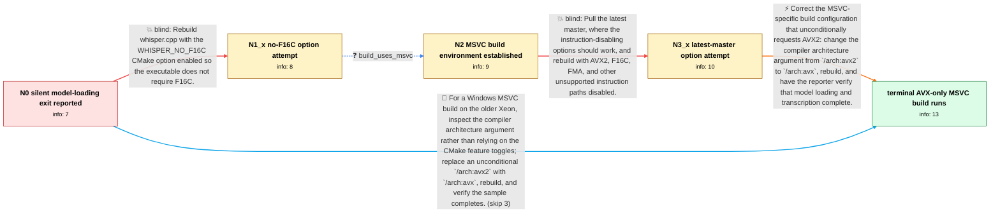

# Review: gh_ggml-org_whisper.cpp_860

**main.exe silently crashes**

- source: https://github.com/ggml-org/whisper.cpp/issues/860
- kind: LLM draft (needs review)
- reviewed: `True`
- graph: `data/github_v0/graphs/gh_ggml-org_whisper.cpp_860.json` · raw thread: `data/github_v0/raw/gh_ggml-org_whisper.cpp_860.json`

## Opening (body)

> I tried whisper.net, the compiled Windows x64 binaries from v1.4.0 and v1.2.0, several base models, and the sample jfk.wav. Running `main.exe -m ggml-model-whisper-base.en.bin -f jfk.wav -l en -t 8` prints the model metadata and then the process silently stops. I traced the exit to `whisper_init_from_file` and then `ggml_init`. My system is Windows 10 x64 with an Intel Xeon E5-2640 and a GeForce GTX 1060 6GB. The CPU does not appear to support F16C, and compiling with CUDA support did not change the crash.

## Satisfaction conditions

1. Must identify the accepted root cause: the MSVC-specific build configuration unconditionally passed `/arch:avx2`, so changing CMake feature options did not prevent an AVX2-targeted executable from being built for the older Xeon.
2. Must ground the diagnosis in the Windows Xeon E5-2640 setup, the MSVC build, the unused CMake option warning, and the continued exit after nominally disabling instruction features.
3. Must recommend changing the MSVC compiler architecture argument from `/arch:avx2` to `/arch:avx` and rebuilding the executable.
4. Must not present CUDA support or the WHISPER_NO_F16C and related CMake toggles alone as the fix; those approaches were tried without stopping the exit under MSVC.
5. Must ask the reporter to verify that a rebuilt binary loads the model and completes transcription before declaring the issue resolved.

## Edges

| edge | type | gates / info | payload |
|---|---|---|---|
| `e1_N0__N1_x` | solution_only **BLIND** | req_info: cpu_appears_not_to_support_f16c, exit_localized_to_whisper_init_and_ggml_init elements: mentions_building_without_f16c | Rebuild whisper.cpp with the WHISPER_NO_F16C CMake option enabled so the executable does not require F16C. |
| `e2_N1_x__N2` | clarification_only | asks: build_uses_msvc | I'm compiling with MSVC. CMake warns that WHISPER_NO_F16C is a manually specified variable that the project do |
| `e3_N2__N3_x` | solution_only **BLIND** | req_info: cpu_appears_not_to_support_f16c, build_uses_msvc, whisper_no_f16c_cmake_variable_not_recognized elements: mentions_rebuilding_latest_master_with_instruction_options_disabled | Pull the latest master, where the instruction-disabling options should work, and rebuild with AVX2, F16C, FMA, and other unsupported instruction paths disabled. |
| `e4_N3_x__N_terminal` | solution_only | req_info: system_windows10_x64_xeon_e5_2640_gtx1060, exit_localized_to_whisper_init_and_ggml_init, cpu_appears_not_to_support_f16c, cuda_build_exits_the_same_way, build_uses_msvc, whisper_no_f16c_cmake_variable_not_recognized, latest_master_with_avx_avx2_f16c_fma_disabled_still_exits elements: identifies_unconditional_msvc_avx2_compilation_as_the_root_cause, changes_msvc_architecture_setting_from_avx2_to_avx, rebuilds_the_executable_after_the_source_configuration_change, asks_user_to_verify_model_loading_and_transcription_on_the_rebuilt_binary | Correct the MSVC-specific build configuration that unconditionally requests AVX2: change the compiler architecture argument from `/arch:avx2` to `/arch:avx`, rebuild, and have the reporter verify that model loading and transcription complete. |
| `e5_N0__N_terminal` | solution_only | req_info: system_windows10_x64_xeon_e5_2640_gtx1060, exit_localized_to_whisper_init_and_ggml_init, cpu_appears_not_to_support_f16c, cuda_build_exits_the_same_way elements: identifies_unconditional_msvc_avx2_compilation_as_the_likely_root_cause, changes_msvc_architecture_setting_from_avx2_to_avx, asks_user_to_verify_model_loading_and_transcription_on_the_rebuilt_binary | For a Windows MSVC build on the older Xeon, inspect the compiler architecture argument rather than relying on the CMake feature toggles; replace an unconditional `/arch:avx2` with `/arch:avx`, rebuild, and verify the sample completes. |

## Nodes

| node | terminal | volunteered | images | symptoms |
|---|---|---|---|---|
| `N0` |  | 3 | 0 | main.exe prints the model metadata through the model size and then the process silently exits. The exit occurs while calling whisper_init_fr |
| `N1_x` |  | 1 | 0 | CMake warns that WHISPER_NO_F16C was not used, and the resulting executable still silently exits at ggml_init. |
| `N2` |  | 0 | 0 | My MSVC build still silently exits at ggml_init, and CMake says the requested instruction-setting variable is unused. |
| `N3_x` |  | 1 | 0 | After pulling the latest master and disabling AVX, AVX2, F16C, and FMA through the available options, the executable still silently exits at |
| `N_terminal` | ✓ | 1 | 0 | After rebuilding with the MSVC architecture setting changed from AVX2 to AVX, the model loads and the transcription completes. The tiny mode |

## Machine review (audit pass, adversarially verified)

Auditor verdict: **n/a** · 0 of 0 findings survived independent refutation.

__

## Review checklist

> The graph is the case's ANSWER KEY, not a transcript: edge order need
> not mirror thread chronology. Do not file chronology mismatch as a
> defect; what must be faithful is who knew what, when.

Structural (machine-checked by `scripts/validate.py`, re-verify after edits):

- [ ] validates: schema + info-containment + terminal reachability

Semantic (the defect catalog — check each against the source thread):

- [ ] **Faithful blind paths** — every `is_known_blind_path` edge corresponds
  to an attempt actually falsified in the thread (or a brush-off the
  reporter rejected). No invented failures; no ACCEPTED fix mislabeled as
  a blind path (the most common LLM defect class).
- [ ] **Gettable required info** — every id in any `solution.required_info`
  is obtainable: a clarification on some edge, or in the start node's
  info_state, or volunteered (with matching `volunteered_info` text).
  Engineer-only inference belongs in `info_inferred_by_engineer` /
  `inference_hint`, not in hard required_info.
- [ ] **Measurement-class rule** — handler-initiated measurements the user
  executed (bisections, test builds, config probes, version checks) are
  clarification edges, not solutions; their answers state what the
  measurement showed.
- [ ] **No logistics gates** — `required_elements_for_full_match` encode the
  technical diagnostic→fix chain, not release/packaging/scheduling
  remarks the engineer merely mentioned.
- [ ] **Coherent reveals** — each `user_answer_in_this_oncall` is consistent
  with the thread, delivers what it promises, and stays in the user's
  voice (no future knowledge, no diagnosis the user never made).
- [ ] **Symptoms are observations** — `symptoms_visible` contains only what
  the user can see; no causes or advice.
- [ ] **Terminal semantics** — satisfaction_conditions demand root cause +
  evidence grounding + prohibition of falsified moves + user verification;
  the terminal node is the verified-resolved state.
- [ ] **Image assignment** — referenced attachments exist and sit on the
  right hook (opening / node symptom / clarification evidence).
- [ ] **Persona** — matches the reporter's actual expertise and style.

## How to sign off

1. Edit the graph JSON if needed (authored fields only; keep
   `concrete_example` as the factual record).
2. `uv run scripts/validate.py '<graph path>'`
3. Set `metadata.hitl_reviewed: true` in the graph JSON.
4. Re-run `uv run scripts/make_review_docs.py` to refresh this page.
