# Review: gh_godotengine_godot_102219

**Graphical glitches all over the place in both game and editor after Nvidia driver update**

- source: https://github.com/godotengine/godot/issues/102219
- kind: LLM draft (needs review)
- reviewed: `False`
- graph: `data/github_v0/graphs/gh_godotengine_godot_102219.json` · raw thread: `data/github_v0/raw/gh_godotengine_godot_102219.json`

```mermaid
flowchart LR
    N0["<b>N0 moving rendering artifacts reported</b><br/><small>info: 7</small>"]
    N1_x["<b>N1_x sharpening-setting aftermath</b><br/><small>info: 8</small>"]
    N2["<b>N2 driver and API isolation established</b><br/><small>info: 13</small>"]
    N3["<b>N3 Nvidia regression acknowledged</b><br/><small>info: 14</small>"]
    N_terminal["<b>terminal artifacts gone after Nvidia update</b><br/><small>info: 15</small>"]
    N_terminal_shortcut["<b>terminal shortcut to corrected Nvidia driver</b><br/><small>info: 8</small>"]
    N0 ==>|"💥 blind: Treat the artifacts as Nvidia image sharpening or contrast enhancement being enabled for Godot and disable that driver setting."| N1_x
    linkStyle 0 stroke:#ef4444,stroke-width:2px
    N1_x -.->|"❓ nvidia_control_panel_sharpening_screenshot, rollback_to_56636_removes_artifacts, direct3d12_does_not_show_artifacts, other_vulkan_applications_show_similar_artifacts"| N2
    linkStyle 1 stroke:#3b82f6,stroke-width:2px
    N2 -.->|"❓ nvidia_feedback_thread_acknowledges_vulkan_artifacts"| N3
    linkStyle 2 stroke:#3b82f6,stroke-width:2px
    N3 ==>|"⚡ Treat this as an Nvidia driver regression rather than a Godot rendering bug: update to an Nvidia driver containing the vendor fix, then verify Godot under Vulkan; until then, roll back the driver or use Direct3D 12 as a temporary workaround."| N_terminal
    linkStyle 3 stroke:#f97316,stroke-width:2px
    N0 ==>|"🚀 Recognize the temporal link to the Nvidia update as a likely vendor driver regression, recommend moving to a vendor-fixed driver and verifying the same Vulkan scene, with rollback or Direct3D 12 only as temporary alternatives. (skip 4)"| N_terminal_shortcut
    linkStyle 4 stroke:#0ea5e9,stroke-width:2px
    class N0 start
    class N1_x normal
    class N2 normal
    class N3 normal
    class N_terminal terminal
    class N_terminal_shortcut terminal
    classDef start fill:#fee2e2,stroke:#b91c1c,color:#000
    classDef terminal fill:#dcfce7,stroke:#15803d,color:#000
    classDef normal fill:#fef3c7,stroke:#a16207,color:#000
```

## Opening (body)

> Since updating to the latest Nvidia drivers, I get moving graphical glitches in both my games and the Godot editor. Pixels jump along the X axis when I pan or move the camera. Nearest filtering makes the problem visible, while linear filtering hides it in many cases, and shaders are affected too. I tested Godot 4.3, 4.4 beta 1, and 4.4 beta 2 with Forward+ on Windows 11, Nvidia driver 572.16, and a GeForce 30-series GPU. An empty project with the default sprite reproduces it.

## Satisfaction conditions

1. Must identify the final accepted root cause as an Nvidia driver regression affecting Vulkan rendering or presentation, not a texture-filtering defect in Godot.
2. The diagnosis must be grounded in the collected evidence: the issue began after the Nvidia update, disappears on rollback, is absent with Direct3D 12, affects other Vulkan applications, and was acknowledged by Nvidia.
3. Must not settle on Nvidia image sharpening or contrast enhancement as the cause; it was disabled globally and for Godot while the artifacts continued.
4. Must recommend updating to an Nvidia driver containing the vendor fix; driver rollback or Direct3D 12 may be offered only as temporary workarounds, not as the underlying fix.
5. Must not require a Godot-side driver blacklist or engine mitigation as the resolution, since the accepted thread conclusion is that the temporary regression was Nvidia's responsibility.
6. Must ask the user to verify the same Vulkan workload after installing the corrected driver before declaring the issue resolved.

## Edges

| edge | type | gates / info | payload |
|---|---|---|---|
| `e1_N0__N1_x` | solution_only **BLIND** | req_info: moving_pixel_glitches_in_editor_and_games elements: attributes_artifacts_to_driver_image_sharpening, asks_to_disable_sharpening_globally_or_for_godot | Treat the artifacts as Nvidia image sharpening or contrast enhancement being enabled for Godot and disable that driver setting. |
| `e2_N1_x__N2` | clarification_only | asks: nvidia_control_panel_sharpening_screenshot, rollback_to_56636_removes_artifacts, direct3d12_does_not_show_artifacts, other_vulkan_applications_show_similar_artifacts | There is only one sharpening setting, and it is disabled both globally and in the profile I created for Godot. / I rolled back to 566.36 and the artifacts disappeared. The same Godot projects display normally on that driver / With Vulkan, Forward+ and Mobile show the issue. Using Direct3D 12 on the same system, I do not see the artifa / It is not limited to Godot. I can see similar visual glitches in Doom + Doom II using Vulkan, and there are ma |
| `e3_N2__N3` | clarification_only | asks: nvidia_feedback_thread_acknowledges_vulkan_artifacts | I reported it to Nvidia and linked this issue. Nvidia support directed me to its official driver feedback thre |
| `e4_N3__N_terminal` | solution_only | req_info: glitches_started_after_nvidia_57216_update, empty_project_default_sprite_reproduces, other_vulkan_applications_show_similar_artifacts, rollback_to_56636_removes_artifacts, direct3d12_does_not_show_artifacts, nvidia_feedback_thread_acknowledges_vulkan_artifacts elements: identifies_an_nvidia_driver_regression_affecting_vulkan_presentation, recommends_updating_to_a_vendor_driver_containing_the_fix, treats_rollback_or_direct3d12_as_temporary_workarounds, asks_user_to_verify_on_a_build_containing_the_driver_fix, does_not_propose_a_godot_engine_change_as_the_primary_fix | Treat this as an Nvidia driver regression rather than a Godot rendering bug: update to an Nvidia driver containing the vendor fix, then verify Godot under Vulkan; until then, roll back the driver or use Direct3D 12 as a temporary workaround. |
| `e5_N0__N_terminal_shortcut` | solution_only | req_info: glitches_started_after_nvidia_57216_update, affected_godot_43_through_44_beta2, empty_project_default_sprite_reproduces elements: identifies_the_nvidia_driver_as_the_likely_source, recommends_a_vendor_fixed_driver_instead_of_changing_godot, asks_user_to_verify_after_the_driver_change | Recognize the temporal link to the Nvidia update as a likely vendor driver regression, recommend moving to a vendor-fixed driver and verifying the same Vulkan scene, with rollback or Direct3D 12 only as temporary alternatives. |

## Nodes

| node | terminal | volunteered | images | symptoms |
|---|---|---|---|---|
| `N0` |  | 0 | 0 | I see graphical artifacts in both the Godot editor and my games; pixel columns jump along the X axis as I pan or move the camera. Nearest fi |
| `N1_x` |  | 1 | 0 | The moving pixel glitches continue with Nvidia image sharpening disabled globally and explicitly disabled for Godot. |
| `N2` |  | 1 | 0 | The artifacts remain in Godot's Vulkan-based Forward+ and Mobile renderers on the newer driver. The same scenes display normally after rolli |
| `N3` |  | 0 | 0 | The pixel corruption is still present on the affected Nvidia driver when Godot uses Vulkan. |
| `N_terminal` | ✓ | 1 | 1 | After updating to Nvidia driver 572.60, the glitches and artifacts are no longer present in Godot using Vulkan Forward+. |
| `N_terminal_shortcut` | ✓ | 1 | 0 | After updating to Nvidia driver 572.60, the glitches and artifacts are no longer present in Godot using Vulkan Forward+. |

## Machine review (audit pass, adversarially verified)

Auditor verdict: **n/a** · 0 of 0 findings survived independent refutation.

__

## Review checklist

> The graph is the case's ANSWER KEY, not a transcript: edge order need
> not mirror thread chronology. Do not file chronology mismatch as a
> defect; what must be faithful is who knew what, when.

Structural (machine-checked by `scripts/validate.py`, re-verify after edits):

- [ ] validates: schema + info-containment + terminal reachability

Semantic (the defect catalog — check each against the source thread):

- [ ] **Faithful blind paths** — every `is_known_blind_path` edge corresponds
  to an attempt actually falsified in the thread (or a brush-off the
  reporter rejected). No invented failures; no ACCEPTED fix mislabeled as
  a blind path (the most common LLM defect class).
- [ ] **Gettable required info** — every id in any `solution.required_info`
  is obtainable: a clarification on some edge, or in the start node's
  info_state, or volunteered (with matching `volunteered_info` text).
  Engineer-only inference belongs in `info_inferred_by_engineer` /
  `inference_hint`, not in hard required_info.
- [ ] **Measurement-class rule** — handler-initiated measurements the user
  executed (bisections, test builds, config probes, version checks) are
  clarification edges, not solutions; their answers state what the
  measurement showed.
- [ ] **No logistics gates** — `required_elements_for_full_match` encode the
  technical diagnostic→fix chain, not release/packaging/scheduling
  remarks the engineer merely mentioned.
- [ ] **Coherent reveals** — each `user_answer_in_this_oncall` is consistent
  with the thread, delivers what it promises, and stays in the user's
  voice (no future knowledge, no diagnosis the user never made).
- [ ] **Symptoms are observations** — `symptoms_visible` contains only what
  the user can see; no causes or advice.
- [ ] **Terminal semantics** — satisfaction_conditions demand root cause +
  evidence grounding + prohibition of falsified moves + user verification;
  the terminal node is the verified-resolved state.
- [ ] **Image assignment** — referenced attachments exist and sit on the
  right hook (opening / node symptom / clarification evidence).
- [ ] **Persona** — matches the reporter's actual expertise and style.

## How to sign off

1. Edit the graph JSON if needed (authored fields only; keep
   `concrete_example` as the factual record).
2. `uv run scripts/validate.py '<graph path>'`
3. Set `metadata.hitl_reviewed: true` in the graph JSON.
4. Re-run `uv run scripts/make_review_docs.py` to refresh this page.
