# Review: gh_godotengine_godot_102219

**Graphical glitches all over the place in both game and editor after Nvidia driver update**

- source: https://github.com/godotengine/godot/issues/102219
- kind: LLM draft (needs review)
- reviewed: `True`
- graph: `data/github_v0/graphs/gh_godotengine_godot_102219.json` · raw thread: `data/github_v0/raw/gh_godotengine_godot_102219.json`

```mermaid
flowchart LR
    N0["<b>N0 moving rendering artifacts reported</b><br/><small>info: 6</small>"]
    N1["<b>N1 sharpening configuration ruled out</b><br/><small>info: 8</small>"]
    N2["<b>N2 driver and graphics API scope established</b><br/><small>info: 12</small>"]
    N3_x["<b>N3_x intermediate driver update aftermath</b><br/><small>info: 13</small>"]
    N_terminal["<b>N_terminal artifacts gone on fixed Nvidia driver</b><br/><small>info: 15</small>"]
    N0 -.->|"❓ nvidia_sharpening_disabled_globally_and_for_godot"| N1
    linkStyle 0 stroke:#3b82f6,stroke-width:2px
    N1 -.->|"❓ rollback_to_566_36_removes_artifacts, direct3d12_test_has_no_artifacts, other_vulkan_app_shows_same_artifacts"| N2
    linkStyle 1 stroke:#3b82f6,stroke-width:2px
    N2 ==>|"💥 blind: Install the newly released 572.47 Nvidia driver on the expectation that the vendor's next update has corrected the rendering artifacts."| N3_x
    linkStyle 2 stroke:#ef4444,stroke-width:2px
    N3_x ==>|"⚡ Treat this as an Nvidia Vulkan driver regression rather than a Godot rendering bug, update to a current Nvidia driver containing the vendor fix, and verify the same Vulkan scene before declaring resolution."| N_terminal
    linkStyle 3 stroke:#f97316,stroke-width:2px
    N2 ==>|"🚀 Recognize the Nvidia Vulkan driver regression from the cross-driver and cross-API evidence, skip the still-affected intermediate driver, update directly to a current Nvidia driver containing the vendor fix, and verify the scene. (skip 1)"| N_terminal
    linkStyle 4 stroke:#0ea5e9,stroke-width:2px
    class N0 start
    class N1 normal
    class N2 normal
    class N3_x normal
    class N_terminal terminal
    classDef start fill:#fee2e2,stroke:#b91c1c,color:#000
    classDef terminal fill:#dcfce7,stroke:#15803d,color:#000
    classDef normal fill:#fef3c7,stroke:#a16207,color:#000
```

## Opening (body)

> Since updating to Nvidia driver 572.16 on Windows 11 with a GeForce 30-series GPU, I get moving graphical glitches in both my games and the Godot editor using Forward+. Pixels jump along the X axis when I pan or move the camera. Nearest filtering makes the problem obvious, while linear filtering hides it in many cases, and shaders are affected too. I reproduced it in Godot 4.3, 4.4 beta 1, and 4.4 beta 2. An empty project with the default sprite is enough to reproduce it.

## Satisfaction conditions

1. Must identify the accepted root cause as an Nvidia driver regression affecting Vulkan applications, not a defect in the Godot project, texture filtering configuration, or engine renderer.
2. The diagnosis must be grounded in the collected comparisons: sharpening is disabled, driver 566.36 displays correctly, Direct3D 12 displays correctly, and another Vulkan application shows similar artifacts on the affected driver.
3. Must recommend updating to an Nvidia driver containing the vendor's rendering correction; rollback to a known-good older driver or temporarily using Direct3D 12 may be offered as workarounds.
4. Must not recommend Nvidia sharpening changes as the fix, because disabling sharpening globally and for Godot did not change the artifacts.
5. Must not treat the still-affected 572.47 update as the resolution.
6. Must ask the user to retest the same Vulkan scene after updating and only declare the issue resolved once the artifacts are observably gone.

## Edges

| edge | type | gates / info | payload |
|---|---|---|---|
| `e1_N0__N1` | clarification_only | asks: nvidia_sharpening_disabled_globally_and_for_godot | It isn't enabled. I also created a program profile for Godot and forced that feature off, but the problem cont |
| `e2_N1__N2` | clarification_only | asks: rollback_to_566_36_removes_artifacts, direct3d12_test_has_no_artifacts, other_vulkan_app_shows_same_artifacts | With 572.16 I see the visual artifacts. After going back to 566.36, everything displays correctly again. / The issue appears with Forward+ and Mobile when they use Vulkan. I tested the same content using Direct3D 12 a / I see the issue in Doom + Doom II when it uses Vulkan too. I also found many reports of the same kind of visua |
| `e3_N2__N3_x` | solution_only **BLIND** | req_info: moving_pixel_artifacts_after_nvidia_572_16_update, rollback_to_566_36_removes_artifacts, direct3d12_test_has_no_artifacts elements: recommends_the_572_47_driver_as_the_fix | Install the newly released 572.47 Nvidia driver on the expectation that the vendor's next update has corrected the rendering artifacts. |
| `e4_N3_x__N_terminal` | solution_only | req_info: moving_pixel_artifacts_after_nvidia_572_16_update, artifacts_affect_editor_games_and_shaders, nearest_filter_exposes_artifacts_linear_often_hides_them, nvidia_sharpening_disabled_globally_and_for_godot, rollback_to_566_36_removes_artifacts, direct3d12_test_has_no_artifacts, other_vulkan_app_shows_same_artifacts, driver_572_47_still_shows_artifacts elements: identifies_the_problem_as_an_nvidia_vulkan_driver_regression_not_a_godot_bug, recommends_updating_to_a_vendor_driver_containing_the_rendering_fix, asks_user_to_verify_the_same_vulkan_scene_after_updating, treats_rollback_or_direct3d12_as_temporary_alternatives | Treat this as an Nvidia Vulkan driver regression rather than a Godot rendering bug, update to a current Nvidia driver containing the vendor fix, and verify the same Vulkan scene before declaring resolution. |
| `e5_N2__N_terminal` | solution_only | req_info: moving_pixel_artifacts_after_nvidia_572_16_update, artifacts_affect_editor_games_and_shaders, nearest_filter_exposes_artifacts_linear_often_hides_them, nvidia_sharpening_disabled_globally_and_for_godot, rollback_to_566_36_removes_artifacts, direct3d12_test_has_no_artifacts, other_vulkan_app_shows_same_artifacts elements: identifies_the_problem_as_an_nvidia_vulkan_driver_regression_not_a_godot_bug, recommends_a_driver_containing_the_vendor_fix, asks_user_to_verify_on_the_updated_driver | Recognize the Nvidia Vulkan driver regression from the cross-driver and cross-API evidence, skip the still-affected intermediate driver, update directly to a current Nvidia driver containing the vendor fix, and verify the scene. |

## Nodes

| node | terminal | volunteered | images | symptoms |
|---|---|---|---|---|
| `N0` |  | 0 | 0 | Since installing Nvidia driver 572.16, pixels jump along the X axis in both the Godot editor and my games when I pan or move the camera. Nea |
| `N1` |  | 1 | 0 | The moving pixel artifacts continue with Nvidia image sharpening disabled globally and explicitly disabled in a Godot program profile. |
| `N2` |  | 1 | 0 | The artifacts remain on the 572.16 driver when Godot uses Vulkan, while the same Godot content displays normally in a Direct3D 12 test. Anot |
| `N3_x` |  | 1 | 0 | The same pixel artifacts are still present after installing Nvidia driver 572.47. |
| `N_terminal` | ✓ | 1 | 1 | After updating to Nvidia driver 572.60 or newer, the glitches and artifacts are no longer present in Godot with Vulkan Forward+. |

## Machine review (audit pass, adversarially verified)

Auditor verdict: **n/a** · 0 of 0 findings survived independent refutation.

__

## Review checklist

> The graph is the case's ANSWER KEY, not a transcript: edge order need
> not mirror thread chronology. Do not file chronology mismatch as a
> defect; what must be faithful is who knew what, when.

Structural (machine-checked by `scripts/validate.py`, re-verify after edits):

- [ ] validates: schema + info-containment + terminal reachability

Semantic (the defect catalog — check each against the source thread):

- [ ] **Faithful blind paths** — every `is_known_blind_path` edge corresponds
  to an attempt actually falsified in the thread (or a brush-off the
  reporter rejected). No invented failures; no ACCEPTED fix mislabeled as
  a blind path (the most common LLM defect class).
- [ ] **Gettable required info** — every id in any `solution.required_info`
  is obtainable: a clarification on some edge, or in the start node's
  info_state, or volunteered (with matching `volunteered_info` text).
  Engineer-only inference belongs in `info_inferred_by_engineer` /
  `inference_hint`, not in hard required_info.
- [ ] **Measurement-class rule** — handler-initiated measurements the user
  executed (bisections, test builds, config probes, version checks) are
  clarification edges, not solutions; their answers state what the
  measurement showed.
- [ ] **No logistics gates** — `required_elements_for_full_match` encode the
  technical diagnostic→fix chain, not release/packaging/scheduling
  remarks the engineer merely mentioned.
- [ ] **Coherent reveals** — each `user_answer_in_this_oncall` is consistent
  with the thread, delivers what it promises, and stays in the user's
  voice (no future knowledge, no diagnosis the user never made).
- [ ] **Symptoms are observations** — `symptoms_visible` contains only what
  the user can see; no causes or advice.
- [ ] **Terminal semantics** — satisfaction_conditions demand root cause +
  evidence grounding + prohibition of falsified moves + user verification;
  the terminal node is the verified-resolved state.
- [ ] **Image assignment** — referenced attachments exist and sit on the
  right hook (opening / node symptom / clarification evidence).
- [ ] **Persona** — matches the reporter's actual expertise and style.

## How to sign off

1. Edit the graph JSON if needed (authored fields only; keep
   `concrete_example` as the factual record).
2. `uv run scripts/validate.py '<graph path>'`
3. Set `metadata.hitl_reviewed: true` in the graph JSON.
4. Re-run `uv run scripts/make_review_docs.py` to refresh this page.
