# Review: gh_godotengine_godot_102877

**Scenes can't be fully loaded and Godot freezes**

- source: https://github.com/godotengine/godot/issues/102877
- kind: LLM draft (needs review)
- reviewed: `True`
- graph: `data/github_v0/graphs/gh_godotengine_godot_102877.json` · raw thread: `data/github_v0/raw/gh_godotengine_godot_102877.json`

```mermaid
flowchart LR
    N0["<b>N0 TPS Demo indefinite freeze reported</b><br/><small>info: 5</small>"]
    N1["<b>N1 freeze reproduced with OpenGL</b><br/><small>info: 6</small>"]
    N2["<b>N2 regression persists in RC1</b><br/><small>info: 8</small>"]
    N3["<b>N3 indefinite freeze distinguished from compilation pause</b><br/><small>info: 11</small>"]
    N4["<b>N4 hanging thread stacks collected</b><br/><small>info: 12</small>"]
    N5["<b>N5 candidate deadlock fix verified</b><br/><small>info: 14</small>"]
    N_terminal["<b>terminal original TPS Demo freeze resolved</b><br/><small>info: 16</small>"]
    N0 -.->|"❓ opengl3_run_has_same_freeze"| N1
    linkStyle 0 stroke:#3b82f6,stroke-width:2px
    N1 -.->|"❓ issue_persists_in_44_rc1"| N2
    linkStyle 1 stroke:#3b82f6,stroke-width:2px
    N2 -.->|"❓ reported_freeze_at_100_percent_is_indefinite, direct_scene_run_also_freezes, separate_75_percent_pause_occurs_during_pipeline_recompile"| N3
    linkStyle 2 stroke:#3b82f6,stroke-width:2px
    N3 -.->|"❓ hang_thread_dump_waits_in_shader_compilation_and_worker_pool"| N4
    linkStyle 3 stroke:#3b82f6,stroke-width:2px
    N4 -.->|"❓ pr103506_test_eliminates_indefinite_blocking, brief_waits_remain_only_during_shader_pipeline_recompile"| N5
    linkStyle 4 stroke:#3b82f6,stroke-width:2px
    N5 ==>|"⚡ Treat the permanent scene-loading freeze as a shader-compilation WorkerThreadPool deadlock, apply the tested deadlock/crash fix from PR #103506, and have an affected reporter verify a build containing it before declaring the original TPS Demo case resolved."| N_terminal
    linkStyle 5 stroke:#f97316,stroke-width:2px
    class N0 start
    class N1 normal
    class N2 normal
    class N3 normal
    class N4 normal
    class N5 normal
    class N_terminal terminal
    classDef start fill:#fee2e2,stroke:#b91c1c,color:#000
    classDef terminal fill:#dcfce7,stroke:#15803d,color:#000
    classDef normal fill:#fef3c7,stroke:#a16207,color:#000
```

## Opening (body)

> I can reproduce this in Godot 4.4 beta3 and build b607110ad on Windows 10 with Vulkan Forward+ and an NVIDIA GeForce GTX 960; it does not occur in 4.4 beta1 or beta2. In the TPS Demo, pressing Play on the main menu completes the loading bar, but Godot then stops responding. Beta1 and beta2 could also pause, but they responded again after a few seconds. To reproduce it, open the TPS Demo and press Play.

## Satisfaction conditions

1. Must identify the original TPS Demo freeze as a shader-compilation WorkerThreadPool deadlock: a thread waits for shader task-group completion while holding a lock needed by those tasks to make progress.
2. The diagnosis must be grounded in the captured all-thread stacks and the permanent 100% hang, not inferred solely from the NVIDIA GPU or from a slow loading bar.
3. Must not settle on an NVIDIA/Vulkan-specific explanation or switching to OpenGL as the fix, because the same permanent freeze was reproduced with --rendering-driver opengl3.
4. Must distinguish the indefinite deadlock from brief first-run shader or pipeline compilation pauses; eliminating every short loading stutter was not the purpose of the fix.
5. Must use the tested deadlock fix that eliminated indefinite blocking and ask the affected reporter to verify a build containing it before treating the original issue as resolved.
6. Must not splice the later large-project initial-import deadlocks into LiveTrower's TPS Demo resolution chain; those reports came from different projects and continued after the original reporter confirmed resolution.

## Edges

| edge | type | gates / info | payload |
|---|---|---|---|
| `e1_N0__N1` | clarification_only | asks: opengl3_run_has_same_freeze | I tried launching it with --rendering-driver opengl3, but the issue persists. |
| `e2_N1__N2` | clarification_only | asks: issue_persists_in_44_rc1 | Yes, the issue persists in 4.4 RC1. |
| `e3_N2__N3` | clarification_only | asks: reported_freeze_at_100_percent_is_indefinite, direct_scene_run_also_freezes, separate_75_percent_pause_occurs_during_pipeline_recompile | The load reaches 100%, then freezes and never responds. I have to kill the process. / The same permanent freeze happens if I run the scene directly. / No. I also see a 75% blockage when pipelines have to be recompiled, but if I wait a few seconds, kill it, and  |
| `e4_N3__N4` | clarification_only | asks: hang_thread_dump_waits_in_shader_compilation_and_worker_pool | I captured the threads while it was hung. One stack includes Semaphore::wait(), WorkerThreadPool::wait_for_gro |
| `e5_N4__N5` | clarification_only | asks: pr103506_test_eliminates_indefinite_blocking, brief_waits_remain_only_during_shader_pipeline_recompile | I tested PR #103506. The indefinite blocking is resolved: the 75% blockage is effectively gone apart from a po / The short blockages only happen when all shaders and pipelines need to be recompiled. After that, the scene lo |
| `e6_N5__N_terminal` | solution_only | req_info: tps_demo_reaches_full_loading_then_stops_responding, regression_in_44_beta3_not_beta1_beta2, opengl3_run_has_same_freeze, issue_persists_in_44_rc1, reported_freeze_at_100_percent_is_indefinite, hang_thread_dump_waits_in_shader_compilation_and_worker_pool, pr103506_test_eliminates_indefinite_blocking elements: identifies_worker_thread_shader_compilation_deadlock, explains_cyclic_wait_between_task_group_completion_and_required_lock, uses_the_tested_deadlock_fix_that_eliminated_indefinite_blocking, distinguishes_short_pipeline_compilation_waits_from_permanent_freeze, asks_user_to_verify_on_a_build_containing_the_fix | Treat the permanent scene-loading freeze as a shader-compilation WorkerThreadPool deadlock, apply the tested deadlock/crash fix from PR #103506, and have an affected reporter verify a build containing it before declaring the original TPS Demo case resolved. |

## Nodes

| node | terminal | volunteered | images | symptoms |
|---|---|---|---|---|
| `N0` |  | 1 | 0 | In the TPS Demo, pressing Play finishes the loading bar, but Godot then stops responding. With 4.4 beta1 and beta2, a freeze lasted only a f |
| `N1` |  | 0 | 0 | Launching Godot with --rendering-driver opengl3 does not change the problem; the TPS Demo still stops responding after loading. |
| `N2` |  | 1 | 0 | The issue persists in 4.4 RC1: level.tscn opens correctly in the editor, but running it freezes. |
| `N3` |  | 0 | 0 | The reported freeze reaches 100% and never responds, including when I run the scene directly. A separate pause at 75% occurs when pipelines  |
| `N4` |  | 0 | 0 | While Godot is hung, its captured threads remain waiting and the scene never finishes opening. |
| `N5` |  | 0 | 0 | With the build from PR #103506, the 75% blockage is gone apart from an occasional one-second pause, the 100% pause responds after a few seco |
| `N_terminal` | ✓ | 1 | 0 | The TPS Demo scene now finishes loading instead of remaining blocked indefinitely; at most, I see a short wait while shaders or pipelines ar |

## Machine review (audit pass, adversarially verified)

Auditor verdict: **n/a** · 0 of 0 findings survived independent refutation.

__

## Review checklist

> The graph is the case's ANSWER KEY, not a transcript: edge order need
> not mirror thread chronology. Do not file chronology mismatch as a
> defect; what must be faithful is who knew what, when.

Structural (machine-checked by `scripts/validate.py`, re-verify after edits):

- [ ] validates: schema + info-containment + terminal reachability

Semantic (the defect catalog — check each against the source thread):

- [ ] **Faithful blind paths** — every `is_known_blind_path` edge corresponds
  to an attempt actually falsified in the thread (or a brush-off the
  reporter rejected). No invented failures; no ACCEPTED fix mislabeled as
  a blind path (the most common LLM defect class).
- [ ] **Gettable required info** — every id in any `solution.required_info`
  is obtainable: a clarification on some edge, or in the start node's
  info_state, or volunteered (with matching `volunteered_info` text).
  Engineer-only inference belongs in `info_inferred_by_engineer` /
  `inference_hint`, not in hard required_info.
- [ ] **Measurement-class rule** — handler-initiated measurements the user
  executed (bisections, test builds, config probes, version checks) are
  clarification edges, not solutions; their answers state what the
  measurement showed.
- [ ] **No logistics gates** — `required_elements_for_full_match` encode the
  technical diagnostic→fix chain, not release/packaging/scheduling
  remarks the engineer merely mentioned.
- [ ] **Coherent reveals** — each `user_answer_in_this_oncall` is consistent
  with the thread, delivers what it promises, and stays in the user's
  voice (no future knowledge, no diagnosis the user never made).
- [ ] **Symptoms are observations** — `symptoms_visible` contains only what
  the user can see; no causes or advice.
- [ ] **Terminal semantics** — satisfaction_conditions demand root cause +
  evidence grounding + prohibition of falsified moves + user verification;
  the terminal node is the verified-resolved state.
- [ ] **Image assignment** — referenced attachments exist and sit on the
  right hook (opening / node symptom / clarification evidence).
- [ ] **Persona** — matches the reporter's actual expertise and style.

## How to sign off

1. Edit the graph JSON if needed (authored fields only; keep
   `concrete_example` as the factual record).
2. `uv run scripts/validate.py '<graph path>'`
3. Set `metadata.hitl_reviewed: true` in the graph JSON.
4. Re-run `uv run scripts/make_review_docs.py` to refresh this page.
