# Review: gh_godotengine_godot_104266

**Code selection lag in the Godot editor on macOS**

- source: https://github.com/godotengine/godot/issues/104266
- kind: LLM draft (needs review)
- reviewed: `True`
- graph: `data/github_v0/graphs/gh_godotengine_godot_104266.json` · raw thread: `data/github_v0/raw/gh_godotengine_godot_104266.json`

```mermaid
flowchart LR
    N0["<b>N0 code-selection lag reported</b><br/><small>info: 5</small>"]
    N1["<b>N1 scope and settings matrix established</b><br/><small>info: 10</small>"]
    N2["<b>N2 normal-startup software involvement isolated</b><br/><small>info: 13</small>"]
    N3["<b>N3 Magnet interaction isolated</b><br/><small>info: 14</small>"]
    N4["<b>N4 per-application exclusion verified</b><br/><small>info: 15</small>"]
    N_terminal["<b>N_terminal selection lag resolved</b><br/><small>info: 16</small>"]
    N0 -.->|"❓ renderer_and_editor_setting_matrix, other_applications_do_not_have_selection_lag, single_window_mode_does_not_remove_lag, logioptions_removal_does_not_remove_lag, multiple_external_mouse_types_show_same_lag"| N1
    linkStyle 0 stroke:#3b82f6,stroke-width:2px
    N1 -.->|"❓ safe_mode_has_no_lag, new_macos_user_has_no_lag"| N2
    linkStyle 1 stroke:#3b82f6,stroke-width:2px
    N2 -.->|"❓ quitting_magnet_removes_godot_lag"| N3
    linkStyle 2 stroke:#3b82f6,stroke-width:2px
    N3 -.->|"❓ magnet_ignore_godot_probe_removes_lag"| N4
    linkStyle 3 stroke:#3b82f6,stroke-width:2px
    N4 ==>|"⚡ Prevent Magnet from processing Godot by keeping Godot on Magnet's ignore list, or quit Magnet while using Godot, then verify that selection and focus remain responsive with the normal Godot renderer and update settings."| N_terminal
    linkStyle 4 stroke:#f97316,stroke-width:2px
    class N0 start
    class N1 normal
    class N2 normal
    class N3 normal
    class N4 normal
    class N_terminal terminal
    classDef start fill:#fee2e2,stroke:#b91c1c,color:#000
    classDef terminal fill:#dcfce7,stroke:#15803d,color:#000
    classDef normal fill:#fef3c7,stroke:#a16207,color:#000
```

## Opening (body)

> I have imprecise and seemingly random code selection in Godot on macOS because there is a delay between clicking and moving the mouse to select text. It reproduces in Godot 4.3-beta1 and later, including 4.4 stable, but not in 4.3-dev6 and earlier. My system is macOS Sequoia 15.3.2 on a Mac Studio M1 Ultra. I initially found that disabling V-Sync and enabling Update Continuously appeared to correct the problem.

## Satisfaction conditions

1. Must identify the accepted root cause as an interaction with the third-party Magnet window-management application, grounded in the Safe Mode or clean-user comparison and the direct quit-Magnet test.
2. Must recommend quitting Magnet or configuring Magnet to ignore Godot; the per-application exclusion is the preferred workaround when Magnet should remain open.
3. Must not present disabling V-Sync, enabling Update Continuously, switching renderers, removing Logi Options+, or changing mouse hardware as the root fix: those directions were incomplete or falsified in the affected setups.
4. Must not claim that a specific event-propagation mechanism was proven; the thread established the Magnet interaction but left its internals unexplained.
5. Must have the user verify responsive code selection and window focus with ordinary Godot settings before declaring the issue resolved.

## Edges

| edge | type | gates / info | payload |
|---|---|---|---|
| `e1_N0__N1` | clarification_only | asks: renderer_and_editor_setting_matrix, other_applications_do_not_have_selection_lag, single_window_mode_does_not_remove_lag, logioptions_removal_does_not_remove_lag, multiple_external_mouse_types_show_same_lag | Forward+ and Mobile still lag with or without those settings. Compatibility works only when I use both setting / No. Text selection works correctly in other applications such as Visual Studio Code, Safari, Outlook, and Subl / No. The issue is still present after enabling Single Window Mode and restarting Godot. / Yes. I completely removed Logi Options+, and the problem was still there. I later reinstalled it because remov / The affected setups reproduce it with wireless Logitech mice and wired mice as well. One affected Mac has flaw |
| `e2_N1__N2` | clarification_only | asks: safe_mode_has_no_lag, new_macos_user_has_no_lag | In Safe Mode, everything works flawlessly in every Godot configuration. After I restarted normally, the proble / I created a new macOS user and Godot worked flawlessly there. Back in my normal account, the same issue was pr |
| `e3_N2__N3` | clarification_only | asks: quitting_magnet_removes_godot_lag | I was running Magnet. When I quit Magnet, the laggy code selection and the unresponsive window after regaining |
| `e4_N3__N4` | clarification_only | asks: magnet_ignore_godot_probe_removes_lag | Yes. I focused Godot, opened Magnet's dropdown, and clicked Ignore Godot. Magnet can stay open and there are n |
| `e5_N4__N_terminal` | solution_only | req_info: code_selection_lags_between_click_and_drag, other_applications_do_not_have_selection_lag, safe_mode_has_no_lag, quitting_magnet_removes_godot_lag, magnet_ignore_godot_probe_removes_lag elements: identifies_magnet_as_the_conflicting_third_party_application, recommends_ignoring_godot_in_magnet_or_quitting_magnet, does_not_require_the_high_resource_continuous_update_workaround, asks_user_to_verify_selection_and_window_focus_with_normal_godot_settings | Prevent Magnet from processing Godot by keeping Godot on Magnet's ignore list, or quit Magnet while using Godot, then verify that selection and focus remain responsive with the normal Godot renderer and update settings. |

## Nodes

| node | terminal | volunteered | images | symptoms |
|---|---|---|---|---|
| `N0` |  | 0 | 0 | There is a delay between clicking and moving the mouse while selecting code, so the selected range is imprecise and seems random. In my init |
| `N1` |  | 0 | 0 | The lag remains in Forward+ and Mobile regardless of the V-Sync and continuous-update settings. With the Compatibility renderer, selection i |
| `N2` |  | 1 | 0 | Code selection works flawlessly while macOS is in Safe Mode. After returning to a normal startup, the same selection delay comes back. On an |
| `N3` |  | 0 | 0 | With Magnet running, Godot has laggy code selection and can be slow to respond after regaining focus. When I quit Magnet, code selection and |
| `N4` |  | 0 | 0 | Magnet can remain open, and Godot has no selection lag when I test Magnet's Ignore Godot option. |
| `N_terminal` | ✓ | 0 | 0 | Code selection and window focus in Godot are responsive with the normal V-Sync, continuous-update, and Forward+ settings after Godot is excl |

## Machine review (audit pass, adversarially verified)

Auditor verdict: **n/a** · 0 of 0 findings survived independent refutation.

__

## Review checklist

> The graph is the case's ANSWER KEY, not a transcript: edge order need
> not mirror thread chronology. Do not file chronology mismatch as a
> defect; what must be faithful is who knew what, when.

Structural (machine-checked by `scripts/validate.py`, re-verify after edits):

- [ ] validates: schema + info-containment + terminal reachability

Semantic (the defect catalog — check each against the source thread):

- [ ] **Faithful blind paths** — every `is_known_blind_path` edge corresponds
  to an attempt actually falsified in the thread (or a brush-off the
  reporter rejected). No invented failures; no ACCEPTED fix mislabeled as
  a blind path (the most common LLM defect class).
- [ ] **Gettable required info** — every id in any `solution.required_info`
  is obtainable: a clarification on some edge, or in the start node's
  info_state, or volunteered (with matching `volunteered_info` text).
  Engineer-only inference belongs in `info_inferred_by_engineer` /
  `inference_hint`, not in hard required_info.
- [ ] **Measurement-class rule** — handler-initiated measurements the user
  executed (bisections, test builds, config probes, version checks) are
  clarification edges, not solutions; their answers state what the
  measurement showed.
- [ ] **No logistics gates** — `required_elements_for_full_match` encode the
  technical diagnostic→fix chain, not release/packaging/scheduling
  remarks the engineer merely mentioned.
- [ ] **Coherent reveals** — each `user_answer_in_this_oncall` is consistent
  with the thread, delivers what it promises, and stays in the user's
  voice (no future knowledge, no diagnosis the user never made).
- [ ] **Symptoms are observations** — `symptoms_visible` contains only what
  the user can see; no causes or advice.
- [ ] **Terminal semantics** — satisfaction_conditions demand root cause +
  evidence grounding + prohibition of falsified moves + user verification;
  the terminal node is the verified-resolved state.
- [ ] **Image assignment** — referenced attachments exist and sit on the
  right hook (opening / node symptom / clarification evidence).
- [ ] **Persona** — matches the reporter's actual expertise and style.

## How to sign off

1. Edit the graph JSON if needed (authored fields only; keep
   `concrete_example` as the factual record).
2. `uv run scripts/validate.py '<graph path>'`
3. Set `metadata.hitl_reviewed: true` in the graph JSON.
4. Re-run `uv run scripts/make_review_docs.py` to refresh this page.
