# Review: gh_godotengine_godot_104266

**macOS code selection lag in the Godot editor**

- source: https://github.com/godotengine/godot/issues/104266
- kind: LLM draft (needs review)
- reviewed: `False`
- graph: `data/github_v0/graphs/gh_godotengine_godot_104266.json` · raw thread: `data/github_v0/raw/gh_godotengine_godot_104266.json`

```mermaid
flowchart LR
    N0["<b>N0 code selection lag reported</b><br/><small>info: 5</small>"]
    N1_x["<b>N1_x rendering-settings workaround aftermath</b><br/><small>info: 8</small>"]
    N2["<b>N2 Safe Mode probe succeeds</b><br/><small>info: 9</small>"]
    N3["<b>N3 normal-startup software involvement established</b><br/><small>info: 12</small>"]
    N4["<b>N4 Magnet interaction isolated</b><br/><small>info: 13</small>"]
    N5["<b>N5 per-application exclusion verified</b><br/><small>info: 14</small>"]
    N_terminal["<b>terminal resolved with Magnet exclusion</b><br/><small>info: 14</small>"]
    N0 ==>|"💥 blind: Treat the editor's rendering cadence as the cause and use disabled V-Sync together with continuous updating as the general fix."| N1_x
    linkStyle 0 stroke:#ef4444,stroke-width:2px
    N1_x -.->|"❓ safe_mode_has_no_selection_lag"| N2
    linkStyle 1 stroke:#3b82f6,stroke-width:2px
    N2 -.->|"❓ lag_returns_after_normal_boot, other_editors_unaffected, individual_editor_setting_changes_do_not_remove_lag"| N3
    linkStyle 2 stroke:#3b82f6,stroke-width:2px
    N3 -.->|"❓ quitting_magnet_removes_godot_lag"| N4
    linkStyle 3 stroke:#3b82f6,stroke-width:2px
    N4 -.->|"❓ magnet_ignore_godot_removes_lag_while_magnet_runs"| N5
    linkStyle 4 stroke:#3b82f6,stroke-width:2px
    N5 ==>|"⚡ Avoid the third-party Magnet interaction by configuring Magnet to ignore Godot, or quit Magnet if a per-application exclusion is unavailable, then verify that selection remains smooth under normal Godot settings."| N_terminal
    linkStyle 5 stroke:#f97316,stroke-width:2px
    N0 ==>|"🚀 Check for the known third-party Magnet interaction immediately, configure Magnet to ignore Godot or quit it, and have the user verify that text selection is smooth with normal Godot settings. (skip 7)"| N_terminal
    linkStyle 6 stroke:#0ea5e9,stroke-width:2px
    class N0 start
    class N1_x normal
    class N2 normal
    class N3 normal
    class N4 normal
    class N5 normal
    class N_terminal terminal
    classDef start fill:#fee2e2,stroke:#b91c1c,color:#000
    classDef terminal fill:#dcfce7,stroke:#15803d,color:#000
    classDef normal fill:#fef3c7,stroke:#a16207,color:#000
```

## Opening (body)

> I can reproduce this in Godot 4.4 stable and every version from 4.3-beta1 onward, but not in 4.3-dev6 or earlier. On macOS Sequoia 15.3.2 on a Mac Studio M1 Ultra, there is a delay between clicking in the code editor and moving the pointer to select text, making selections imprecise and random. Disabling V-Sync and enabling Update Continuously appeared to correct it.

## Satisfaction conditions

1. Must identify the final accepted cause as an interaction between Godot and the third-party Magnet window-management application; the thread does not establish a more specific event-propagation mechanism.
2. Diagnosis must be grounded in the observed contrasts: the lag disappears in Safe Mode, returns after a normal boot, and disappears when Magnet is quit or configured to ignore Godot.
3. Must recommend configuring Magnet to ignore Godot, or quitting Magnet while using Godot, rather than treating Logitech software, mouse hardware, V-Sync, Update Continuously, or the renderer as the root cause.
4. Must not present disabled V-Sync plus Update Continuously as the complete fix: it was unreliable in Forward+ and Mobile and imposed unnecessary continuous resource usage.
5. Must have the user verify smooth text selection with Magnet excluded from Godot before treating the issue as resolved.

## Edges

| edge | type | gates / info | payload |
|---|---|---|---|
| `e1_N0__N1_x` | solution_only **BLIND** | req_info: code_selection_lags_on_macos, initial_vsync_off_continuous_update_workaround elements: recommends_disabling_vsync, recommends_enabling_update_continuously | Treat the editor's rendering cadence as the cause and use disabled V-Sync together with continuous updating as the general fix. |
| `e2_N1_x__N2` | clarification_only | asks: safe_mode_has_no_selection_lag | I booted in Safe Mode, and everything worked flawlessly in every configuration I tried. |
| `e3_N2__N3` | clarification_only | asks: lag_returns_after_normal_boot, other_editors_unaffected, individual_editor_setting_changes_do_not_remove_lag | After one restart it briefly continued to work, but after the Mac had been off overnight the problem returned. / No. I cannot reproduce it in Visual Studio Code or other applications; it happens in Godot. / The lag is still present with V-Sync disabled, with Single Window Mode enabled, or with Update Continuously en |
| `e4_N3__N4` | clarification_only | asks: quitting_magnet_removes_godot_lag | I quit Magnet, and that solved the problem. The code-selection lag disappeared. |
| `e5_N4__N5` | clarification_only | asks: magnet_ignore_godot_removes_lag_while_magnet_runs | Yes. I focused Godot, opened Magnet's dropdown, and clicked “Ignore Godot.” Magnet can stay open and there are |
| `e6_N5__N_terminal` | solution_only | req_info: code_selection_lags_on_macos, affected_from_godot_4_3_beta1_through_4_4, safe_mode_has_no_selection_lag, lag_returns_after_normal_boot, other_editors_unaffected, quitting_magnet_removes_godot_lag, magnet_ignore_godot_removes_lag_while_magnet_runs elements: identifies_the_third_party_magnet_interaction, recommends_magnet_ignore_godot_or_quitting_magnet, does_not_require_the_high_resource_continuous_update_workaround, confirms_selection_is_smooth_after_the_exclusion | Avoid the third-party Magnet interaction by configuring Magnet to ignore Godot, or quit Magnet if a per-application exclusion is unavailable, then verify that selection remains smooth under normal Godot settings. |
| `e7_N0__N_terminal` | solution_only | req_info: code_selection_lags_on_macos elements: identifies_the_third_party_magnet_interaction, recommends_magnet_ignore_godot_or_quitting_magnet, asks_user_to_verify_with_normal_godot_settings | Check for the known third-party Magnet interaction immediately, configure Magnet to ignore Godot or quit it, and have the user verify that text selection is smooth with normal Godot settings. |

## Nodes

| node | terminal | volunteered | images | symptoms |
|---|---|---|---|---|
| `N0` |  | 1 | 0 | There is a delay between when I click in the Godot code editor and when I move the pointer, so text selection is imprecise and appears rando |
| `N1_x` |  | 3 | 0 | Text selection still lags in Forward+ and Mobile after disabling V-Sync and enabling Update Continuously. In Compatibility mode, the lag dis |
| `N2` |  | 0 | 0 | In macOS Safe Mode, text selection works smoothly in every Godot configuration I tried. |
| `N3` |  | 0 | 0 | After returning to a normal boot, the code-selection lag came back. I do not see the selection lag in other editors, and changing V-Sync, Si |
| `N4` |  | 0 | 0 | After I quit Magnet, text selection in Godot no longer lags. |
| `N5` |  | 0 | 0 | Magnet can remain running if I select its Ignore Godot option; with that exclusion active, the code-selection lag is gone. |
| `N_terminal` | ✓ | 0 | 0 | Code selection in Godot is smooth with Magnet configured to ignore Godot; Magnet can remain open and the lag no longer occurs. |

## Machine review (audit pass, adversarially verified)

Auditor verdict: **n/a** · 0 of 0 findings survived independent refutation.

__

## Review checklist

> The graph is the case's ANSWER KEY, not a transcript: edge order need
> not mirror thread chronology. Do not file chronology mismatch as a
> defect; what must be faithful is who knew what, when.

Structural (machine-checked by `scripts/validate.py`, re-verify after edits):

- [ ] validates: schema + info-containment + terminal reachability

Semantic (the defect catalog — check each against the source thread):

- [ ] **Faithful blind paths** — every `is_known_blind_path` edge corresponds
  to an attempt actually falsified in the thread (or a brush-off the
  reporter rejected). No invented failures; no ACCEPTED fix mislabeled as
  a blind path (the most common LLM defect class).
- [ ] **Gettable required info** — every id in any `solution.required_info`
  is obtainable: a clarification on some edge, or in the start node's
  info_state, or volunteered (with matching `volunteered_info` text).
  Engineer-only inference belongs in `info_inferred_by_engineer` /
  `inference_hint`, not in hard required_info.
- [ ] **Measurement-class rule** — handler-initiated measurements the user
  executed (bisections, test builds, config probes, version checks) are
  clarification edges, not solutions; their answers state what the
  measurement showed.
- [ ] **No logistics gates** — `required_elements_for_full_match` encode the
  technical diagnostic→fix chain, not release/packaging/scheduling
  remarks the engineer merely mentioned.
- [ ] **Coherent reveals** — each `user_answer_in_this_oncall` is consistent
  with the thread, delivers what it promises, and stays in the user's
  voice (no future knowledge, no diagnosis the user never made).
- [ ] **Symptoms are observations** — `symptoms_visible` contains only what
  the user can see; no causes or advice.
- [ ] **Terminal semantics** — satisfaction_conditions demand root cause +
  evidence grounding + prohibition of falsified moves + user verification;
  the terminal node is the verified-resolved state.
- [ ] **Image assignment** — referenced attachments exist and sit on the
  right hook (opening / node symptom / clarification evidence).
- [ ] **Persona** — matches the reporter's actual expertise and style.

## How to sign off

1. Edit the graph JSON if needed (authored fields only; keep
   `concrete_example` as the factual record).
2. `uv run scripts/validate.py '<graph path>'`
3. Set `metadata.hitl_reviewed: true` in the graph JSON.
4. Re-run `uv run scripts/make_review_docs.py` to refresh this page.
