# Review: gh_godotengine_godot_73674

**Tiles are seemingly randomly reset in the editor**

- source: https://github.com/godotengine/godot/issues/73674
- kind: LLM draft (needs review)
- reviewed: `True`
- graph: `data/github_v0/graphs/gh_godotengine_godot_73674.json` · raw thread: `data/github_v0/raw/gh_godotengine_godot_73674.json`

```mermaid
flowchart LR
    N0["<b>N0 intermittent TileSet data loss reported</b><br/><small>info: 6</small>"]
    N1["<b>N1 focus-change trigger observed</b><br/><small>info: 9</small>"]
    N2["<b>N2 reproducible affected project supplied</b><br/><small>info: 13</small>"]
    N3["<b>N3 resource scan trigger isolated</b><br/><small>info: 17</small>"]
    N4["<b>N4 engine-level issue established</b><br/><small>info: 20</small>"]
    N_terminal["<b>terminal resolved after update and retest</b><br/><small>info: 23</small>"]
    N0 -.->|"❓ focus_regain_observed_trigger_in_production_project, restart_restores_previously_saved_tileset_if_corrupt_state_not_saved, original_sample_project_does_not_reliably_reproduce"| N1
    linkStyle 0 stroke:#3b82f6,stroke-width:2px
    N1 -.->|"❓ second_affected_project_reproduces_on_focus_return, painted_collision_and_terrain_data_removed_but_animation_preserved, reset_generates_hundreds_of_thousands_of_output_errors, repro_project_identifies_farm_tilemap_and_backspring_tileset"| N2
    linkStyle 1 stroke:#3b82f6,stroke-width:2px
    N2 -.->|"❓ dialogue_manager_present_in_reproducible_projects, disabling_dialogue_manager_preserves_tileset_during_same_steps, resource_filesystem_scan_on_focus_change_triggers_reset, scan_trigger_remains_after_plugin_handler_code_disabled"| N3
    linkStyle 2 stroke:#3b82f6,stroke-width:2px
    N3 -.->|"❓ same_tileset_data_loss_reported_without_plugins, invalid_terrain_peering_and_missing_tileset_errors_observed, vanilla_unstable_build_still_affected"| N4
    linkStyle 3 stroke:#3b82f6,stroke-width:2px
    N4 ==>|"⚡ Treat this as an engine editor-resource scanning bug rather than a TileSet authoring mistake or a Dialogue Manager-specific defect. Update to a Godot build containing the editor fixes, avoid saving a TileSet after the reset is visible, and verify the fix by repeating the focus-switch reproduction."| N_terminal
    linkStyle 4 stroke:#f97316,stroke-width:2px
    class N0 start
    class N1 normal
    class N2 normal
    class N3 normal
    class N4 normal
    class N_terminal terminal
    classDef start fill:#fee2e2,stroke:#b91c1c,color:#000
    classDef terminal fill:#dcfce7,stroke:#15803d,color:#000
    classDef normal fill:#fef3c7,stroke:#a16207,color:#000
```

## Opening (body)

> I have seen this from Godot 4.0 RC2 through RC6 on two Linux systems using the Vulkan backend. Something in the editor intermittently removes properties from my TileSets, including terrain peering bits and physics-layer data. It can happen while working or after restarting the editor. Usually every terrain bit except the center bit disappears, and the Terrain painting tool then shows only Connect Mode and Path Mode. If I save after this happens, Git shows that the properties were actually deleted from the resource files on disk. I attached a minimal reproduction project, although the problem does not occur reliably.

## Satisfaction conditions

1. Must identify the accepted root cause as a Godot editor resource-scanning problem: the focus-triggered filesystem scan can leave TileData without a valid TileSet reference, after which terrain and physics properties are removed and may be serialized to disk.
2. Diagnosis must be grounded in the collected evidence: focus return triggers the reset, a reproducible project exhibits the loss and error flood, the scan call was isolated, and output reports missing TileSet and invalid terrain-peering data.
3. Must not blame the Dialogue Manager plugin as the underlying defect or present updating that plugin as the complete fix; it provided a reliable scan trigger, but vanilla projects without plugins were also affected.
4. Must not dismiss the loss as user error or merely a stale editor display, since the missing properties are written to disk if the corrupted state is saved.
5. Must recommend a Godot build containing the editor fix and ask the user to repeat the focus-switch reproduction before declaring resolution; until then, the user should avoid saving the reset state and recover from a prior save or version control.
6. Resolution requires an affected user to confirm that the reproduction no longer removes TileSet data after updating.

## Edges

| edge | type | gates / info | payload |
|---|---|---|---|
| `e1_N0__N1` | clarification_only | asks: focus_regain_observed_trigger_in_production_project, restart_restores_previously_saved_tileset_if_corrupt_state_not_saved, original_sample_project_does_not_reliably_reproduce | I finally saw it happen in my production project. I moved focus away from Godot, and the moment my mouse re-en / I had saved just before it happened, so I closed Godot and restarted it. That brought the correct saved TileSe / I still cannot make it happen reliably in the sample project. It occurred again in my production project, but  |
| `e2_N1__N2` | clarification_only | asks: second_affected_project_reproduces_on_focus_return, painted_collision_and_terrain_data_removed_but_animation_preserved, reset_generates_hundreds_of_thousands_of_output_errors, repro_project_identifies_farm_tilemap_and_backspring_tileset | I attached my affected project. The TileMap is Farm.tscn/TileMaps/Back and the TileSet is BackSpring.tscn. In  / All the painted TileSet data I save is removed, including collision masks and terrain details. Normal tile inf / The TileSet editor slows down and the output starts filling with errors. In one occurrence Godot generated mor / Open Farm.tscn, select TileMaps/Back, and inspect the TileSet named BackSpring.tscn. |
| `e3_N2__N3` | clarification_only | asks: dialogue_manager_present_in_reproducible_projects, disabling_dialogue_manager_preserves_tileset_during_same_steps, resource_filesystem_scan_on_focus_change_triggers_reset, scan_trigger_remains_after_plugin_handler_code_disabled | The reproducible projects both have Dialogue Manager installed. I made another sample with Dialogue Manager 2. / With the plugin enabled, the terrain markup disappears after the save and focus switch. After disabling the pl / I narrowed it down to the plugin calling get_editor_interface().get_resource_filesystem().scan() on focus chan / Yes. I disabled the handler code that updates the plugin's own JSON configurations, but left the resource-file |
| `e4_N3__N4` | clarification_only | asks: same_tileset_data_loss_reported_without_plugins, invalid_terrain_peering_and_missing_tileset_errors_observed, vanilla_unstable_build_still_affected | Yes. I have no plugins installed or running, but physics values and terrains still disappear from my TileSet.  / While trying to redo the terrains, the output is spammed with 'Condition !is_valid_terrain_peering_bit(p_peeri / It also happened to me in a vanilla development build with no mods. An entire physics layer was wiped from the |
| `e5_N4__N_terminal` | solution_only | req_info: terrain_bits_except_center_and_physics_data_disappear, saving_after_reset_deletes_properties_on_disk, painted_collision_and_terrain_data_removed_but_animation_preserved, invalid_terrain_peering_and_missing_tileset_errors_observed, focus_regain_observed_trigger_in_production_project, second_affected_project_reproduces_on_focus_return, resource_filesystem_scan_on_focus_change_triggers_reset, scan_trigger_remains_after_plugin_handler_code_disabled, same_tileset_data_loss_reported_without_plugins elements: identifies_engine_side_editor_resource_scan_issue, explains_dialogue_manager_was_a_trigger_not_the_root_cause, recommends_updating_to_a_build_containing_the_editor_fix, warns_against_saving_the_corrupted_tileset_state, asks_user_to_verify_on_a_build_containing_the_fix | Treat this as an engine editor-resource scanning bug rather than a TileSet authoring mistake or a Dialogue Manager-specific defect. Update to a Godot build containing the editor fixes, avoid saving a TileSet after the reset is visible, and verify the fix by repeating the focus-switch reproduction. |

## Nodes

| node | terminal | volunteered | images | symptoms |
|---|---|---|---|---|
| `N0` |  | 1 | 0 | My TileSets intermittently lose terrain peering bits and physics-layer properties; usually only the center terrain bit remains. When this ha |
| `N1` |  | 0 | 0 | In my production project, all tiles changed to the middle-only terrain state at the moment Godot regained focus. Because I had saved before  |
| `N2` |  | 0 | 0 | In another affected project, clicking another window and then returning to Godot removes the painted terrain and collision data within minut |
| `N3` |  | 0 | 0 | With the Dialogue Manager plugin present, adding a terrain, saving, and switching focus can remove the terrain markup or crash the editor. W |
| `N4` |  | 0 | 0 | The same collision and terrain data loss also occurs in projects with no plugins installed. When recreating the lost terrain data, the outpu |
| `N_terminal` | ✓ | 2 | 0 | After updating to a build containing the editor fixes, the focus-switch reproduction no longer removes the terrain markup. The TileSet terra |

## Machine review (audit pass, adversarially verified)

Auditor verdict: **n/a** · 0 of 0 findings survived independent refutation.

__

## Review checklist

> The graph is the case's ANSWER KEY, not a transcript: edge order need
> not mirror thread chronology. Do not file chronology mismatch as a
> defect; what must be faithful is who knew what, when.

Structural (machine-checked by `scripts/validate.py`, re-verify after edits):

- [ ] validates: schema + info-containment + terminal reachability

Semantic (the defect catalog — check each against the source thread):

- [ ] **Faithful blind paths** — every `is_known_blind_path` edge corresponds
  to an attempt actually falsified in the thread (or a brush-off the
  reporter rejected). No invented failures; no ACCEPTED fix mislabeled as
  a blind path (the most common LLM defect class).
- [ ] **Gettable required info** — every id in any `solution.required_info`
  is obtainable: a clarification on some edge, or in the start node's
  info_state, or volunteered (with matching `volunteered_info` text).
  Engineer-only inference belongs in `info_inferred_by_engineer` /
  `inference_hint`, not in hard required_info.
- [ ] **Measurement-class rule** — handler-initiated measurements the user
  executed (bisections, test builds, config probes, version checks) are
  clarification edges, not solutions; their answers state what the
  measurement showed.
- [ ] **No logistics gates** — `required_elements_for_full_match` encode the
  technical diagnostic→fix chain, not release/packaging/scheduling
  remarks the engineer merely mentioned.
- [ ] **Coherent reveals** — each `user_answer_in_this_oncall` is consistent
  with the thread, delivers what it promises, and stays in the user's
  voice (no future knowledge, no diagnosis the user never made).
- [ ] **Symptoms are observations** — `symptoms_visible` contains only what
  the user can see; no causes or advice.
- [ ] **Terminal semantics** — satisfaction_conditions demand root cause +
  evidence grounding + prohibition of falsified moves + user verification;
  the terminal node is the verified-resolved state.
- [ ] **Image assignment** — referenced attachments exist and sit on the
  right hook (opening / node symptom / clarification evidence).
- [ ] **Persona** — matches the reporter's actual expertise and style.

## How to sign off

1. Edit the graph JSON if needed (authored fields only; keep
   `concrete_example` as the factual record).
2. `uv run scripts/validate.py '<graph path>'`
3. Set `metadata.hitl_reviewed: true` in the graph JSON.
4. Re-run `uv run scripts/make_review_docs.py` to refresh this page.
